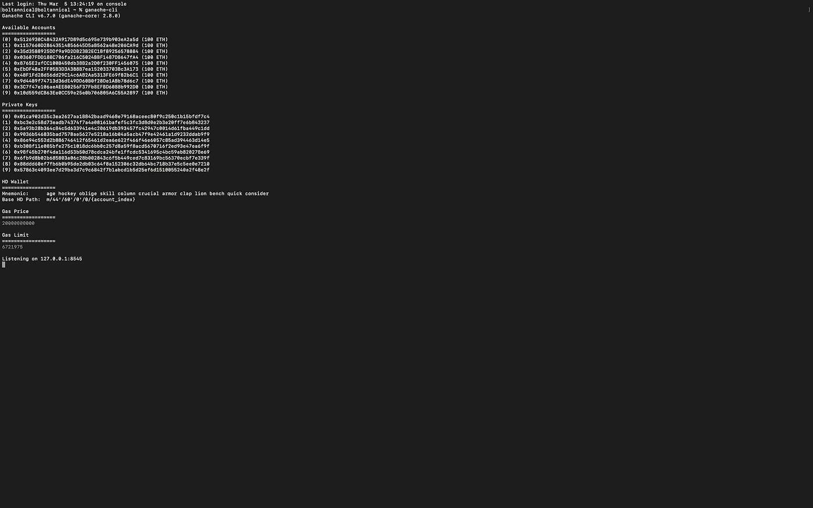

# 作为 Bhad 成员构建 dAPPs:第二部分

> 原文：<https://medium.com/coinmonks/building-dapps-as-a-bhad-guy-part-two-e5ea92e2a339?source=collection_archive---------4----------------------->

在[上一期指南](/coinmonks/building-dapps-as-a-bhad-guy-part-one-26f762c998b4)中，我们在展示一些测试示例和工具的同时，讨论了如何开始构建 dAPPSs。今天，我们将讨论如何在区块链上部署智能合约并与之交互。

**我们需要的东西**

*   元掩码
*   加纳切-CLI
*   Web3 Js

# 第一节

**使用 Metamask** :建议您使用以太坊[区块链](https://blog.coincodecap.com/tag/blockchain/)上的 Ropsten 网络。在主网络上部署将需要使用真正的以太网。但是你可以利用 Ropsten 水龙头提供的免费乙醚。

Metamask Wallet (Connected to the Ropsten Network)

使用免费水龙头将乙醚存入 Ropsten 网络上的钱包。

Deposit Ether via Ropsten

点击 ***请求龙头***

Metamask Ether Faucet

检查你的平衡，看看从水龙头转移的乙醚。

# 第二节

通过使用 Metamask，可以使用 Remix 直接部署。
将部署环境更改为 ***注入的 Web3***

将弹出一个屏幕，要求您允许连接 ***混音 IDE***

确认您的交易以部署智能合约

智能合同已成功部署

使用 Metamask 上提供的链接，查看您的合同创建。

Etherscan.io is an explorer used to check and verify transactions on the ethereum blockchain.

# 使用 Ganache

首先，在你的 PC 终端上运行 **ganache-cli**

Ganache Cli Initiated

在您的 Remix 界面上，选择部署环境为****Web3 Provider****并输入您的 web 3 端点(Ganache 正在监听的 Url)**

**

*选择要部署到的钱包地址*

**

*检查并验证已部署的合同*

**

***注*:** Ganache 是[以太坊](https://blog.coincodecap.com/tag/ethereum/)网络的测试模拟环境，一旦您结束程序，已部署的合同将被删除。*

**

*就这样，你已经成功地在以太坊区块链上部署了你的[智能合约](https://blog.coincodecap.com/tag/smart-contact)。*

**

> *[直接在您的收件箱中获得最佳软件交易](https://coincodecap.com/?utm_source=coinmonks)*

**