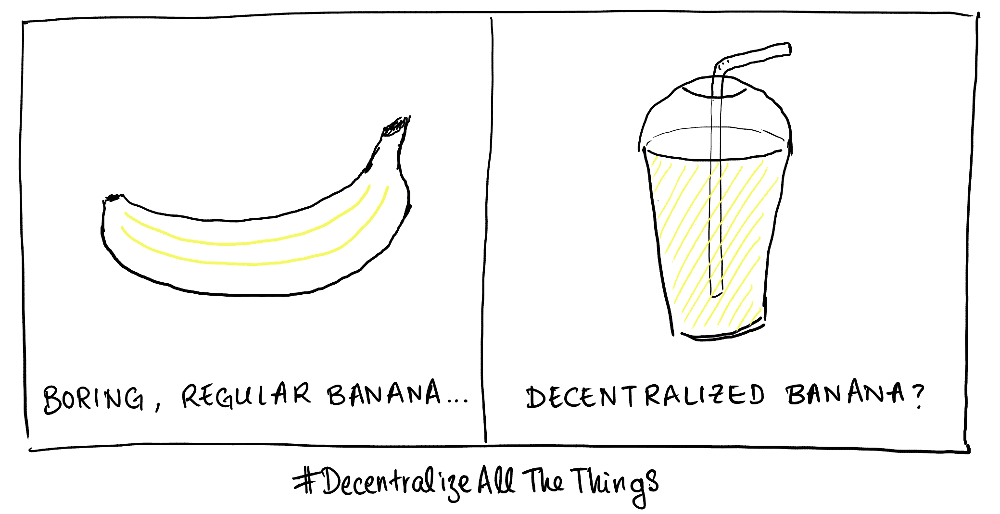
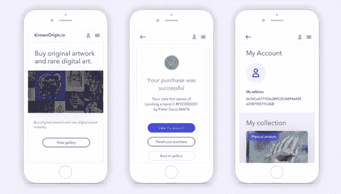

# 构建 dApps:体验是相同的，但不同的…

> 原文：<https://medium.com/coinmonks/building-dapps-the-experience-is-the-same-same-but-different-9bbe3af78a94?source=collection_archive---------4----------------------->

## 用 [KnownOrigin 构建现实世界 dApp 的冒险。](https://www.knownorigin.io)

无论是在你的智能手机上还是在你的笔记本电脑上，我们每天都与*应用*互动。查看火车是否晚点，预订你的下一个假期，查看金·卡戴珊最新的时尚选择，甚至回复老板的电子邮件。

dApps 或*去中心化的应用*和有细微差别的应用差不多。他们通常有一个看起来熟悉的用户界面，他们通常显示信息，让最终用户提交数据并看到相应的响应。

**那么实际上有什么不同呢？**

Excuse the American spelling of Decentralise…

区块链。根据经验，dApps 以某种方式与区块链交互。集中式应用程序通常会有一个数据库支持。

# 那么建立一个 dApp 需要什么呢？

## 建筑物

我们为 KnownOrigin.io 提供了一个 web 前端。与传统的 web 应用程序基本相同，您仍然有 HTML 和 JavaScript，但是您需要使用一些额外的工具。

我们建立在以太坊区块链上，因此一个名为 [*Web3Js*](https://github.com/ethereum/web3.js/) 的附加依赖项允许我们做一些时髦的加密事情，如*签名交易*和直接从区块链读取/写入数据。

S *mart 契约*是你在区块链上的逻辑被持有和执行的地方。写作这些所需知识的专有语言叫做**。这有点棘手，但有许多可识别的特征。我们使用了优秀的 [*松露框架*](http://truffleframework.com/) 来帮助平滑这个过程。**

*我们坚持一种测试驱动的方法，我们不能强烈推荐这种方法，因为在这个生态系统中，bug 实际上是要花钱的。*

*总之，你可以使用所有现有的 web 开发/全栈技能，并融入一些新的技巧，你可以在区块链上开发 dApps。旅途中可能会有一些减速带，但坚持下去…我们要去的地方没有路！*

## *用户体验*

*这就是有趣的地方。*

*现在我在哪里登录？*

*回答:你没有。在区块链这个勇敢的新世界中，你的身份就是你的*私钥&公钥*。*

*这一开始有点奇怪，但是很有意义，我们不想管理一个巨大的用户名和密码数据库。在区块链上身份可以从你的公共地址推导出来大概是这样的:[*0 x3f 8 c 962 EB 167 ad 2 f 80 c 72 b5 f 933511 ccdf 0719d 4*](https://etherscan.io/address/0x3f8c962eb167ad2f80c72b5f933511ccdf0719d4)*

*在 [KnownOrigin.io](https://knownorigin.io/) 你不需要有区块链身份来浏览我们的数字艺术品，但你需要一个来购买资产。*

*令人欣慰的是，像 [*MetaMask*](https://metamask.io/) 这样的扩展工具使得普通人创建账户、用加密货币为其提供资金，以及与去中心化的世界互动变得足够容易。 [MetaMask](https://metamask.io/) 总是在浏览器中存储你的私钥(想想密码),让整个事情变得安全。*

**

*Ethereum powered browsing*

*移动区块链浏览器，如 [*Trust Wallet*](https://trustwalletapp.com/features/trust-wallet) ，是与 dApps 互动的另一种方式，它们再次整合了账户管理和帮助建立交易的能力。*

*一旦你使用过几次以太坊增强版浏览器，它会变得更加自然，但是我们承认这对新用户来说是一个学习曲线。*

***数字作品加载时间过长…***

*突然之间，我们不是从本地调优的数据库中读取数据，因此提取数据的速度突然比您预期的要慢。在 [KnownOrigin.io](https://knownorigin.io/) 网站上，我们添加了额外的文本来解释这一点，但经过多年的一点点*微调*和大量漂亮的数据消费，最终用户有一定的期望。如果这些都得不到满足，他们可能会放弃😒*

*我们正在考虑缓存解决方案，以使网站更具响应性，但这突出表明，以分散的方式工作会带来新的挑战。*

*我没有收到关于我所购物品的即时反馈。发生了什么事？*

*必须在区块链上挖掘区块来验证交易。在以太坊上，这可能需要 10 秒到几分钟甚至更长时间，这取决于汽油的价格。这是一门黑暗的艺术。我们在购买过程中增加了更多的反馈，但我们没有使用可预测的本地数据库。我们会尽快提供一个到 [*以太扫描*](https://etherscan.io/) 的链接来本地查看交易(感觉有点脱节)。一旦我们知道它已被确认，我们更新用户界面。对于所有与区块链有关的人来说，这是一个正在进行中的 UX 工作。你如何最好地交流这种互动？明信片上的答案？*

## *部署*

*因此，您已经准备好了合同和代码。我要怎么做才能从我的 dApp 里得到甜蜜的 ETH？*

***我如何在区块链上获得我的智能合约？***

*在这一点上，您需要理解一旦您部署到活动链上，契约是不可变的。 [KnownOrigin.io](https://knownorigin.io/) 部署在[0x DDE 2d 979 E8 d 39 bb 8416 EAF FCC 1758 F3 cab 2c 9 c 72](https://etherscan.io/token/0xdde2d979e8d39bb8416eafcfc1758f3cab2c9c72)—我们必须额外确定我们对代码感到满意，然后再扣动扳机，一旦部署，更改和升级是很棘手的(不像传统软件)。*

***我如何“创造”新资产或更新合同？***

*突然之间，您不再需要运行简单的迁移脚本或部署 bug 修复，而是必须直接在链上与合同进行交互。这可能很复杂，因为您必须已经实现了预期的变更逻辑，并提前计划好可能需要什么*。及时、经济高效地获得天然气价格和交易的因素——突然之间，这并不像你想象的那么有趣！**

# *摘要*

**

*区块链开发和创建 dApps 正在构建一个新的 web 3.0(这可能会改变互联网的面貌)，但这项技术仍处于起步阶段，需要熟练的从业者来理解与我们熟悉和喜爱的常用软件实践之间的微妙差异。*

*耐心点。教育你自己和你的最终用户。迎接挑战，在你知道之前，我们都将生活在一个去中心化的世界里，登录一个应用程序会突然感觉像在粘一张 DVD。*

**免责声明:KnownOrigin.io 在区块链或分布式文件存储(IPFS)中保存应用程序数据，但前端传统上托管在 web 服务器上(Firebase)。纯粹主义者会认为这也应该以分散的方式进行。**