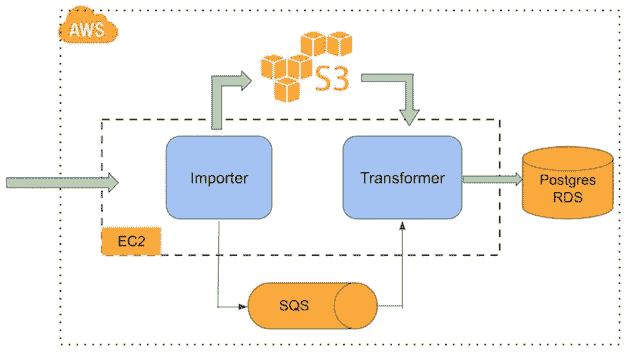

# 在 AWS 上构建分布式数据管道

> 原文：<https://medium.com/coinmonks/building-distributed-data-pipeline-on-aws-f5914f3f1f4f?source=collection_archive---------2----------------------->

数据管道对于任何处理大量数据的企业来说都是常见的。它是基础架构的一个重要部分，从数据源获取数据，对其进行转换并存储以供内部使用。例如，数据管道可以从 Twitter Firehose API 获取所有推文，提取与情感分析相关的信息，并存储每个主题的用户情感得分，以供内部分析。

现代数据管道有几个共同点。它们都是分布式的，这仅仅意味着管道的不同部分运行在不同的计算硬件上。由于分布式的本质，它们都需要一个通知机制来协调管道的每一步。它们都需要持久的数据存储，最常见的是数据库，但也可以是短暂的存储。

在本帖中，我们将使用 Amazon Web Services (AWS)中的核心服务构建一个分布式数据管道。

传统上，在您自己的硬件上构建分布式数据管道是复杂的，并且需要大量的工程和网络成本。云计算的出现极大地改变了大规模计算基础设施的前景。亚马逊网络服务(AWS)提供灵活的按需计算基础设施，使我们能够专注于构建对我们的业务来说重要的东西，而不是担心底层的计算机基础设施。

在这篇文章中，我们将介绍 AWS 的一些核心服务，包括弹性计算云(EC2)、简单存储服务(S3)、简单队列服务(SQS)和关系数据库服务(RDS)。我们还将在这些服务之上构建一个数据导入器和转换器，并将我们的数据管道连接在一起。

我们的数据管道的架构如下所示

首先，我们的数据导入器和转换器运行在两个 EC2 实例上。EC2 代表弹性计算云。它是 AWS 的支柱。它提供灵活的按需计算资源，可以在几分钟内扩展和缩减。出于演示的目的，我们使用 1 个 cpu 和 1gb ram 运行了两个 t2.micro 实例。

数据导入器作为独立的 python 应用程序在一个 EC2 实例上运行。它将从外部 API 获取模拟数据，该 API 以 json 格式给出虚构的博客文章数据，并将原始 json 数据备份到 S3。S3 是亚马逊的高性能对象存储，可以存储任何数量的数据，无论有多大。它已经成为大规模数据备份和归档的事实上的解决方案。在数据导入器将数据备份到 S3 之后，它将向 SQS 上的队列发送一条消息，提供如何在 S3 上找到数据的信息，通知转换器开始处理，作为管道中的下一步。SQS 是一种行为类似于消息队列的 AWS 服务。一端，称为生产者的应用程序可以向队列发送消息。另一方面，另一组称为消费者的应用程序可以按照生产者发送消息的顺序从队列中接收消息。它通常被称为 FIFO(先进先出)队列。我们使用 SQS 来编排数据管道的不同部分，允许一个任务通知下一个任务它的状态。

我们的转换器是运行在第二个 EC3 实例上的另一个 python 应用程序。一旦转换器收到导入程序已经完成工作的消息，它将使用消息中编码的地址从 S3 获取 json 数据并开始工作。转换器很简单，它获取 json 数据，解析它并将其存储在数据库中。我们使用的数据库是 Postgres RDS。RDS 代表关系数据库服务。它只是意味着 AWS 为您管理数据库的设置、供应和扩展。一旦它启动，您就可以像在您自己的硬件上运行一样将它作为一个普通的 Postgres 数据库来使用。将数据存储到数据库中是我们数据管道的最后一个阶段。

因为我们选择在 AWS 服务上运行我们的数据管道基础设施，所以我们必须编写的 Python 应用程序代码非常简单。

对于我们的数据导入器，我们使用 boto3 与 S3 和 SQS 交互，并请求 library 向外部 API 发出 http 请求，这些请求为我们提供虚构的数据。boto3 是用于 AWS 服务的 python 客户端库。Requests 是一个常见的 python 库，用于向 web 服务发出 http 请求。

对于我们的变压器，我们还使用 boto3 进行 S3 和 SQS 交互。此外，我们使用 pychopg2 库连接到 Postgres RDS 数据库，并将数据插入到关系表中。

就是这样！不到 100 行代码的全功能分布式数据导入管道。AWS 承担了临时计算资源、建立网络策略和扩展基础设施的重任。我们专注于编写和部署我们的应用程序。

分布式数据基础设施已经成为当今世界的新常态。在 Cloudbox Labs，我们热衷于提供实用的解决方案来帮助企业(无论规模大小)从大数据技术中受益。

一如既往，你可以在 [Cloudbox Labs github](https://github.com/cloudboxlabs/blog-code/tree/master/datapipe) 上找到这篇文章中讨论的完整代码。

标签:[亚马逊 Web 服务](https://cloudboxlabs.com/tag/amazon-web-services/)， [aws](https://cloudboxlabs.com/tag/aws/) ， [boto3](https://cloudboxlabs.com/tag/boto3/) ，[云计算](https://cloudboxlabs.com/tag/cloud-computing/)，[数据管道](https://cloudboxlabs.com/tag/data-pipeline/)，[分布式系统](https://cloudboxlabs.com/tag/distributed-system/)， [postgres](https://cloudboxlabs.com/tag/postgres/) ， [rds](https://cloudboxlabs.com/tag/rds/) ，[关系数据库服务](https://cloudboxlabs.com/tag/relational-database-services/)， [s3](https://cloudboxlabs.com/tag/s3/)

*原载于 2018 年 4 月 15 日*[*cloudboxlabs.com*](https://cloudboxlabs.com/2018/04/15/building-distributed-data-pipeline-on-aws/)*。*