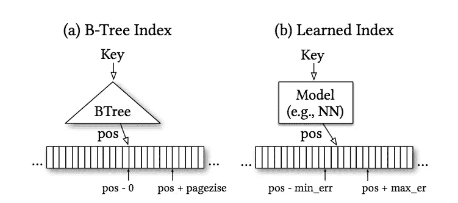

# ML 的应用:建立指数？

> 原文：<https://medium.com/coinmonks/building-efficient-learned-indices-using-machine-learning-96890c0fa948?source=collection_archive---------4----------------------->

## 介绍

在本帖中，我们将介绍 Google 的一篇探索性论文，该论文提出了一种非常新颖的方法,通过将机器学习技术应用于底层数据来构建更加时空高效的数据结构，例如 B 树索引。传统上，诸如 B 树或散列图之类的索引是用静态试探法和假设构建的。静态试探法不考虑底层数据分布。如果知道键的范围是从 1 到 100M，记录的大小是固定的，那么 B 树可能不是最佳的数据结构。在这种情况下，只使用键本身作为偏移量的索引会更好。显然，这个例子很简单，但是很有启发性。总是不可能先验地手动理解所有的数据分布，并构建那些可以对所有类型的数据表现良好的优化索引。

该论文提出了一个有趣的问题，即如果数据结构实际上是通过学习数据分布而不是静态地预先构建的，是否会有类似的改进。本文关注的是大量读取的工作负载，并不提倡现在就替换这些数据结构，而是致力于理解描述底层数据的连续函数是否可能产生更高效的数据结构，特别是对于大规模场景。

## 想法的直觉——指数是模型吗？

通常，每当需要快速查找时，在计算机科学中就使用索引。在数据库中，对于基于范围的查询，使用 B 树。对于点查询，使用散列映射。对于集合成员，使用布隆过滤器。

如果我们暂时关注 B 树，B 树遍历可以被认为是一个预测可能有您正在寻找的键的磁盘页面的模型。所以树的最初遍历(从根到叶)是预测(确定性地)排序数组中的起始位置。从这个起始位置开始的顺序搜索最大限度地减少了找到实际键的时间。(见下图“a”)。如果机器学习模型可以学习关键字的整体模式，那么它可以类似地预测关键字在排序数组中的位置(参见下面的图“b”)。类似地，布隆过滤器可以被认为是一个分类器，如果找到该键，则预测 1，如果该键不存在，则预测 0。

B-tree predicts the page in which the key can be present. For a learned index, similarly a model can predict the page where key might be present within some error bounds.

Jeff Dean 在 [SysML talk](https://youtu.be/Nj6uxDki6-0) 中概述的另一个趋势，可能会使基于 ML 的数据结构更加引人注目，那就是摩尔定律正在趋于稳定。因此，可以使用 SIMD 或 GPU 等矢量化指令的工作负载可以从硬件中提取更多信息。请看显示单核性能趋于平稳的蓝线。

[https://www.karlrupp.net/wp-content/uploads/2015/06/40-years-processor-trend.png](https://www.karlrupp.net/wp-content/uploads/2015/06/40-years-processor-trend.png)

## 范围指数(B 树)模型和 CDF

类似 b 树的索引有利于查询一系列数据。这种索引是建立在排序数据集之上的。已排序的数据被分成页面。由于空间限制，每个页面在索引中都有一个键。所以 B 树将一个键映射到磁盘上的一个页面。因此，可以将它视为最小误差为零(页面中的第一个关键字)和最大误差为页面大小(页面中的最后一个关键字)的回归树。因此，只要误差在相同的限度内，人们可以潜在地将这些指数构建为 ML 模型，如回归和神经网络。

基于机器学习的模型可以通过使用对一个关键字的预测并记录该预测偏离了多少来训练。只要这个误差在相同的范围内，这个模型在 B 树提供的语义保证上是等价的。此外，对于 B 树，由于数据是排序的，所以可以进行局部搜索来快速纠正错误。对于键的插入，B 树需要被平衡，类似地，ML 模型需要被重新训练。由于神经网络擅长学习各种各样的数据分布，它们可以用于为各种数据访问模式建立有效的数据结构。挑战在于平衡模型的复杂性与准确性和语义保证。本文提供了一些关于 B 树相对于 ML 模型的复杂度的计算。借助大多数硬件中可用的 SIMD 指令集或不断增长的 GPU，ML 模型可以运行得更好。

假设我们暂时关心固定大小记录的简单密集内存中索引。这些在很多系统中都很常见。此外，本文中的大部分研究都是针对整数/实数值，而不是字符串。字符串建模需要进一步研究。

**作为 CDF 模型的范围指数模型:**

累积密度函数学习数据分布。给定一个数据集，它计算概率，如果你选择一个随机阈值，那么数据集中任何数字小于或等于该阈值的概率是多少。假设我们记录了 100 个人的体重，如果我们为其建模一个 CDF F(X)。现在，如果我们选择 250 磅作为阈值，那么 F(250)将给出多少人的体重小于或等于 250 磅的概率。在这种情况下，概率可能是 95%左右。

如果我们把这个想法推广到范围索引，我们要寻找的是，给定一个键，这个键在数据集中的位置是什么。在排序的数据集中，它转换为:给定一个键，这个键大于或等于数据集中的键的概率是多少。例如，如果我们为从 10 到 1M 的键访问建模一个 CDF，然后在这个 CDF 索引中寻找键 999 的位置。然后选择关键字 999 作为阈值，CDF 将给出数据集中任何关键字小于或等于 999 的概率。在这种情况下，可能是 10%，甚至更小。因此位置估计函数可以变成:p = F(key) * N 其中 N 是键的数量。所以这个 CDF 预测，对于一个排序的数组，键位于数据集的 10%。然后一次可以往后退一点或者往前一点找到实际位置。出于训练目的，回归模型可以通过最小化最小平方误差来学习数据分布。

## 一个天真的指数:

作者最初建立了一个简单的索引，但结果证明比 B 树昂贵得多。由此得出的主要结论是:神经网络或回归模型可以在高粒度上很好地概括。但是当你放大时，更多的不规则现象出现了。看下面的例子，这个函数看起来非常平滑，但是当你放大到“最后一英里”时，这个模式非常分散。

Smooth CDF function, but wide variety at a finer granularity

## 一个实验性的索引生成框架

为了优化上述瓶颈，本文构建了一个新的学习索引框架(LIF ),该框架可以根据给定的配置生成索引代码。它自己建立回归模型，而神经网络使用 Tensorflow。然后，它提取神经网络生成的权重，并建立一个有效的 C++代码，可用作索引。

为了解决上面提到的最后一英里准确性问题，该框架构建了一个模型层次结构— **递归模型索引(RMI)** 。阶段 *l* ，有 M *l* 款。每个阶段都预测了键的某个位置。当您在层次结构中向下移动时，模型会使用上一阶段模型的先前位置预测来预测较新的位置。所以每一个阶段都在迭代改进上一个阶段所做的预测。例如，对于以百万计的键的数量，阶段 1 可以以一万的精度预测键的位置。下一阶段将研究这些 10K，然后将范围缩小到 100 个，以此类推。递归的终止条件可以是针对某个均方误差训练的朴素模型。

Each stage consists of multiple models and they are narrowing down the range of positions for the given key by using a model in the next stage. Note that in this scheme there can be overlapping ranges Model 2.2 refers to 3.2 and 3.3\. both. While 2.1 also refers to Model 3.2

这种方法的另一个优点是，在层次结构的顶部可以有复杂的神经网络，而在底部是简单的线性回归。这可以在空间-时间之间实现更优的折衷。在这样的混合模型中，如果误差太大，那么几乎所有的中间模型都可以变成 B 树。这种选择可以通过这些模型的误差测量来实现。

论文中的一些实验结果相当惊人。在某些情况下，B 树需要 50MB 来存储，而学习的索引只需要 0.15MB。此外，它们比 B 树的查找速度快 2.7 倍。实验使用两级 RMI，在第二级使用 10k、50K 模型。

## 点索引—哈希映射

传统的哈希映射是使用哈希函数实现的。根据哈希函数的效率，哈希映射中可能会有冲突。冲突的数量对存储和查找的哈希映射的性能有很大影响。在散列映射中，键不是按排序顺序存储的，键只是被映射到某个位置。

该论文提出通过学习 CDF 来构建散列函数。然后，可以缩放 CDF 以获得给定键的散列。假设数据集中有 N 个关键字，哈希映射的预期大小是 M，其中 M< N. Then a potential hash function could be: ***H(key)= F(key)* M .***如果学习模型完美地预测了 CDF，那么就不会有冲突。

Traditional hash map with lots of free slots and lots of collisions. The learned hash map with better utilization of the hash map and fewer collisions.

考虑一个关键字为 10，15，15，17，20 的数据集。每个键的 CDFs 分别为 1/5、3/5、4/5、5/5。如果我们想要一个大小为 3 的散列图，那么 H(15)将是 3/5* 3。其他的也可以类似计算。如您所见，哈希映射实现与此是分离的。可以使用探测或链接，具体取决于哪种方式有效。这种机制只提供了一种学习哈希函数的方法，可以最大限度地减少冲突并提高表的整体利用率。

这一方案可能并不总是奏效。如果数据集遵循均匀分布，那么数据集中的所有键具有相等的概率。因此，可以通过简单的线性回归很容易地对学习到的函数进行建模，因为对于给定的数据，均匀分布的 CDF 是一条直线。在这种情况下，上面提到的散列函数不是很有优势——它将与任何常用的散列函数执行相同的操作。

在实现方面，上面提到的 RMI 可以再次用于生成散列函数。对于实验，作者在第二阶段使用 100K 模型的 2 阶段 RMI。大规模密钥空间的一个大问题是哈希映射的内存限制。虽然基于模型的方法速度稍慢，但内存节省是巨大的——在 20%到 60%的范围内。

总的来说，结论似乎是，根据数据集和场景，学习哈希函数可能值得考虑。

## 存在指数或集合成员资格—布隆过滤器

布隆过滤器传统上用于使用存储器优化结构来检查集合成员资格。布隆过滤器保证他们将有零假阴性——如果一个键不在布隆过滤器中，那么它将以 100%的成功率进行预测。如果一个键在布隆过滤器中，那么它可能有误报，需要进一步检查。

**分类问题:**可以把 Bloom filters 看成分类问题。对于数据集中的所有键，模型预测为 1，而对于所有非键，模型预测为 0。一个非常简单的例子是，如果我们的集合由从 0 到 N 的所有整数组成，那么 f(x) = 0 ≤ x ≤ N 可以非常有效地为所有键返回 1。对于更复杂的数据，可以潜在地训练具有 sigmoid 激活函数的 RNN，因为这是二元分类。此外，sigmoid 中使用的 f(x)可以用作概率指标，我们可以设置一些阈值。任何高于阈值的值都表示存在于数据集中。因此，我们的数据集中不会考虑任何低于阈值的数据。因此，可以为这些关键字创建另一个溢出布隆过滤器，以实施上述的假阴性标准。需要注意的是，这种机制需要对非键有所了解。

**学习 bloom filter 的哈希函数:**这里有一个简洁的想法，我们需要的 bloom filter 哈希是键之间的大量冲突和非键之间的大量冲突。但是键和非键之间的冲突很少。这可以用上面提到的神经网络模型来完成。将 M 视为位集的大小。如果我们使用上一节中提到的相同的 f(x ),并且使用 f(x) * M 作为散列函数，那么较高概率的 f(x ),即关键字将映射到位集中的较高位置，而较低概率的非关键字映射到位集中的较低位置。

从本文所做的实验来看，当使用基于模型的方法时，bloom filter 的大小似乎减少了大约 15%。

## 结论

我认为这是一篇非常酷的论文，概述了一种使用 ML 技术构建数据结构的非常新颖的方法。在它们变得司空见惯之前，肯定还需要发生更多的事情，但是这是一个非常令人兴奋的 ML 技术的应用。

> [在您的收件箱中直接获得最佳软件交易](https://coincodecap.com/?utm_source=coinmonks)

