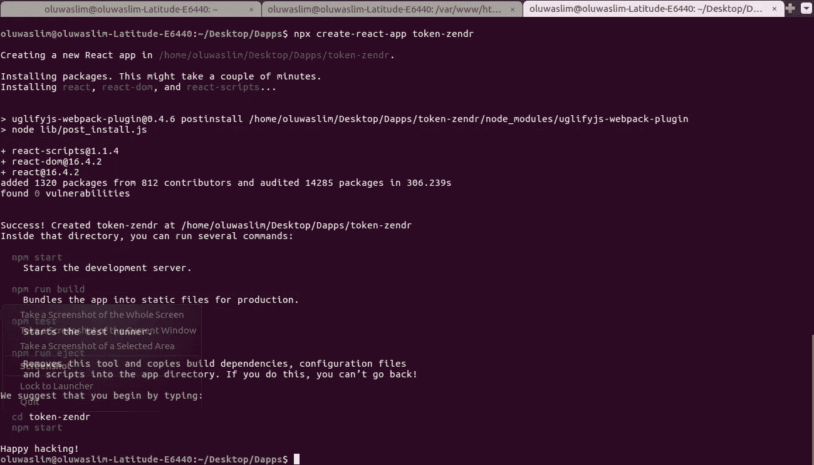
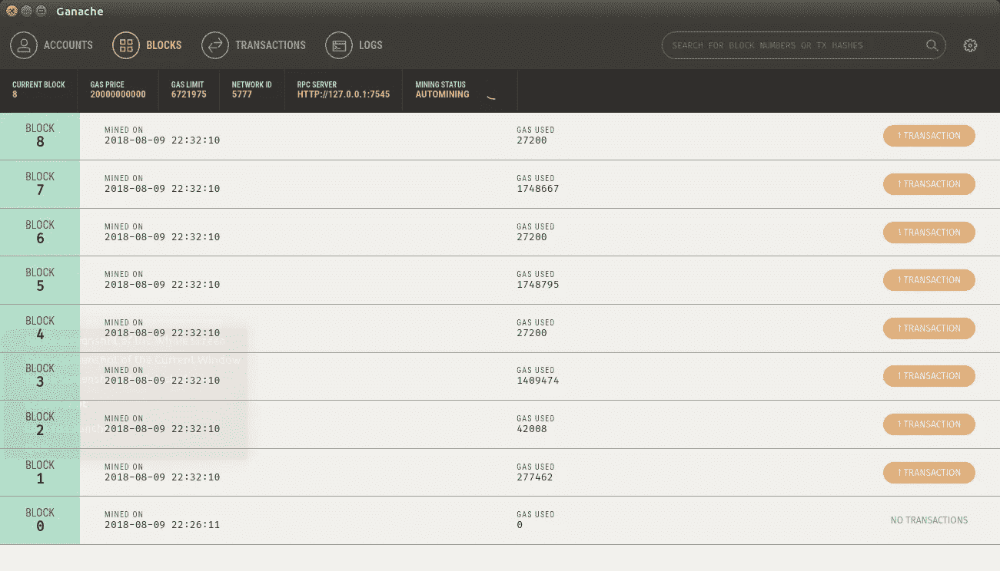
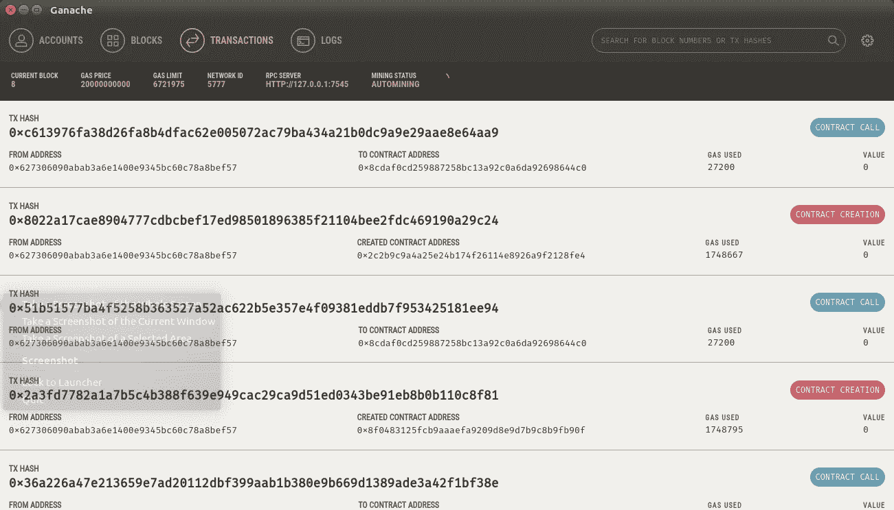
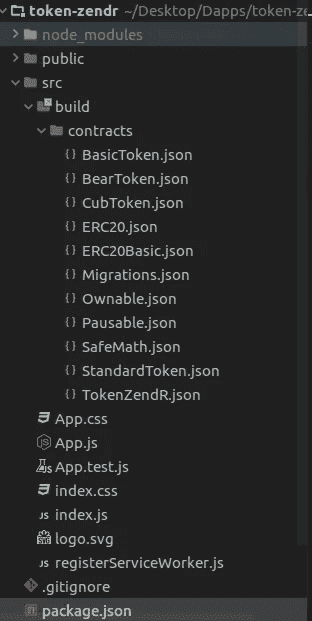
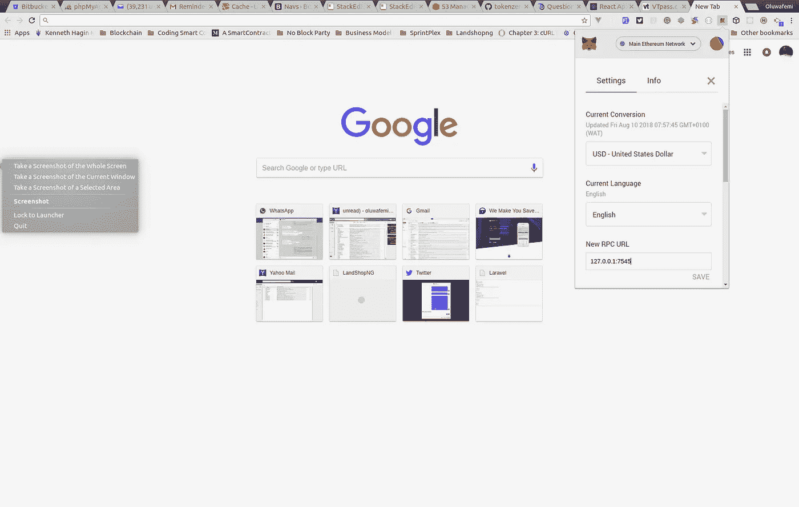
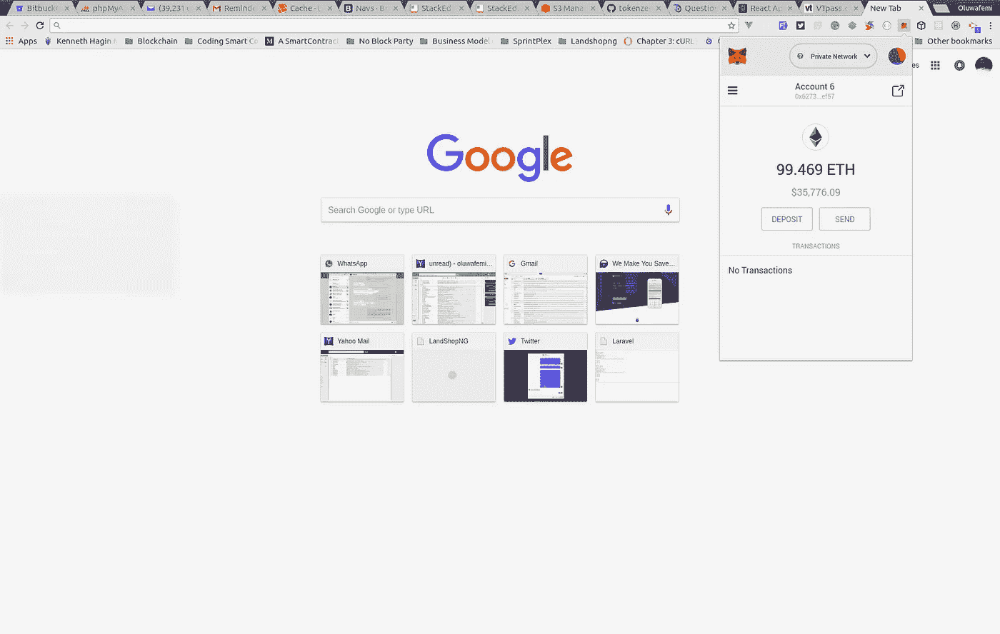
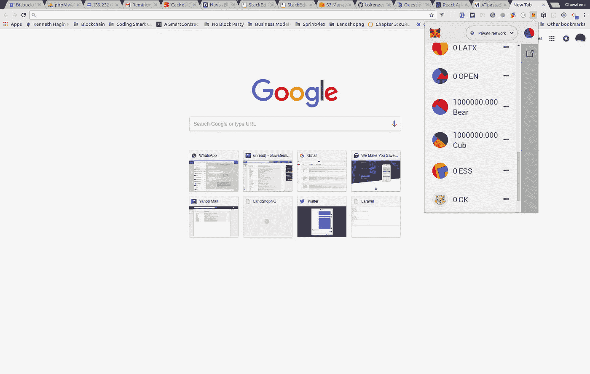
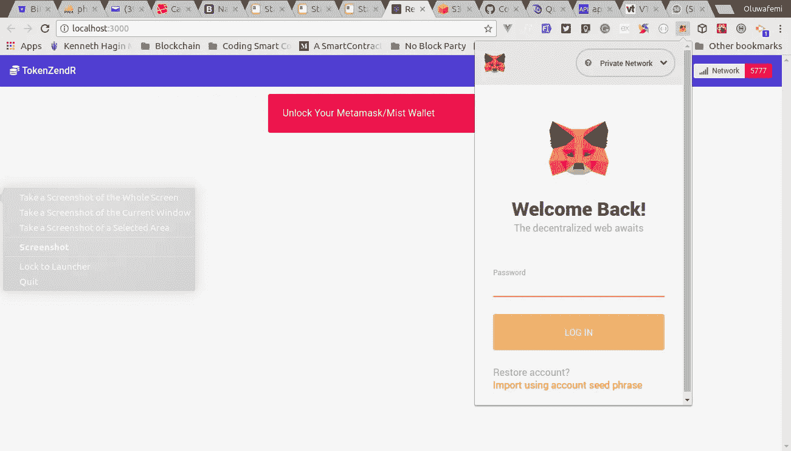
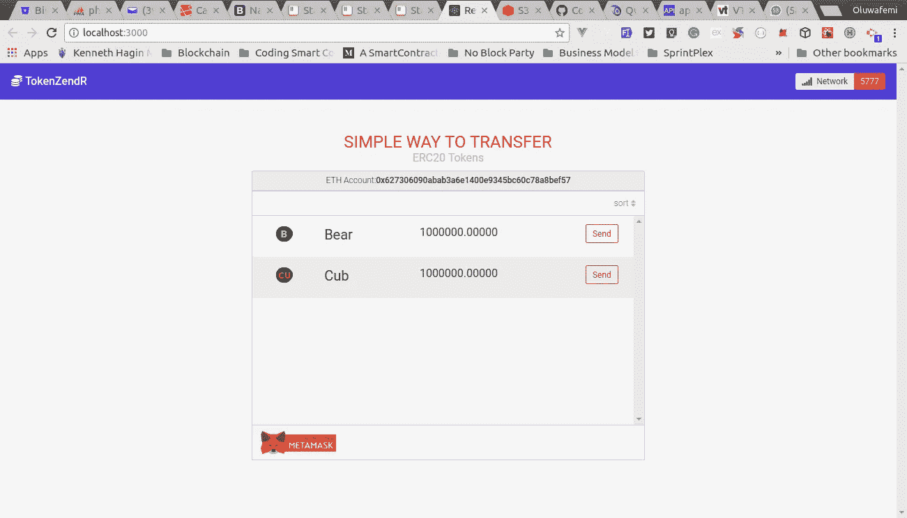

# 用 ReactJS + Truffle Contract + Web3 构建以太坊 Dapps，一个用于令牌的 UI For 一个将 ERC20 令牌转移到其他地址的智能合约—第 2 部分

> 原文：<https://medium.com/coinmonks/building-ethereum-dapps-with-reactjs-truffle-contract-web3-a-ui-for-tokenzendr-a-smart-bf345478b116?source=collection_archive---------0----------------------->


# 概观

在我上一篇 p [ost](/coinmonks/build-a-smart-contract-that-transfers-erc20-token-from-your-wallet-to-other-addresses-or-erc20-ee8dc35f40f6) 中，我写了一篇关于如何编写智能合约的教程，帮助你将任何 ERC20 兼容令牌转移到另一个地址，无论是 exchange wallet、metamask 还是 MEW。我们能够编写测试来断言我们的智能合约按照我们想要的方式工作，并通过 truffle 控制台与之交互。如果您还没有查看它，您可能应该查看一下。

本教程是第二部分，我们将使用 React 以及 Truffle Contract、web3js 和布尔玛来构建一个干净的界面，访问我们应用程序的用户可以使用它来与区块链上的智能合约进行交互。

> 交易新手？试试[密码交易机器人](/coinmonks/crypto-trading-bot-c2ffce8acb2a)或者[复制交易](/coinmonks/top-10-crypto-copy-trading-platforms-for-beginners-d0c37c7d698c)

## 我会学到什么？

在本教程的第二部分，您将学习如何:

*   使用 React 构建标准 Dapps 接口
*   使用 truffle 轻松构建 Dapps 接口的架构和工作流程
*   使用松露合同结合 Web3 与我们在区块链的合同进行交互

## 要求

对于本教程，您需要从上一个教程中克隆存储库，尽管在直接进入本教程之前并不要求阅读第一个教程，因为每个教程都涉及构建以太坊 Dapps 的两个不同方面，因此可以认为是独立的。

*   克隆令牌-森德智能合同[https://github.com/slim12kg/tokenzendr-contract](https://github.com/slim12kg/tokenzendr-contract)
*   Trufflesuite 已安装[安装指南点击此处](https://github.com/trufflesuite/truffle)
*   Ganache 安装了[私人区块链服务器](https://github.com/trufflesuite/ganache/releases)
*   为 chrome、firefox、opera 安装元掩码
*   安装了 npx(npx 随 npm 5.2+一起提供)
*   React 的基础知识

本教程假设您使用的是 *UNIX 操作系统*

## 困难

*   中间的

## 教程内容

首先，创建一个新的 react 应用

```
npx create-react-app token-zendr
```



记得之前我们提到过我们将使用 web3js，bulma & truffle 合同。现在是安装它们的时候了，要这样做，用下面看到的内容替换您的项目`package.json`，然后运行`npm install`

```
{  
  "name": "token-zendr",  
  "version": "0.1.0",  
  "private": true,  
  "dependencies": {  
  "bulma-start": "0.0.2",  
  "react": "^16.4.2",  
  "react-dom": "^16.4.2",  
  "react-scripts": "1.1.4",  
  "truffle-contract": "^3.0.6",  
  "web3-js": "^1.0.5-beta.26"  
  },  
  "scripts": {  
  "start": "react-scripts start",  
  "build": "react-scripts build",  
  "test": "react-scripts test --env=jsdom",  
  "eject": "react-scripts eject"  
  }  
}
```

成功安装软件包后，用`npm start`打开你的应用程序，你的默认浏览器会自动打开一个新标签，显示默认的反应屏幕。保持选项卡打开。

在我们继续之前，我需要你克隆处理转移的智能合同，并将其部署在你的私人区块链(Ganache)上。

注意:在运行以下命令之前，必须在您的计算机上启动 Ganache

```
git clone https://github.com/slim12kg/tokenzendr-contract.gitcd tokenzendr-contractnpm installtruffle consoletruffle(development)> compiletruffle(development)> migrate
```


如果您打开 Ganache，您应该会看到挖掘的事务和创建的新块，如下图所示

## 开采了 8 个区块



## 显示合同创建和呼叫的交易日志



刚开始构建以太坊 Dapps 的开发人员面临的一个挑战是，无论何时契约被重新部署，他们都必须在代码中编辑契约的地址。为了解决这个问题，我的方法是在令牌 *tokenzendr-contract* 中创建一个构建目录到我们新项目的 *src* 目录的软链接。

这确保了无论何时重新部署合同，我们都将引用更新的合同地址。Genuis！！

从命令行运行此命令，替换应用于项目的命令中的项目路径

```
//Remember to substituite your project path as it applies to you
ln -s ~/Desktop/Dapps/tokenzendr-contract/build/ ~/Desktop/Dapps/token-zendr/src!
```



如果你的截图看起来像上面的，那么你应该继续学习教程，否则检查你是否指定了正确的目录路径，并正确替换了适用于你的目录路径。

作为一个自治的智能开发人员，我们只想支持转移一些经过审查的令牌，或者令牌创建者可能需要向我们支付费用，以支持他们在我们的平台上转移令牌。智能契约已经有了一个添加或删除受支持令牌的方法，但在我们的前端，我们也想做同样的事情，但这次只是用令牌地址、名称、符号、小数在 json 文件中列出它们。

回顾我们部署到私有区块链的智能合约，需要意识到的一件重要事情是，我们不仅部署了处理令牌传输的智能合约，还部署了我们将在本教程中用于测试目的的两个 ERC20 令牌(BearToken，CubToken)合约。我们将在我们钱包中的两个地址之间转移它们，这两个地址将连接到它们被部署到的同一个网络。

既然我已经提到了在我们的传输合同中部署了两个令牌，您需要将您的*元掩码*连接到自定义的 *RPC* 。点击 *mainnet* 会弹出一个下拉菜单，提供选择自定义 RPC 的选项，点击此选项并输入新 RPC 的地址`http://127.0.0.1:7545`。


输入新的 RPC URL



看到第一个地址与加纳切的地址相同，并显示相同的余额



当部署双令牌契约时，它将所有令牌供应分配给用于部署契约的地址，在我们的示例中是第一个帐户。我们希望令牌余额显示在我们的钱包中，这样您就可以在转账时看到您的余额历史，为此只需打开我们之前创建的软链接的构建文件夹的`contract`目录，您将看到文件`BearToken.json`和`CubToken.json`文件。在 *networks* 部分下，复制`address`(联系地址)值，并将它们作为新令牌添加到元掩码中。

```
...
"networks": {  
  "5777": {  
  "events": {},  
  "links": {},  
  "address": "0x8f0483125fcb9aaaefa9209d8e9d7b9c8b9fb90f",  
  "transactionHash": "0x2a3fd7782a1a7b5c4b388f639e949cac29ca9d51ed0343be91eb8b0b110c8f81"  
  }  
},
...
```



我们将从编写 react 组件开始。本教程不是初学者的帖子，因此我们不会从头开始编码，因为这显然需要更长的时间。取而代之的是，我将一次选取每个组件，并在将它与`App.js`文件联系起来时提及每个组件所扮演的角色。

哦，对设置过程的一个快速添加，在项目的`src`目录中创建一个`Tokens`目录，添加三个文件`all.js`、`Bear.js`和 cub . js。`Bear.js`和`Cub.js`将携带每个令牌的信息，如`address`、`decimal`、`name`、`symbol`、`icon`，最重要的是`abi`，这将是添加一个新的支持令牌的过程。您可以从构建目录中的每个令牌的 json 文件中获得地址、十进制数和 abi，通常在 mainnet 上您总是可以从 etherscan.io 中获得这些信息

最后在公共文件夹中创建`icons`文件夹，添加小熊和小熊图标。你可以在这里找到它们[https://github . com/slim 12k g/token-zendr-react-interface/tree/master/public/icons](https://github.com/slim12kg/token-zendr-react-interface/tree/master/public/icons)

实际上， *ABI* (应用程序初级界面)包含的信息要比下面显示的多得多。

```
export default {  
  address: "0x8f0483125fcb9aaaefa9209d8e9d7b9c8b9fb90f",  
  decimal: 5,  
  name: "BearToken",  
  symbol: "Bear",  
  icon: "bear_x28.png",  
  abi: [  
     {  
        "constant": true,  
        "inputs": [],  
        "name": "name",  
        "outputs": [  
            {  
                "name": "",  
                "type": "string"  
             }  
        ],  
       ...,
       "name": "Transfer",  
      "type": "event"  
      }  
     ]
 }
```

在`src`目录下创建一个`Components`文件夹，添加以下组件

```
//InstallMetamask.js
import React from 'react';  

function InstallMetamask() {  
  return (  
 <div className="modal is-active">  
     <div className="modal-background"></div>  
     <div className="modal-content">  
         <p className="image download-metamask">  
             <a href="https://metamask.io/" rel="noopener noreferrer" target="_blank">  
             </img>
             </a>  
         </p>  
     </div>  
     <button className="modal-close is-large" aria-label="close"></button>  
 </div>  
 )}  

export default InstallMetamask;
```

这是当用户没有安装元掩码时显示的通知组件。

```
//UnlcokMetaMask.js
import React from 'react';  

function UnlockMetamask(props) {  
  return (  
     <div className="column is-4 is-offset-4">  
         <div className="notification is-danger">  
             <button className="delete"></button>  
             {props.message}  
         </div>  
     </div>  
 )}  

export default UnlockMetamask;
```

如果用户元掩码帐户被锁定，这也是一个显示警告的通知组件。

```
//Nav.js
import React, { Component } from 'react';  

class Nav extends Component {  
      render(){  
          return (  
             <nav className="navbar is-link" aria-label="main navigation">  
                 <div className="navbar-brand">  
                     <a className="navbar-item" href="/">  
                         <strong><i className="fa fa-coins"></i> {this.props.appName}</strong>  
                     </a>  

                     <a role="button" className="navbar-burger" aria-label="menu" aria-expanded="false">  
                         <span aria-hidden="true"></span>  
                         <span aria-hidden="true"></span>  
                         <span aria-hidden="true"></span>  
                     </a>  
                 </div>  
                 <div className="navbar-menu">  
                     <div className="navbar-end">  
                         <a className="navbar-item">  
                             <div className="tags has-addons">  
                                 <span className="tag">  
                                 <i className="fa fa-signal"></i> &nbsp; Network  
                                                                </span>  
                                 <span className="tag is-danger">{this.props.network}</span>  
                             </div>  
                         </a>  
                     </div>  
                 </div>  
             </nav>  
         ) 
     }
 }  

export default Nav;
```

这个组件的目的是作为我们的应用程序导航。它传递的是我们当前连接的网络的值。

```
//Description.js
import React from 'react';  

function Description(props) {  
  return (  
     <section className="container">  
         <div className="has-text-centered content">  
             <br/>  
             <h1 className="title is-4 is-uppercase has-text-danger">Simple Way To Transfer</h1>  
             <h2 className="subtitle is-6 has-text-grey-light">ERC20 Tokens</h2>  
         </div>  
     </section>  
 )}  

export default Description;
```

只是一个为我们的应用程序添加描述的组件。我使用了简单的方法来转移 ERC20 令牌，你可以根据自己的喜好进行修改

```
//Container.jsimport React, { Component } from 'react';  
import AddressBar from './AddressBar';  
import TokenBlock from './TokenBlock';  
import TradeMarkBlock from './TradeMarkBlock';  
import SortTokenBlock from './SortTokenBlock';  
import TransferToken from './TransferToken';  
import TransferHeader from './TransferHeader';  
import SuccessTransaction from './SuccessTransaction';  

class Container extends Component {  
  render(){  
      return (  
         <section className="container">  
             <div className="columns">  
                <div className="is-half is-offset-one-quarter column">  
                         <div className="panel">  
                         {  this.props.tx ?  
                         <SuccessTransaction tx={this.props.tx} /> :  
                          ''  
                          }  

                     <AddressBar account={this.props.account} tx={this.props.tx}/>  
                     {  
                         this.props.transferDetail.hasOwnProperty('name') ?  
                         <div>  
                             <TransferHeader token={this.props.transferDetail} />  
                             <TransferToken closeTransfer={this.props.closeTransfer}  
                                          transferDetail={this.props.transferDetail}  
                                          fields={this.props.fields}  
                                          account={this.props.account}  
                                          Transfer={this.props.Transfer}  
                                          inProgress={this.props.inProgress}  
                                          defaultGasPrice={this.props.defaultGasPrice}  
                                          defaultGasLimit={this.props.defaultGasLimit}  
                                          onInputChangeUpdateField={this.props.onInputChangeUpdateField}/>  
                     </div> :  
                     <div className={this.props.tx ? 'is-hidden' : ''}>  
                         <SortTokenBlock />  
                         <TokenBlock newTransfer={this.props.newTransfer} tokens={this.props.tokens} />  
                     </div>  
                     } 
                     <TradeMarkBlock tx={this.props.tx}/>  
                     </div>  
                 </div>  
             </div>  
         </section>  
         ) 
     }
 }  

export default Container;
```

这个*容器*组件包含其他几个组件，当状态改变时切换一些组件的显示，并将它们各自的属性从`app.js`传递给它。

地址栏组件显示活动帐户的地址
令牌块组件列表用户钱包中可用的受支持令牌
商标块组件卡页脚显示徽章的图像
排序令牌块组件对钱包中仅受支持令牌的列表进行排序 ASC/DESC
转移令牌组件包含进行转移的表单。它接受地址、要转移的金额和气体限制
TransferHeader 组件显示发起转移的令牌的信息，其名称和描述
SuccessTransaction 组件显示通知消息，该消息在成功转移后立即显示

最后是我们的`App.js`，它处理我们的状态和事件，并将数据传递给`Container`组件。我将对代码的每一部分进行注释，以提供更多信息。

```
import React, { Component } from 'react';  
import Web3 from 'web3'  
import TruffleContract from 'truffle-contract'  
import Tokens from './Tokens/all';  
import Nav from './Components/Nav';  
import Description from './Components/Description';  
import Container from './Components/Container';  
import InstallMetamask from './Components/InstallMetamask';  
import UnlockMetamask from './Components/UnlockMetamask';  
import TokenZendR from './build/contracts/TokenZendR.json';  

class App extends Component {  
  constructor(){  
      super();  

      this.tokens = Tokens;  //list of supported tokens by token-zendr contract
      this.appName = 'TokenZendR';  
      this.isWeb3 = true; //If metamask is installed  
      this.isWeb3Locked = false; //If metamask account is locked  

      //bind this methods to enable them change state from children components
      this.newTransfer = this.newTransfer.bind(this);  
      this.closeTransfer = this.closeTransfer.bind(this);  
      this.onInputChangeUpdateField = this.onInputChangeUpdateField.bind(this);  

      this.state = {  
          tzAddress: null,          //address of the token-zendr contract
          inProgress: false,        //if a transfer action is in progress
          tx: null,                 //tx returned after a successfull transaction
          network: 'Checking...',   //default message to show while detecting network
          account: null,            //address of the currently unlocked metamask
          tokens: [],               //list of supported tokens owned by the user address
          transferDetail: {},  
          fields: {                 //form fields to be submitted for a transfer to be initiated 
              receiver: null,  
              amount: null,  
              gasPrice: null,  
              gasLimit: null,  
         },     
         defaultGasPrice: null,     
         defaultGasLimit: 200000  
      };  

      let web3 = window.web3;  

      //set web3 & truffle contract
      if (typeof web3 !== 'undefined') {  
          // Use Mist/MetaMask's provider  
          this.web3Provider = web3.currentProvider;  
          this.web3 = new Web3(web3.currentProvider);  

          this.tokenZendr = TruffleContract(TokenZendR);  
          this.tokenZendr.setProvider(this.web3Provider);  

          if (web3.eth.coinbase === null) this.isWeb3Locked = true;  

     }else{  
      this.isWeb3 = false;  
     } 
 }  

  //switch statement to check the current network and set the
  //value to be displayed on the nav component 
  setNetwork = () => {  
      let networkName,that = this;  

      this.web3.version.getNetwork(function (err, networkId) {  
      switch (networkId) {  
      case "1":  
          networkName = "Main";  
          break;  
      case "2":  
          networkName = "Morden";  
          break;  
      case "3":  
          networkName = "Ropsten";  
          break;  
      case "4":  
          networkName = "Rinkeby";  
          break;  
      case "42":  
          networkName = "Kovan";  
          break;  
      default:  
          networkName = networkId;  
     }  

     that.setState({  
          network: networkName  
       })  
    }); 
 };  

 //When a new transfer is initiated
 //set details of the token to be
 //transfered such as the address, symbol.. etc
  newTransfer = (index) => {  
      this.setState({  
      transferDetail: this.state.tokens[index]  
     }) 
 }; 

  //Called at the end of a successful
  //transfer to cclear form fields & transferDetails
  closeTransfer = () => {  
      this.setState({  
          transferDetail: {},  
          fields: {},  
     }) 
 };  

  setGasPrice = () => {  
      this.web3.eth.getGasPrice((err,price) => {  
          price = this.web3.fromWei(price,'gwei');  
          if(!err) this.setState({defaultGasPrice: price.toNumber()})  
     }); 
 };  

  setContractAddress = ()=> {  
      this.tokenZendr.deployed().then((instance) => {  
      this.setState({tzAddress: instance.address});  
     }); 
 };  

 //Reset app state
  resetApp = () => {  
      this.setState({  
          transferDetail: {},  
          fields: {  
              receiver: null,  
              amount: null,  
              gasPrice: null,  
              gasLimit: null,  
         },  
         defaultGasPrice: null,  
     })
  };  

  Transfer = () => {  
      //Set to true to allow some component disabled
      //and button loader to show transaction progress
      this.setState({  
          inProgress: true  
      });  

      //Use the ABI of a token at a particular address to call its methods
      let contract = this.web3.eth.contract(this.state.transferDetail.abi)
                          .at(this.state.transferDetail.address);  
      let transObj = {
      from: this.state.account,
      gas: this.state.defaultGasLimit,
      gasPrice: this.state.defaultGasPrice
      };  
      let app = this;  
      //Use the decimal places the token creator set to get actual amount of tokens to transfer
      let amount = this.state.fields.amount + 'e' + this.state.transferDetail.decimal;  
      let symbol = this.state.transferDetail.symbol;  
      let receiver = this.state.fields.receiver;  

  amount = new this.web3.BigNumber(amount).toNumber();  

  //Approve the token-zendr contract to spend on your behalf
  contract.approve(this.state.tzAddress, amount ,transObj, (err,response)=>{  
      if(!err) {  
          app.tokenZendr.deployed().then((instance) => {  
              this.tokenZendrInstance = instance;  
              this.watchEvents();  

              //Transfer the token to third party on user behalf
              this.tokenZendrInstance.transferTokens(symbol, receiver, amount, transObj)  
                 .then((response,err) => {  
                      if(response) { 
                          app.resetApp();  

                          app.setState({  
                              tx: response.tx,  
                              inProgress: false  
                          });  
                     }else{  
                      console.log(err);  
                     } 
                 }); 
             }) 
         }else{  
          console.log(err);  
         } 
     }); 
 };  

 /**  
 * @dev Just a console log to list all transfers  
 */  
 watchEvents() {  
  let param = {from: this.state.account,to: this.state.fields.receiver,amount: this.state.fields.amount};  

  this.tokenZendrInstance.TransferSuccessful(param, {  
      fromBlock: 0,  
      toBlock: 'latest'  
  }).watch((error, event) => {  
      console.log(event);  
     }) 
 }  

  onInputChangeUpdateField = (name,value) => {  
      let fields = this.state.fields;  

      fields[name] = value;  

      this.setState({  
          fields  
      });  
 };  

  componentDidMount(){  
      let account = this.web3.eth.coinbase;  
      let app = this;  

      this.setNetwork();  
      this.setGasPrice();  
      this.setContractAddress();  

      this.setState({  
          account  
      });  

      //Loop through list of allowed tokens
      //using the token ABI & contract address
      //call the balanceOf method to see if this
      //address carries the token, then list on UI
      Tokens.forEach((token) => {  
          let contract = this.web3.eth.contract(token.abi);  
          let erc20Token = contract.at(token.address);  

      erc20Token.balanceOf(account,function (err,response) {  
          if(!err) {  
              let decimal = token.decimal;  
              let precision = '1e' + decimal;  
              let balance = response.c[0] / precision;  
              let name = token.name;  
              let symbol = token.symbol;  
              let icon = token.icon;  
              let abi = token.abi;  
              let address = token.address;  

              balance = balance >= 0 ? balance : 0;  

              let tokens = app.state.tokens;  

              if(balance > 0) tokens.push({  
                  decimal,  
                  balance,  
                  name,  
                  symbol,  
                  icon,  
                  abi,  
                  address,  
             });  

              app.setState({  
                  tokens  
              })  
            } 
         }); 
     }); 
 }  

  render() {  
      if(this.isWeb3) {  
          if(this.isWeb3Locked) {  
          return (  
             <div>  
                 <Nav appName={this.appName} network={this.state.network} />  
                 <UnlockMetamask message="Unlock Your Metamask/Mist Wallet" />  
             </div> 
         ) 
         }else {  
          return (  
             <div>  
                 <Nav appName={this.appName} network={this.state.network} />  
                 <Description />  
                 <Container onInputChangeUpdateField={this.onInputChangeUpdateField}  
                              transferDetail={this.state.transferDetail}  
                              closeTransfer={this.closeTransfer}  
                              newTransfer={this.newTransfer}  
                              Transfer={this.Transfer}  
                              account={this.state.account}  
                              defaultGasPrice={this.state.defaultGasPrice}  
                              defaultGasLimit={this.state.defaultGasLimit}  
                              tx={this.state.tx}  
                              inProgress={this.state.inProgress}  
                              fields={this.state.fields}  
                              tokens={this.state.tokens} />  
             </div>  
            ) 
        } 
    }else{  
         return(  
            <InstallMetamask />  
         ) 
        } 
     }
 }  

export default App;
```

将 src 文件夹中的`app.css`重命名为下面的样式。

```
img.meta-trademark {  
  width: 20%;  
}  

#token-lists {  
  height: 300px;  
  overflow-y: scroll;  
}  

#token-lists div.token:nth-child(even) {  
  background: #f5f5f5;  
}  

#token-lists div.token {  
  cursor: pointer;  
}  

.sortby {  
  font-weight: 300;  
  cursor: pointer;  
}  

.token-icon {  
  width: 28px;  
  height: 28px;  
}  

.download-metamask {  
  height: 30%;  
  cursor: pointer;  
  width: 70%;  
  margin: auto;  
}  

.is-ellipsis {  
  overflow: hidden;  
  text-overflow: ellipsis;  
}
```

给你的`public/index.html`添加字体超赞的图书馆 CDN

```
<!DOCTYPE html>  
<html lang="en">  
<head>  
 <meta charset="utf-8">  
 <meta name="viewport" content="width=device-width, initial-scale=1, shrink-to-fit=no">  
 <meta name="theme-color" content="#000000">  
 <script defer  
 src="https://use.fontawesome.com/releases/v5.1.0/js/all.js"></script>  
  (html comment removed:   
 manifest.json provides metadata used when your web app is added to the homescreen on Android. See https://developers.google.com/web/fundamentals/engage-and-retain/web-app-manifest/ )  <link rel="manifest" href="%PUBLIC_URL%/manifest.json">  
 <link rel="shortcut icon" href="%PUBLIC_URL%/favicon.ico">  
 <title>React App</title>  
</head>  
<body>  
<noscript>  
  You need to enable JavaScript to run this app.  
</noscript>  
<div id="root"></div>  
</body>  
</html>
```

到目前为止，应用程序将会显示，但是没有 bulma 样式，为了解决这个问题，我们需要在`src/index.js`文件中包含 bulma。只需用下面的代码替换 index.js

```
import React from 'react';  
import ReactDOM from 'react-dom';  
import App from './App';  
import '.././node_modules/bulma-start/css/main.css'  
import './app.css';  

ReactDOM.render(<App />, document.getElementById('root'));
```

运行`npm start`或刷新已经打开的应用程序。当我这样做的时候，我看到的第一个屏幕是下面的截图，因为我的元掩码帐户被锁定了。



然后我输入我的元掩码密码，刷新应用程序，瞧！！



与应用程序交互，看看还能添加什么。我希望你会发现这个教程解释得很好，内容很有教育意义。让我在评论区听到你的想法。

## 课程

*   [A 部分—创建一个智能合同，将 ERC20 令牌转移到任何符合 ERC20 的地址](https://steemit.com/utopian-io/@alofe.oluwafemi/create-a-smart-contract-that-transfers-erc20-tokens-to-any-erc20-compliant-address)
*   [B 部分—以太坊 Dapps 与 ReactJS + Truffle Contract + Web3 一起，为 TokenZendR 构建一个 UI，这是一个将 ERC20 令牌转移到其他地址的智能合约](https://steemit.com/utopian-io/@alofe.oluwafemi/building-ethereum-dapps-with-reactjs-truffle-contract-web3-a-ui-for-tokenzendr-a-smart-contract-that-transfers-erc20-tokens-to#)

## 链接存储库

[https://github.com/slim12kg/tokenzendr-contract.git](https://github.com/slim12kg/tokenzendr-contract.git)
https://github.com/slim12kg/token-zendr-react-interface

**想要学习使用节点 API 构建 Defi 储蓄智能合约，以便与智能合约进行交互吗？**👇👇👇

[](https://www.udemy.com/course/the-complete-solidity-mastery-course/) [## 完整的坚实掌握课程

### 大家好，我的名字是奥卢瓦费米。在接下来的 8 年里，我一直在构建可伸缩的 web 应用程序…

www.udemy.com](https://www.udemy.com/course/the-complete-solidity-mastery-course/) 

> 加入 Coinmonks [电报频道](https://t.me/coincodecap)和 [Youtube 频道](https://www.youtube.com/c/coinmonks/videos)获取每日[加密新闻](http://coincodecap.com/)

## 另外，阅读

*   [复制交易](/coinmonks/top-10-crypto-copy-trading-platforms-for-beginners-d0c37c7d698c) | [加密税务软件](/coinmonks/crypto-tax-software-ed4b4810e338)
*   [网格交易](https://coincodecap.com/grid-trading) | [加密硬件钱包](/coinmonks/the-best-cryptocurrency-hardware-wallets-of-2020-e28b1c124069)
*   [密码电报信号](/coinmonks/top-3-telegram-channels-for-crypto-traders-in-2021-8385f4411ff4) | [密码交易机器人](/coinmonks/crypto-trading-bot-c2ffce8acb2a)
*   [最佳加密交易所](/coinmonks/crypto-exchange-dd2f9d6f3769) | [印度最佳加密交易所](/coinmonks/bitcoin-exchange-in-india-7f1fe79715c9)
*   对开发者来说最好的加密 API
*   最佳[密码借贷平台](/coinmonks/top-5-crypto-lending-platforms-in-2020-that-you-need-to-know-a1b675cec3fa)
*   [杠杆代币的终极指南](/coinmonks/leveraged-token-3f5257808b22)