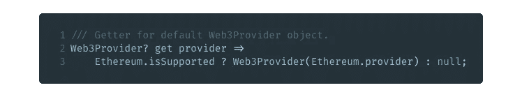
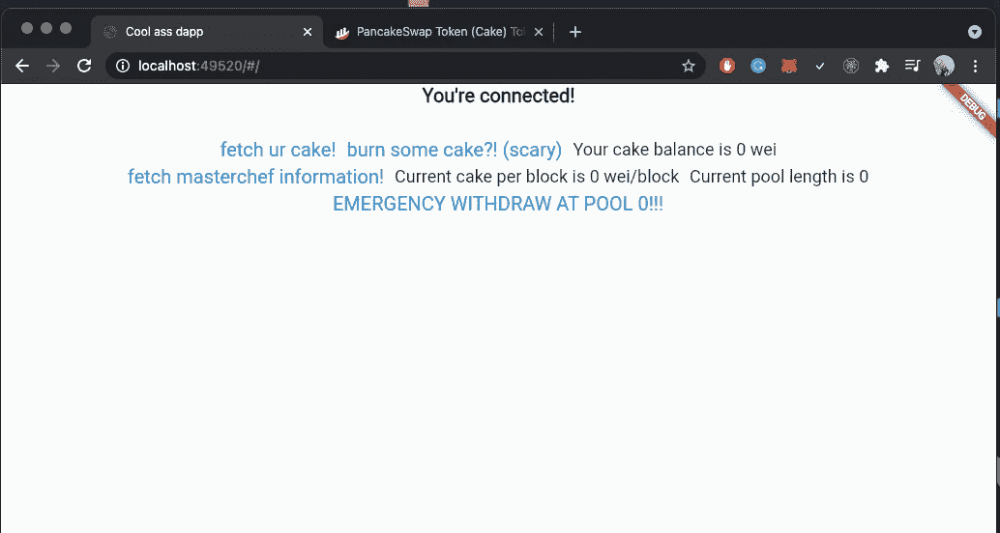

# 用 Flutter 构建现代 Web Dapp

> 原文：<https://medium.com/coinmonks/building-modern-web-dapp-with-flutter-91656c71d8b?source=collection_archive---------0----------------------->

## 不再有反应！再也没有 JS 了！(jk)我们现在是在颤振时代！

# 介绍

今天我将向你展示如何用 Flutter 构建一个现代的 web Dapp！

我们将使用 [flutter_web3](https://github.com/y-pakorn/flutter_web3) 包与以太坊对象交互，连接 Metamask、Wallet Connect 和其他提供者。

这个包还包括其他连接到 Ethers Js 和 Wallet Connect 等提供商的实用工具。

别说了，让我们开始吧！

# 安装

首先，创建一个颤振项目。

```
flutter create coolassname
```

并在`pubspec.yaml`中添加一些包。这次我将使用 [Getx](https://pub.dev/packages/get) 进行简单的状态管理，使用 [Niku](https://pub.dev/packages/niku) 进行酷属性构建，使用我们的包 [flutter_web3](https://github.com/y-pakorn/flutter_web3) 。

```
dependencies:
  flutter:
    sdk: flutter flutter_web3:
  niku:
  get:
```

开始舞动

```
flutter run -d web-server
```

因为像 Metamask 这样的扩展无法在 Chrome 调试浏览器(sad)中使用。

> 请记住，Flutter web 服务器没有自动刷新页面的热重启功能，在 CLI 中刷新后，您需要再次手动刷新浏览器。

# **建立网站**

## 规划功能

我们今天的主题是

*   像`requestAccount`一样使用以太坊对象及其方法。
*   使用 Ethers js 与智能合约交互。
*   使用默认的合同商 20 构建具有合同商 20 标准的合同。

请注意，这些并不是软件包的全部功能；请务必查看所有 API 和特性的文档。

因此，为了简单起见，我们将尝试制作 Pancake 交换交互器。

## 连接到帐户

我们首先定义网站的基本结构。然后我们将在那之后工作在 web3 部分。


定义一些扩展，让生活更轻松。


对于 Web3 部分，我们将把它放在`HomeController`。


为了便于解释，我们一行一行来。

*   第 2 行，检查我们是否可以访问以太坊对象获取器。从下面的实现来看，如果浏览器没有任何可用的提供者，以太网对象可以是`null`。即 Metamask、Wallet Connect、币安链钱包等。


*   第 4 行，检查当前连接的链是否是币安智能链(链 id 56)。
*   第 6 行，全面检查与网站的连接。`ethereum.isConnected()`仅用于提供者可用性，因此我们必须从节点公开的地址进行检查。
*   第 9 行和第 11 行存储状态变量。
*   第 15 行，连接到提供者并更新`currentAddress`和`currentChain`。通过使用`ethereum.requestAccount`,我们可以提示提供商与网站建立连接。(即元掩码模式)返回地址列表，该列表中的第一个地址是将被使用的当前地址。如果用户拒绝模态，一定要处理错误(在这种情况下，我不拒绝，这是我不应该做的。)并使用`ethereum.getChainId`更新`currentChain`
*   第 26 行，处理`accountChanged`和`chainChanged`事件。每当用户改变他的帐户或链时，它将调用`clear`并更新上面的变量。

然后我们可以构建一个超级简单的 UI 来显示我们是否连接。如果没有，请单击“连接”按钮，提示提供商进行连接。


所以我们完成了帐户连接部分。我在这里只展示粗糙的 UI 实现，你们可以把它做得尽可能好。


Connect Button


Connecting to the provider


Connected

## 连接到 Ethers js 提供程序

Ethers js 有很多提供者，其中两个是`Web3Provider`和`JsonRPCProvider`。

两者都可以用来从区块链读取数据，Web3Provider 通过将以太坊提供者放入构造函数来实例化。JsonRPCProvider 通过将 RPC Url 放入构造函数来实例化。

为了简单起见，我们可以通过使用默认的提供者 getter 来连接并获取 Web3。实现如下。



## 与合同交互

我们将此分为两个部分，与蛋糕令牌合同交互和与 Masterchef 合同交互。

对于蛋糕令牌契约，我们将使用`ContractERC20`。

对于 Masterchef 合同，我们将使用普通醚`Contract`并指定我们自己的 ABI。

## 蛋糕代币合同

超级简单！只需用令牌地址实例化 ContractERC20 类。

我们还将添加一个结束函数，它可以烧掉你 1 gwei 的蛋糕！辣！


我们将在这里一行一行地重复。

*   第 3，5 行存储了关于蛋糕令牌和令牌余额的变量。
*   第 7 行，如果为空，实例化`cakeToken`对象。并从`balanceOf`函数中获取我们的蛋糕余额。
*   第 15 行，从口袋里掏出 1 gwei 的蛋糕。先检查一下你的余额是不是超过 1 gwei(所以你有足够的烧完，还有剩余，哈哈！)然后把你的蛋糕调入`addressZero`，或者 0x0。然后再次更新你的蛋糕余额。

要为我们的契约构建 UI，我们首先需要确保以太坊对象不为空，然后正常地构建它。


Fetch cake and burn cake button


After fetching Cake


Burning 1 gwei of Cake


Burned

## **主厨**合同**合同**

因为我们需要创建自己的契约实例，所以我们还需要契约的 abi。我们可以在你选择的 block explorer 中查找。

我们可以使用 [BscScan](https://bscscan.com/address/0x73feaa1ee314f8c655e354234017be2193c9e24e#code) 查看合同的代码。


我们将选择一些属性、常量函数和写函数作为我们的例子。

首先，我们需要获得 abi。有关 abi 规格和类型，请参考 [Ethers js 文档](https://docs.ethers.io/v5/api/utils/abi/formats/)。

为了简单起见，我们将在这里使用最小的人类可读 abi，您也可以使用从 solidity 生成的 JSON abi，并将其粘贴到这里。

所以参考文件我们的 abi 是。


然后我们可以创建我们的契约并调用那个函数。请注意，solidity 中所有返回类型为`uint`的函数实际上都是 Dart 中的`BigInt`。


为了解释，

*   第 16 行，如果为空，则创建 Masterchef 合同，并获得带注释类型`BigInt`的`cakePerBlock`和`poolLength`。
*   第 24 行，调用`emergencyWithdraw`，用`0`表示池号作为参数。

之后，我们继续构建我们的 UI。



Fetch information button


After fetching information

# 结论

虽然开发 Dapp 的 Flutter 生态系统是前所未见的。但是通过 Dart2js 和许多涌现出来的用于增强加密和 web3 效用的 Flutter 包，这使得 Flutter 成为未来 Dapp 开发的有力竞争者。

我展示的简单例子已经证明了 Flutter 确实有潜力使用 Dart 的广泛功能开发复杂的 Dapp。

你可以在这里找到这个例子[的源代码。](https://gist.github.com/y-pakorn/76e0defd1f3cd7861c64c813760ef5d1)

> 加入 [Coinmonks 电报频道](https://t.me/coincodecap)了解加密交易和投资

## 另外，阅读

*   [尤霍德勒 vs 科恩洛 vs 霍德诺特](/coinmonks/youhodler-vs-coinloan-vs-hodlnaut-b1050acde55a)
*   [美元成本平均交易机器人](https://blog.coincodecap.com/pionex-dca-bot)