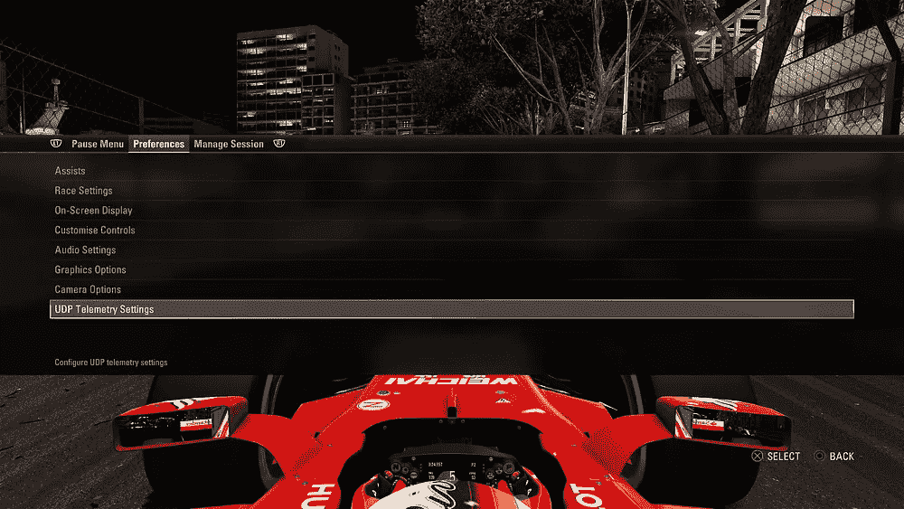
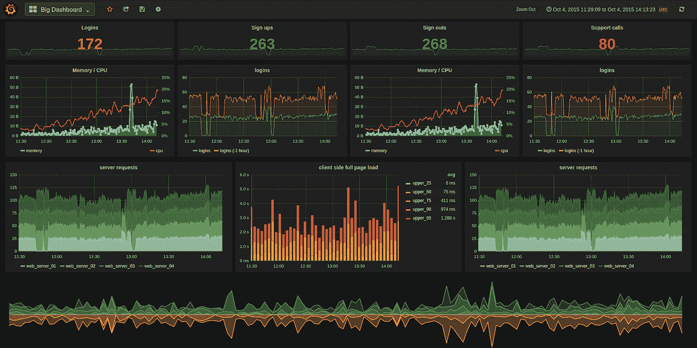
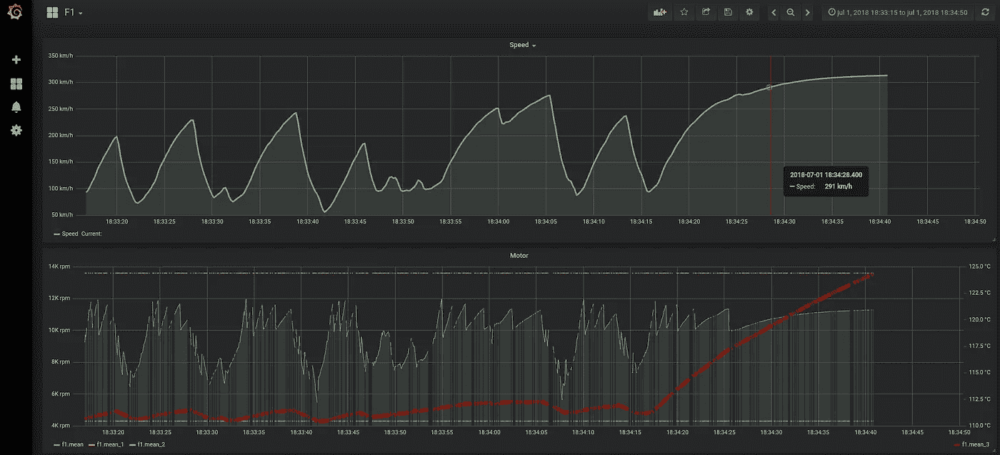
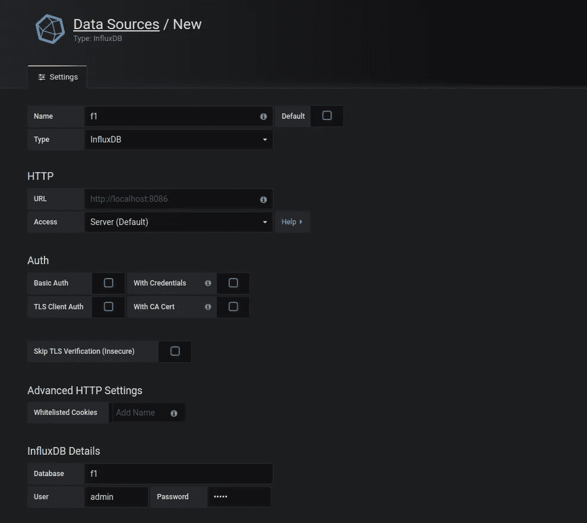
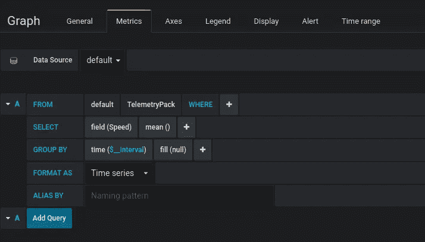
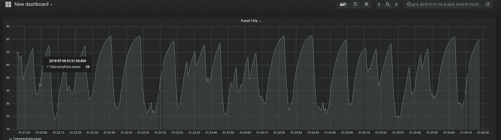

# 使用 Golang、InfluxDB 和 Grafana 为 F1 2017(游戏)构建自己的遥测系统。

> 原文：<https://medium.com/coinmonks/building-my-own-telemetry-system-for-f1-2017-game-using-golang-influxdb-and-grafana-48dedbd2cdc1?source=collection_archive---------2----------------------->

# 介绍

前几天，我在我的 F1 2017 游戏(PS4)中发现了一个功能，在菜单中导航时，我播下了一个名为 UDP 遥测设置的选项，其中包含许多网络配置，如下所示。



UDP Telemetry Settings in F1 2017

之后，我在谷歌上搜索了一下，我在 Codemasters 博客上找到了一篇关于 UDP 包的规范的博文。是的，这是一个很好的糟糕文档的例子，只有一个错误信息的结构方案在帖子下面的评论中被修复了。该结构如下所示。

```
// Packet size – **1289** bytes**struct UDPPacket**{float m_time;float m_lapTime;float m_lapDistance;float m_totalDistance;float m_x; // World space positionfloat m_y; // World space positionfloat m_z; // World space positionfloat m_speed; // Speed of car in MPH //First mistake, the speed is measured in m/s.........See the full struct at the blog post : [http://forums.codemasters.com/discussion/53139/f1-2017-d-box-and-udp-output-specification](http://forums.codemasters.com/discussion/53139/f1-2017-d-box-and-udp-output-specification)
```

在我知道如何使用这个功能后，我创建了一个简单的 go 程序来读取包装和打印汽车的速度。在我的程序中，我必须从 UDP 有效载荷 Obs 中读取一些字节:所有的 Floats 字段有 4 个字节，Int 的值有一个字节。

是的，只看到速度在一个终端是没有用的，我需要找到一个好的方法来看到这些信息的，我认为在一个好的工具用于监控服务器和应用程序，如果你认为 Grafana 你是对的。

Grafana 可以制作带有大量图表的漂亮仪表板，它可以处理数据，非常适合实时监控软件应用程序等事物，但现在 a 将使用一级方程式赛车进行测试；).



[Grafana Dashboard (at Github project)](https://github.com/grafana/grafana)

我做的第一件事是了解如何向 Grafana 发送数据。在我的搜索中，我发现了许多数据源，但只有 10 个官方数据源，在这些数据源中，我选择了 InfluxDB，因为它快速、简单，并且我不需要使用收集器来将我的数据发送到 DB。

用这三个工具，我做了自己的遥测系统。



F1 Dashboard

# 第一步:制作一个收集器

首先，我需要写一个收集器，谁将收集 UDP 包中的数据，然后将发送到 InfluxDB，这很容易说话，但我发现建立相同的问题。

我们需要解决的第一个问题是如何读取 UDP 包，这在 Go 中很简单，我们可以使用 package net，在这个包中有函数 ListUDP，它打开一个 UDP 连接，然后我们需要建立一个循环并使用连接的 read 函数来读取 UDP 有效载荷的字节。Obs:我创建了一个 1289 字节的缓冲区，因为这是 F1 文档中描述的大小。

读完 UDP 包后，我们需要转换成一个描述赛车或比赛信息的结构，所以下一步是写结构，我们有两个结构，第一个描述你，第二个描述其他玩家。

现在有了完整的结构，我们需要解码 TelemetryPack 中的二进制包，这也很容易。我们可以使用 Go 的‘编码/二进制’包。在中有一个名为 Read 的函数，它转换结构中的二进制文件。我们可以在 telemetry.go 文件中编写一个新函数。

之后，我们需要编写一个简单的客户端来发送 InfluxDB 中的结构，相信这也很容易。

我需要给出一些关于该代码的解释，首先我创建了一个 UDPClient，它将把数据发送到 InfluxDB，在我用 channel 初始化了一个循环并创建了一个 BatchPoints 之后，BatchPoints 是一个接口，它连接到一组要一起写入 InfluxDB 的点，但是在这个例子中，我们将一个一个地编写，因为我们需要在图形视图中有更快的速度。

在创建了一个批处理点之后，我创建了一个代表单个数据点的点，最后我用写函数将批处理点发送到服务器。

此时，我们有收集器的三个不同部分，一个 UDP 接收器、Struct 和一个 InfluxDB 客户端。现在我们需要让它们一起工作，首先我们将让接收器将 UDP 包转换为 TelemetryPack，并说明这一点。

为此，我们需要将结构转换成字符串映射，为此我用 reflect 包写了一个特殊的函数。

现在忽略简单的事情，我们需要在客户端调用那个函数。新点

influxdb.go complete

最后，我们需要为我们的客户端发送结构，为此我用 influxDBSender 初始化了 5 个 go 例程，并在循环中创建了一个 Point 结构并发送给 channel。

要查看所有代码，请前往[我的 github 项目](https://github.com/rafaelreinert/F1/)。

# 第二步:安装 InfluxDB

现在我们需要在一个主机上安装一个 InfluxDB 服务器，在这篇文章中，我用了一个 Raspberry pi 3 b+作为我的 Grafana 和 InfluxDB 的主机。安装 Raspbian 非常容易，我们需要在 apt 添加 InfluxData 存储库，在运行 apt-get 之后，我们可以使用以下命令来完成此操作:

如果你想了解更多，请访问[的官方文档 https://docs . influx data . com/influx db/v 1.5/introduction/installation](https://docs.influxdata.com/influxdb/v1.5/introduction/installation/)。

之后，我们有一个 InfluxDB 服务器在我们的主机上运行，但它还不允许 UDP 包，为了进行配置，我们需要在 influxdb.conf 中进行一些更改，只更改为 true 启用的 UDP，取消对 bind-address 的注释，并将数据库行与我们的数据库的名称(“f1”)放在一起。

```
[[udp]]
   enabled = true
   bind-address = ":8089"
   database = "f1"
.........
```

现在，用这些命令重新启动服务器并创建 f1 数据库。

```
influx
**>> CREATE** **DATABASE f1
>> exit**
```

# 第三步:安装 Grafana

简单，跟着 http://docs.grafana.org/installation/debian/那页[。](http://docs.grafana.org/installation/debian/)

我用这些命令安装:

```
wget [https://s3-us-west-2.amazonaws.com/grafana-releases/release/grafana_5.2.1_armhf.deb](https://s3-us-west-2.amazonaws.com/grafana-releases/release/grafana_5.2.1_armhf.deb) 
sudo dpkg -i grafana_5.2.1_armhf.deb
sudo service grafana-server start
```

是吗，如果你试着用用户 admin/admin 访问端口 3000，你可以访问 Grafana。

首先要做的是配置数据源。



# 第四步:配置我们的第一个仪表板

InfluxDB 只在收到第一条消息后创建模式，我们需要为此尝试所有，玩 F1 游戏并运行我们的 Golang 程序。

现在我们已经完成了我们的第一个 dashbord。

很简单，在创建新仪表板->添加面板->图形->编辑中点击，之后只需添加配置即可:



现在，我们有了第一个速度图表。好好享受吧。



现在只需研究 Grafana，让你 dashboad。

# 最后的

在那篇文章中，我向你展示了我如何制作自己的遥测系统，这是最基本的，如果你想了解更多，请看我的 github repo。

[https://github.com/rafaelreinert/F1](https://github.com/rafaelreinert/F1)

如果你觉得没用。你是正确的。但是我提高了我的英语写作水平，我了解了 Grafana 和 Influxdb，这是我第一次使用 UDP 并在 Go 中反映。所有这些都在一个很酷的项目中(对我来说)。