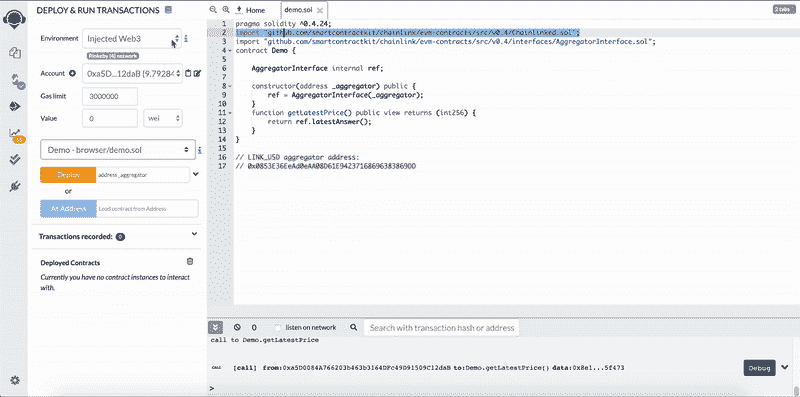
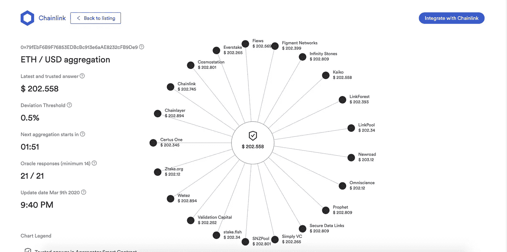

# 聪明地建立智能合同

> 原文：<https://medium.com/coinmonks/building-smart-contracts-smartly-b33dded92b37?source=collection_archive---------2----------------------->

## 使用分散数据的参考合同；借助 DeFi 应用的可信节点降低风险。


Photo by [Clifford Photography](https://unsplash.com/@cliffordgatewood?utm_source=unsplash&utm_medium=referral&utm_content=creditCopyText) on [Unsplash](https://unsplash.com/s/photos/ethereum?utm_source=unsplash&utm_medium=referral&utm_content=creditCopyText)

“明智地建立明智的合同”——Patrick

好吧，所以我不是英语课上最好的，但这是一个有趣的标题不是吗？

你会注意到我写了一篇关于构建智能合同的类似文章，从这里开始。在那篇文章中，我介绍了如何从单个节点获取数据，如果您正在寻找特定类型的数据，这是非常有用的。从单个点获取数据至少有一个主要问题，因为您现在有一个单点故障。我们已经看到历史上最近的案例，这些单点实际上已经引起了问题。请看这里: [1。](https://www.theblockcrypto.com/linked/28748/synthetix-suffers-oracle-attack-potentially-looting-37-million-synthetic-ether) [2。](https://www.theblockcrypto.com/post/56207/bzx-attacked-again-645k-in-eth-estimated-to-be-lost)

一种更安全、更便宜、更有效的方法是从分散的 oracle feed 或[参考数据契约](https://docs.chain.link/docs/using-chainlink-reference-contracts)获取数据。Chainlink 已经采取措施，在 chain 上提供具体的广泛使用的定价数据，供您在您的[智能合同](https://blog.coincodecap.com/tag/smart-contact/)中使用，而且使用起来再简单不过了。数据是从多个来源收集和汇总的，并且有一个信誉系统，因此每个节点都有动力总是发送最准确的数据。

测试它最简单的方法是用 [Remix](https://remix.ethereum.org/) (一个在线 solidity IDE):

```
pragma solidity ^0.4.24;import "github.com/smartcontractkit/chainlink/evm-contracts/src/v0.4/interfaces/AggregatorInterface.sol";contract Demo {

    AggregatorInterface internal ref;

    constructor(address _aggregator) public {
        ref = AggregatorInterface(_aggregator);
    }
    function getLatestPrice() public view returns (int256) {
        return ref.latestAnswer();
    }
}
```

测试聚合器契约有几个步骤。

1.  确保您已经安装了[元掩码](https://metamask.io/)，钱包中有 [Rinkeby test ETH](https://faucet.rinkeby.io/) ，并且您已经选择了 Rinkeby testnet。
2.  将上述代码复制并粘贴到 Remix IDE 中
3.  编译(此代码的版本为 0.4.24)
4.  然后使用一个 [Rinkeby testnet 聚合器地址](https://docs.chain.link/docs/using-chainlink-reference-contracts#section-test-reference-data-contracts-rinkeby)进行部署。在本演示中，我们使用 LINK-USD 提要。
5.  在区块确认申请后，选择 UI 中的“getLatestPrice”按钮。

现在你可以在[以太坊](https://blog.coincodecap.com/tag/ethereum/)区块链上看到链环的价格！



您可以在这里获得 [mainnet 地址](https://feeds.chain.link/)，以及哪些节点托管数据，目前谁在使用这些数据，以及价格如何波动。其他要测试的 [rinkeby 地址可以在这里找到。](https://docs.chain.link/docs/using-chainlink-reference-contracts#section-test-reference-data-contracts-rinkeby)



A visual representation of nodes sending data to a reference contract.

# 就这么简单

现在，您可以在您的 [DeFi](https://blog.coincodecap.com/tag/defi/) 应用程序中使用定价数据！

要直接从一个节点获取 mainnet 契约中的数据，您只需支付一点 LINK token，这就是 Chainlink token 如此有价值的原因。对于链上数据生态系统来说，这是一个至关重要的实用令牌，可确保节点始终运行，为[区块链](https://blog.coincodecap.com/tag/blockchain/)提供数据。这些来自节点运营商的拉动是这些参考契约的动力。

# 想再深入一点吗？

在这里可以找到一个关于构建可靠智能契约和用户界面的精彩课程。@ste_grider，它涵盖了端到端的一切。

这里的所有观点都是我自己的。

*关注我上*[*Twitter*](https://twitter.com/PatrickAlphaC)*，*[*medium*](/@patrick.collins_58673)*，*[*github*](https://github.com/PatrickAlphaC)*，*[*LinkedIn*](https://www.linkedin.com/in/patrickalphac/)*，获取更多内容和见解。*

*# financer evolution #区块链# ETH # chain link # smart contracts*

> [在您的收件箱中直接获得最佳软件交易](https://coincodecap.com/?utm_source=coinmonks)

[](https://coincodecap.com/?utm_source=coinmonks)