# 构建您的第一个基于 Azure 区块链工作台以太坊的应用程序

> 原文：<https://medium.com/coinmonks/building-your-first-azure-blockchain-workbench-application-7d7d49c0015a?source=collection_archive---------4----------------------->

当谈到区块链时，开发人员经常抱怨在解决安装和部署问题上花费了大量时间。如果我说有了 Microsoft Azure，您可以快速部署您的应用程序，甚至不需要任何安装或部署，只需要一些配置。

有了它，开发人员将能够专注于实现业务逻辑，他们的生产力将会提高:

Developers Reaction

让我们一步一步地看看这个过程:

1.  只需登录你的账户:portal.azure.com，搜索“区块链工作台”的服务= >从市场选择 Azure 区块链工作台。

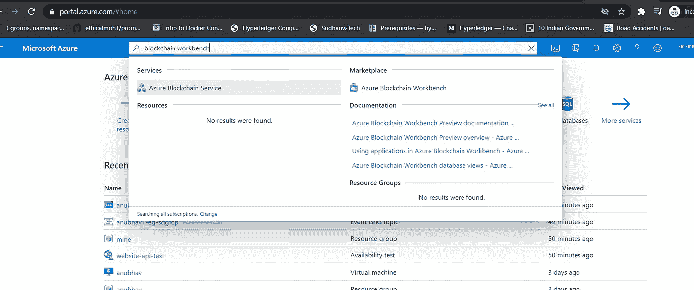

Azure Blockchain Workbench

2.一旦你点击了它，你将进入另一个窗口，它看起来像这样，包括关于这个服务的所有细节，只需点击创建:

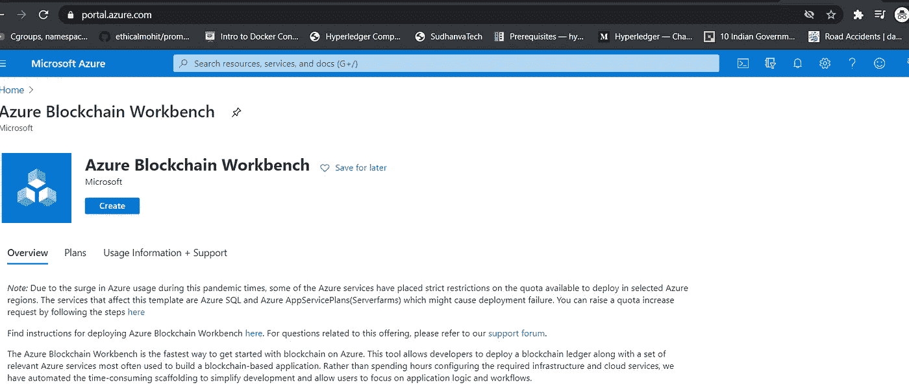

Azure Blockchain workbench

3.点击“创建”后，您将进入下一页，询问有关服务的所有详细信息，您可以逐一填写:

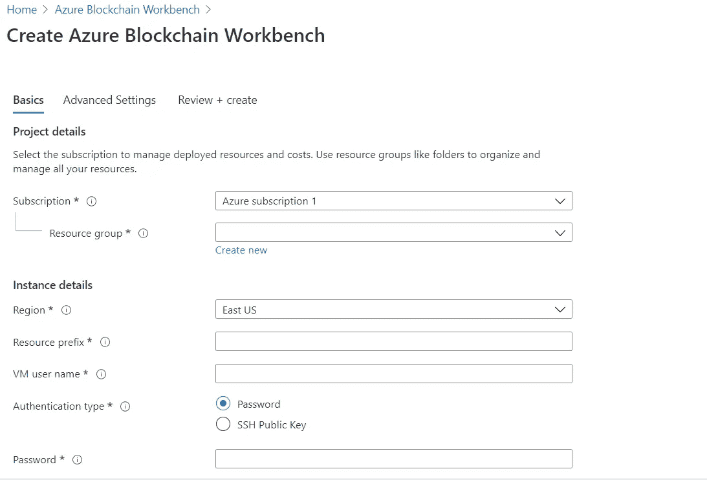

4.填写完所有详细信息后，将进入此服务的下一个调配级别，这可能需要大约 25 分钟。一旦它结束，您将收到一个确认，如下图所示，表明您的部署已完成:

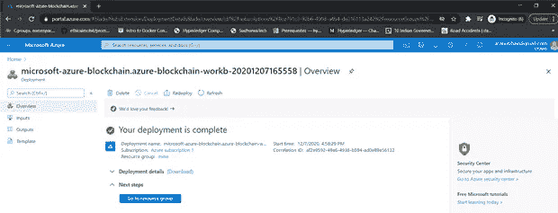

5.进入左边的输出部分，你会收到一个 URL，对我来说是“[https://anubhav1-sdgfop-api.azurewebsites.net](https://anubhav1-sdgfop-api.azurewebsites.net)”:

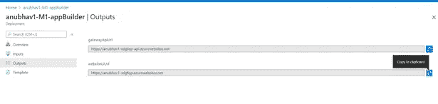

6.打开该链接后，您需要通过 PowerShell 在 Active Directory 链接中注册该应用程序，只需执行这些指令，您就会看到:

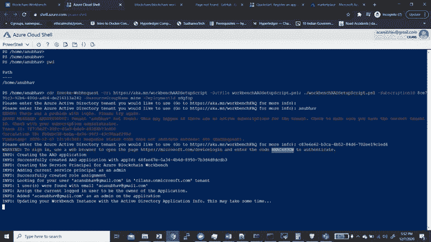

Powershell commands to be entered

7)成功完成集成后，您将看到如下确认信息:

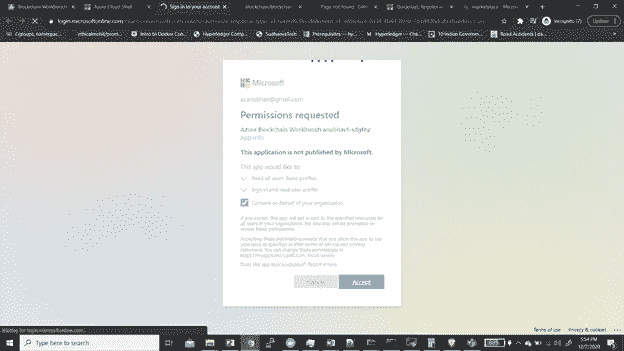

8)你可以去链接“【https://anubhav1-sdgfop-api.azurewebsites.net】”(输出中的链接)和路由“/应用”进入 it making =>“【https://anubhav1-sdgfop-api.azurewebsites.net】/应用”。你应该能看到下面的窗户。

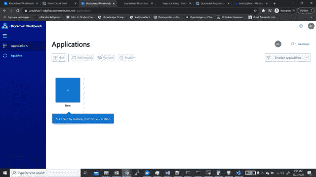

9)转到部署新应用程序的选项，选择您的以太坊 JSON 文件以及智能合约可靠性文件。

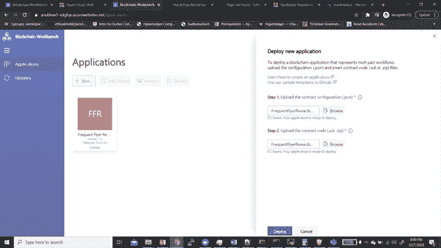

我已经为我的资产转让合同选择了文件，作为参考，您可以参考链接中给出的文件:

 [## aniforverizon/AzureBlockchainSmartContracts

### GitHub 是超过 5000 万开发人员的家园，他们一起工作来托管和审查代码、管理项目和构建…

github.com](https://github.com/aniforverizon/AzureBlockchainSmartContracts) 

10)您的应用程序将得到部署，您现在可以通过不同角色的人员的电子邮件 ID 添加成员:

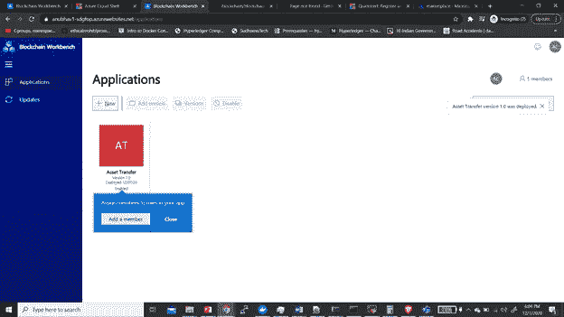

我添加了 3 个成员，他们有 3 个不同的角色(采购员、检验员和所有者)，如下图所示:

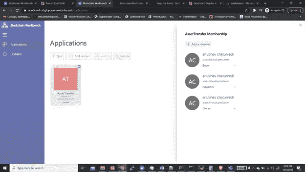

11)我们现在可以添加记录并开始跟踪它们:

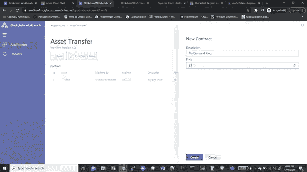

12)我添加的记录之一，后来修改的钻石戒指可以看到如下:

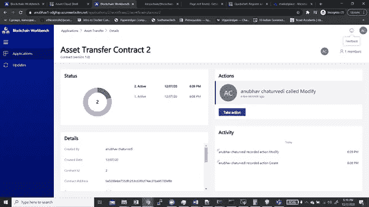

Tracking of records.

我将发布更多基于微软 Azure 的简单解决方案。如果你对本文或 Golang 有任何疑问，你可以在 Linkedin 或 instagram id= [acanubhav94](http://instagram.com/acanubhav94) 上给我发短信。

 [## Anubhav Chaturvedi - DevOps 解决方案架构师- Reliance Jio | LinkedIn

### 担任区块链开发(Hyperledger)和 DevOps 工程师等角色的独立承包商，包括…

www.linkedin.com](https://www.linkedin.com/in/anubhav-chaturvedi-a7465a72/) 

## 另外，阅读

*   最好的[密码交易机器人](/coinmonks/crypto-trading-bot-c2ffce8acb2a)
*   [Deribit 审查](/coinmonks/deribit-review-options-fees-apis-and-testnet-2ca16c4bbdb2) |选项、费用、API 和 Testnet
*   [FTX 密码交易所评论](/coinmonks/ftx-crypto-exchange-review-53664ac1198f)
*   [Bybit 交换审查](/coinmonks/bybit-exchange-review-dbd570019b71)
*   最好的比特币[硬件钱包](/coinmonks/the-best-cryptocurrency-hardware-wallets-of-2020-e28b1c124069?source=friends_link&sk=324dd9ff8556ab578d71e7ad7658ad7c)
*   [密码本交易平台](/coinmonks/top-10-crypto-copy-trading-platforms-for-beginners-d0c37c7d698c)
*   最好的[加密税务软件](/coinmonks/best-crypto-tax-tool-for-my-money-72d4b430816b)
*   [最佳加密交易平台](/coinmonks/the-best-crypto-trading-platforms-in-2020-the-definitive-guide-updated-c72f8b874555)
*   最佳加密贷款平台
*   [莱杰纳米 S vs 特雷佐 one vs 特雷佐 T vs 莱杰纳米 X](https://blog.coincodecap.com/ledger-nano-s-vs-trezor-one-ledger-nano-x-trezor-t)
*   [block fi vs Celsius](/coinmonks/blockfi-vs-celsius-vs-hodlnaut-8a1cc8c26630)vs Hodlnaut
*   Bitsgap 评论——一个轻松赚钱的加密交易机器人
*   为专业人士设计的加密交易机器人
*   [PrimeXBT 审查](/coinmonks/primexbt-review-88e0815be858) |杠杆交易、费用和交易
*   [HaasOnline 评论](/coinmonks/haasonline-review-d8d1a3400419)享受九折优惠
*   [埃利帕尔泰坦评论](/coinmonks/ellipal-titan-review-85e9071dd029)
*   [赛克斯石评论](https://blog.coincodecap.com/secux-stone-hardware-wallet-review)
*   [BlockFi 评论](/coinmonks/blockfi-review-53096053c097) |从您的密码中赚取高达 8.6%的利息
*   [面向开发人员的最佳加密 API](/coinmonks/best-crypto-apis-for-developers-5efe3a597a9f)
*   [最佳区块链分析工具](https://bitquery.io/blog/best-blockchain-analysis-tools-and-software)
*   [加密套利](/coinmonks/crypto-arbitrage-guide-how-to-make-money-as-a-beginner-62bfe5c868f6)指南:新手如何赚钱
*   顶级[比特币节点](https://blog.coincodecap.com/bitcoin-node-solutions)提供商
*   最佳[加密制图工具](/coinmonks/what-are-the-best-charting-platforms-for-cryptocurrency-trading-85aade584d80)
*   了解比特币最好的[书籍有哪些？](/coinmonks/what-are-the-best-books-to-learn-bitcoin-409aeb9aff4b)

> [直接在您的收件箱中获得最佳软件交易](/coinmonks/newsletters/coinmonks)

