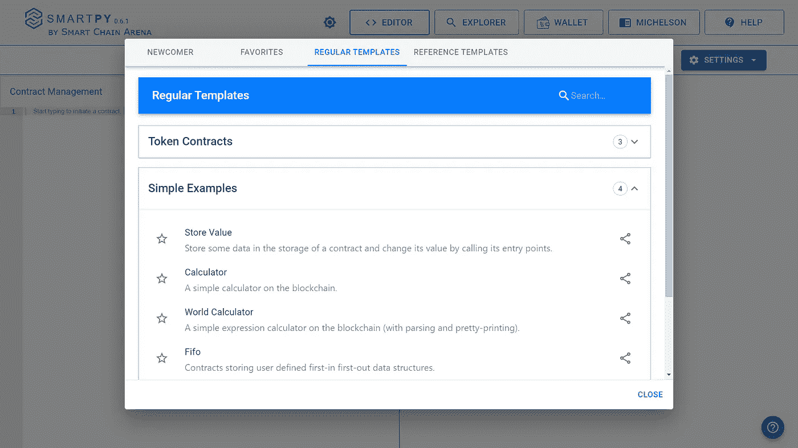
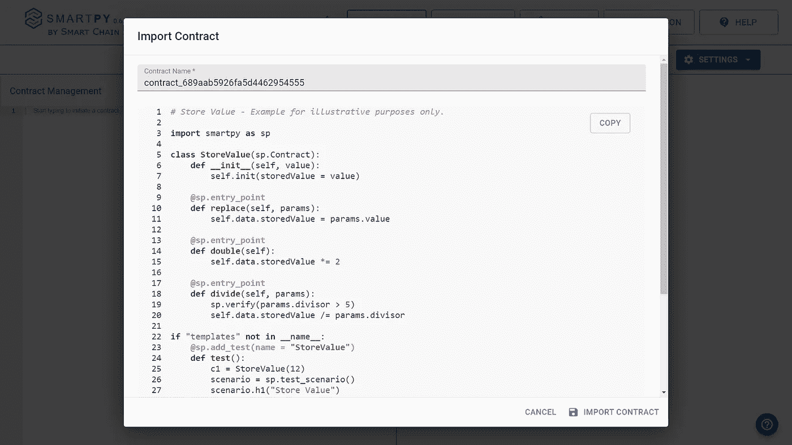
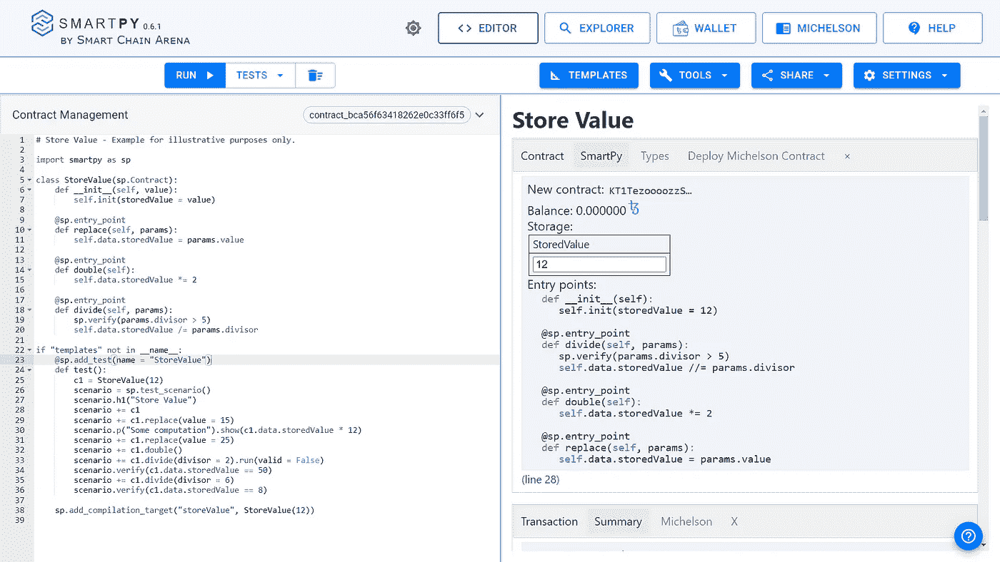
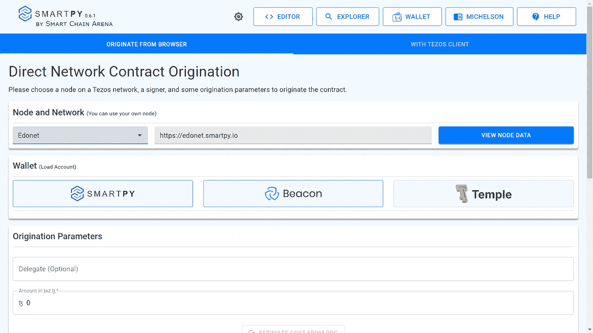
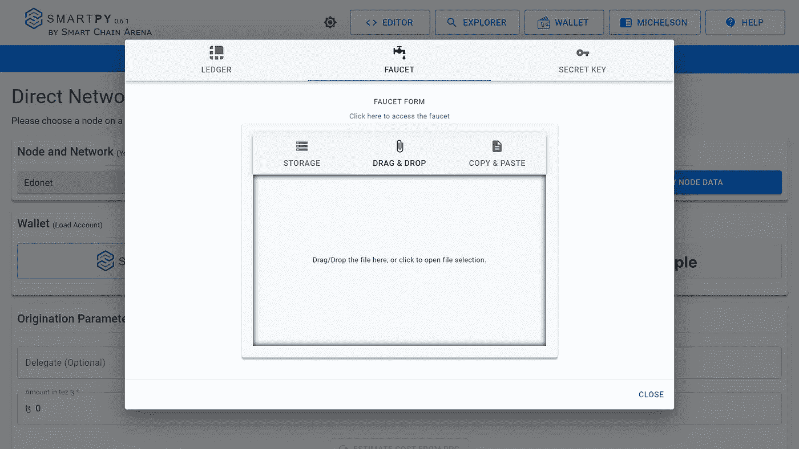

# 在 Tezos 上构建您的第一个 DApp:第 1 部分——在 SmartPy 上编写智能合同

> 原文：<https://medium.com/coinmonks/building-your-first-dapp-on-tezos-part-1-writing-smart-contract-on-smartpy-d7cdf27476f9?source=collection_archive---------1----------------------->

区块链是一种不可变的共享数字分类账，记录对等网络中的交易。它见证了许多领域的巨大需求，包括银行、医疗保健和公共管理。

Tezos 是一个去中心化的开源区块链网络，可以执行点对点交易，并作为部署智能合约的平台。

在本教程中，我们将创建一个 DApp，用于匿名发布博客，并以匿名捐赠的形式获得公众支持，这些捐赠将在 Tezos Blockchain 上得到保护。

## 项目解决的问题

媒体是民主的第四大支柱。但是许多人认为媒体被政府控制，政府压制他们的言论自由。

## 问题的解决方法

牢记这一点，我想到建立一个博客网站，任何人都可以匿名分享他们的观点，作家也可以通过匿名捐款的形式获得支持。这将确保没有中央机构控制文章的内容。

## 履行

[SmartPy](https://smartpy.io/) 是一个用于构建 Tezos 智能合约的 python 库。SmartPy IDE 有许多工具，使得智能合约的开发和部署非常容易。

## 快速启动

*   让我们跳到 [SmartPy](https://smartpy.io/) 。在顶部栏中，转到在线编辑器。这将打开 SmartPy 编辑器。

*   在上面的弹出窗口中，转到*常规模板*并从*简单示例*中选择*存储值*并导入该合同。

## 撰写智能合同

*   为了使用 SmartPy 库的特性，我们首先必须导入它。
*   之后，我们需要创建一个类，在那里我们将编写所有需要执行的函数。就像上面的例子一样，有一个类`StoreValue`，我们在其中定义了所有的入口点。
*   `StoreValue`类需要从`sp.Contract`类继承。
*   `__init__`函数是`StoreValue`类的构造函数，我们在其中初始化`storedValue`变量。
*   下一步是为特定的函数创建入口点。入口点是可以从外部调用的方法。需要用`@sp.entrypoint`装饰器标记。
*   在`replace`函数中，我们有 params，它是一个用于访问传递给函数的所有参数的对象，可以作为`params.value`来访问`value`参数。
*   和大多数语言一样，SmartPy 也有表达式。例如`self.data.x`代表存储字段`x`。
*   在上面的例子中，`replace`函数用用户使用`self.data.storedValue = params.value`传递的值替换`storedValue`。
*   现在，为了测试我们的智能合约，我们将编写如下测试。

## 测试和场景

*   `c1`是`StoreValue`类的一个对象。
*   `scenario`描述一系列动作:发起契约、计算表达式、调用入口点等。
*   `sp.test_scenario()`呼吁对我们的智能合同进行测试。
*   `scenario.h1("Store Value")`是我们测试输出的标题，类似于 HTML 标题。
*   `scenario += c1`显示 c1 的初始状态。
*   `scenario += c1.replace(value = 15)`显示调用入口点`replace`后 c1 的状态。

## 运行和测试我们的智能合同

运行代码以查看右侧的测试结果。

## 部署智能合同

*   在右侧点击*部署* *迈克尔逊* *合同。*

*   选择 Edonet 作为节点。
*   选择 SmartPy wallet。

*   选择水龙头，转到提供的链接，并生成您自己的水龙头帐户。
*   复制并粘贴您的水龙头信息在这里。
*   关闭弹出窗口，然后激活帐户，然后显示它。
*   向下点击*从 RPC 估算成本。*
*   最后，点击*部署合同*。

呜哇！我们已经成功创建和部署了智能合同。现在，您可以进入*浏览合同*页面与合同进行交互。

## 下一步是什么

在接下来的部分中，我们将构建一个更高级的智能契约，然后将其与前端集成。