# 在云上构建你的第一个神经网络

> 原文：<https://medium.com/coinmonks/building-your-first-neural-network-on-the-cloud-ffb9fcfef945?source=collection_archive---------2----------------------->


image found here [https://www.wallpapersin4k.org/images/772395](https://www.wallpapersin4k.org/images/772395)

在这篇文章中，我将带你了解如何轻松地构建一个图像分类器，可以从时尚 MNIST 数据集中区分 10 种不同的服装。不仅如此，这一切都将通过利用云计算的力量来完成。本文将介绍在云上建立自己的项目的所有步骤。如果你想直接跳到一个完整的项目，点击下面的链接，你会发现这个项目已经设置好了，可以开始了！

[](https://floydhub.com/run?template=https://github.com/djbyrne/CNN-On-The-Cloud-)

# 介绍

在过去的几年里，我们已经看到了大量令人兴奋的神经网络用例，从生成内容，到像聊天机器人一样与生活对话，以及在各种游戏中击败顶级人类玩家。这是一个加入快速发展的人工智能世界的美妙时刻。然而，除非你有自己的高功率钻机，否则需要很长时间来训练网络达到可接受的标准。这可能需要几个小时到几天的时间。即使使用高规格的硬件，更令人印象深刻的任务仍然需要很长时间。

如果你刚开始涉足这一领域，你不太可能想投资建立自己的定制机器和必要的硬件。幸运的是我们不需要。云为人工智能的蓬勃发展提供了完美的生态系统，允许我们轻松地利用我们快速高效地启动和运行所需的必要资源。到本文结束时，您应该对在云上运行自己的机器学习项目感到舒适了！

# 用什么平台？

目前，在选择云提供商时，有几个选项可供选择。目前云计算领域的三大巨头当然是谷歌、亚马逊和微软。其中每一个都提供了强大的云平台和基础架构，可以满足您所有的云需求。这听起来很棒，但是它们也有很长的学习曲线(有些比其他的更长)。有很多信息需要吸收，如果你刚刚开始或需要快速原型一个想法，这有点矫枉过正。就我个人而言，我在自己的项目中使用第四个选项 FloydHub。FloydHub 是一个快速简单的云平台，让您可以立即启动并运行。FloydHub 被称为深度学习的英雄，这是一个很好的描述方式。它基本上消除了在云中设置的所有麻烦，这就是我们将要使用的项目。

# 获取设置

好吧，首先，去 [FloydHub](https://www.floydhub.com/?utm_medium=content&utm_source=dbyrne&utm_campaign=jul_2018) 创建一个免费账户。登录后，单击“项目”选项卡并创建一个新项目。你也可以选择使用 FloydHub 模板，它为你提供了各种人工智能用例的入门模板，如图像分类和情感分析。一旦你创建了你的项目，你需要创建一个工作空间。这是我们进行项目的地方。单击创建工作区。

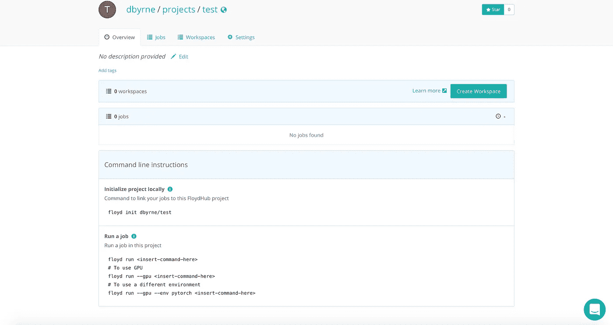

然后你会被提示选择如何初始化你的项目。您可以从头开始，也可以从现有的 GitHub 存储库中导入代码。现在选择从头开始

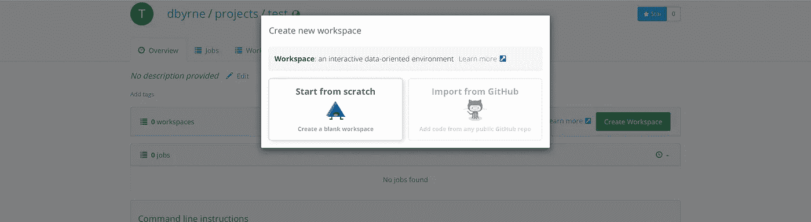

接下来，您需要选择您的环境和机器类型。您可以选择各种类型的环境，包括不同版本的 python、tensorflow 和 pytorch。现在为 python 3 选择 tensorflow 1.7。机器类型决定了您将使用的硬件规格。基本免费帐户提供了一个标准的单一 CPU，这将符合我们的目的。您也可以购买为您提供更高规格的 GPU 和 CPU 的电源 ups。Power ups 允许您根据最适合您需求的套餐，购买指定小时数的专用深度学习机器。

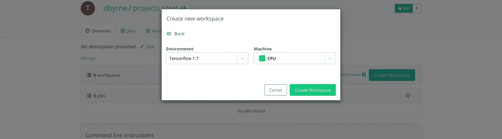

一旦你完成选择你的规格，你会在你的项目中看到一个新的工作空间。点击它，我们将在那里工作的代码。

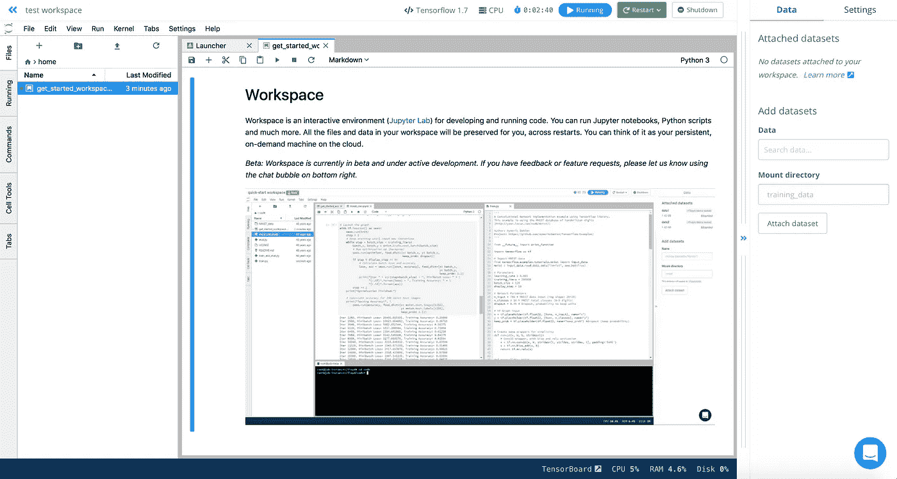

# 浏览工作区

工作区提供了几个 UI 特性来帮助您进行云开发。在顶部，我们可以看到关于我们正在运行的工作区的信息。这包括环境类型、正在使用的机器类型、它已经运行了多长时间、它当前是否正在运行，以及重启工作空间或完全关闭它的选项。确保你没有让你的工作空间闲置！这将浪费你的 CPU/GPU 时间，你将无法得到它回来。

左边是我们的文件夹目录，里面有我们所有的资源和文件。此部分的顶部栏有创建和上传新文件/文件夹的选项。

在右边，我们看到一个选项卡，让我们将数据集添加到我们的工作区。我们稍后会详细讨论这一点。

首先，单击左侧文件目录中的加号图标。这将给你一个制作新的 python3 笔记本的选项。随你怎么命名，我们已经准备好开始编码了。

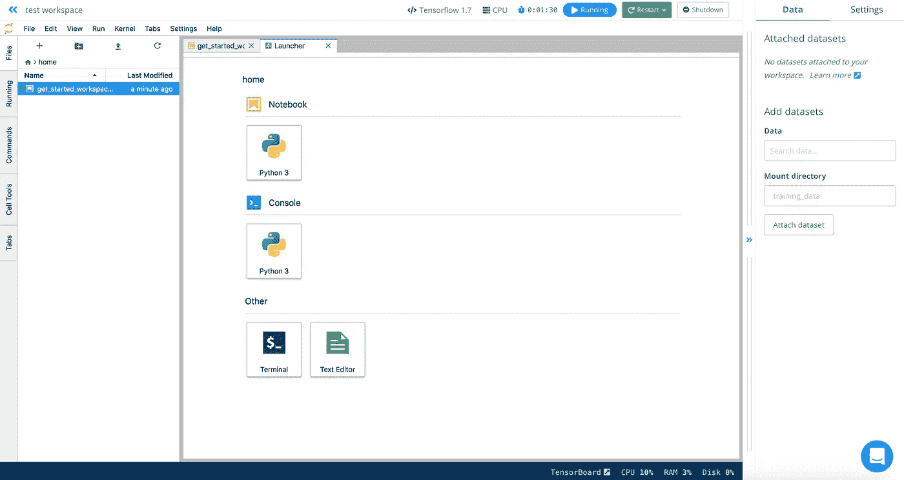

# 添加数据集

在动手之前，我们需要添加一个数据集。你可以从 [Kaggle](https://www.kaggle.com/zalando-research/fashionmnist) 下载时尚 MNIST 数据集。一旦在本地机器上有了数据集，就可以将其连接到 FloydHub 工作空间。为此，我们需要导航回项目页面。

转到数据集，然后单击新建数据集。像创建一个新项目一样，填写细节。在这个例子中，我将我的数据集称为 fashion-mnist。接下来我们需要使用一些命令行指令。如果你不熟悉命令行，我强烈建议你学习一些常用的指令，比如 cd 和 ls。一开始可能会有点混乱，但是相信我，一旦你掌握了它，命令行会让事情变得更快。

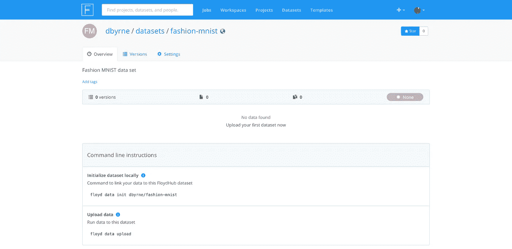

首先我们需要安装 FloydHub CLI，这让我们可以在终端中使用 FloydHub 命令。运行以下命令:

```
$ pip3 install -U floydhub-cli
```

完成后，使用以下信息登录 FloydHub:

```
$ floyd loginLogin with your FloydHub username and password to run jobs.Username [alice]: alicePassword:Login Successful as alice
```

输入你的用户名和密码，你就可以开始了。

接下来，导航到存储数据集的文件夹。例如，我刚刚下载了时尚 MNIST 数据集，所以我的数据将在我的下载文件夹中。要连接它，请在终端中运行以下命令

```
$ cd Downloads/fashionmnist$ floyd data init fashion-mnist$ floyd data upload
```

我们的数据集现在已连接到我们的 FloydHub 帐户。最后一步是将新数据集添加到我们的项目中。

导航回工作区页面。您可以在主控制面板中通过单击工作区并找到合适的工作区来快速完成此操作。如果您同时停止了工作区，请单击 resume 使其恢复运行。

在右侧的“添加数据集”下，搜索我们刚刚上传的数据集 fashion-mnist。正如您在下面看到的，当您选择了数据集后，FloydHub 会向您显示数据在您的工作空间中的存储位置的 url，以便您可以轻松地访问它。

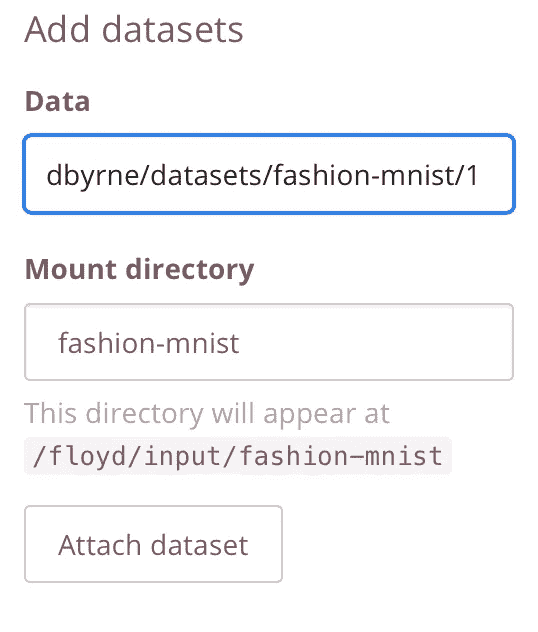

我们现在准备开始编码了！

# 构建项目

开始有趣的事情。我们将使用 keras 制作一个简单的图像分类器。对于那些不熟悉 keras 的人来说，它是一个很棒的库，提供了一个简单的 API，可以让你快速构建神经网络。我不打算详述代码的细节，因为它将在后面的文章中介绍，这只是给你一个在 FloydHub 中构建项目的例子。

## 导入库

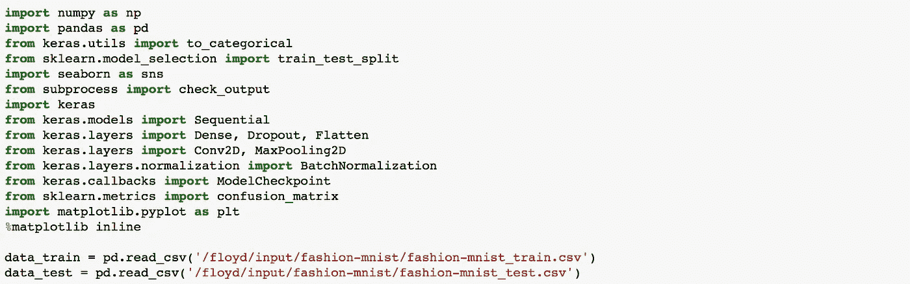

## 数据准备

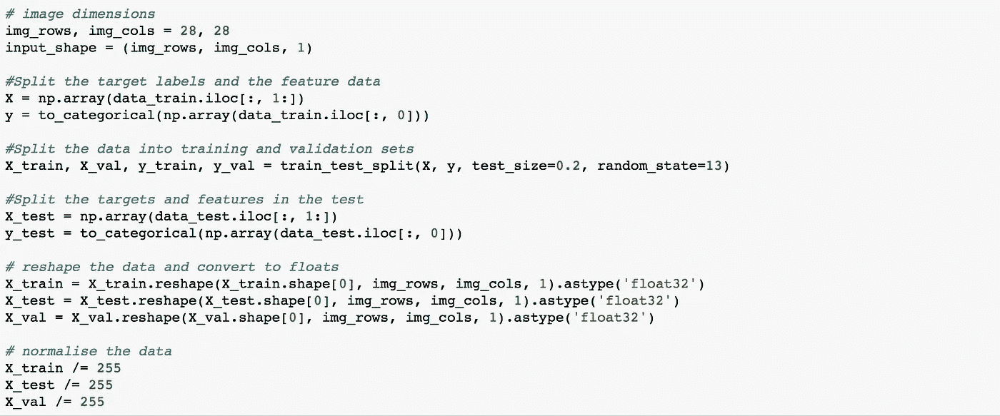

## 超参数

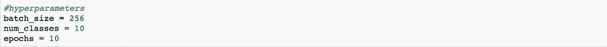

## 构建网络

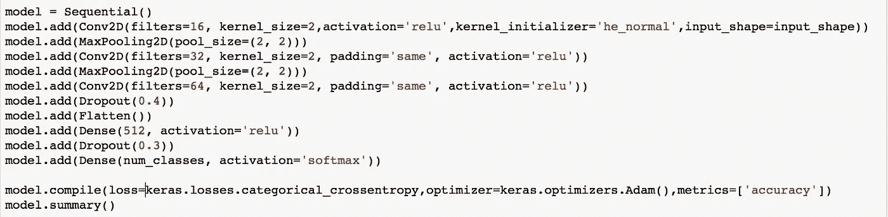

## 编译和培训

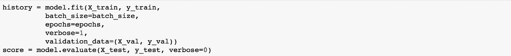

## 测试我们模型的准确性

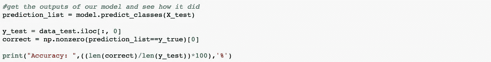

# 运行项目

好的，让我们运行完成的模型，看看它的表现如何。

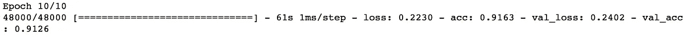

经过 10 个时期的训练(大约 10 分钟)，我们的模型在测试集上获得了 91%的准确率！这很好，但是我们可以做得更好。尝试使用给定的代码，看看是否可以提高模型的准确性。改变超参数，增加更多的历元或降低学习率。看一下 keras 文档，看看是否可以给我们的模型添加一些额外的层来提高它的准确性。将来我会写一篇文章，详细介绍卷积神经网络。完整的代码和笔记本可以在我的 [github](https://github.com/djbyrne/CNN-On-The-Cloud-) 上找到

[](https://github.com/djbyrne/CNN-On-The-Cloud-) [## djbyrne/CNN-On-The-Cloud

### CNN-On-The-Cloud- -用于为时尚 MNIST 数据集构建图像分类器的代码。使用 Keras 库构建…

github.com](https://github.com/djbyrne/CNN-On-The-Cloud-) 

值得指出的是，如果你用一台 GPU 机器来运行它，而不是基本的 CPU，它会运行得更快。在 GPU 机器上运行我们的项目允许我们进行更长时期的训练，使用更复杂的模型，并获得更好的结果。

# 结论

恭喜您，您已经成功在云端构建了您的第一个神经网络！

在本文中，我们了解到:

1.  在我们的 ML 项目中利用云计算的力量
2.  如何在 FloydHub 上设置自己的项目并添加自定义数据集
3.  使用云上的 keras 快速构建图像分类器

我希望这篇文章对你有用。如果您有任何问题、意见或反馈，请在下面留下。