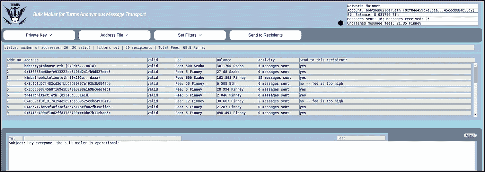

# 用于 Turms 匿名消息传输的批量邮件程序

> 原文：<https://medium.com/coinmonks/bulk-mailer-for-turms-anonymous-message-transport-6370aa823544?source=collection_archive---------1----------------------->

[Turms AMT](/@alejandrodiaz_71295/introducing-turms-anonymous-message-transport-2e40b31dbdc2?source=friends_link&sk=1cdec02ea57b2fd0bb66d5e711d0a256) (匿名消息传输)是一个对等消息系统，用于在以太坊地址之间发送消息。现在只有一个理由使用它: ***接收垃圾邮件会让你付出代价！***

将会有一些不可思议的 DApps 建立在 Turms AMT 之上。但是它们还不存在。与此同时，让人们尝试新的信息系统是相当困难的。所以现在尝试它的原因是，每次你收到一条消息，它会给你带来一点点额外的消耗——比你执行 register-transaction 所花费的汽油多一点。

这就是为什么引入批量邮件非常重要，因为这是让营销人员向已注册 Turms AMT 的人发送广告(垃圾邮件)的第一步。

批量邮寄者是 DApp。它看起来是这样的:

## 注意事项:

*   批量邮件使用与 Turms AMT 相同的合同
*   合同由 Solidified 审计
*   所有 Turms 消息都是对等加密的
*   当你注册以太坊地址时，你可以通过设置高额的“垃圾邮件费”来限制你收到的垃圾邮件数量
*   该系统是完全分散的
    —它基于一个简单的以太坊智能合约
    —默认情况下，消息存储在以太坊区块链
    —可选地，消息可以存储在 Swarm
    —没有后端服务器
*   群发邮件代码都是开源的，在 [github](https://github.com/AlejandroDiaz666/bulk-mailer) 上

## 未托管批量邮件

为了避免必须为每个收件人单独签署每笔交易，批量邮件程序要求您输入以太坊私钥。这与 [Turms AMT DApp](https://ipfs.io/ipns/messagetransport.turmsanonymous.io/) 不同，后者使用元掩码发送消息，因此它从不要求您输入私钥。当然，您的私钥永远不会被传输或保存。但是对于任何网站来说，要求你输入私钥都是不礼貌的。因此，群发邮件不会在任何网站上运行——你需要在你自己的电脑上运行它。

## 高质量的垃圾邮件？

值得注意的是，Turms AMT 垃圾邮件可能比典型的电子邮件垃圾邮件质量更高。原因很简单:由于发件人需要为每封邮件付费，他们会对发送垃圾邮件三思而行。无论如何，如果你觉得你收到了太多的信息，就把你的垃圾邮件费提高到 1000 以太。

## 立即注册

现在有了批量邮件，我希望在接下来的几周内，一些勇敢的营销人员会开始发送广告(又名。垃圾邮件)——发送到所有在 Turms AMT 注册的以太坊地址——垃圾邮件费用将开始慢慢流入。如果你有一个以太坊地址，但还没有注册，去[Turms AMT Dapp](https://ipfs.io/ipns/messagetransport.turmsanonymous.io/)——它只需要几美分的汽油费——你将会得到比垃圾邮件费更多的钱。

你可以在 [Alex Diaz un-website](https://diazgonewild.com/) 上找到关于 Turms 的链接和文章。

亚历杭德罗·迪亚兹