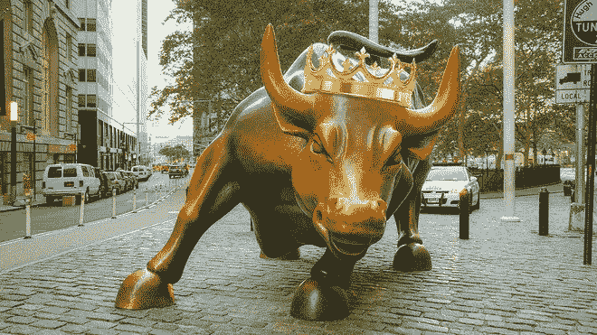

# 牛市不受影响

> 原文：<https://medium.com/coinmonks/bull-run-unaffected-4f6279459de4?source=collection_archive---------5----------------------->

在制图的时候，画随机的线并不能代表什么。我通常参考均线，MACD(但不经常)，偶尔参考 RSI，以及一些指标和振荡指标来寻找一些好的交易机会。大多使用每日或每周的规模。我们需要知道每个指标代表什么，否则，我们不会正确地使用它们。我不寻找任何模式，如楔形，头和肩膀，杯子和手柄，大象…