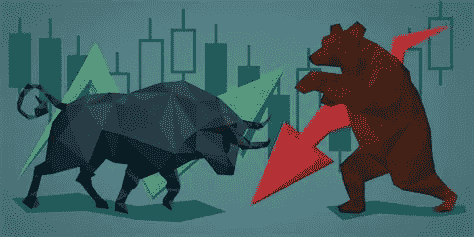
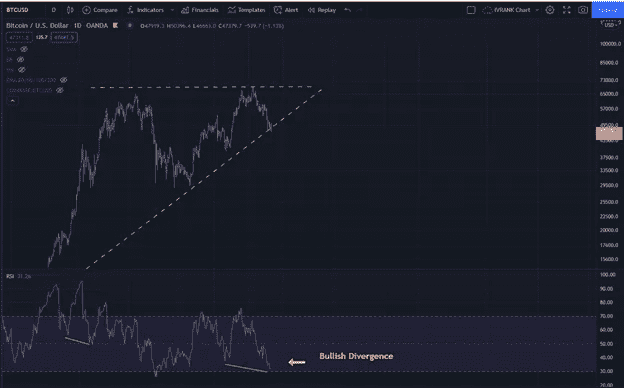
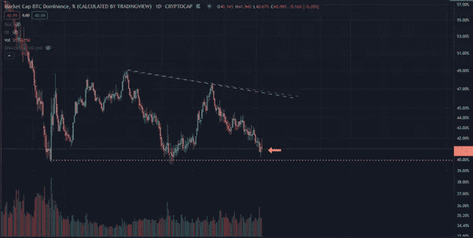
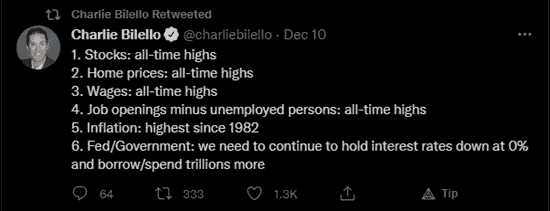
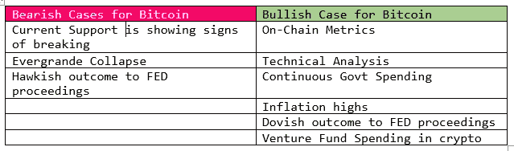
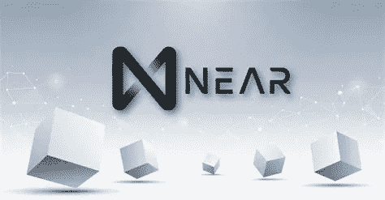
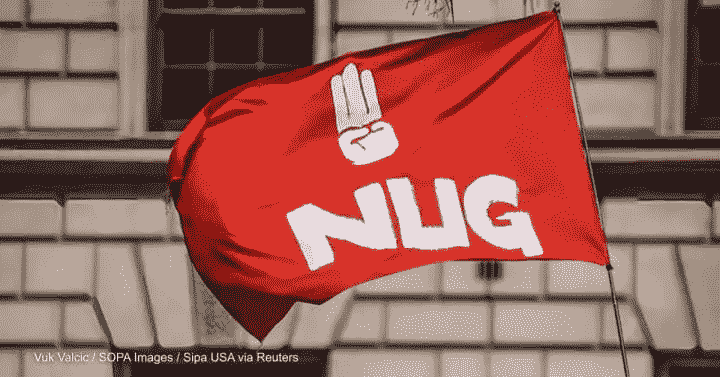
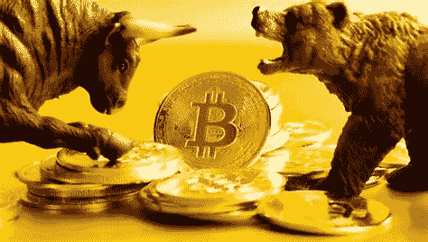

# 比特币的看涨和看跌案例 12.13

> 原文：<https://medium.com/coinmonks/bullish-and-bearish-cases-for-bitcoin-12-13-2ce27e25501b?source=collection_archive---------7----------------------->

## 每日加密市场更新和投资报告 12.13

## BTC 的看涨/看跌案例|今日主要新闻|新手每日一课:看涨和看跌意味着什么？

Photo by [Mark Basarab](https://unsplash.com/@markbasarabvisuals?utm_source=medium&utm_medium=referral) on [Unsplash](https://unsplash.com?utm_source=medium&utm_medium=referral)

# 概观

*   加密市场洞察:比特币的看涨和看跌案例
*   加密市场更新
*   主要秘密新闻
*   每周观察列表
*   新手每日一课:看涨和看跌意味着什么？

# 秘密市场洞察:牛市和熊市

比特币(BTC)正在强势测试 48k-50k 支撑位。突破这一水平可能会进一步推动下跌至 40k 的支持。接下来几天的新闻和价格走势将对比特币价格的决定至关重要。

比特币看起来是一个大的上升三角形形态。这种模式本质上是非常看涨的,(相对强弱指数)RSI 也显示看涨背离。上一次出现这种情况是在 2020 年 12 月，当时比特币在反弹后攀升了 95%。

BTC 1D ascending triangle

比特币的统治地位(BTC。d)为 42%,正在打破持续 3 个月的下降趋势。这可能是逃离替代硬币的信号，和/或它也可以表明一个大的 BTC 运行的预期。然而，随着整体加密市场的萎缩，一些资金正从替代硬币流入 BTC。

BTC.D 1D bitcoin dominance

我倾向于不变得乐观，直到当前的支持得到维持，最终的结果可能在几天或几周内不会实现。我仍然认为这些支持级别是平均成本(DCA)的重要方面。如果有一个支撑的最终测试，寻找一个戏剧性的最终突破，然后是一个快速反弹，将形成一个大的针棒或吞没蜡烛。在摆脱杠杆和散户交易者的最后努力中，将会出现一个夸张的举动。我们在 7 月 21 日和 9 月 30 日看到了类似的模式。美联储明天的会议和程序可能会成为催化剂。许多投资者预计温和的结果将有利于加密市场。在宣布短期内不会加息后，整体看空情绪可能会发生强烈变化。这是一位备受尊敬的市场分析师 Charlie Bilello 关于这个主题的推文，仔细看看第 6 条。

# 加密市场更新

**比特币(BTC)** 是**下跌. 80%**

**以太坊(ETH)** 则**下跌 1.42%**

**总加密市场(TOTAL)** 比**下降 5.88%**

**比特币的统治地位(BTC。D)** 比**上涨 1.00%**

智能合约平台在过去一周陷入困境:

> ***8.15%***
> 
> ***BNB -5.88%***
> 
> ***溶胶-15.56%***
> 
> ***-6.33%***
> 
> ***. 58%***
> 
> ***卢娜-10.38%***
> 
> ***T5【AVAX-10.44%】***

*本周值得关注的**上升者**:*

> ****接近+36%****
> 
> ****【启+30%】****
> 
> ****上涨+14%****
> 
> ****春晚+13%****
> 
> ****SYS +34%****
> 
> ****【寿司+14%】****
> 
> ****【黄昏+92%】****

***Near 协议(NEAR)** 是一个高级的第一层平台，在短期内有许多重要消息。*

**

***Dusk Network (DUSK)** 是一个繁忙的开发项目，为银行创建所有工具，开始实施区块链技术来取代当前的银行系统。由于监管障碍，黄昏经常被推迟。*

> **比特币恐惧与贪婪指数:* ***28****
> 
> **谷歌趋势:* ***39****
> 
> **最大痛苦(Dec 30 选项):* ***48k****

*[*如何利用恐惧和贪婪指数进行投资*](/@TraderGabi/when-can-we-start-buying-again-c3ffc2a1cd3b)*

# *主要加密新闻 12.13*

*   *在一系列“内部危机”中，一位顶级 Avalanche 开发者提议重组 SushiSwap (SHUSHI)舒氏在新闻上上涨了 10%。*
*   *根据 blockchain.com 的数据，90%的比特币已经被正式开采。目前，2100 万个比特币中有 1889 万个是在 2140 年开采的最后一批比特币。*
*   *ETC 集团在欧洲的德意志交易所推出了 Tezos (XTZ)交易所交易产品。它将使 Tezos 在 16 个欧洲国家的机构中可用。*
*   *元宇宙公司 InfiniteWorld 将通过价值 7 亿美元的特殊目的收购公司合并上市。该股将于明年年初在纳斯达克上市，股票代码为 JPG。这将是一只有趣的股票，值得关注当前热门的 metaverses 叙事。*
*   *由 400 家德国储蓄银行组成的网络将投票决定是否在 2022 年开始允许他们的 5000 万客户进行加密交易。*

**

*   *在货币贬值的情况下，缅甸影子政府宣布 USDT 为官方货币。NUG 民族团结政府正在举行持续的筹款活动，试图推翻该国目前的军事政权。*

# *新手的每日一课*

***看涨和看跌是什么意思？***

**

*看涨是对价格向上运动的强烈情绪。就像上涨运动中的牛市一样，牛市是相信价格会随着时间的推移而上涨的人。多头是通过购买建仓的个人。*

*看跌意味着完全相反。一只熊用爪子向下击打。看跌市场的人认为价格即将下跌。空头是通过卖出建立“空头”头寸的个人。*

*当讨论看跌或看涨情绪时，时间框架很重要。一个人现在可能觉得看跌，但他是一个长期牛市。有些人被认为是永久熊或永久牛。永久看跌者可能会认为，像比特币这样的资产一直被高估或无用。虽然永久牛市可能过于乐观，认为比特币价格今天应该达到 100 万美元。*

*[*这个过去的报告包含一个新手友好加密*](/@TraderGabi/crypto-market-update-and-trading-digest-11-9-65c38fad7047) 的列表*

# *每周硬币观察列表*

*   *比特币(BTC)*
*   *近似协议(Near)*
*   *寿司*
*   *多边形(MATIC)*

*该报告将继续关注美联储，希望得到温和的消息。市场正到达与通胀、美联储缩减购债规模、EOY 平仓和市场处于历史高点相关的重要宏观拐点。很多事情将在本周决定，图表显示了准确的情绪。*

**

*我希望你们都喜欢这个报告。祝你白天/晚上愉快。*

# *TraderGabi*

**关注我的*[*Twitter*](https://twitter.com/TraderGabi)*和*[*Medium*](/@TraderGabi)*或订阅此免费每日快讯*[*Substack*](https://tradergabi.substack.com/)*。**

> *加入 Coinmonks [电报频道](https://t.me/coincodecap)和 [Youtube 频道](https://www.youtube.com/c/coinmonks/videos)了解加密交易和投资*

## *另外，阅读*

*   *[什么是融资融券交易](https://blog.coincodecap.com/margin-trading) | [美元成本平均法](https://blog.coincodecap.com/dca)*
*   *[拥护卡审核](https://blog.coincodecap.com/uphold-card-review) | [信任钱包 vs MetaMask](https://blog.coincodecap.com/trust-wallet-vs-metamask)*
*   *[Exness 评测](https://blog.coincodecap.com/exness-review)|[moon xbt Vs bit get Vs Bingbon](https://blog.coincodecap.com/bingbon-vs-bitget-vs-moonxbt)*
*   *[如何开始通过加密贷款赚取被动收入](https://blog.coincodecap.com/passive-income-crypto-lending)*
*   *[BigONE 交易所评论](/coinmonks/bigone-exchange-review-64705d85a1d4) | [电网交易机器人](https://blog.coincodecap.com/grid-trading)*
*   *[新加坡十大最佳加密交易所](https://blog.coincodecap.com/crypto-exchange-in-singapore) | [购买 AXS](https://blog.coincodecap.com/buy-axs-token)*
*   *[投资印度的最佳加密软件](https://blog.coincodecap.com/best-crypto-to-invest-in-india-in-2021) | [WazirX P2P](https://blog.coincodecap.com/wazirx-p2p)*
*   *[7 个最佳零费用加密交易平台](https://blog.coincodecap.com/zero-fee-crypto-exchanges)*
*   *[最佳网上赌场](https://blog.coincodecap.com/best-online-casinos) | [期货交易机器人](/coinmonks/futures-trading-bots-5a282ccee3f5)*
*   *[分散交易所](https://blog.coincodecap.com/what-are-decentralized-exchanges) | [比特 FIP](https://blog.coincodecap.com/bitbns-fip) | [宾邦评论](https://blog.coincodecap.com/bingbon-review)*
*   *[用信用卡购买密码的 10 个最佳地点](https://blog.coincodecap.com/buy-crypto-with-credit-card)*
*   *[加拿大最佳加密交易机器人](https://blog.coincodecap.com/5-best-crypto-trading-bots-in-canada) | [Bybit vs 币安](https://blog.coincodecap.com/bybit-binance-moonxbt)*
*   *[用于 Huobi 的加密交易信号](https://blog.coincodecap.com/huobi-crypto-trading-signals) | [Swapzone 审查](/coinmonks/swapzone-review-crypto-exchange-data-aggregator-e0ad78e55ed7)*
*   *最佳[密码交易机器人](https://blog.coincodecap.com/best-crypto-trading-bots) | [购买索拉纳](https://blog.coincodecap.com/buy-solana) | [矩阵导出评论](https://blog.coincodecap.com/matrixport-review)*
*   *[Coldcard 评论](https://blog.coincodecap.com/coldcard-review) | [BOXtradEX 评论](https://blog.coincodecap.com/boxtradex-review)|[uni swap 指南](https://blog.coincodecap.com/uniswap)*
*   *[阿联酋五大最佳加密交易所](https://blog.coincodecap.com/best-crypto-exchanges-in-uae) | [SimpleSwap 评论](https://blog.coincodecap.com/simpleswap-review)*