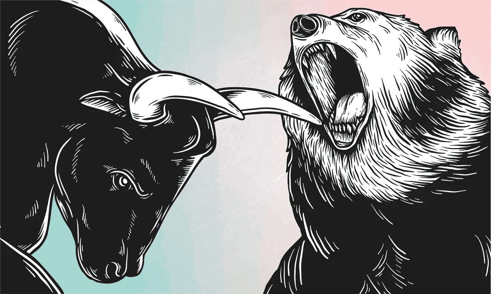

# 看涨和看跌

> 原文：<https://medium.com/coinmonks/bullish-and-bearish-fc261ce2dad4?source=collection_archive---------7----------------------->

Bullish and Bearish

任何观察过市场的人都可能经历过看涨和看跌的表达。但这意味着什么呢？一个比另一个高吗？你如何决定这种差异？

看涨和看跌的观点是非常例外的，所以积极地去学习，同样地去认识这些必要的概念。

**看涨和看跌解释**

你可能已经读过了:“[初学者和进阶者的完美策略加密货币交易](https://cryptoworldfinace.blogspot.com/2021/11/perfect-strategy-cryptocurrency-trading.html)”、“[突破和伪造加密货币](https://cryptoworldfinace.blogspot.com/2021/12/breakout-and-fakeout-in-cryptocurrency.html)”、“[加密泵和转储方案](https://cryptoworldfinace.blogspot.com/2021/11/crypto-pump-and-dump-schemes.html)。牛市通常被描述为支出逐渐增长的时间长度，而熊市被描述为市场从最近的高点下跌 20%或更多的持续时间。看涨技巧你相信费用会从目前的水平上涨，而看跌则相反；你假设费用会从现在的水平下降。

看涨的商家似乎会通过购买股票、选择名字或任何不同的经济工具来建立多头头寸，这些工具会随着费用的增加而上涨。看跌的商人正在寻找在市场或库存从当前价格下跌时他们将获利的地方建立空头头寸。一些商人非常看好他们会单独购买股票的地方，他们认为股票会上涨。

这往往是市场更著名的方法，因为由于通货膨胀和其他宏观经济条件，市场有长期自然上涨的趋势。然而，看跌也可能同样有利可图。市场往往会在一段时间内有规律地攀升，而市场的低迷往往会变得剧烈而令人惊讶，这使得看跌的商人可以在短时间内获利。

**看涨和看跌的概念**

*   看涨和看跌包含两根[蜡烛线，后一根蜡烛线](https://cryptoworldfinace.blogspot.com/2021/11/technical-analysis-and-read-candlestick.html)吞没了前一根蜡烛线的整体形态。
*   吞没烛台可以看涨或看跌，完全取决于它随趋势变化的位置。
*   看涨吞没蜡烛警告下跌趋势的逆转，并表明当它似乎在下跌趋势的背后时，购买应变的向上推挤。
*   熊市吞没警告上升趋势的逆转，并建议在营销人员的帮助下降低费用，当它似乎处于上升趋势的顶点时，营销人员施加促进压力
*   吞没蜡烛有助于商家认识到时尚的逆转，指出风格的延续，并额外帮助商家发出退出信号。

**看涨**

看涨可以不同于普通市场先决条件的长期观点，也可以不同于商人由于特定于组织的最新信息(如收益、新交易等)而认为库存看涨的短期观点。如果一时的商人看涨，他们认为库存将在未来几分钟、几天甚至几周内上升。这主要是基于检查当天的数量和利率变动或库存图表。在这种情况下，看涨的观点与基础公司无关。

如果投资者认为库存超卖，他或她也可能购买股票，希望快速反转。其他短期交易者看涨，因为他们希望一些近期的比赛会顺利进行。例如，经销商可能会在季度收入发布的前一天额外购买库存，期待组织会取代其预期。

> 阅读:[加密货币重要提示](https://cryptoworldfinace.blogspot.com/2021/11/important-tips-for-cryptocurrency.html)

**多头长线交易**

当交易者看好长期时，意味着他们看好公司的未来。他们同意存货在今天的股价下被低估了。

这也适用于通常的市场。如果你看好市场，你同意金融前提有利于价格上涨。

**看跌**

交易员对资产信托持悲观态度，认为其成本将会下降。有这种信念的投资者也可能决定是否采取行动。如果他们选择采取行动，他们也可能会提高他们目前拥有的股票，或者他们可以促进库存短缺。这种能力使他们可以从经纪人那里借入股票，在公开市场上推销，目的是在费用下降后再次购买这些股票，以获得更高的成本效益。

熊市可以作为自我实现的预言出现，因为大量悲观的买家也可能通过大力推销资产开始下跌趋势，预期费用将下降，但实际上费用也会下降。

然而，当投机者进来并在低位买入时，这种反转是很有技巧的，当商人受到打击时，费用会再次有规律地向上推，随之而来的是牛市。

**如何交易看涨和看跌情绪**

将这些短语与交易联系起来的最简单的方法是:

*   当商人看好某项资产或处于牛市的某个阶段时，投资于上涨的成本。
*   当商家看空某项资产或整个市场时，投资于支出下降。

**牛市解释**

一般来说，牛市描述了费用增加的时间范围。更准确地说，牛市是一段持续数月或数年的时间，价格不断上涨。

该短语通常用于库存市场；然而，不同种类的资产还会有牛市，例如，商品、海外货币和房地产。

特征

*   牛市通常出现在金融体系稳健或螺旋式上升的时候。
*   他们倾向于以地区份额来衡量国内生产总值，就像失业率下降一样，通常对应于公司利润的增加。
*   买家的自信很有可能跨越牛市的长度。
*   共同的市场基调和股票需求将是积极的。
*   在牛市的某个阶段，可以看到 IPO 努力程度的典型上升。

**熊市解释**

用存货成本下降表示的长度描绘了一个持久的市场。尽管对离岸价市场的货币推断可能有所不同，但总的来说，离岸价市场是通过在至少两个月的时间内库存支出下降 20%或更多来表示的。

通常，经历市场与标准普尔 500 等成熟市场或指数的下跌相关联。就持续时间而言，经历的市场可以持续数周或一年以上。

在经历市场期间，经济通常会放缓，随着机构开始解雇员工，失业费用会上升。

特征

*   熊市通常始于投资者的自我信念在一段时间的更有利的库存价格后开始下降。
*   与供给相比，对证券的需求相当低，因此股票支出减少。
*   投资者情绪和货币周期在持久市场的形成和力量中起着重要作用。
*   疲软的经济与经历市场有关，因为大多数公司缺乏报告巨额收入的能力，因为客户现在的支出远远不够。
*   潜在的损失是高质量的，因为支出不断下降，除了看不到结束。

**最终想法——看涨和看跌**

看涨和看跌是用来表示股票、商品和密码市场特征的短语。这两个市场之间的重要区别是自我保证是否低，费用是否减少，或者费用是否过多，成本是否上升。根据看涨或看跌的观点采取行动需要借助于定义明确且经过检验的[买卖策略](https://cryptoworldfinace.blogspot.com/2021/11/perfect-strategy-cryptocurrency-trading.html)来引导。

[阅读更多](https://cryptoworldfinace.blogspot.com/)