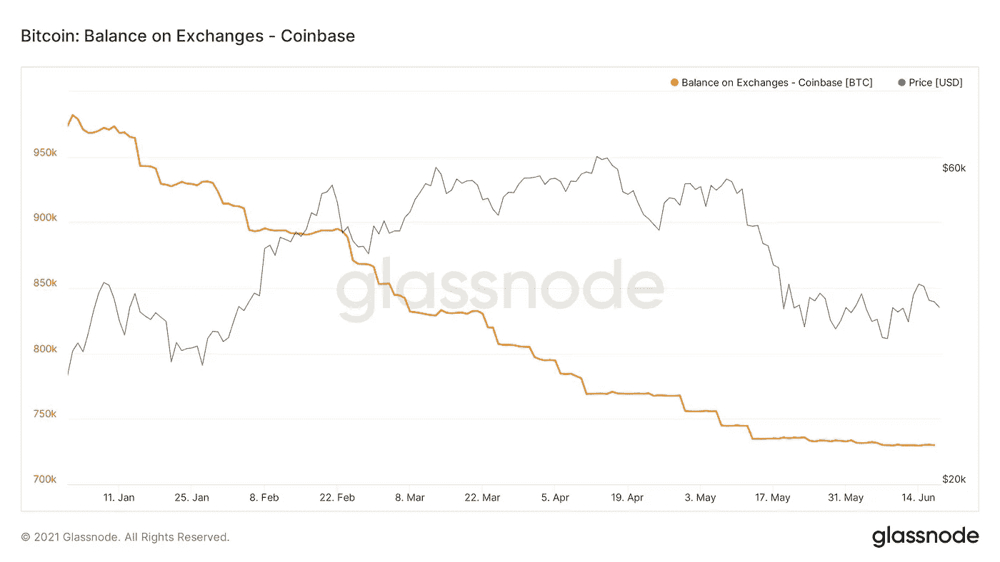
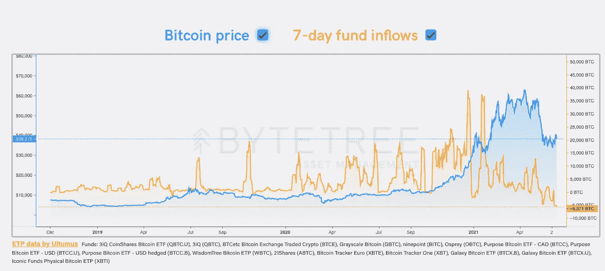
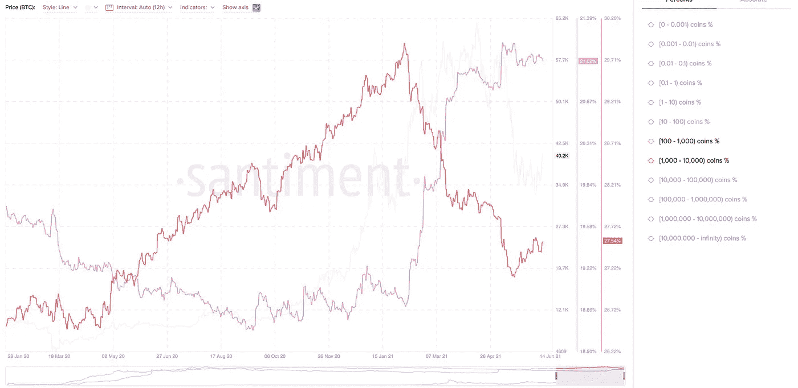
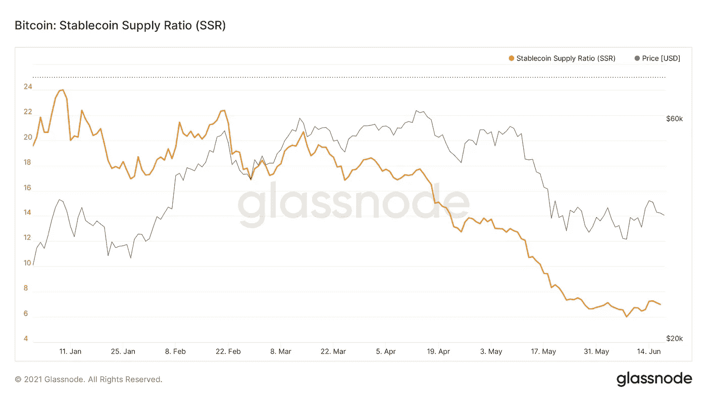

# 看涨潜在的连锁趋势和比特币的短期怀疑前景

> 原文：<https://medium.com/coinmonks/bullish-underlying-on-chain-trend-and-a-short-term-sceptical-outlook-for-bitcoin-ae45f6104606?source=collection_archive---------2----------------------->

另外，关于如何批判性地评估链上数据的一些注意事项

你可能已经看到了很多看涨外链的推文在上周出来了。例如，HODLed 或丢失的硬币数量再次增加，或矿工外流量(7d MA)在 2021 年 6 月 16 日达到 5 个月低点 1，725，244.14 美元。

总的来说，看起来“聪明”的钱正在积累。那么，为什么与此同时，比特币将迎来过去 8 年来最糟糕的第二季度呢？

我越来越多地看到人们想知道为什么价格不跟随这种看涨的环比消息，并因此看到他们中的一些人开始质疑环比数据的有用性。不幸的是，当这些图表没有放在上下文中，只是作为看涨消息出售时，就会发生这种情况。他们中的许多人都有可能，但通常不是在短期内。这些图表有助于确定潜在趋势。然而，要确定短期走势，这些方法中的大多数不一定那么有用。特别是比特币的波动性相对较高，短期走势很难预测，不管你使用的是链上数据还是任何其他数据源。下面是[将死](https://medium.com/u/5280ca5bd9c9?source=post_page-----ae45f6104606--------------------------------)对这个话题的评论:

我将尝试给出一个简短的解释，为什么尽管有积极的链上数据和新闻，如萨尔瓦多使比特币成为合法货币等，我们迄今为止还没有看到比特币的爆发。

首先，让我们看看比特币基地外汇平衡图。今年年初，大量比特币已经离开比特币基地。自 5 月中旬以来，这种情况不再以同样的规模发生。由于大量资金正在或已经在那里买入，如迈克尔·塞勒或格雷，这些净流量可以被视为机构或大投资者需求的代表。这种平衡一直相当平稳，这意味着这方面的需求有所下降。

另一个潜在的替代指标是比特币的 7 天基金净流入。根据 ByteTree.com[的数据](https://medium.com/u/9903964070e3?source=post_page-----ae45f6104606--------------------------------)资金净流入在 10 月中旬开始增加，在今年 1 月达到峰值，之后开始下降，甚至从 5 月中旬开始部分转为负值。有趣的是，在比特币最近的 ATH 之前，流入量就开始减少。这里的总体需求有点令人失望。

从积极的一面来看，根据@santimentfeed 的数据，价格下跌后，拥有 1000-10000 比特币的地址开始再次积累(感谢 [@cyberspaceape](https://twitter.com/cyberspaceape) 为我指明了数据源)。虽然无可争议的是，一些鲸鱼正在积累，但目前对比特币的需求还没有高到再次做出重大举动的地步。

是的，链上数据越来越多地显示出中长期的积极迹象，但如果比特币的价格横向下跌的时间更长一些，也不要感到惊讶。这并不意味着目前的水平不是一个好的买入机会。由于比特币的走势在短期内相当不可预测，如果你是长期投资者，保持观望可能不是最明智的策略。你不想出局，万一坐在场外的资本决定冲进去(例如，市场上有许多相对于比特币供应的稳定硬币)。

**如何批判性地评估链上数据？**

当你在 Twitter 或其他地方看到一个链上图表时，我发现以下问题有助于了解它的相关性以及它在比特币市场环境中的意义:

1.  这张图表到底显示了什么？
2.  是可靠的数据吗？[例如，一些短期的环比数据可能不准确。](https://insights.glassnode.com/exchange-metrics/)
3.  图表是看涨还是看跌？
4.  相关程度如何？例如，效果很重要还是趋势足够长？
5.  如果相关:这会在短期、中期或长期影响比特币吗？
6.  有没有其他数据支持这个图表，或者有哪些数据反对这个图表？(图表是有用的，但通常只能与其他图表/数据结合使用)

一如既往的座右铭“不要相信！验证！”适用于任何张贴在那里的图表。即使是为了图表，我也在张贴。

**更多定期更新请在 Twitter 上关注我:** [**@JanWues**](https://twitter.com/JanWues)

披露:上述文章引用了一种观点，仅供参考。它无意成为投资建议。

> 加入 [Coinmonks 电报频道](https://t.me/coincodecap)，了解加密交易和投资

## 另外，阅读

*   [尤霍德勒 vs 科恩洛 vs 霍德诺特](/coinmonks/youhodler-vs-coinloan-vs-hodlnaut-b1050acde55a) | [Cryptohopper vs 哈斯博特](https://blog.coincodecap.com/cryptohopper-vs-haasbot)
*   [币安 vs 北海巨妖](https://blog.coincodecap.com/binance-vs-kraken) | [美元成本平均交易机器人](https://blog.coincodecap.com/pionex-dca-bot)
*   [如何在印度购买比特币？](/coinmonks/buy-bitcoin-in-india-feb50ddfef94) | [WazirX 审核](/coinmonks/wazirx-review-5c811b074f5b) | [BitMEX 审核](https://blog.coincodecap.com/bitmex-review)
*   [我的加密副本交易经历](/coinmonks/my-experience-with-crypto-copy-trading-d6feb2ce3ac5) | [比特币基地评论](/coinmonks/coinbase-review-6ef4e0f56064)
*   [加密货币储蓄账户](/coinmonks/cryptocurrency-savings-accounts-be3bc0feffbf) | [赌注加密](https://blog.coincodecap.com/staking-crypto) | [CEX。IO 审查](https://blog.coincodecap.com/cex-io-review)
*   [最佳比特币保证金交易](/coinmonks/bitcoin-margin-trading-exchange-bcbfcbf7b8e3) | [Bityard 保证金交易](https://blog.coincodecap.com/bityard-margin-trading) | [Prokey 点评](/coinmonks/prokey-review-26611173c13c)
*   [加密保证金交易交易所](/coinmonks/crypto-margin-trading-exchanges-428b1f7ad108) | [赚取比特币](/coinmonks/earn-bitcoin-6e8bd3c592d9) | [Mudrex 投资](https://blog.coincodecap.com/mudrex-invest-review-the-best-way-to-invest-in-crypto)
*   [WazirX vs coin dcx vs bit bns](/coinmonks/wazirx-vs-coindcx-vs-bitbns-149f4f19a2f1)|[block fi vs coin loan vs Nexo](/coinmonks/blockfi-vs-coinloan-vs-nexo-cb624635230d)
*   [BlockFi 信用卡](https://blog.coincodecap.com/blockfi-credit-card) | [如何在币安购买比特币](https://blog.coincodecap.com/buy-bitcoin-binance) | [网格交易机器人](https://blog.coincodecap.com/grid-trading)
*   [加密复制交易平台](/coinmonks/top-10-crypto-copy-trading-platforms-for-beginners-d0c37c7d698c) | [五大 BlockFi 替代品](https://blog.coincodecap.com/blockfi-alternatives)
*   【Crypto.com 评论】|[|](/coinmonks/crypto-com-review-f143dca1f74c)|[信用交易](/coinmonks/huobi-margin-trading-b3b06cdc1519)
*   [顶级付费加密货币和区块链课程](https://blog.coincodecap.com/blockchain-courses) | [币安评论](/coinmonks/binance-review-ee10d3bf3b6e)
*   [在美国如何使用 BitMEX？](https://blog.coincodecap.com/use-bitmex-in-usa) | [BitMEX 回顾](https://blog.coincodecap.com/bitmex-review) | [币安 vs Bittrex](https://blog.coincodecap.com/binance-vs-bittrex)
*   [最佳免费加密信号](https://blog.coincodecap.com/free-crypto-signals) | [YoBit 评论](/coinmonks/yobit-review-175464162c62) | [Bitbns 评论](/coinmonks/bitbns-review-38256a07e161) | [OKEx 评论](/coinmonks/okex-review-6b369304110f)
*   [比特币基地赌注](https://blog.coincodecap.com/coinbase-staking) | [热点评论](/coinmonks/hotbit-review-cd5bec41dafb) | [库币评论](https://blog.coincodecap.com/kucoin-review) | [期货交易机器人](/coinmonks/futures-trading-bots-5a282ccee3f5)
*   [最佳加密交易信号电报](/coinmonks/best-crypto-signals-telegram-5785cdbc4b2b) | [MoonXBT 评论](/coinmonks/moonxbt-review-6e4ab26d037)