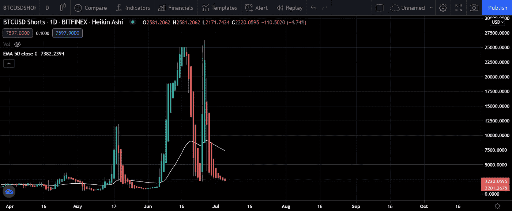

# 多头正在升温！！准备好迎接疯狂的比特币行动吧…

> 原文：<https://medium.com/coinmonks/bulls-are-heating-up-get-ready-for-insane-bitcoin-move-89ad21211ff0?source=collection_archive---------4----------------------->

在 crypto 最艰难的一天？最艰难的一周？几周？…近 3 个月来，我们只看到比特币的螃蟹运动，在 30 到 40 k 之间来回波动

## **不同的观点**

围绕我们正在目睹的崩溃和复苏，有许多理论。其中比较突出的有**威科夫分布示意图、威科夫聚集示意图**

## **威科夫分布示意图**

理解威科夫分布有助于交易者在市场反转前兑现多头头寸，并最大化空头利润。它是在预定时间内以尽可能好的价格分配(出售)资产的过程。

如果其他指标也对当前比特币的抛物线走势表示赞赏，这种情况就会发生

检查其他指标，这就是为什么我强烈认为我们仍然处于牛市的原因

因此，通过考虑所有这些 KPI，我们可以说比特币的运动还不是牛市的暗示终点。

## **威科夫积累示意图**

在长时间的下跌趋势后，积累阶段是一个横盘和区间的时间。这是较大的玩家试图建立头寸，摆脱较小的鱼，而不产生明显的价格下跌，或新趋势的开始。

## **分析**

图片剪影:Rekt Capital

目前的趋势揭穿了威科夫的分布示意图，然而，春季测试后有一个显着的价格运动注意到，这是遵循非常完整的威科夫的积累示意图。

一旦比特币越过 40k，多头将如火如荼，比特币价格将见证抛物线走势。

## **当前比特币多头和空头**

**Longs**

**短裤**

看来，我们要见证公牛疯狂的举动了。比特币最初可能会跌跌撞撞，但最终会变成抛物线。

## **结论**

比特币恐惧指数的市场情绪从 10 恢复到 29，多头跑赢了空头。市场情绪正从恐惧转向乐观。考虑到所有这些，你应该保持乐观。

**PS** :这既不是付费文章，也不是理财建议。记录下来的是我自己的研究发现，这是出于对这个隐秘领域的热情

如果你想表达一些爱，请捐赠并帮助我们继续做我们正在做的事情

**ERC 20:0x 867 ca 4 af 0 EB 86d 48014 D8 ce 344d 096 c 01348 a163**

***作者* : Eth！c@l Aka Kumar**

***邮箱*:**[IfWorldGoneCrypto@gmail.com](mailto:IfWorldGoneCrypto@gmail.com)

***电报*:**[https://t.me/IfWorldGoneCrypto](https://t.me/IfWorldGoneCrypto)

***同行评审*:臭 Linky**

> 加入 coin monks 电报频道，了解加密交易和投资

## 也阅读

 [## 最佳免费加密交易机器人——前 16 名比特币交易机器人[2021]

### 2021 年币安、比特币基地、库币和其他密码交易所的最佳密码交易机器人。四进制，位间隙…

medium.com](/coinmonks/crypto-trading-bot-c2ffce8acb2a)