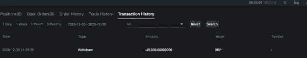

# 牛赚钱，熊赚钱，猪被宰。

> 原文：<https://medium.com/coinmonks/bulls-make-money-bears-make-money-pigs-get-slaughtered-8d4931dae803?source=collection_archive---------9----------------------->

我们大多数人都试图找出如何快速赚钱，和我们所爱的人，包括我在内，过上更自由、更少压力的生活！

当我在 2015 年发现加密货币时，它们的波动性引起了我的兴趣。如果我交易它们，它们让我有可能在很短的时间内赚很多钱。我看到里面有座金矿。

我一直认为自己足够聪明，可以实现任何我想要的东西。我最终的梦想是实现财务自由，我觉得通过掌握交易技巧，我的梦想将会实现。

交易令人兴奋，提供了灵活性和丰厚的利润。

我还能要求什么？

Freedom on the horizon

我开始做我的研究，很明显我走的这条路并不容易。据统计，只有 5%的交易者成功打破障碍并获得可持续的收入，其余 95%失败或损失了大部分资金。

# 被叫的多，被选的少。

90–90–90 规则适用于交易。这意味着 90%的交易者在 90 天内亏损。

这些陈述或统计数字丝毫没有让我沮丧。对我来说，这些只是数字。

25 岁时，我在一家金融科技公司工作，有一份高薪的管理工作，并有信心克服最具挑战性的技能。

我已经想象自己成为了 5%成功交易者中的一员。

我的金融科技工作很有趣，但还不够有趣！我想实现的不仅仅是成为公司的一员。

我开始在一家机构学习基本面和技术分析，这家机构让我对市场有了很好的理解。

我开始用很少的钱交易，成功地完成了一些交易，但是我仍然在交易中损失了很大一部分工资。

连续三年，我日以继夜地研究图表，我着迷了，交易成了我无论如何都要克服的个人挑战。

我甚至降低了我的生活标准，以节省更多的钱，并将其用于交易(反正我是在亏损)。

我到了不得不向父母借钱来维持生活的阶段。我没有钱买食物或付房租，我慢慢意识到这条路会毁了我，而不是带我走向成功。

几个星期后，我开始交易心理学来帮助我处理我的困扰。在这里，我意识到最大的敌人是我自己，在我战胜自己之前，我总是会在市场中失败。

所有这些都对我的个人生活产生了负面影响。我和我的伴侣有矛盾，把我变成了一个脾气暴躁的人，我内心有一个巨大的声音在说

> 你是个失败者！

这是一个艰难的决定，但我决定暂时停止交易，只做长期投资。

我不是那种轻易放弃的人，事实上，这种机会在交易三年后才到来。我不得不接受现实，不得不接受还不是时候的事实。

我下定决心，总有一天我会回到交易市场。我一开始就知道这不是一项容易掌握的技能，所以为什么要放弃呢？

> “你必须愿意经常犯错；没毛病。做出你最好的判断，错了，做出你下一个最好的判断，错了，做出你第三个最好的判断，然后让你的钱翻倍。”—布鲁士·高富拿

在我不做交易的一年里，我总是关注密码领域的最新动态。老实说，没有交易，我的生活轻松多了。交易是有压力的——尤其是如果没有用正确的方式。

在我不交易的时候，我感觉精神和身体都很好。我也有更多的空间来接受新的想法。事实上，我为 [**密码爱好者开创了一项教育事业。**](http://www.cryptoenthusiast.net)

我知道加密货币总的来说不是一个容易理解的主题——特别是因为网上找到的大多数信息都涉及令人困惑的加密术语。

我的使命是(现在仍然是)让加密货币变得简单，并为任何人解释清楚，不管你的教育水平、国籍和工作。我喜欢这个项目，它让我很忙，没有时间交易。

作为我长期投资策略的一部分，我买入 crypto 并持有(不卖出)。

几个月前，我开始使用 [**币安**](https://www.binance.com/en/register?ref=41625775) ，因为我听说他们有最好的加密交换费用。他们的平台一开始看起来有点太复杂，页面上有太多的促销和产品，尤其是对于像我这样只对购买一些密码感兴趣的人来说。

我仍然很好奇，浏览了他们的网站，想了解这些人能提供什么。他们当然有一些有趣的产品，包括著名的期货。

简单来说，期货提供了利用金融工具的可能性，这意味着如果你进行交易，并且你站在市场的正确一边，你就能够增加你的收益，或者增加你的损失，以防你站在错误的一边。

风险是巨大的，但回报更大。有了币安，我可以交易加密货币的期货。

币安提供(现在仍在提供)高杠杆产品，而大多数在线经纪商提供的杠杆比率为 1:2，币安提供的杠杆比率为 1:125。

这意味着你可以将你的收益/损失放大 125 倍，很有可能失去你所有的资本。

# 让我们试一试！

巨大的杠杆让我对事情感兴趣，我觉得这是在中断一年后再次尝试交易的正确时机。

币安可以选择交易 USDT (stablecoin)或任何你想要的加密货币。我开始时采取了非常保守的策略，因为我退出了一段时间，我开始走上了正确的道路——盈利。

我很高兴能回来，我认为这次会不同，所以我开始增加交易量和杠杆(风险更高)。

当时，XRP(大约一个月前)有一个大规模的反弹，超级看涨。我说过 XRP 不太可能跌至 0.30 美元，因为它已经达到 0.90 美元的高点，并修正至 0.60 美元区域。

我扩大规模，在一次交易中冒了 10，000 XRP 的风险。清算价格(全部亏损)为 0.25 美元，这让我感到安慰，我处于一个安全的位置。

同一天晚上，一个大新闻出来了，我醒来发现 XRP 在两位数的损失。

# 这是一场大屠杀！

> ***“Ripple 因出售未授权证券被 Sec 起诉！”***

我在新闻上看到的第一件事。

我仍然希望 XRP 的价格下跌将恢复并再次获得看涨势头，但当大型加密交易所开始将其退市时，价格跌至 20 美元以下。

我失去了一万 XRP。情绪开始踢了进来，并希望得到我的 XRP 回来。我增加了杠杆，并增加了 1 万 XRP 与之交易。

接下来的交易非常成功，以 65，000 XRP 绿色收盘。(在下面你可以看到提款)那晚我做的。

当时我觉得我是不可战胜的，我很确定我能赚更多的钱，所以我继续交易。这一次不那么小心了，因为我觉得自己很强大，没有什么能阻止我！

我开始在交易中损失少量的钱，一旦我开始失去耐心，我增加了每次交易的风险。

信不信由你，我设法在 24 小时内失去了所有的收益(65，000 XRP)。

我感到愤怒，沮丧，不停地在账户里加钱交易，挽回损失。

我意识到，除了最初获得的收益之外，我还损失了一大笔存款。每交易一次，我越沮丧，犯的错误越多。

我觉得自己失去了理智，无法控制局面。

足够幸运的是，一天早晨，一个新鲜的想法让我停下来思考。

我仍然充满内疚和愤怒，但设法与自己达成了协议。

***只有我一个人对自己的行为负责，没有别人！我赢得了他们，也失去了他们。我被贪婪冲昏了头脑，没有理由自怜和后悔自己的行为。***

我不能让时光倒流，所以我能做的就是从我的错误中吸取教训。

我是一个非常激进的交易者，也是一个没有耐心的人，如果不受控制，这是交易失败的最佳组合。

*我知道我会有在一天内获得巨大收益的那些日子，但这* ***是不可持续的*** *，我最终会在接下来的几天里失去一切。*

当我在很短的时间内赚了一大笔钱时，我忘记了钱的价值，所以很可能我会再次失去它。

# 是时候改变了！

我决定我应该回到我的保守策略。这很简单，但当我坚持这五个简单的步骤时，它就奏效了:

*   确立一种趋势。
*   等待回调。
*   顺应趋势买入或卖出。
*   只冒少量风险(你能承受的损失)
*   设置丰厚的止损。

这五个步骤加上一个非常重要的属性——耐心是成为成功交易者的简单方法。

当然，你会有亏损的交易，但从长远来看，这是一个成功的策略。交易不需要复杂。我把事情复杂化了，我把自己变成了最大的敌人。

自从我整合了我的保守策略以来，我的耐心得到了回报，我仍远未实现我所失去的，但我相信这将是可持续的，从长远来看，我将再次盈利。

这三个星期我一直在坚持。我正在尽最大努力保持系统化，毕竟他们说“养成一个习惯只需要 21 天”。

考虑到我是一个固执的人，也许我需要的时间会比 21 天长一点，但我确信在几周的时间里，我的大脑会变得更加保守。

我不能向任何人推荐杠杆产品，尤其是从未交易过的人。我建议 [**从知名的加密交易所**](https://cryptoenthusiast.net/where-to-buy-cryptocurrency/) 购买加密货币，并长期保存在你的 [**硬件钱包中。**](https://shop.ledger.com/?r=8ccc062e29a4)

我很确定无论如何回报将是巨大的。

然而，如果有人认为他有足够的自制力，并有兴趣为更高的回报承担更高的风险，他们可以看看币安期货。

只使用小杠杆，用你能承受的少量交易，而不会影响你的情绪！

这是一条痛苦的道路，希望我已经吸取了教训，不会再次重演。

记住猪最终总是会被宰杀的！

如果你喜欢这篇文章，如果你推荐这篇文章(点击❤按钮)让其他人看到，我会非常感激。

*故事最初发表于* [*我的个人网站*](http://www.cryptoenthusiast.net) *并包含附属链接。*