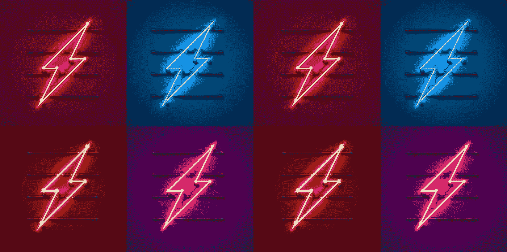
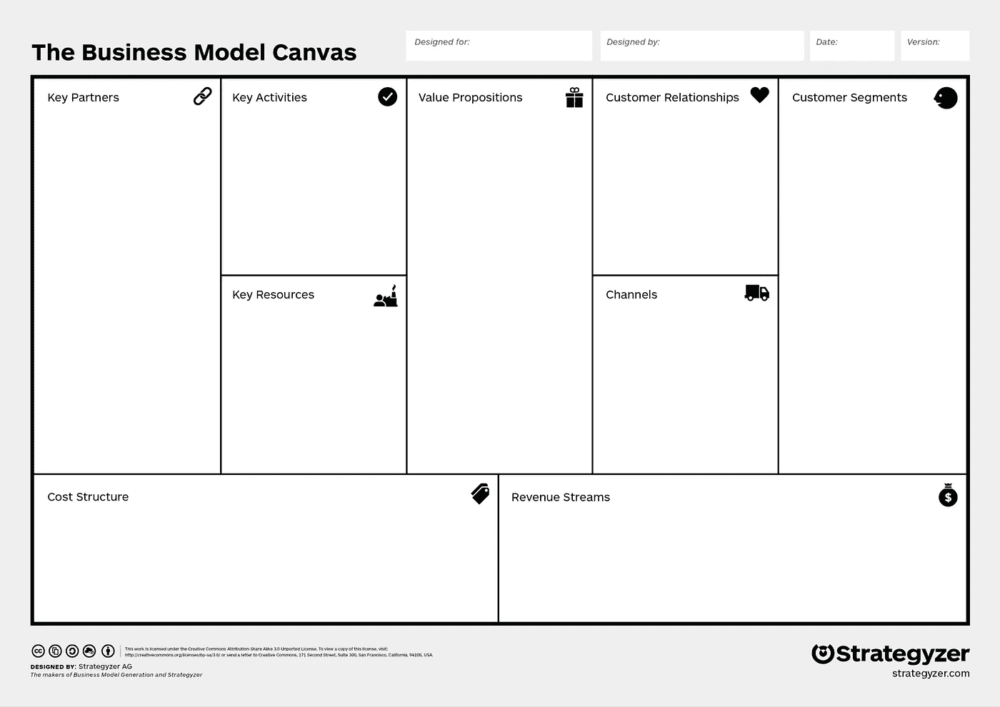
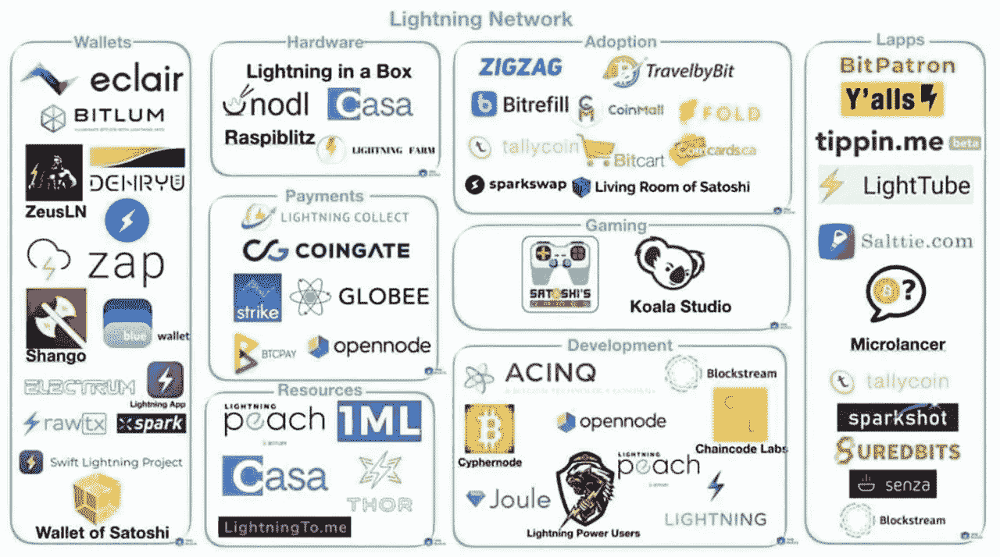
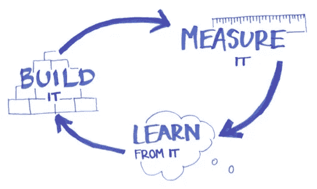

# 比特币闪电网络生态系统中的商业建模

> 原文：<https://medium.com/coinmonks/business-modeling-in-the-bitcoin-lightning-network-ecosystem-5d8d6be65695?source=collection_archive---------0----------------------->

**简介**

本文旨在为 Lapps(闪电网络应用)提供关于闪电网络生态系统的宝贵见解，帮助他们建立成功的商业模式。

我们将浏览商业模式画布的主要部分，并展示一些已经在市场上运行的应用程序的案例研究。我们将了解 Lapps 运营所必需的资源，他们的价值主张是什么，他们如何向目标市场提供他们的价值主张，最后他们如何赚钱。

值得一提的是，Lightning 用户仍然是一个非常小的市场，因此这里介绍的许多模型需要更多的 Lightning 网络用户才能盈利。然而，设计一个不仅使用趋势技术，而且以可扩展的方式这样做的商业模式是一个很好的实践，以便为 Lightning 用户的利基市场大到足以让 Lapps 产生可观的利润做准备。

**闪电生态系统中的商业模式**

商业模式描述了组织如何创造、传递和收集价值。它还确定了与供应商、客户和其他市场参与者的关键互动和协作。

在本章中，我们将探讨闪电网络带来的新的价值主张，这些价值主张传递给客户的方式，lapp 在市场中运营所需的资源，lapp 必须承担的成本，以及 lapp 获得收入的可用选项。

Business Model Canvas. Source: strategyzer.com

**价值主张**

它代表了 Lapps 为其目标市场提供的价值。当初创公司建立 Lapp 时，他们需要问自己以下问题:在闪电网络出现之前，什么是不可能的？他们的 Lapp 怎么可能做到？与提供相同产品/服务但不使用 Lightning 网络的其他公司相比，他们的 Lapp 可以更高效/有效地做什么？他们的 Lapp 解决了任何问题/满足了任何需求吗？

让我们首先列出闪电网络提供的功能；然后，我们将看看拉普什价值主张的一些例子。

闪电网络的特点:

*   即时廉价的价值转移；
*   微交易；
*   私下交易；
*   任何时候自动提取**任何金额**(欧分的偶数)**；**
*   认证用户的新方法(支付证明和基于节点 id 的数字签名)

Lapps 的价值主张示例:

*   [**Tippin.me**](https://tippin.me/) :可以让人们以一种简单、廉价、即时的方式收发小费。此外，小费可以很少(几分之一欧分)，因此发送者可以给任何金额的小费，接收者可以累积这些金额并随时提取。通过一个浏览器扩展，也可以通过点击“喜欢”按钮旁边的特定图标来提示 Twitter 上的推文；
*   [**Satoshis.games**](https://satoshis.games/) :允许用户通过玩游戏赚取比特币。在游戏平台内，价值的转移不是单向的(从用户到平台:付费游戏系统)，而是双向的(从用户到平台以及从平台到用户)。Satoshis.games 在游戏内使用比特币作为货币，这样这种货币就不依赖于平台，游戏内的微观经济也不是虚构的(价值可以从平台中提取，花在其他应用程序或日常生活中)。最后，游戏中的数字元素(如超级马里奥硬币)具有实际价值，这种价值可以随时以零成本立即提取。Satoshis.games 上的每一个数字行为都可以被货币化或奖励；
*   [**Gab**](https://gab.com/) :是勇者浏览器的一个分叉。Gab 的团队正在研究一种实现方式，可以为浏览网页时观看广告的用户付费。在用户方面的优势是，他们甚至可以因为浏览器的“微使用”而获得报酬，并且这种报酬是通过“实时”微交易来支付的，微交易可以在任何时候撤销；
*   [**Sats 4 喜欢**](https://kriptode.com/satsforlikes/index.html) :是一个 Lapp，奖励用户在社交媒体上分享和喜欢帖子。希望在社交媒体上为其产品做广告的公司或个人在 Sats 4 Likes 上发布一项任务，并指定用户分享/喜欢/评论一篇帖子将获得多少报酬。然后，他们向 Sats 4 Likes 支付一张发票，然后当用户完成任务时，Sats 4 Likes 向用户支付费用。价值主张在于用微交易奖励“微任务”(很公平)，让广告主为具体的、有价值的、特定的行为付费，而不是印象或点击。此外，Sats 4 Likes 代表了一种渠道，通过这种渠道，可以以非常直接和有效的方式锁定比特币和闪电网络用户:仅用比特币奖励用户允许仅接触比特币用户。相反，在传统渠道锁定比特币持有者非常复杂，因为脸书、Instagram 和 Twitter 等社交媒体无法提供如此详细的锁定参数，无法优化预算，只能让实际的比特币用户受益；
*   [**Suredbits**](https://suredbits.com/) :提供对历史和实时流数据馈送的访问。由于闪电网络，他们的服务定价在微观水平:客户只需为他们想使用的数据付费(没有月度或年度合同)，仅此而已。

Lightning Network ecosystem. Source: J. Dantoni 2019, The Block Genesis

**频道**

通过渠道，Lapps 必须传递他们的价值主张。渠道代表着与客户的联系，是 Lapps 接触他们的方式。根据产品的不同，如果 lapp 是移动或桌面应用程序，频道可以是直接从 web 或任何应用程序商店访问的 web 应用程序。

闪电网络生态系统的一个非常特殊的渠道是 Bluewallet 市场。希望从比特币制造者花钱的地方直接联系到的应用程序(Bluewallet 应用程序)可以要求被列入上述钱包的市场。

其他行业特有的渠道以基于网络的市场为代表，如[lightningnetworkstores.com](https://lightningnetworkstores.com/)和[闪电罩](https://lhgamestudio.com/)。还有一个时事通讯服务，[lapps.co](https://www.lapps.co/)，提供关于市场上新的应用程序的更新:创业公司可以联系他们，并被包括在更新中。

一个非常有效的渠道是 [Sats 4 Likes](https://kriptode.com/satsforlikes/index.html) ，通过这个渠道可以执行推广 Lapps 的广告活动。正如我们之前提到的，这种营销渠道使得只接触 Lightning 网络用户变得非常容易，并有助于避免将营销预算花费在不使用 Lightning 的用户的点击和印象上，这些用户可能包括在 Twitter、脸书和谷歌活动的目标受众中。

**客户关系**

客户关系渠道是指 Lapps 应通过其维持与其客户/用户的关系、提供客户支持、发送跟进消息、通知和其他一切必要的渠道，以留住客户并满足他们的需求。

闪电网络生态系统中使用最多的客户关系渠道是 Telegram 和 Slack，用于客户支持，以及 Twitter，用于推广和客户参与。

**客户细分**

基于来自网络(活跃节点的数量)和应用商店(支持 LN 的主要钱包的下载数量)的数据，我们可以估计几万 LN 用户的人口。任何 Lapp 的目标市场都是该人群的子集(例如，如果 Lapp 在游戏行业中运营，则 LN 用户中的游戏玩家；LN 用户中的音乐流媒体工具，如果 Lapp 在音乐流媒体行业中运营的话)。

正如我们在介绍中已经说过的，LN 用户仍然很少，但在当前的市场环境中测试商业模式使 Lapps 为普及应用和获得可观利润做好了准备。

**收入流**

Lapps 是如何营收的？这个真的要看产品了。但是，有一些模型可以作为例子:

*   应用内购买:它们代表了一种收入来源。这种模式包括允许用户购买应用内的内容，如生活、游戏功能、头像等；
*   费用:Lapps 可以在购买时收取费用。这就是 [Sats 4 Likes](https://kriptode.com/satsforlikes/index.html) 的情况，公司或个人决定投资一定数量的比特币在社交媒体上发布广告，Sats 4 Likes 向他们收取额外的 satoshis 服务费；
*   按使用付费:这是一个真正适合闪电网络技术的模型。事实上，微交易允许企业在微观层面上为他们的服务定价，这样他们就可以向他们的客户收取费用，即使是对服务的“微观使用”也是如此，而且只收取他们消费的费用。这种模式取代了向用户收取固定费用的订阅计划模式，不管他们是使用服务一整个月还是仅仅几个小时。这是数据流服务 [Suredbits](https://suredbits.com/) 使用的模型；
*   免费增值:它包括让用户免费使用一个功能最少的应用程序。想要高级功能的用户必须付费或购买高级账户。 [Satoshis.games](https://satoshis.games/) 也是如此，用户可以免费玩 Super Bro，如果想有更多机会获胜，可以购买额外的生命和功能；
*   广告:想要通过广告获得收入的应用程序需要考虑一些问题。比特币用户非常关心他们的隐私，他们不喜欢被监视:Lapps 上的广告不应该太具侵入性，用户数据应该有一定程度的匿名性。这将导致广告客户的目标定位不那么详细，并且可能导致广告空间的价格更低。然而，这样做 Lapps 将保留他们的社区，并保持他们的客户群的忠诚度。

**成本结构**

与传统商业模式相比，Lapps 的成本结构并没有真正改变。包括开发成本(开发者的工资)、It 维护成本(网站的服务器的成本)、营销成本、官僚成本(税务顾问、律师、顾问等服务)等等。如果 Lapp 的 Lightning 网络节点已经通过 [BTCPay 服务器](https://btcpayserver.org/)启动，并使用类似 [LunaNode](https://www.lunanode.com/) 的云托管服务，Lapp 还必须考虑该服务的成本(大约 10€/月)。

**关键资源**

关键资源是指那些使 Lapp 难以模仿或复制的资源。他们真的依赖于产品。相反，在这里，我将列出每个 Lapp 在闪电网络生态系统中运行所需的两个主要资源:

*   Lightning 网络节点，例如运行在 [BTCPay 服务器](https://btcpayserver.org/)或 [RaspiBlitz](https://github.com/rootzoll/raspiblitz) 上；
*   入站容量(用于接收付款)。可以通过类似 [Thor](https://www.bitrefill.com/thor-lightning-network-channels/?hl=en) 的闪电网开道服务获得；

如果 Lapp 想避免推出自己的节点，它可以通过像 Satoshis Games 的 [APItoshi](http://apitoshi.com/) 和 [OpenNode](https://www.opennode.co/) 这样的服务来集成 Lightning。

我们将跳过关键活动部分，因为它们完全取决于产品/服务的类型。

**主要合作伙伴**

闪电网络生态系统是一个非常协作的空间。创业公司应该利用这一点，并与其他企业合作，以利用协同效应，提高品牌知名度和他们的 Lapp 的可及性。

每个 Lightning 网络应用的潜在关键合作伙伴肯定是以 [Bluewallet](https://bluewallet.io/) 为代表的。Bluewallet 是最受欢迎的比特币钱包之一，支持闪电网络，从其市场可以访问许多 Lapps。初创公司可以与 Bluewallet 合作，并在其市场上列出他们的 Lapp。通过这种方式，Lapps 将离他们的客户(Lightning 用户)更近一步，Bluewallet 将通过向其客户提供更多的购买机会而从中受益。我们在“渠道”部分提到的那些市场也是如此([lightningnetworkstores.com](https://lightningnetworkstores.com/)、[闪电罩](https://lhgamestudio.com/)等):初创公司可以在那里列出他们的 Lapp 来获得品牌知名度和流量，这些市场将能够为他们的用户提供更多的内容。

**验证商业模式**

在一张纸上画一个商业模型是不够的:商业模型需要通过大量的测试来验证。这里我们介绍精益方法，它包括 3 个主要步骤:

1.  基于市场洞察创建 MVP:MVP(最小可行产品)是试图满足客户需求的产品的最简单版本。举个例子:如果一家公司的目标是创造一种产品，让人们不用走路就能从 A 点到 B 点，那么它的 MVP 就不会是汽车，也不会是自行车，而是滑板。在验证过程中，应该只构建必要的特性来保持灵活性。基于市场洞察来构建这些特性是非常重要的:开发必须由客户研究来驱动；
2.  MVP 测试和性能测量:MVP 必须投放市场，看看它是否有吸引力。需要衡量销售额、流量和客户保持率等指标；
3.  向前或旋转:如果度量显示一个好的性能，产品可以通过添加更多的特性和运行更多的测试来改进(循环重新开始，在先前的 MVP 上进行改进)。如果指标显示表现不佳，这可能意味着价值主张没有被客户视为有价值，或者业务模型不能产生和收集价值，因此需要重新设计。在这一点上，有必要转向:初创公司需要再次倾听客户的需求，建立一个新的价值主张和一个必须经过测试的新 MVP。新 MVP 的开发应该在深入研究客户需求之后开始。

Lean Methodology

**结论**

如果拉普人想要在长期中取得成功，他们需要一个合适的商业模式，让他们能够向他们的客户提供他们的价值主张并盈利。

在本文中，我们提供了一些关于闪电网络生态系统的见解，可以帮助 Lapps 建立一个成功的商业模式。

从长期来看，只有那些能够以可持续的方式满足实际需求的 Lapps 才会在 LN 的推广中获得成功。

**触点**

需要帮助设计你的商业模式或通过正确的渠道宣传你的 Lapp 吗？

发送消息到:

*   邮箱:federico@satoshis.games
*   推特:@FedericoSpital3

> [直接在您的收件箱中获得最佳软件交易](https://coincodecap.com/?utm_source=coinmonks)

