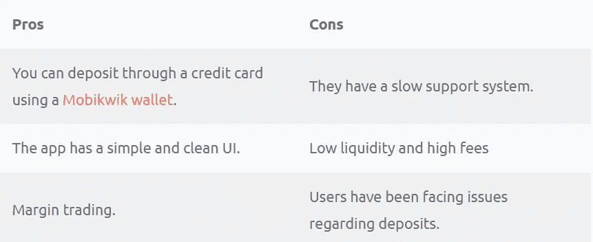
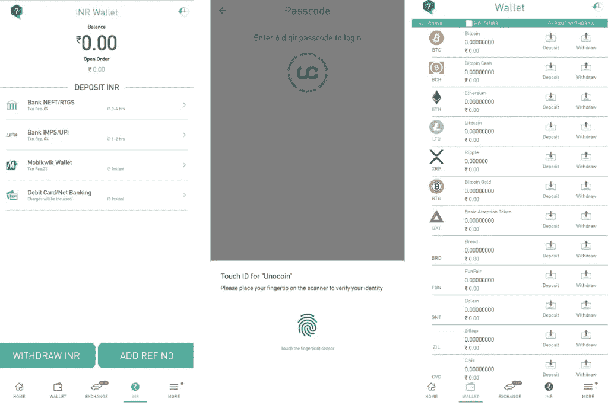

# 印度 6 大加密交易应用——2022 年最佳交易所

> 原文：<https://medium.com/coinmonks/buy-bitcoin-in-india-feb50ddfef94?source=collection_archive---------0----------------------->

## 如何使用移动应用程序购买比特币印度

印度一些购买比特币的最佳应用是 [WazirX](https://wazirx.com/invite/ad4e888q) 、 [Bitbns](https://ref.bitbns.com/64358) 和 [CoinDCX](https://coindcx.com/signup?r=70297373$$Dxroxs&utm_medium=coincodecap&utm_campaign=coinmonks) 。此外，本文将为您提供根据您的需求选择最佳平台的所有必要信息。

# 摘要

*   一个比特币交易所应用程序允许你在旅途中交易。
*   play store 和 apple store 上的很多 app 都提供这项服务。
*   [**WazirX**](https://wazirx.com/invite/ad4e888q) 是印度最受欢迎的比特币交易 app，提供了几乎所有的存款方法。(参考代码— **ad4e888q** )
*   [**bit bns**](https://ref.bitbns.com/64358)exchange 提供了一个简单的用户界面，允许通过 Mobikwik 钱包使用信用卡。(转介代码— **64358** )
*   [(转介代码— **70297373** )](https://coindcx.com/signup?r=70297373$$Dxroxs&utm_medium=coincodecap&utm_campaign=coinmonks)

> [**币安**](https://www.binance.com/en/register?ref=UARTH1S1) (非印度)却拥有所有的硬币，还能为你省下一大笔交易费用。(转介 Id — **UARTH1S1** )

> **查看带有 app 链接的完整表格** [**此处**](https://blog.coincodecap.com/buy-bitcoin-app-india#h-table)

**Check the complete table with app links** [**here**](https://blog.coincodecap.com/buy-bitcoin-app-india#h-table)

# 什么是比特币兑换 app？

一个让你通过手机在印度购买、出售和交易比特币的应用程序叫做比特币交易所应用程序。它们将你从到处携带笔记本电脑的忙碌中解放出来，并使加密交易变得遥不可及。

你可以在旅途中使用移动应用进行交易，甚至作为初学者，你也可以使用应用开始投资比特币。许多应用程序中都有简单的交互式用户界面，但让我们来看看最好的应用程序。

# 印度 6 款最佳比特币交易应用

许多平台最近开始通过移动应用程序提供服务，要知道哪一个最适合你可能很有挑战性。因此，我们为您整理了一份七大应用列表。

# 1.CoinDCX

[CoinDCX](https://coindcx.com/signup?r=70297373$$Dxroxs&utm_medium=coincodecap&utm_campaign=coinmonks) 提供印度最高的流动性，并为您提供交易 200 多个硬币的选择。您可以在几秒钟内完成注册程序，只需输入手机和邮件上发送的动态口令。

CoinDCX 加密交换平台可以被认为是最通用的平台。他们甚至在设置选项卡上教授投资的基本知识。而且，你还可以通过 CoinDCX 推荐计划获得被动收入。

使用 CoinDCX，可以在印度购买比特币。

## CoinDCX 安全吗？

是的，CoinDCX 可以安全使用，因为 CoinDCX 提供的第一层安全是通过 Google authenticator 应用程序。他们只允许你在验证后使用投资工具。您需要设置不同的取款密码来确认您处理的每一笔取款。

该应用程序还提供了一个通过指纹解锁的选项。

## CoinDCX 费用

CoinDCX 向您收取 0.1%的创建者和接受者费用。最低取款限额为 1000 印度卢比，不收取任何费用。CoinDCX 的现货和保证金交易费用取决于你的交易量。如下表所示，它可以分为不同的层:

## CoinDCX 付款方式

DCXinsta 帮助您以印度卢比购买或出售加密货币。您可以通过 **UPI、NEFT、IMPS、RTGS** 和**银行转账**存入印度卢比。

## CoinDCX —利弊

CoinDCX Pros and cons

# 2.瓦济克斯

通过 [**WazirX 交易所**](https://wazirx.com/invite/ad4e888q) ，你可以使用 INR、USDT、BTC，甚至 WRX(该平台的原生令牌)投资广泛的加密资产。此外，该平台主办各种竞赛和空投；你可以通过主页了解这些情况。在设置页面，您还可以邀请您的朋友，并通过 WazirX 推荐赚取。

此外，WazirX 也有其名为 WRX 的硬币，您可以使用 INR 购买 WRX，然后使用 WRX 投资许多其他加密资产。要了解更多信息，请阅读 [WazirX 评论](https://coincodecap.com/wazirx-review)。

## WazirX 安全吗？

是的，WazirX 使用起来是安全的，因为它将你几乎所有的资产储存在冷库中，只有一小部分放在热钱包中。您可以通过从设置中激活[双因素身份验证](https://en.wikipedia.org/wiki/Multi-factor_authentication)和应用程序密码来提高安全性。此外，平台会通过成功执行订单的通知来通知您。

最后，WazirX 已经被世界上最大的加密交易所币安收购，这为它提供了一个额外的信任层。

## WazirX 费用

[WazirX](https://wazirx.com/invite/ad4e888q) 收取除交易费之外的 0.2%的成交费和做市商费。不过，这款应用提供了一个名为“用 WRX 支付交易费”的功能。从费用设置中启用后，您可以使用 WRX 支付交易费用，并注册交易费用的 50%折扣。

## WazirX 存款/取款

由于印度市场的高度不确定性，该平台经常面临存款问题，不得不改变其存款方法。截至 2021 年 9 月 22 日，您可以在您的 WazirX 钱包中存入印度卢比，您可以使用网上银行存款，最低存款金额为 100 印度卢比，手续费为 24 印度卢比。此外，您可以在支付网关上使用 MobiKwik 进行存款和支付费用。 ***您也可以使用 WazirX P2P，获得免费的 USDT 存款。要了解更多，请阅读我们关于 WazirX P2P******的*** [***指南。***](https://coincodecap.com/wazirx-p2p)

WazirX Deposits

对于取款，您可以立即取款，每次交易的手续费为 10 印度卢比，限额为 20 万卢比。您也可以使用 NEFT，每次交易收费 5 印度卢比，限额 10 万卢比。

## 瓦齐克斯:利弊

WazirX: Pros and cons

# 3.Bitbns

Bitbns 是一个[印度加密交换](/coinmonks/bitcoin-exchange-in-india-7f1fe79715c9)平台，让事情变得简单、有吸引力和安全。这款应用提供[保证金交易](https://coincodecap.com/crypto-margin-trading-exchanges)，联营销售，通常还有加密交易。该应用还提供了一个**固定收益计划**，保证你在加密货币方面的投资回报。平台有自己的硬件钱包你可以从官网获取。此外，该平台将很快推出其期权交易，并已推出测试网。bitbns 登录过程也相当简单。要了解更多信息，请阅读[Bitbns review](https://coincodecap.com/bitbns-review) 。

## Bitbns 安全吗？

是的，Bitbns 使用起来很安全，它们使用冷存储来存储你的大部分资产。此外，该应用程序具有双因素认证和谷歌认证器，以确保钱包的个人安全。您也可以购买 Bitbns 钱包，安全地存储您的资金。此外，如果您对该平台有任何疑问，您可以联系 Bitbns 客户支持并开出罚单。

## Bitbns 费用

Bitbns 收取 0.25%的固定交易费，这是市场上最高的交易费之一。此外，该平台还收取 1.77%的 Mobikwik 押金费用。对于取款，他们根据以下标准收取费用:

交易费取决于你的交易量，并会随着时间的推移而变化。

## Bitbns —接受的支付方式

[Bitbns](https://ref.bitbns.com/64358) 为您提供通过 MobiKwik wallet 存款的选项。你可以在 Mobikwik 使用信用卡，然后在这里使用 Mobikwik 付款。该应用程序还允许您通过 IMPS、NEFT、银行转账、USDT P2P、合众国际社和银行 P2P 支付。

## bit bns——利弊

Bitbns Pros and cons

# 4.Unocoin

Unocoin 印度应用程序有一个简单的用户界面，同时支持多加密资产。 [Unocoin 应用](http://unocoin.com/?ref=U-305402)在个人资料选项卡中提供自动销售功能，帮助其用户安排资产销售。您可以通过该应用程序开始投资，只需创建一个账户，然后完成您的 KYC。

> 使用 Unocoin 推荐代码 **U-305402** 获得交易费折扣。

## Unocoin 安全吗？

是的，使用 Unocoin 是安全的，因为该应用程序为您提供了双重身份验证。您还可以设置数字 pin 和指纹认证来登录应用程序。每当你输入错误的 pin 码或你的指纹与记录不匹配时，该应用程序会将你注销。

你可以通过应用程序设置，通过电话、电子邮件，甚至与他们的机器人聊天来联系支持团队。

## 硬币费

对于 60 天的最低使用量，Unocoin 收取 0.7%的买/卖费。之后，他们收取 0.5%的费用，将你升级为“黄金会员”。Unocoin 不收取任何制作者或接受者费用。

但是，平台对存款的收费如下。

## 非硬币支付方式

您可以通过 **NEFT、RTGS、IMPS 和 UPI** 存款，无需任何交易费用。也可以使用 **MobiKwik** 钱包，交易手续费 2%，借记卡或信用卡，有一定手续费。

最低存款额为 1000 印度卢比；然而，最高存款金额为 150，000，000 印度卢比。

> 使用 Unocoin 推荐代码 **U-305402** 获得交易费折扣。

## uno coin——利弊

Unocoin Pros and cons

# 5.泽布埃

印度喜欢称自己为“比特币 Ki Dukaan ”,自 2015 年以来一直提供加密投资服务。您可以通过您的手机号码注册并完成他们的“快速 KYC”来开始加密交易。

ZebPay 有一个推荐和赚取功能，你可以在一年内通过你的链接获得新注册交易费用的 50%。

## 安全性

当你和 ZebPay 交易时，你 98%的资产都在冷库里。ZebPay 使用了一项名为 Omnitrixx 的技术，通过多链安全系统保护冷热钱包之间的所有交易。

ZebPay 应用程序有一个四位数的 pin 码用于帐户安全，你也可以使用你的指纹访问应用程序。

## ZebPay 费用

ZebPay 每月收取 0.0001 BTC 的会员费。然而，你可以通过成为一个积极的投资者来避免这笔会员费。

平台向你收取 0.15%的造商费和 0.25%的取货费。如果您的订单进入和退出发生在同一天，ZebPay 会将您的交易费用降至 0.10%。

ZebPay 的所有加密存款都是免费的。但是，UPI 需要支付 15 印度卢比的存款费，网上银行需要支付 1.77%的存款费。所有的菲亚特提款都要交 10 印度卢比的手续费，每 BTC 提款要交 0.0006 BTC。

在进行超过 100 万卢比的交易时，ZebPay 会为您提供 VIP 费用等级。

## zeb pay——接受的支付方式

您可以通过 **IMPS、RTGS、NEFT、UPI、银行转账和网银**存入印度卢比。UPI 的最低存款金额为 100 印度卢比，任何其他来源的最低存款金额为 1000 印度卢比。

## zeb pay——利弊

ZebPay Pros and cons

# 6.俱吠罗硬币开关公司

[CoinSwitch](https://coinswitch.co/in/refer?tag=Rd8P) app 注册流程简单，提供电话号码就可以直接创建账户。然而，要开始加密交易，你需要完成你的 KYC。

这款应用得到了红杉、Ribbit Capital 和最大的加密公司之一 Paradigm 的支持。

在这里，您可以用 100 多种加密货币以最优惠的价格进行交易，并有多种支付方式可供选择。

## 安全性

CoinSwitch 网站和应用程序没有提供太多关于安全性的信息。因此，你的资产和个人信息的安全是非常值得怀疑的。

然而，该应用程序确实提供了 pin 码来维护个人安全。

## 硬币转换费

在 [CoinSwitch 俱吠罗](https://coinswitch.co/in/refer?tag=Rd8P)的预发布期间，该公司提出了针对首批 10 万用户的报价。他们将有 100 天不用支付交易费。

## CoinSwitch 支付方式

他们通过 **NEFT、银行转账和合众国际社**接受印度卢比的加密货币存款和支付。

## 硬币开关——利弊

CoinSwitch Pros and cons

# 如何在印度购买比特币-结论

总之，在安全性、收费和提供的服务之间取得适当平衡的应用程序可以被认为是投资 crypto 的最佳应用程序。根据我们的说法， [**WazirX**](https://wazirx.com/invite/ad4e888q) 和 [**CoinDCX**](https://coindcx.com/signup?r=70297373$$Dxroxs&utm_medium=coincodecap&utm_campaign=coinmonks) 提供了一个高效的移动界面，可以成为您在旅途中开始加密交易的选择。也可以试试 ZebPay 和 [**Bitbns**](https://ref.bitbns.com/64358) 。

# 常见问题

**印度比特币用哪个 app 最好？**

WazirX 加密交换平台可以被认为是你的比特币应用。它有一个干净简单的用户界面，有许多加密货币。然而，你也可以选择 CoinDCX，因为它是 WazirX 的主要竞争对手之一。

**如何快速获得免费比特币？**

你可以通过在线完成奇怪的任务来获得比特币 T21，一些调查公司也会付费完成他们的调查。你也可以帮助加密交易所找到他们平台中的漏洞，他们用比特币支付给你。

> 加入 coin monks[Telegram group](https://t.me/joinchat/EPmjKpNYwRMsBI4p)学习加密交易和投资

## 另外，阅读

*   最佳加密[硬件钱包](/coinmonks/hardware-wallets-dfa1211730c6) | [Bitbns 评论](/coinmonks/bitbns-review-38256a07e161)
*   [新加坡十大最佳加密交易所](https://coincodecap.com/crypto-exchange-in-singapore) | [收购 AXS](https://coincodecap.com/buy-axs-token)
*   [红狗赌场评论](https://coincodecap.com/red-dog-casino-review) | [Swyftx 评论](https://coincodecap.com/swyftx-review) | [CoinGate 评论](https://coincodecap.com/coingate-review)
*   [投资印度的最佳加密软件](https://coincodecap.com/best-crypto-to-invest-in-india-in-2021)|[WazirX P2P](https://coincodecap.com/wazirx-p2p)|[Hi Dollar Review](https://coincodecap.com/hi-dollar-review)
*   [加拿大最佳加密交易机器人](https://coincodecap.com/5-best-crypto-trading-bots-in-canada) | [库币评论](https://coincodecap.com/kucoin-review)
*   [火币的加密交易信号](https://coincodecap.com/huobi-crypto-trading-signals) | [HitBTC 审查](/coinmonks/hitbtc-review-c5143c5d53c2)

