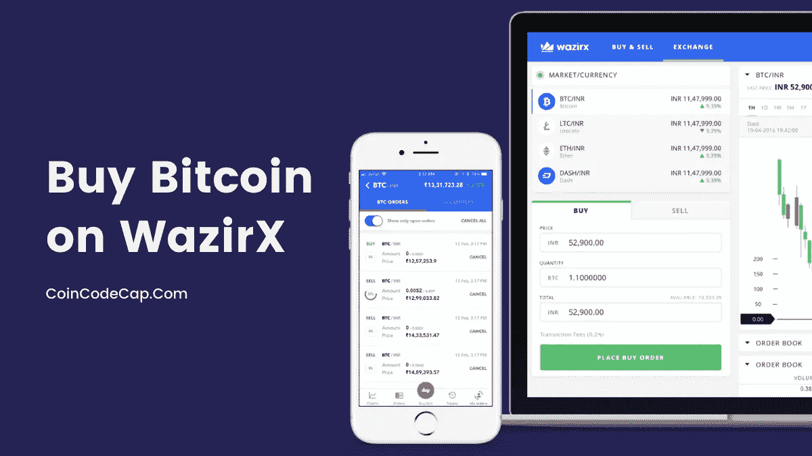
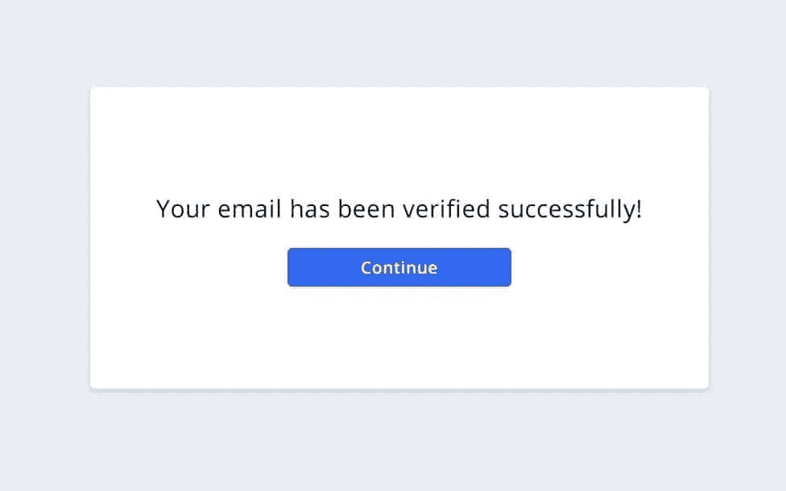
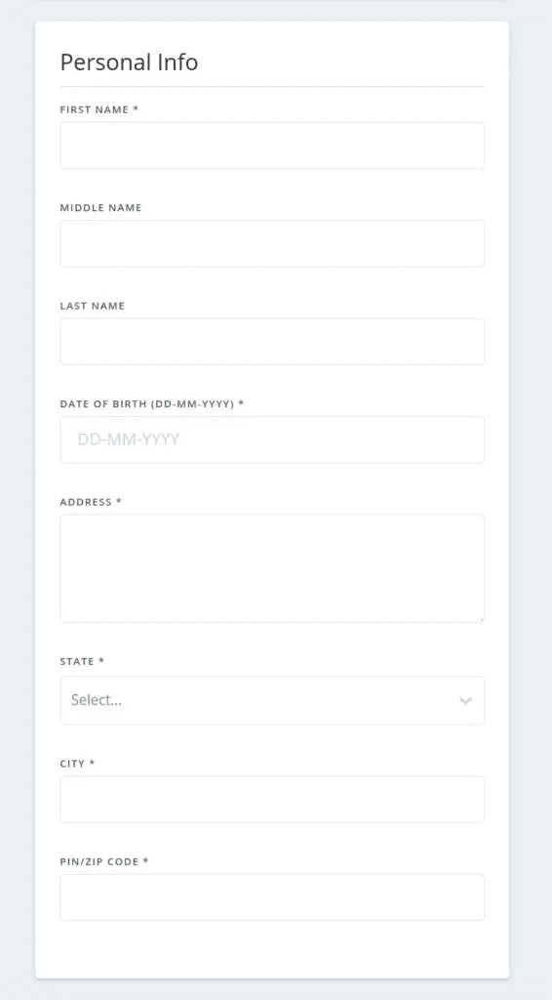

# 如何在 WazirX 2021 上购买比特币？[也适用于移动设备]

> 原文：<https://medium.com/coinmonks/buy-bitcoin-on-wazirx-2d12b7989af1?source=collection_archive---------10----------------------->

在本文中，我们将展示在 [WazirX](https://blog.coincodecap.com/go/wazirx) 上购买比特币的步骤。

WazirX 是[印度最大的加密货币交易](https://blog.coincodecap.com/bitcoin-exchange-in-india)平台。在这里，你可以买卖和交易不同的加密货币。它甚至有自己的硬币，叫做 WRX。它也可以在各种平台上访问。

WazirX 应用程序可以在 [iOS](https://itunes.apple.com/in/app/wazirx/id1349082789?mt=8) 和 [Android](https://play.google.com/store/apps/details?id=com.wrx.wazirx&referrer=utm_source%3DWazirX%2520Desktop%26utm_medium%Hero%2520Image%26utm_term%3DDownload%2520App) 设备上下载。值得注意的是，WazirX 于 2019 年 11 月被[币安](https://blog.coincodecap.com/go/binance)(一个加密货币交易平台)收购。

在 WazirX 交易所使用 **ad4e888q** 转介代码获得费用折扣。

# 摘要

*   [WazirX](https://blog.coincodecap.com/go/wazirx) 是印度最大的加密货币交易平台。
*   创建 WazirX 账户有三个步骤:注册、KYC 和购买。
*   要在 WazirX 上购买比特币，你首先需要**将印度卢比存入你的 WazirX 账户**
*   存款印度卢比有多种选择:UPI/IMPS/NEFT/RTGS
*   现在，进入 WazirX 网站上的“交换”页面。
*   从网站左侧的不同加密到 INR 交换列表中，选择“BTC/INR”交换选项。
*   在页面的右下方，你会看到一个“购买/出售比特币”选项。
*   在“购买”选项卡上，输入您想要花费的印度卢比金额，您将获得的 BTC 金额将出现在屏幕上。
*   点击“购买 BTC”按钮继续交易。
*   一旦您的订单得到处理，您的 BTC 就会出现在您的 [WazirX](https://blog.coincodecap.com/go/wazirx) 钱包中。
*   点击“基金”选项卡查看您的 BTC。

# 如何在 WazirX 上创建帐户？

## 第一步:注册一个 WazirX 账户

*   转到 [WazirX 网站](https://blog.coincodecap.com/go/wazirx)并点击右上角的“注册”按钮。
*   输入您的电子邮件地址并设置一个强密码。
*   仔细阅读服务条款，然后勾选“我同意”框。
*   准备好后，点击“注册”按钮。
*   之后，WazirX 会给你发一封验证邮件。请到您的收件箱查看 WazirX 验证邮件。在电子邮件中，您会看到一个“验证电子邮件”按钮。点击此按钮。这条消息将出现在您的屏幕上:

## 步骤 2:设置 2FA(双因素身份验证)

*   然而，这一步是可选的，但我们不建议跳过这一步。设置 2FA 是至关重要的，因为它为您的帐户提供了额外的一层保护。您可以通过以下方式设置 2FA:
*   设置 2FA 的一种方法是使用您的手机号码并通过短信接收代码。
*   第二种方法是将你的 [WazirX 账户](https://blog.coincodecap.com/go/wazirx)链接到你的谷歌认证应用，并在那里接收代码。WazirX 推荐 Google Authenticator 选项，因为它更安全。

## 第三步:KYC 验证

这是注册的第三部分，也是最后一部分:

*   从下拉菜单中选择您的国家。
*   之后，您将被要求填写以下 KYC 验证的详细信息。

*   一旦您输入所有这些细节，并点击提交，您的申请将进入验证过程。
*   在你的 KYC 申请被批准后，你会收到一封来自[瓦济克斯](https://blog.coincodecap.com/go/wazirx)的电子邮件。
*   现在，你已经准备好使用 WazirX 提供的每一个特性了。
*   您需要在将 INR 存入您的 WazirX 账户之前完成您的 KYC 验证。

# 如何在 WazirX 上购买比特币？

## 1.将印度卢比存入您的 WazirX 账户

*   点击网站顶栏上的“基金”选项卡。
*   你会发现“卢比(印度卢比)”是“资产”部分的第一个选项。点击“存款”按钮，将印度卢比存入您的 WazirX 账户。
*   WazirX 现在会询问您的银行信息。
*   一旦你添加了银行信息，你的银行账户就会链接到你的 [WazirX 账户](https://blog.coincodecap.com/go/wazirx)。
*   您的银行帐户和 WazirX 帐户上的名称必须相同。
*   此后，您将看到两个选项:“即时存款”和“UPI 即时存款”

## 2.立即存款印度卢比(IMPS/NEFT/RTGS)

*   点击“即时存款”按钮。
*   然后，你会看到你的银行账户信息和 WazirX 的银行信息。
*   通过 IMPS/NEFT/RTGS 向该银行账户转账。
*   您的存款将会立即存入您的账户。
*   通过 IMPS/NEFT/RTGS 即时存款，每笔交易收取 5.9 印度卢比的费用。

## 3.如何在合众国际社进行即时存款？

*   点击“UPI 即时存款”选项。
*   复制您的 [WazirX](https://blog.coincodecap.com/go/wazirx) 账户的唯一 UPI ID。
*   进入您选择的 UPI 应用程序(如 Google pay、Paytm、Bhim、PhonePe ),选择“通过 UPI ID 支付”选项。
*   粘贴您的 WazirX UPI ID 并输入您要存入的金额。
*   完成您的交易。您的存款将会完成。
*   如果您的 UPI 状态是“成功”，您的 WazirX 帐户将在 15 分钟内被记入。
*   UPI 的即时存款每笔交易收取 4 印度卢比的费用。

## 4.在 WazirX 上购买比特币

*   在你将印度卢比存入你的账户后，你就可以用它来购买比特币了。
*   打开网站上的“交换”标签。在这里，您将在左侧看到不同加密到 INR 交换的列表。点击“BTC/印度卢比”兑换。
*   在右下角，你会看到一个买卖比特币的选项。
*   在购买选项卡上，输入您打算花费的印度卢比金额。当你做这一步的时候，你也会看到你将要收到的 BTC 的数量。
*   [瓦济克斯](https://blog.coincodecap.com/go/wazirx)对购买 BTC 收取 **0.2%的做市商费**。
*   当您准备购买时，点击“购买 BTC”按钮，等待您的订单完成。
*   一旦你的交易完成，你的[比特币](https://blog.coincodecap.com/a-candid-explanation-of-bitcoin)就会出现在你的 WazirX 钱包里。点击网站上的“基金”标签，查看您的比特币。

# 在 WazirX 上购买比特币:结论

[WazirX](https://blog.coincodecap.com/go/wazirx) 是一个易于使用且安全的[印度密码交换平台](https://blog.coincodecap.com/bitcoin-exchange-in-india)。任何有兴趣涉足加密投资的人都可以在这个网站上快速学习。人们也不必局限于使用网站。WazirX 应用程序为人们提供了直接从手机上投资的便利。

# 常见问题

**我可以不通过 KYC 验证就存入印度卢比吗？**

不，您不能在没有完成 KYC 验证的情况下存入印度卢比。然而，你可以交易和存放密码。

**印度卢比有最低或最高存款限额吗？**

存款的最低限额是 100 印度卢比。没有最大限制。

**存放 INR 要收费吗？**

是的，每笔交易收取少量费用。费用如下:IMPS/RTGS/NEFT 费用:每笔交易 5.9 印度卢比。合众国际社收费:每笔交易 4 印度卢比。

> 加入 coin monks[Telegram group](https://t.me/joinchat/EPmjKpNYwRMsBI4p)学习加密交易和投资

## 另外，阅读

*   什么是[闪贷](https://blog.coincodecap.com/what-are-flash-loans-on-ethereum)？
*   最好的[密码交易机器人](/coinmonks/crypto-trading-bot-c2ffce8acb2a) | [网格交易](https://blog.coincodecap.com/grid-trading)
*   [3 商业评论](/coinmonks/3commas-review-an-excellent-crypto-trading-bot-2020-1313a58bec92) | [Pionex 评论](/coinmonks/pionex-review-exchange-with-crypto-trading-bot-1e459d0191ea) | [Coinrule 评论](https://blog.coincodecap.com/coinrule-review-a-perfect-trading-bot)
*   [AAX 交易所评论](/coinmonks/aax-exchange-review-2021-67c5ea09330c) | [德里比特评论](/coinmonks/deribit-review-options-fees-apis-and-testnet-2ca16c4bbdb2) | [FTX 交易所评论](/coinmonks/ftx-crypto-exchange-review-53664ac1198f)
*   [n ave 零点回顾](/coinmonks/ngrave-zero-review-c465cf8307fc) | [Phemex 回顾](/coinmonks/phemex-review-4cfba0b49e28) | [PrimeXBT 回顾](/coinmonks/primexbt-review-88e0815be858)
*   [Bybit Exchange 审查](/coinmonks/bybit-exchange-review-dbd570019b71) | [Bityard 审查](https://blog.coincodecap.com/bityard-reivew) | [CoinSpot 审查](https://blog.coincodecap.com/coinspot-review)
*   [3 commas vs crypto hopper](/coinmonks/3commas-vs-pionex-vs-cryptohopper-best-crypto-bot-6a98d2baa203)|[赚取加密利息](/coinmonks/earn-crypto-interest-b10b810fdda3)
*   最好的比特币[硬件钱包](/coinmonks/the-best-cryptocurrency-hardware-wallets-of-2020-e28b1c124069?source=friends_link&sk=324dd9ff8556ab578d71e7ad7658ad7c) | [BitBox02 回顾](/coinmonks/bitbox02-review-your-swiss-bitcoin-hardware-wallet-c36c88fff29)
*   [总帐 vs n 平均](https://blog.coincodecap.com/ngrave-vs-ledger) | [总帐 nano s vs x](https://blog.coincodecap.com/ledger-nano-s-vs-x)
*   [加密复制交易平台](/coinmonks/top-10-crypto-copy-trading-platforms-for-beginners-d0c37c7d698c) | [比特码复制交易](https://blog.coincodecap.com/bityard-copy-trading)
*   [Vauld 评论](https://blog.coincodecap.com/vauld-review) | [YouHodler 评论](/coinmonks/youhodler-4-easy-ways-to-make-money-98969b9689f2) | [BlockFi 评论](/coinmonks/blockfi-review-53096053c097)
*   最好的[加密税务软件](/coinmonks/best-crypto-tax-tool-for-my-money-72d4b430816b) | [CoinTracking 评论](/coinmonks/cointracking-review-a-reliable-cryptocurrency-tax-software-5114e3eb5737)
*   最佳[加密借贷平台](/coinmonks/top-5-crypto-lending-platforms-in-2020-that-you-need-to-know-a1b675cec3fa) | [杠杆代币](/coinmonks/leveraged-token-3f5257808b22)
*   [莱杰纳米 S vs 特雷佐 one vs 特雷佐 T vs 莱杰纳米 X](https://blog.coincodecap.com/ledger-nano-s-vs-trezor-one-ledger-nano-x-trezor-t)
*   [block fi vs Celsius](/coinmonks/blockfi-vs-celsius-vs-hodlnaut-8a1cc8c26630)|[Hodlnaut 评论](https://blog.coincodecap.com/hodlnaut-review)
*   [Bitsgap 审查](https://blog.coincodecap.com/bitsgap-review) | [Quadency 审查](/coinmonks/quadency-review-a-crypto-trading-automation-platform-3068eaa374e1) | [Bitbns 审查](https://blog.coincodecap.com/bitbns-review)
*   [埃利帕尔泰坦评论](/coinmonks/ellipal-titan-review-85e9071dd029) | [赛克斯斯通评论](https://blog.coincodecap.com/secux-stone-hardware-wallet-review)
*   [DEX Explorer](https://explorer.bitquery.io/ethereum/dex) | [本地比特币评论](https://blog.coincodecap.com/localbitcoins-review)
*   最佳[区块链分析](https://bitquery.io/blog/best-blockchain-analysis-tools-and-software)工具| [赚比特币](https://blog.coincodecap.com/earn-bitcoin)
*   [加密套利](/coinmonks/crypto-arbitrage-guide-how-to-make-money-as-a-beginner-62bfe5c868f6)指南| [如何做空比特币](https://blog.coincodecap.com/short-bitcoin)
*   最佳[加密制图工具](/coinmonks/what-are-the-best-charting-platforms-for-cryptocurrency-trading-85aade584d80) | [最佳加密交易所](/coinmonks/crypto-exchange-dd2f9d6f3769)
*   [如何在印度购买比特币](https://blog.coincodecap.com/buy-bitcoin-app-india)？
*   [印度比特币交易所](/coinmonks/bitcoin-exchange-in-india-7f1fe79715c9) | [比特币储蓄账户](https://blog.coincodecap.com/bitcoin-savings-account)
*   [尤霍德勒 vs 科恩洛 vs 霍德诺特](https://blog.coincodecap.com/youhodler-coinloan-hodlnaut)

> [直接在您的收件箱中获得最佳软件交易](/coinmonks/newsletters/coinmonks)

*原载于 2021 年 3 月 9 日 https://blog.coincodecap.com**T21*[。](https://blog.coincodecap.com/buy-bitcoin-on-wazirx)