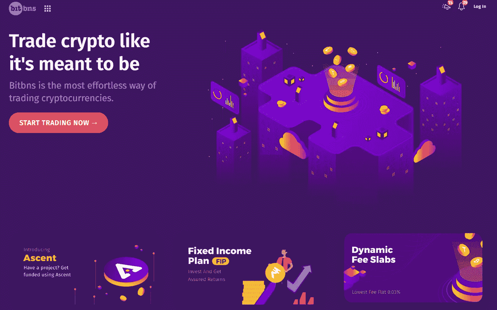
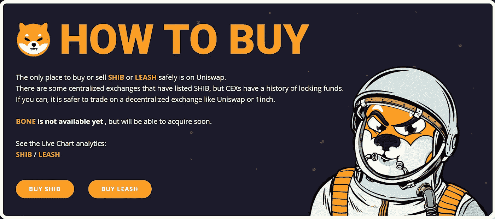
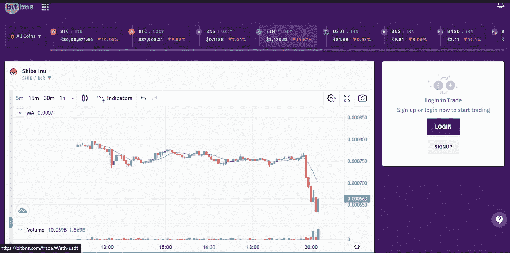
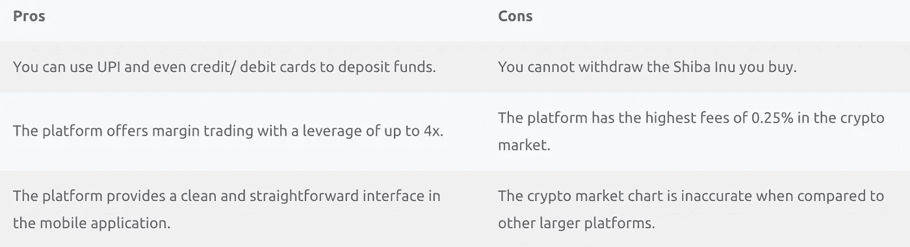
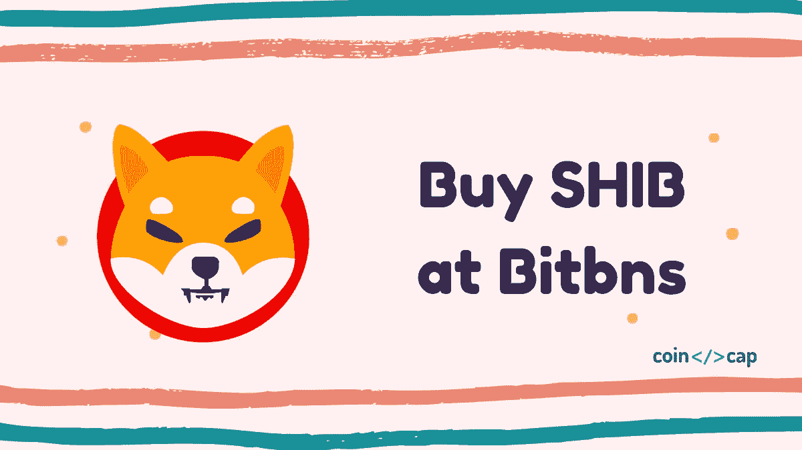

# 如何在 Bitbns 上购买柴犬(SHIB)币？

> 原文：<https://medium.com/coinmonks/buy-shiba-on-bitbns-aaef9c905959?source=collection_archive---------15----------------------->

今天我们将谈论一个最近很出名的迷因币。柴犬最近在印度证券交易所上市。在本文中，我们将解释如何在 [Bitbns](https://ref.bitbns.com/64358) 购买柴犬(SHIB)币。

# 总结(TL；博士)

*   [柴犬](https://shibatoken.com/) (SHIB)是一种基于日本狗的迷因币。
*   [柴犬](https://shibatoken.com/)的 [woof 论文](https://github.com/shytoshikusama/shibawoofpaper/raw/main/SHIBAINU_Ecosystem_WOOF_Paper.pdf)明确提到是实验令牌。所以在投资你的血汗钱之前做好你的研究。
*   Bitbns 允许你购买，HODL，出售柴犬令牌；但是，您不能从您的 Bitbns 钱包中提取它。
*   在 Woof 的论文中没有提到 SHIB 的具体特征，因此它没有任何作用。

# 什么是 Bitbns？

[Bitbns](https://ref.bitbns.com/64358) 是[最好的印度加密交易平台](https://coincodecap.com/best-bitcoin-exchange-in-india)之一，自 2017 年秋季开始活跃。该平台还提供 4 倍杠杆的保证金交易。该平台收取 0.25%的费用，并为其用户提供固定收益计划(FIP)。

你可以从我们的 [Bitbns 评论](https://coincodecap.com/bitbns-review)中了解更多关于 Bitbns 的信息。选择合适的硬币进行投资需要对市场进行大量的研究和了解。如果你是初学者，那么我们的[投资加密货币指南](https://coincodecap.com/crypto-investing-guide)可能会很方便。

# 柴犬是什么？

柴犬是日本的一种狗。你可能会遇到另一种流行的加密货币 [DOGE](https://dogecoin.com/) ，也是基于一只日本狗。柴犬币据说是终极 DOGE 杀手，但是这些硬币有任何用处吗？简单的回答是否定的，随之而来的是另一个问题。那么，它们为什么会存在呢？让我们试着找到它的解决方法。

# 柴犬令牌为什么被创造出来？

一群来自世界各地的开发人员携手合作，创造出一些有创意的东西。这催生了柴犬社区，并最终产生了令牌。根据他们的 Woofpaper(基于一只狗的 meme coin 白皮书)，SHIB 只是建立一个分散的自发社区的实验令牌。

创建 SHIB 的主要目的是为世界提供一种不受单一实体控制的货币。我想这是大多数加密货币的目的。你可以从他们的[汪汪汪论文](https://github.com/shytoshikusama/shibawoofpaper/raw/main/SHIBAINU_Ecosystem_WOOF_Paper.pdf)中了解更多关于柴犬令牌的信息。

# 如何在 Bitbns 上购买 SHIB？

您可以在 [Bitbns](https://ref.bitbns.com/64358) 上交易柴犬币；但是，您不能提取代币存放在您的私人钱包中。现在，如果你想交易 SHIB，你可以按照以下步骤建立你的 Bitbns 账户。

# 创建账户和存款的步骤

*   首先，访问 Bitbns 的官方网站，点击注册按钮。
*   现在，输入你的电子邮件和密码，点击提交按钮。
*   进入你的邮箱，点击 [Bitbns](https://ref.bitbns.com/64358) 发来的链接。
*   验证过程完成后，登录您的帐户。
*   其次，访问帐户部分，并单击 KYC 验证选项卡。
*   一旦你上传了所有的文件，交易所将在一天内验证你的帐户。
*   第三，访问资金部分，并点击存款资金按钮。
*   现在，选择您的首选模式存款 INR。
*   完成该过程，并存入您希望投资的金额。

# 在 Bitbns 购买 SHIB 的步骤

*   一旦你完成了上述所有步骤，你就可以前进到柴犬令牌。
*   点击主屏幕上的开始交易按钮，然后点击下一个屏幕上的查看所有按钮(在所有交易对上方)。
*   然后在交易对中搜索 SHIB。
*   现在，输入你想购买的 SHIB 的数量，然后点击购买按钮。

# 在 SHIB 投资有什么风险？

最近几周，柴犬大受欢迎，投资 SHIB 的交易者数量激增。然而，硬币的概念仍然不清楚，并且有特定的原因使它比其他加密资产风险更大:

*   就目前而言，SHIB 毫无用处，其唯一目的是为数字支付模式提供一个机会。就算你看了 [Woof paper](https://github.com/shytoshikusama/shibawoofpaper/raw/main/SHIBAINU_Ecosystem_WOOF_Paper.pdf) (柴犬令牌白皮书)，除了几乎每枚硬币都提供的去中心化，没有提到任何有帮助的技术。
*   在 Woof 论文中，提到这个项目是一个实验。因此，这很有可能是一个骗局。
*   SHIB 代币是一种迷因币；还记得上一次迷因令牌出现在市场上并受到广泛关注时发生了什么吗？是的，由于埃隆·马斯克的持续影响，它的价值上升了，但你能提供一个为什么它明天不会暴跌的理由吗？

# 从 Bitbns 收购柴犬(SHIB):利弊

# 结论

最近柴犬投资者数量的激增导致其价值上升。然而，由于这是一种在[区块链科技](https://coincodecap.com/what-is-blockchain-a-simple-guide-for-dummies)中毫无用处的货币，任何明智的投资者都不可能参与其中。如果你继续你的研究，并希望购买柴犬， [**Bitbns**](https://ref.bitbns.com/64358) 可以是一个完美的购买 HODL 并以更高价格出售的平台。

# 常见问题

## 比特币在印度合法吗？

截至 2021 年 5 月，印度没有关于加密货币的法律，因此既不合法也不非法。然而，有传言说印度禁止加密，这可能会阻止政府收取大量的税款。所以你应该留意来自政府的最新密码相关新闻。

## 哪里可以买到柴犬代币？

你几乎可以在任何一家印度交易所买到柴犬，比如 Bitbns。然而，这些平台只允许你交易 SHIB 代币，你不能撤回你的任何持有。你可以使用 [Uniswap](https://uniswap.org/) 购买柴犬，并将其提取到你的外部钱包中。

## 我如何从 Bitbns 取钱？

您可以从钱包部分的 Bitbns 账户中提取您持有的印度卢比。然后你会看到一个取款按钮，点击它，你就可以把钱转到你的账户上。详细解释可以参考我们的 *Bitbns* 评测文章。

*   [Bitget 回顾](https://coincodecap.com/bitget-review) | [双子座 vs BlockFi](https://coincodecap.com/gemini-vs-blockfi) cmd| [OKEx 期货交易](https://coincodecap.com/okex-futures-trading)
*   [AscendEx Staking](https://coincodecap.com/ascendex-staking)|[Bot Ocean Review](https://coincodecap.com/bot-ocean-review)|[最佳比特币钱包](https://coincodecap.com/bitcoin-wallets-india)
*   [霍比审核](https://coincodecap.com/huobi-review) | [OKEx 保证金交易](https://coincodecap.com/okex-margin-trading) | [期货交易](https://coincodecap.com/futures-trading)
*   [网格交易机器人](https://coincodecap.com/grid-trading) | [Cryptohopper 审查](/coinmonks/cryptohopper-review-a388ff5bae88) | [Bexplus 审查](https://coincodecap.com/bexplus-review)
*   [7 个最佳零费用加密交易平台](https://coincodecap.com/zero-fee-crypto-exchanges)
*   [氹欞侊贸易评论](https://coincodecap.com/anny-trade-review) | [霍比保证金交易](/coinmonks/huobi-margin-trading-b3b06cdc1519)
*   [分散交易所](https://coincodecap.com/what-are-decentralized-exchanges) | [比特 FIP](https://coincodecap.com/bitbns-fip) | [Pionex 审查](https://coincodecap.com/pionex-review-exchange-with-crypto-trading-bot)

***包含附属链接**

