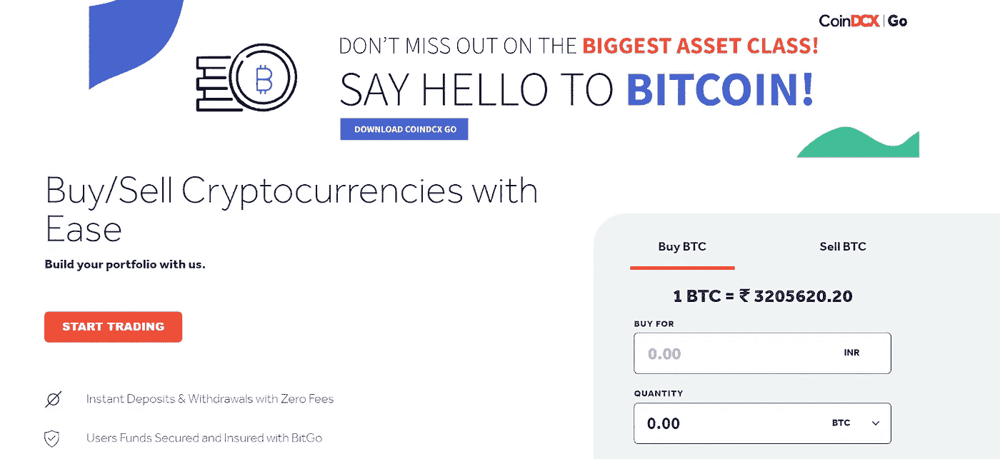
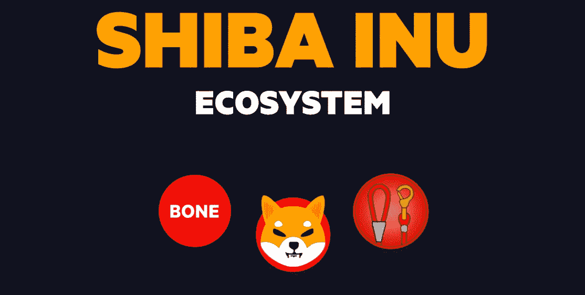
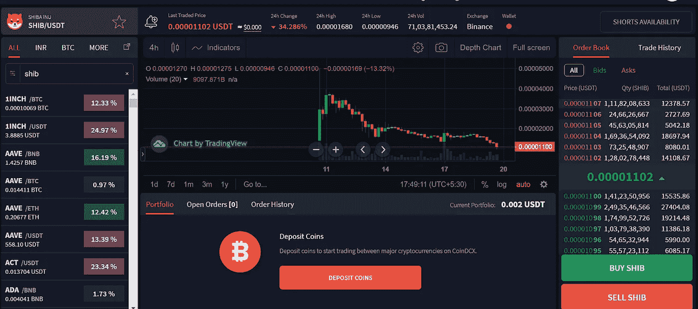
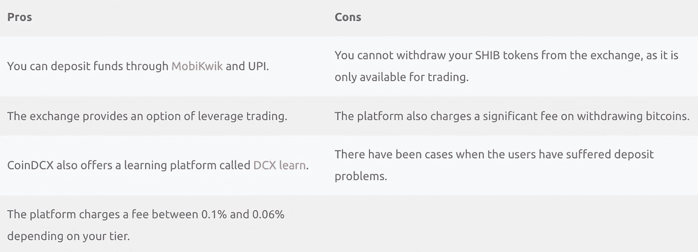
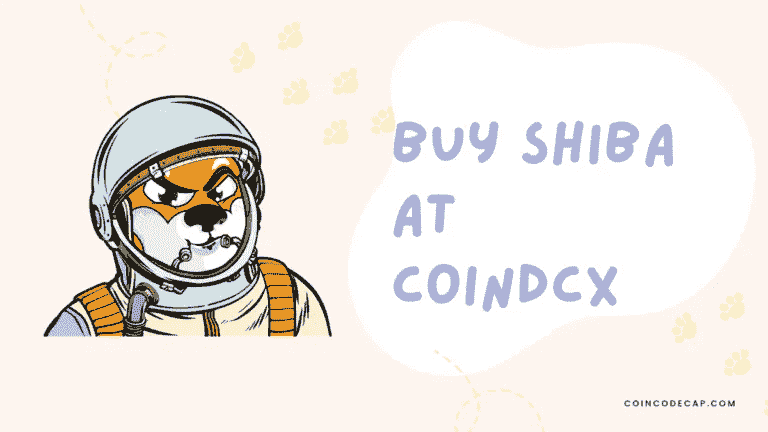

# 如何在 CoinDCX 上购买柴犬(SHIB)硬币？

> 原文：<https://medium.com/coinmonks/buy-shiba-on-coindcx-1ea6d76b3687?source=collection_archive---------16----------------------->

在这篇文章中，我们将谈论在 CoinDCX 购买[柴犬币(SHIB)](https://shibatoken.com/) 。柴犬最近在多个[印度密码交易所](https://coincodecap.com/buy-bitcoin-app-india)上市，而 [***CoinDCX***](https://coindcx.com/signup?r=70297373$$Dxroxs&utm_medium=coincodecap&utm_campaign=coinmonks) 是首批提供其交易服务的交易所之一。

# 总结(TL；博士)

*   CoinDCX 提供 200 多种加密资产进行交易，自 2018 年以来一直在运行。
*   柴犬是以一只日本狗为原型的模因 token，是去中心化自发建筑中的一个实验。
*   CoinDCX 是首批在印度上市 SHIB 的平台之一。即使你不能交易 SHIB/印度卢比，你也可以交易 SHIB/ USDT。
*   柴犬令牌的[网站上明确提到是实验项目；因此，你必须在投资前研究令牌。](https://shibatoken.com/)

# CoinDCX 是什么？

[CoinDCX](https://coindcx.com/signup?r=70297373$$Dxroxs&utm_medium=coincodecap&utm_campaign=coinmonks) 是一家总部位于新加坡的加密货币交易平台，自 2018 年起在印度提供服务。它提供 200 多种加密资产进行交易，甚至提供[杠杆交易](https://coincodecap.com/margin-trading)、赌注和[加密贷款](https://coincodecap.com/crypto-lending)。

您可以从我们的 [CoinDCX review](https://coincodecap.com/coindcx-review) 文章中了解关于该平台的更多信息。如果你是初学者，你可以从我们的[投资加密货币](https://coincodecap.com/crypto-investing-guide)指南开始学习投资加密的基础知识。

# 柴犬是什么？

根据 SHIB 的创始人，令牌是一个分散的自发建设的实验。这导致了以另一种日本狗命名的加密货币“柴犬”的诞生。我们见过类似的基于迷因狗的硬币。柴犬和 [DOGE](https://dogecoin.com/) 相似吗？让我们试着找出答案。

# 柴犬令牌是做什么的？

你可以购买和存储尽可能多的 Shiba Inu 代币，这可能是这种货币的唯一用途。然而，[柴犬生态系统](https://shibatoken.com/)旨在为社区和由社区开发柴犬代币。随着诈骗项目每隔一天就会冒出来，很难相信一枚硬币为什么会有价值？

# 如何在 CoinDCX 上购买 SHIB？

[**CoinDCX**](https://coindcx.com/signup?r=70297373$$Dxroxs&utm_medium=coincodecap&utm_campaign=coinmonks) 允许您买卖，即交易柴犬代币，**但您不能撤回代币**。现在转到下一部分，了解购买 Shiba Inu 的详细步骤。

# 创建帐户和存款资金的步骤

*   访问 CoinDCX 官方网站，点击注册按钮或登录到您现有的帐户。
*   现在，输入您的电子邮件地址和密码，然后点击提交按钮。
*   确认您的电子邮件，登录您的帐户，并完成双因素身份验证过程。
*   然后移至“配置文件”部分，完成 KYC 验证。
*   完成上载文档后，等待验证您的帐户。
*   现在访问资金部分存款资金在您的帐户。
*   点击 INR 标签并点击存款按钮。
*   然后在下一个屏幕上，选择您的首选存款选项并存入您希望投资的金额。(如果通过合众国际社存款，您可以选择“移动维基”选项，然后继续使用合众国际社。)

在 CoinDCX 购买比特币或任何其他加密资产的过程与此类似，因此您也可以阅读我们的文章[如何在印度购买比特币](https://coincodecap.com/buy-bitcoin-in-india)或[如何在印度购买以太坊](https://coincodecap.com/buy-ethereum-in-india)。

# 在 CoinDCX 收购 SHIB 的步骤

一旦您验证了您的帐户并完成了资金存款过程，您就可以按照以下步骤购买 SHIB:

*   首先，登录你的 [CoinDCX 账户](https://coindcx.com/signup?r=70297373$$Dxroxs&utm_medium=coincodecap&utm_campaign=coinmonks)。
*   然后，如果你在一台个人电脑上，将鼠标指针置于交易标签上，点击 Spot。
*   如果你在打电话，点击屏幕底部的市场标签。
*   第三，搜索 USDT，购买尽可能多的你想投资的柴犬代币。
*   然后搜索 SHIB 并点击 SHIB/ USDT 选项。
*   现在，选择市场/限价订单模式，并输入您希望购买的 SHIB 金额。
*   最后，点击“购买”按钮，在成功完成您的订单后，您的钱包部分中将提供代币。

# 投资 SHIB 有什么风险？

在 SHIB 投资有很多风险，主要原因可能是一个骗局。让我们来看看其中的几个:

*   柴犬是一种货币，除了收集代币之外没有任何用途。
*   我们已经看到 DOGE 从一无所有发展到一美元，然后在一些影响的帮助下回来。这对于 SHIB 来说也是可能的。
*   SHIB 的唯一基础是货币的去中心化，甚至这一特征也伴随着几乎所有其他数字资产。
*   我们可以在网站上看到 SHIB 代币是一个实验。因此，它也可能是一个骗局，你可能会把你的血汗钱投资到一个骗局中。

# 从 CoinDCX 收购柴犬:利弊

# 结论

柴犬是一种迷因货币，目前没有任何具体的用例。然而，如果你想投资 SHIB 代币，我们建议你做市场调查。 [**CoinDCX**](https://coindcx.com/signup?r=70297373$$Dxroxs&utm_medium=coincodecap&utm_campaign=coinmonks) 为您提供一个交易 SHIB 代币的平台；但是，您可能无法从平台上提取代币。

# 常见问题

## 我能在哪里购买柴犬代币？

你可以在任何列出 SHIB 的平台上买到这些硬币。但是，要提取购买的 SHIB，需要将钱包连接到 [UniSwap](https://uniswap.org/) ，连接的钱包必须在 ETH 中有资金。

## WazirX 和 CoinDCX 哪个最好？

无论是 [WazirX](https://wazirx.com/invite/ad4e888q) 还是 [CoinDCX](https://coindcx.com/signup?r=70297373$$Dxroxs&utm_medium=coincodecap&utm_campaign=coinmonks) 都有其好处，没有一个平台可以在各个方面都做到完美。一方面 WazirX 已经被 [***币安***](https://accounts.binance.com/en/register?ref=UARTH1S1) 收购，另一方面 CoinDCX 支持所有国际交易平台的功能。要了解更多信息，您可以阅读我们关于 [WazirX 评论](https://coincodecap.com/wazirx-review)和 [CoinDCX 评论](https://coincodecap.com/coindcx-review)的文章，并亲自比较这些功能。

# 如何在 CoinDCX 上购买比特币？

在任何特定交易所购买任何资产的过程都是相似的，因此你可以按照上述步骤购买比特币。你也可以阅读我们关于如何在印度购买比特币的文章。

*   [加密复制交易平台](/coinmonks/top-10-crypto-copy-trading-platforms-for-beginners-d0c37c7d698c) | [如何在 WazirX 上购买比特币](/coinmonks/buy-bitcoin-on-wazirx-2d12b7989af1)
*   [CoinLoan 评论](https://coincodecap.com/coinloan-review)|[Crypto.com 评论](/coinmonks/crypto-com-review-f143dca1f74c)
*   [如何在加拿大购买加密货币？](https://coincodecap.com/how-to-buy-cryptocurrency-in-canada)
*   [百无聊赖的猿游艇俱乐部(BAYC)审查](https://coincodecap.com/bored-ape-yacht-club-bayc-review)
*   [5 款最佳加密交易终端](https://coincodecap.com/crypto-trading-terminals) | [最佳 DeFi 应用](https://coincodecap.com/best-defi-apps)
*   [最佳网上赌场](https://coincodecap.com/best-online-casinos) | [币安评论](/coinmonks/binance-review-ee10d3bf3b6e) | [BitMEX 评论](https://coincodecap.com/bitmex-review)
*   [麻雀交换评论](https://coincodecap.com/sparrow-exchange-review) | [纳什交换评论](https://coincodecap.com/nash-exchange-review)
*   [美国最佳加密交易机器人](https://coincodecap.com/crypto-trading-bots-in-the-us) | [不断回顾](https://coincodecap.com/changelly-review)

***包含附属链接**

