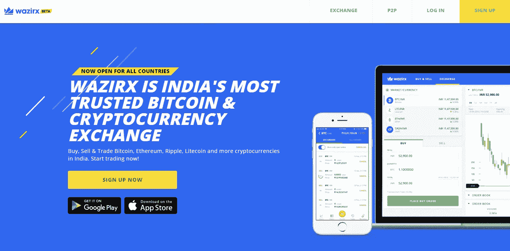
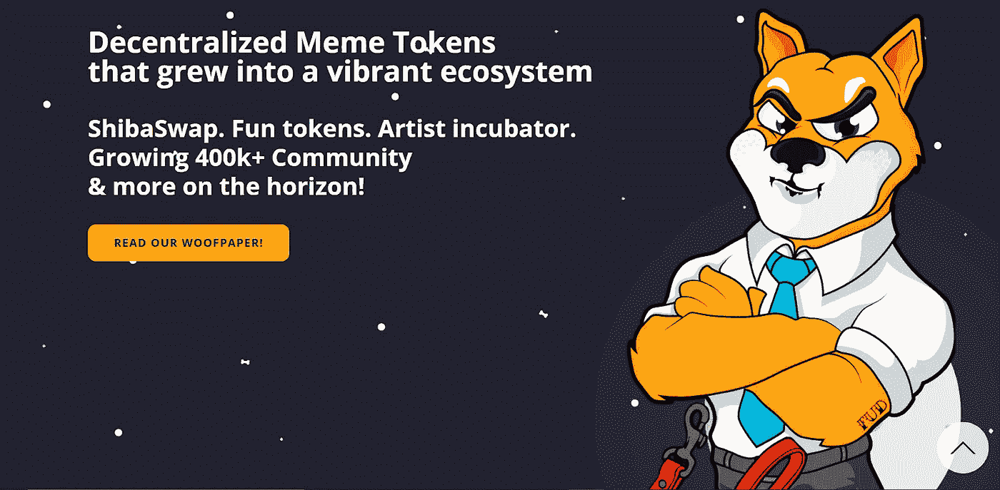
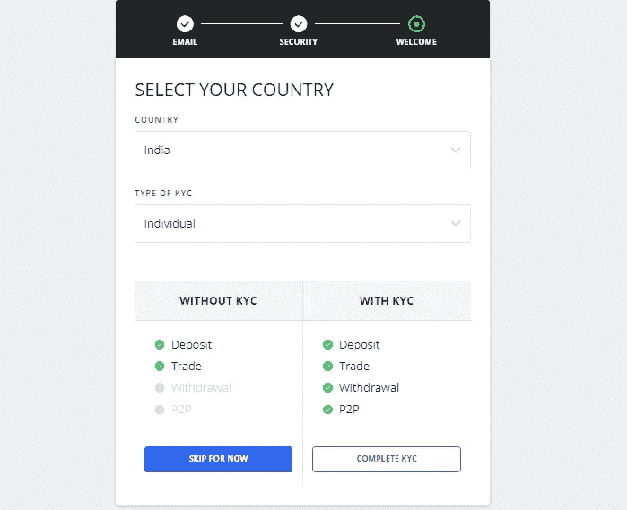
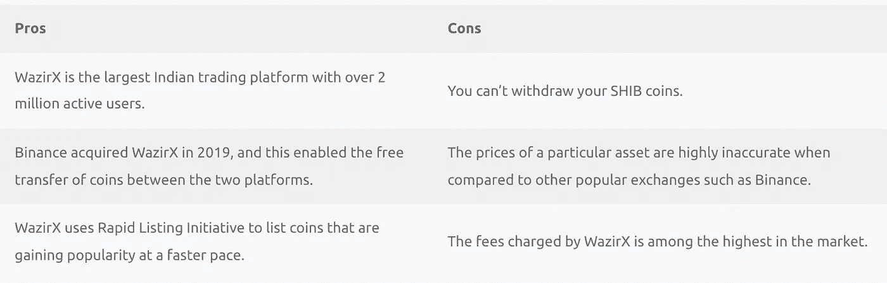
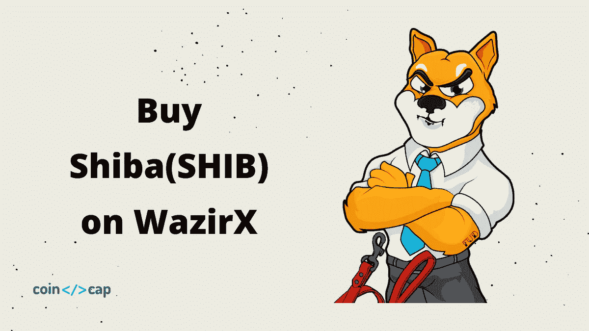

# 如何在 WazirX 上购买柴犬(SHIB)硬币？

> 原文：<https://medium.com/coinmonks/buy-shiba-on-wazirx-cf2eb6b26c53?source=collection_archive---------18----------------------->

本文将带你一步步了解在 [**瓦济克斯**](https://wazirx.com/invite/ad4e888q) 购买[柴犬 INU](https://shibatoken.com/)【SHIB】的过程。我们也会关注购买柴犬 will 的风险。

# 总结(TL；博士)

*   WazirX 是印度最好的加密交换平台。此外，由于[币安](https://accounts.binance.com/en/register?ref=UARTH1S1)收购了它，现在在两个平台之间转移资金更容易了。
*   柴犬是一个基于另一只叫做柴犬的日本狗的迷因硬币。
*   你可以在 WazirX 通过创建账户、完成验证、存款和下订单来购买柴犬 INU。
*   柴犬·INU 在伊隆·马斯克的一条推特[上走红，这条推特显示了我们对一个人影响力的重视程度。](https://twitter.com/elonmusk/status/1390550521077977089?lang=en)

# 什么是 WazirX？

[**WazirX**](https://wazirx.com/invite/ad4e888q) 最突出的是[印度加密货币交易所](https://coincodecap.com/best-bitcoin-exchange-in-india)。尽管加密货币在印度的未来存在不确定性，但该平台是最先理解分散化技术和区块链在印度的重要性的平台之一。

要投资加密货币，你必须坚持理解区块链技术的运作方式。你可以从我们成熟的[投资加密货币](https://coincodecap.com/crypto-investing-guide)指南中更好地了解加密和区块链。你也可以阅读我们的 [WazirX 评论](https://coincodecap.com/wazirx-review)文章来更好地了解这个平台。

# 什么是柴犬·INU？

柴犬(SHIB)是一种以日本犬种柴犬命名的加密货币。它与 [Dogecoin](https://dogecoin.com/) 非常相似，并且由于 Doge 杀手的称号而越来越受欢迎。几乎所有主要的加密平台都列出了令牌，印度的交易平台也是如此。

# 柴犬代币的作用是什么？

柴犬·INU 令牌是一个声称已经成长为一个充满活力的生态系统的模因令牌。柴犬也提供 Shib 掉期，并计划通过其第一家正式的 NFT 合资企业进入 NFT 市场。简而言之，柴犬的角色是利用区块链来推广迷因社区。

# 如何在 WazirX 上购买 SHIB？

柴犬最近通过[快速上市倡议](/wazirx/rapid-listing-initiative-on-wazirx-c617f7794c35)被列入该平台，在这里你可以购买和交易柴犬·INU，但不能从你的 WazirX 钱包里取出来。购买 SHIB 的步骤在下一节:

# 创建账户和存款的步骤

您可以按照以下步骤在 [WazirX](https://wazirx.com/invite/ad4e888q) 创建账户、完成验证并存入印度卢比:

*   访问 WazirX 的官方网站，点击注册按钮。
*   现在输入您的电子邮件、密码和推荐代码(如果有的话)，然后点击提交按钮。
*   使用邮件中发送的验证码验证您的帐户，然后登录您的帐户。
*   现在，上传必要的文件和一张自拍照，完成您的 KYC 验证。
*   验证后，从设置中启用双因素身份验证。
*   访问您的账户部分，点击 INR。
*   现在点击存款 INR 按钮，选择您喜欢的存款方式。
*   在您将资金转入您的 WazirX 账户后，如果有任何存款延迟，它将在 5 小时内可用。

既然你已经在 WazirX 开设了账户，是时候购买 SHIB 了。对 WazirX 的所有加密资产下购买订单是类似的；因此，你也可以阅读我们的文章[如何在 WazirX 上购买比特币](https://coincodecap.com/buy-bitcoin-on-wazirx)或[如何在印度购买 ETH](https://coincodecap.com/buy-ethereum-in-india)。

# 在瓦济克斯购买 SHIB 的步骤

现在，要购买 SHIB 代币，您可以遵循以下步骤:

*   访问手机上的“市场”选项卡或电脑上的“交易”选项卡。
*   现在，在 INR 菜单中搜索 SHIB。
*   打开 SHIB 的交易窗口，点击手机上的买入/卖出按钮。
*   现在，将订单类型设置为市场，或者输入您希望订单执行的限价。
*   然后输入你想买的 SHIB 的数量，点击按钮。
*   一旦您的订单成功执行，您可以从账户部分关注您拥有的 SHIB 的价值。

# 投资柴犬 INU 的风险？

如果你愿意把辛苦赚来的钱投资到加密资产中，你必须至少对你要投资的资产进行一些研究。如果不是这样，你可以阅读我们关于如何投资加密货币的文章。如果你知道，你觉得 SHIB·INU 有什么重要的？

Dogecoin 因 Reddit 用户而变得流行，最终因埃隆·马斯克的一些推文而变得流行，埃隆·马斯克被称为 DOGE 的父亲。柴犬·INU 正在尝试类似的方法。我们必须明白，加密货币更重要，一个人不应该像 Doge 那样影响其价格。而正是我们这些投资者，基于别人的笑话，实际上在拿我们的钱冒险。

加密货币市场最终会寻找有利于区块链技术的项目，以太坊、ADA、Polkadot 和 GRT 等项目正在帮助它实现这一目标。

我们正处于私人货币的时代，因此你会看到每天都有新的硬币冒出来，因此在投资前做好你的研究。

# 从 WazirX 购买 Shib:利弊

# 结论

[**WazirX**](https://wazirx.com/invite/ad4e888q) 是最受欢迎的[印度加密交易平台](https://coincodecap.com/best-bitcoin-exchange-in-india)，由于币安已经收购了它，它为我们提供了一个在两个交易所之间转移资金的机会，而且不收取任何费用。SHIB 是一枚迷因硬币，所以如果你打算在 SHIB 投资，你必须事先做好市场调查。

# 常见问题

# 有多少柴犬·INU 硬币？

这些迷因币之所以不能有多大价值，是因为它们的市场供应量。柴犬 INU 硬币的货币市场供应上限为一万亿或 100000000000000000 个硬币。然而， [40%的供应量](https://www.coindesk.com/vitalik-buterin-burns-6b-in-shib-tokens-says-he-doesnt-want-the-power)已经被 Vitalik 烧掉了。

# 我如何能在印度得到柴犬 INU 硬币？

你可以在任何著名的印度交易所买到柴犬·INU 硬币，比如 WazirX。你甚至可以按照上面的指南来完成这个过程。还可以使用以太坊网络上的 Uniswap 平台买卖加密货币，换取 ETH。

# 柴犬·INU 硬币的用途是什么？

柴犬 INU 在其官方网站上提到的唯一有价值的事情是，你可以持有数百万甚至数十亿的柴犬 INU 代币。令牌没有其他用途；然而，随着自己的 NFT 平台的发布，SHIB 可能会对 NFT 平台的创建者产生一些影响。

*   **包含附属链接**

## 也阅读

*   [如何在 CoinDCX 上购买柴犬(SHIB)币？](https://coincodecap.com/buy-shiba-coindcx)
*   [CBET 点评](https://coincodecap.com/cbet-casino-review) | [库币 vs 比特币基地](https://coincodecap.com/kucoin-vs-coinbase) | [拜比特 vs 比特币基地](https://coincodecap.com/bybit-vs-coinbase)
*   [折叠 App 回顾](https://coincodecap.com/fold-app-review) | [本地比特币回顾](/coinmonks/localbitcoins-review-6cc001c6ed56) | [Bybit vs 币安](https://coincodecap.com/bybit-binance-moonxbt)
*   [加密保证金交易交易所](/coinmonks/crypto-margin-trading-exchanges-428b1f7ad108) | [赚取比特币](/coinmonks/earn-bitcoin-6e8bd3c592d9) | [Mudrex 投资](https://coincodecap.com/mudrex-invest-review-the-best-way-to-invest-in-crypto)
*   [WazirX vs coin dcx vs bit bns](/coinmonks/wazirx-vs-coindcx-vs-bitbns-149f4f19a2f1)|[block fi vs coin loan vs Nexo](/coinmonks/blockfi-vs-coinloan-vs-nexo-cb624635230d)
*   [比斯勒评论](https://coincodecap.com/bitsler-review)|[WazirX vs coin switch vs coin dcx](https://coincodecap.com/wazirx-vs-coinswitch-vs-coindcx)
*   [7 大副本交易平台](https://coincodecap.com/copy-trading-platforms) | [BuyCoins 点评](https://coincodecap.com/buycoins-review)

