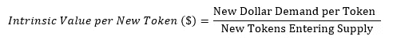

# 回购/流模型:通过$SRM 案例研究对加密回购建模的方法

> 原文：<https://medium.com/coinmonks/buyback-flow-model-a-way-to-model-crypto-buybacks-through-the-srm-case-study-cf8ca92a0e2f?source=collection_archive---------0----------------------->

## **总结**

回购/流量是一个框架，根据即将到来的供应评估回购-燃烧计划的潜在价格影响。为了证明这一框架，我们使用了一个项目的案例研究，该项目是最积极的回购-烧伤计划之一:血清。

Serum 是一个 Solana 本地的，基于 orderbook 的 DEX，它希望在 Solana 上建立 DeFi 生态系统的基础。Serum 是由 FTX 的 Sam Bankman-Fried 和 Alameda Research 共同创立的，目前，Serum 将 68%的周收入用于回购业务。

在这篇文章中，我们深入探讨了回购燃烧与供应导向的象征经济学之间的相互作用，以及对价格的最终影响。

完整的模型可以在这里找到:【https://cutt.ly/HbmGBZ6】T2

## **回购/流动介绍**

回购-烧钱是一种隐秘的现象，其中协议/平台将固定百分比的收入用于在公开市场上回购自己的代币，并且不仅从流通供应中而且从总体供应中移除它们。这种做法通常每周进行一次，被认为是一种通货紧缩现象，将对价格产生长期的积极影响。高比例的收入用于回购燃烧通常会导致围绕硬币的积极叙事，这本身会导致积极的价格行动。

然而，当我们从授予计划中为创始人、顾问和其他当前锁定的代币引入越来越多的代币供应时，这个简单的概念变得复杂了。很难模拟有多少通过授权计划进入供应的代币将被通过回购-焚烧计划焚烧的代币抵消，因此对价格的净影响可能是什么。这是因为净代币供应量(新供应量减去已消耗的供应量)影响价格，而价格影响可消耗的代币数量，从而导致逻辑上的循环。

为了打破这种循环，我们提出了**回购/流动模型**，该模型允许我们测量回购-烧钱和增量供应这两种对立力量所造成的潜在价格影响。以下是我们建议的直观表示(血清特异性数据点将在本报告后面详细讨论):

Buyback / Flow Model; Source: Clear Chain Capital

我们的论点背后的前提如下:

1/让我们将某一年的现有循环供应量和新进供应量分成两个单独的桶

[2]我们假设当前的流通供给被某种程度的有机市场需求所抵消，决定了当前的市场价格

3/市场现在需要根据对这些新代币的需求，对新进入的供应进行定价，这可以使用下面的公式来近似计算

Assuming Ceteris Paribus

4/我们建议，现在可以将美元需求分成两部分:第一，专门用于回购-烧伤的最低保证美元，第二，没有被定价到当前市场水平的任何增量有机需求

5/通过这样做，我们将回购-焚烧计划的影响从代币的数量转化为对新代币的基于美元的需求

6/这使我们能够提出这样一个问题:“根据有保证的象征性供应和回购-燃烧的最低保证需求，需要多少额外的有机需求才能与当前的价格水平相匹配？”

7 如果这个数字是负数，那么我们可以肯定回购燃烧将对价格产生积极影响，如果是正数，我们可以衡量这些需求水平是否合理

我们决定使用血清(SRM)作为我们的第一个案例研究，因为它目前拥有最大的回购烧伤，占承诺收入的%。事实上，根据 Serum 的白皮书,$SRM 令牌的最大用途是通过回购-烧录增加价值:

Source: Serum Whitepaper

然而，在进行案例研究之前，我们认为谨慎的做法是花些时间了解一下血清的基本知识及其作用。

## **血清(SRM)概述**

血清是一种茄碱原生的 DEX，由 FTX 的 Sam Bankman-Fried 和 Alameda Research 共同创立。Serum 提供了三方面的价值主张:

1.  较低的交易费用和更快的交易时间(特别是与基于以太坊的 dex 相比)
2.  基于订单簿的系统(相对于 AMM，即基于自动做市商)最大限度地减少滑点
3.  Oracle 免费跨链交易结算(使用基于抵押品的模式)

Serum 的目标是成为高速 DeFi 生态系统的中心，该生态系统已准备好进行大规模采用，并可以处理超过 10 亿用户。在 2020 年 8 月推出之前，Serum 在三周内建成，这是一个著名的例子，它已经朝着这一目标取得了有意义的进展，在 2021 年 4 月下旬，日交易额达到约 1 亿美元。

Source: Dune Analytics, Serum Website

Serum 发行两种类型的令牌:SRM 令牌和 MSRM 令牌。SRM 令牌可用于支付费用、享受交易费用折扣以及参与治理投票。100 万个 SRM 令牌可以组合成 1 个 MSRM 令牌，其中只能有 1，000 个。MSRM 令牌的关键特征是充当确保系统平稳运行的节点。

Serum 的增长也反映在其回购计划的轨迹上，该计划已经产生了许多围绕令牌的嗡嗡声。

Dollars dedicated by Serum to buyback-burns over the past 27 weeks

然而，目前只有约 5%的 SRM 令牌在供应，授予时间表将于今年晚些时候 2021 年 8 月 11 日开始。

具体来说，SRM 的最大供应量为 100 亿，解锁供应量为 10 亿。其中，8.25 亿枚令牌目前用于生态系统计划，1.25 亿枚令牌作为储备。这使得 5000 万代币的流通供应量，或最大供应量的 5%。

锁定供应在利益相关方之间的分配如下:

Serum Token Distribution; Source: Serum Website

根据 Serum 的报告，这一锁定供应将一直锁定到 2021 年 8 月 11 日，届时代币将开始归属。预计供应将在 6 年内以每天 400 万个令牌的固定速度线性解锁。鉴于 90%的供应将在此期间解锁，这将在上述积极回购计划影响价格的能力中发挥关键作用。

$SRM Unlock Schedule; Source: Serum Website

**回购/流动模式**

这为我们提供了实现$SRM 回购/流动模型所需的所有细节。以下是我们的假设:

基于我们的初步结果，我们发现，一旦解锁开始，当前的价格水平将持续，要么:1)几乎没有既得令牌必须进入市场作为供应，要么 SRM 令牌的有机需求必须非常高。

Buyback / Flow Model: $SRM Token

另一种思考方式是，尽管回购力度非常大，但回购力度不足以抵消即将到来的供应，这对于任何计划在 6 年内授予 95%供应量的代币来说都是一种风险。

这就引出了一个问题，对 SRM 令牌的有机需求会有多强。鉴于代币持有者少于 100 万的代币的使用案例本质上是平台折扣，尚不清楚有机需求是否会特别强劲。

然而，一种现实的可能性是，既得代币持有者集体同意停止向市场供应代币，并在更长的时间内非常谨慎地抛售代币，以维持价格稳定。鉴于这个项目背后有一个声誉良好的团队，他们很可能会竭尽全力支持象征性价格。

然而，这实质上意味着，在 8 月 11 日之后，来自当前流通供应的 SRM 令牌持有者将完全受到既得令牌持有者的支配。

我们完整的模型可以在这里找到:【https://cutt.ly/HbmGBZ6 

## **短期展望**

如果我们将时间范围缩小到 5 月至 8 月之间的三个月，这是 crypto 中一个有意义的时间窗口，故事看起来会有很大不同。由于供应固定，回购变得非常强大，这意味着在当前价格约 11 美元的情况下，年化远期市盈率约为 5X。与比特币基地股票 710 倍的市盈率相比，这尤其具有吸引力。

## **结论**

短期来看，有可能作为代币持有者享受 Serum 回购-burns 的权力。然而，从 8 月 11 日开始，随着供应开始涌入市场，非常谨慎地进行将是非常重要的。从那时起，假设投资者对维持市场价格感兴趣，他们可能不得不依赖团队和顾问的卖出限制。

> 加入 [Coinmonks Telegram group](https://t.me/joinchat/uiLERCQL1fQ5ZjA1) 并了解加密交易和投资

## 另外，阅读

*   最好的[密码交易机器人](/coinmonks/crypto-trading-bot-c2ffce8acb2a) | [电网交易机器人](https://blog.coincodecap.com/grid-trading)
*   [加密复制交易平台](/coinmonks/top-10-crypto-copy-trading-platforms-for-beginners-d0c37c7d698c) | [五大 BlockFi 替代方案](https://blog.coincodecap.com/blockfi-alternatives)
*   [CoinLoan 点评](/coinmonks/coinloan-review-18128b9badc4)|[Crypto.com 点评](/coinmonks/crypto-com-review-f143dca1f74c) | [火币保证金交易](/coinmonks/huobi-margin-trading-b3b06cdc1519)
*   [尤霍德勒 vs 科恩洛 vs 霍德诺特](/coinmonks/youhodler-vs-coinloan-vs-hodlnaut-b1050acde55a) | [Cryptohopper vs 哈斯博特](https://blog.coincodecap.com/cryptohopper-vs-haasbot)
*   [杠杆代币](/coinmonks/leveraged-token-3f5257808b22) | [最佳密码交易所](/coinmonks/crypto-exchange-dd2f9d6f3769) | [Paxful 点评](/coinmonks/paxful-review-4daf2354ab70)
*   [如何在印度购买比特币？](/coinmonks/buy-bitcoin-in-india-feb50ddfef94) | [WazirX 评论](/coinmonks/wazirx-review-5c811b074f5b) | [BitMEX 评论](https://blog.coincodecap.com/bitmex-review)
*   [双子座 vs 比特币基地](https://blog.coincodecap.com/gemini-vs-coinbase) | [比特币基地 vs 北海巨妖](https://blog.coincodecap.com/kraken-vs-coinbase)|[coin jar vs coin spot](https://blog.coincodecap.com/coinspot-vs-coinjar)
*   [币安 vs 北海巨妖](https://blog.coincodecap.com/binance-vs-kraken) | [美元成本平均交易机器人](https://blog.coincodecap.com/pionex-dca-bot)
*   [印度比特币交易所](/coinmonks/bitcoin-exchange-in-india-7f1fe79715c9) | [比特币储蓄账户](/coinmonks/bitcoin-savings-account-e65b13f92451)
*   [币安费用](/coinmonks/binance-fees-8588ec17965) | [Botcrypto 审核](/coinmonks/botcrypto-review-2021-build-your-own-trading-bot-coincodecap-6b8332d736c7) | [Hotbit 审核](/coinmonks/hotbit-review-cd5bec41dafb) | [KuCoin 审核](https://blog.coincodecap.com/kucoin-review)
*   [我的加密副本交易经验](/coinmonks/my-experience-with-crypto-copy-trading-d6feb2ce3ac5) | [《比特币基地评论》](/coinmonks/coinbase-review-6ef4e0f56064)
*   [加密货币储蓄账户](/coinmonks/cryptocurrency-savings-accounts-be3bc0feffbf) | [YoBit 审查](/coinmonks/yobit-review-175464162c62) | [Bitbns 审查](/coinmonks/bitbns-review-38256a07e161)
*   [最佳比特币保证金交易](/coinmonks/bitcoin-margin-trading-exchange-bcbfcbf7b8e3) | [比特币保证金交易](https://blog.coincodecap.com/bityard-margin-trading)
*   [加密保证金交易交易所](/coinmonks/crypto-margin-trading-exchanges-428b1f7ad108) | [赚取比特币](/coinmonks/earn-bitcoin-6e8bd3c592d9) | [Mudrex 投资](https://blog.coincodecap.com/mudrex-invest-review-the-best-way-to-invest-in-crypto)
*   [BlockFi 信用卡](https://blog.coincodecap.com/blockfi-credit-card) | [如何在币安购买比特币](https://blog.coincodecap.com/buy-bitcoin-binance)
*   [顶级付费加密货币和区块链课程](https://blog.coincodecap.com/blockchain-courses) | [币安评论](/coinmonks/binance-review-ee10d3bf3b6e)
*   [MXC 交易所评论](/coinmonks/mxc-exchange-review-3af0ec1cba8c) | [Pionex vs 币安](https://blog.coincodecap.com/pionex-vs-binance) | [Pionex 套利机器人](https://blog.coincodecap.com/pionex-arbitrage-bot)
*   [在美国如何使用 BitMEX？](https://blog.coincodecap.com/use-bitmex-in-usa) | [BitMEX 点评](https://blog.coincodecap.com/bitmex-review) | [币安 vs Bittrex](https://blog.coincodecap.com/binance-vs-bittrex)