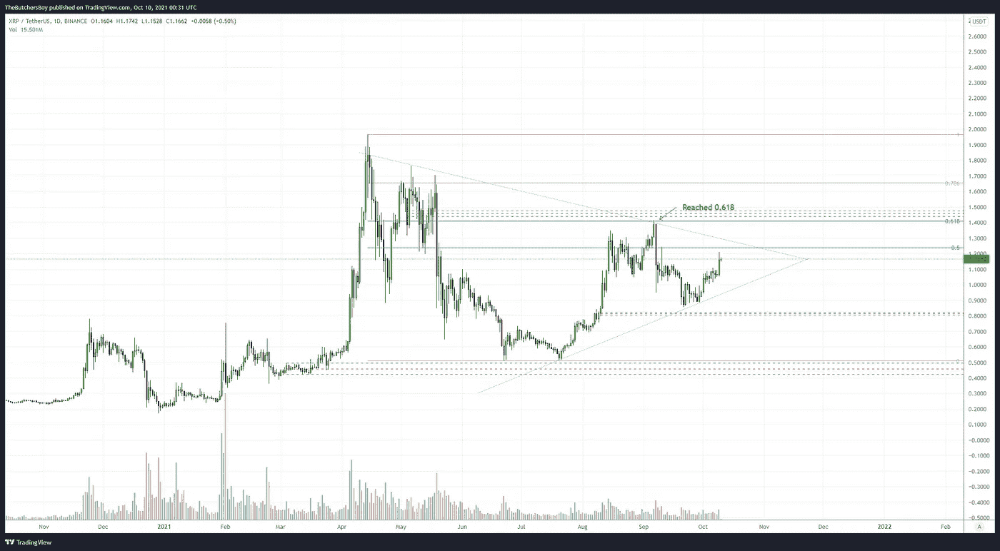
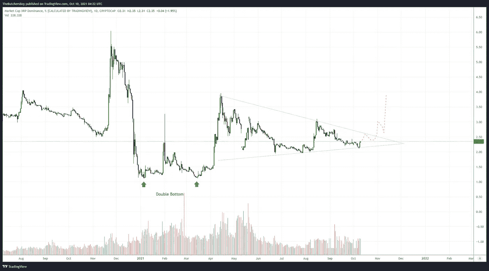
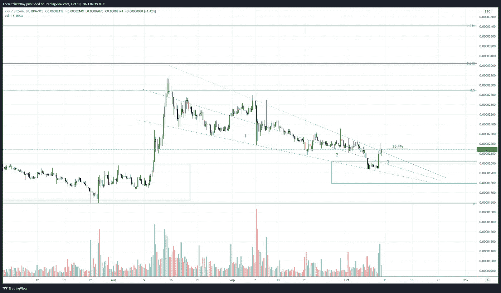
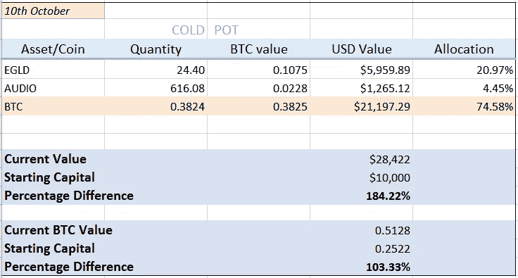
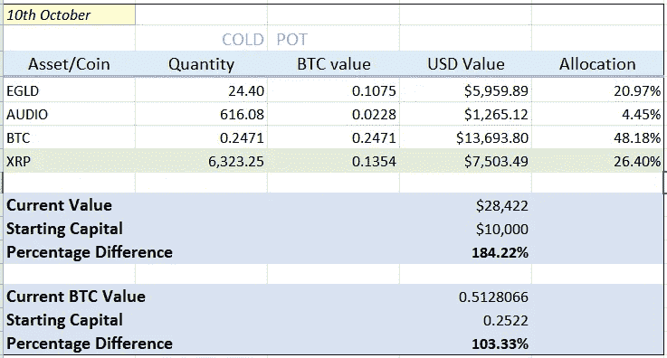

# 购买 Ripple—10 月 10 日

> 原文：<https://medium.com/coinmonks/buying-ripple-10th-oct-e7054eb39d24?source=collection_archive---------4----------------------->

Ripple 在过去的一周里表现出了一些相对的实力。如果我们看看宏观时间框架，这是在最后一轮上涨中触及 0.618 纤维回撤的少数几个低价之一。

Ripple/USD Daily chart

XRP。d(波动优势)日线图给了我们一个漂亮的低波动楔形。这个周期我们会看到传说中的波纹泵吗？技术上看起来是这样，我相信这背后也有一些基本的原因。

如果你像我一样是纯粹的技术交易者，你会明白图表预测了走势，消息为迟到的人证明了这一点。我们在这里很早，如果我们的分析是准确的，我们将沐浴在利润丰厚的荣耀中，而零售商则在给我们打气。

要知道，这是一个优势图，我们在未来一段时间内仍然宏观看好 crypto，我们预计未来几个月所有 Crypto 都将强劲增长，这意味着 Ripple 可能(如果我们是准确的话)对其他也将上涨的硬币翻倍。

XRP Dominance Daily chart

我们在这里输入我们投资组合的 26.4%，为它卖出比特币。

我们将密切关注它在未来几周的表现，并加大回调幅度。下周，比特币的表现可能会超过低价位，可能会停留在 60k，这将为我们提供一个在更便宜的 BTC 价格上积累更多涟漪的好机会。

XRP against BTC 8hr chart

## 以前

10th Oct

## 在...之后

Today (10th Oct)

仅供参考，我也将在 CoinMonks 媒体页面上发布这个更新

尽快聊，

姚。

> 加入 Coinmonks [电报频道](https://t.me/coincodecap)和 [Youtube 频道](https://www.youtube.com/c/coinmonks/videos)了解加密交易和投资