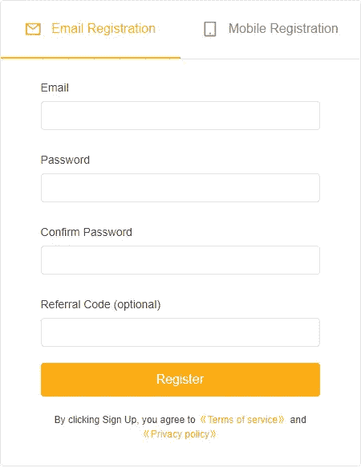

# Bybit 审查-杠杆交易、费用、奖金和测试网

> 原文：<https://medium.com/coinmonks/bybit-exchange-review-dbd570019b71?source=collection_archive---------0----------------------->

在本文中，我们将回顾 2018 年 3 月在英属维尔京群岛推出的加密衍生品交易所 [**Bybit**](https://www.bybit.com/en-US?affiliate_id=13748&group_id=0&group_type=1) 。它拥有一百多万注册用户，专注于有经验的交易者。 [**Bybit**](https://www.bybit.com/en-US?affiliate_id=13748&group_id=0&group_type=1) 使用简单，界面友好。它每秒可以处理 10 万笔交易。Bybit 提供高达 100 倍[杠杆](https://www.investopedia.com/terms/l/leverage.asp)的永续期货。

# 摘要

*   杠杆高达 100 倍的保证金交易。
*   三种类型的订单——市价订单、限价订单和有条件订单。
*   USDT 和反向永久合同。
*   快速安全的存款/取款。
*   使用 SSL 通信、双因素身份验证和高级标记和索引定价系统的强大安全管理。
*   与[最佳交易机器人服务](/coinmonks/crypto-trading-bot-c2ffce8acb2a)整合。
*   ByBit testnet 了解平台如何运作，再投入真正的资金。
*   用户友好且直观的用户体验。
*   Android 和 iOS 上的应用程序可以随时跟踪信息。
*   推荐奖励和从属节目赚取被动收入。
*   保险基金和风险管理互助保险。
*   全天候全面的客户支持。

> 还看:[在美国如何使用 Bybit](https://coincodecap.com/bybit-in-the-usa)？

# **如何创建**[**by bit**](https://www.bybit.com/en-US?affiliate_id=13748&group_id=0&group_type=1)**账户？【Bybit 是如何工作的？**

要创建一个帐户，你必须访问 Bybit 网站**并输入你的电子邮件和密码。您将在注册的电子邮件中收到一个验证码。验证码的有效期为五分钟。一旦您确认，您的帐户将被创建。**

**Bybit 是一个完全匿名的交易所，因此，[了解你的客户(KYC)](https://en.wikipedia.org/wiki/Know_your_customer) 是**而不是**必须的。**

****

**ByBit review: Registration Page**

# **[Bybit](https://www.bybit.com/en-US?affiliate_id=13748&group_id=0&group_type=1)杠杆**

**[Bybit](https://blog.coincodecap.com/go/bybit) 为您提供 100 倍的杠杆作用。你必须提供 1%的保证金作为初始名义金额。开仓后可以调整杠杆，这是很多其他交易所没有的。**

**交易所的每份永久合约价格为 1 美元。 [Bybit](https://www.bybit.com/en-US?affiliate_id=13748&group_id=0&group_type=1) 还提供 [Ripple](https://ripple.com/) 和 [EOS](https://eos.io/) 的[期货合约](https://en.wikipedia.org/wiki/Futures_contract)，杠杆为 25 倍。**

**如果你交易量很大，并进入相当大的位置，杠杆可能会少一些。随着你仓位的增加，你的初始保证金也会增加。您可以在这里查看[风险限额](https://help.bybit.com/hc/en-us/articles/360007213413-Risk-Limit-Levels)。无论合同大小，维持保证金为 0.5%。**

# ****订单类型****

**[Bybit](https://www.bybit.com/en-US/) 提供三种类型的订单。**

1.  ****市价订单:**以现行市价下单。如果是卖出，它们被标为“出价”，如果是买入，它们被标为“问价”。**
2.  ****限价单:**它们被置于远离市场的特定水平。**
3.  ****条件订单:**一旦达到特定水平，它就充当市价订单或限价订单。**

**你必须定义触发价格、杠杆、数量和方向。**

****

**Bybit Orders review**

**订单适用于一定时期，也称为订单寿命。有三种生活秩序-**

1.  ****取消前有效(GTC)——**这些订单在您选择关闭之前一直有效。**
2.  **立即或取消(IOC)——你必须立即以最优惠的价格供货。未填充的部分将被取消。因此允许部分订单执行。因此，存在订单可能无法执行的风险。**
3.  ****填充或删除(FOC)** —这意味着不部分执行，订单将被完全填充或根本不填充。**

# ****Bybit 合同****

**Bybit 提供两种主要类型的永久合约反向合约和 USDT 合约。**

**对 USDT 来说，美元是基础货币，而 [Tether](https://en.wikipedia.org/wiki/Tether_(cryptocurrency)) 是稳定的硬币。抵押品价值为 1 美元，而 Tether 充当基础保证金。 [Bybit](https://blog.coincodecap.com/go/bybit) 提供 BTCUSDT、ETHUSDT、LINKUSDT、XTZUSDT、LTCUSDT。**

**对于反向合约，加密货币充当基础保证金。如果你不是在交易[比特币](https://blog.coincodecap.com/a-candid-explanation-of-bitcoin)，那么它就属于反向永久合约。它们价值 1 美元。Bybit 提供 BTCUSD、ETHUSD、EOSUSD 和 XRPUSD。**

# ****逐位审查:存款****

**您可以使用 [Bybit 菲亚特网关](https://www.bybit.com/en-US/buy-crypto)存放菲亚特并将其转换为 BTC、USDT 和 ETH。您可以输入所需的金额，然后选择您喜欢的服务提供商。交易完成后，您可以在 Bybit 的资产页面查看您的余额。**

**如果你想直接存密码，你必须生成一个钱包地址。您可以在“资产”部分进行同样的操作。一旦你有了地址，你就必须开始交易。完成这一过程需要一些时间。同时，您可以在[区块链浏览器](https://explorer.bitquery.io/)中监控进度。**

****

**ByBit review: Deposits**

# ****逐位取款****

**您必须点击所需资产上的取款按钮，并输入钱包地址。然后，您必须使用双因素身份验证来确认交易。此外，你需要支付矿工费，这是一个小数目。**

**所有的账户都有提款限额，尽管它们并不是非常严格。**

****

**Bybit review: withdrawal limits**

**Bybit 也有每日提款限额，以确保他们的热钱包里有资金。分别是 100 BTC 和 10,000 ETH。如果资金耗尽，你得一点一点地等[从冰冷的钱包里转出来。](https://www.bybit.com/en-US?affiliate_id=13748&group_id=0&group_type=1)**

# ****按位收费****

**每当你在使用加密货币交易所时，你要么充当制造者，要么充当接受者。制造商增加订单的深度，并提供流动性。买家从订单上拿走流动性。**

**市价单总是以接受者的身份执行，而限价单可以是庄家也可以是接受者。市价订单是即时订单，而限价订单不是即时订单。**

**如果你是接受者，你要支付 0.075%，而如果你是制造者，你可以赚取 0.025%的回扣。ByBit 从交易中赚取 0.05%的做市商和收单商费用。**

**现货交易手续费在 0.2%以上。它们比永久合约交易高出 3 到 15 倍。**

**您将通过 Bit 在[支付以下期货合约费用。](https://www.bybit.com/en-US?affiliate_id=13748&group_id=0&group_type=1)**

****

**Bybit fees review**

**融资费，也被称为“隔夜”利率，是在交易者之间直接交换的，而不是通过一点一点的。你要么支付融资费用，要么收到它。**

**您无需为存款付费。提现的同时会收你一笔矿工或者网络费，相对来说比较少。**

**您将不得不为任何现场交换物理密码的资产交换订单支付 5 美元的费用。**

# **ByBit 资助费**

**每日美元和基础利息分别为 0.06%和 0.03%。基金费率区间为三，每八小时一次。目前的利率是 0.01%。融资费的计算方法是头寸价值乘以融资利率。利率的计算方法是美元利息减去基础资产利息，再除以融资利率。**

# ****ByBit 计算器****

**[ByBit](https://www.bybit.com/en-US?affiliate_id=13748&group_id=0&group_type=1) 计算器允许您使用当前账户信息，计算利润、损失、清算和目标价格。你可以使用它轻松管理你的头寸。计算器在网站的右上角。**

****

**ByBit calculator review**

**您可以使用以下公式计算损益，不包括费用—合约数量(1/进场价格—1/出场价格)。**

**此外，您可以将损益百分比计算为(损益/未平仓价值)* 100%未平仓价值:合约数量/进场价格。**

**您可以将投资回报(ROI)计算为资产回报率与头寸中使用的初始保证金的比率。**

# **逐位支付方式**

**Bybit 交换平台接受通过 Visa、电子资金转账、万事达卡等支付或存款。此外，该平台与 Xanpool、MoonPay、Mercury 和 BAnxa 合作，支持通过法定货币进行支付。**

# ****Bybit 交易机器人****

**[3Commas](https://3commas.io/?c=tc252152) 已经与 [Bybit](https://www.bybit.com/en-US?affiliate_id=13748&group_id=0&group_type=1) 整合，提供一个 [ByBit 交易机器人](/coinmonks/crypto-trading-bot-c2ffce8acb2a)，可以通过编程买卖你的加密资产。你可以从最好的投资组合中复制交易策略，或者从简单、做空、复合和复合做空机器人中选择。您只需使用 API 密钥将您的 [Bybit](https://blog.coincodecap.com/go/bybit) 账户链接到 [3Commas](https://3commas.io/?c=tc252152) 交易平台。**

# ****ByBit 测试网****

**[Bybit testnet](http://testnet.bybit.com) 是给那些想在签约前测试平台的人准备的。你可以做模拟账户，检查订单是如何运作的。你可以从测试网[的水龙头](https://en.bitcoin.it/wiki/Testnet#Faucets)中获得演示币。另外，你可以按照这个[指南](https://help.bybit.com/hc/en-us/articles/360010490434-How-to-obtain-BTC-testnet-coins-to-testnet-Bybit-)去了解试玩币的借用。在测试网上，你将获得最少量的比特币，因为它的释放率为每小时 0.01 BTC。**

# ****Bybit 回顾:用户体验****

**Bybit 是一个用户友好的平台，你可以在钱包、账户管理、BTC 和 ETH [期货市场](https://en.wikipedia.org/wiki/Futures_exchange)之间轻松切换。此外，左边是交易图表，中间是订单簿，右边是合同细节。它还提供夜间模式。**

****

**Bybit interface review**

**该界面是完全可定制和模块化的。Bybit 使用 [Tradingview 的制图技术](https://www.tradingview.com/?offer_id=10&aff_id=24152)。因此，如果 ADL 被触发，您可以通过检查您的 ADL 排名和管理您的潜在去杠杆化来管理您的头寸。**

**它们提供了一个强大的订单匹配引擎，每个合同总共执行 1，000，000 笔交易。快速订单执行降低了滑点风险。**

# ****拜比特 App****

**如果你想在旅途中跟踪信息，你应该试试 [Bybit](https://blog.coincodecap.com/go/bybit) App。它们在 Android 和 iOS 平台上都有。也可以扫描二维码，从网站下载 app。它提供了与网站几乎相同的功能。您还可以设置和接收价格水平通知，并可以查看高级订单。大多数情况下，提供应用的交易所不允许这样做，所以这是一个优势。**

**Bybit 移动应用程序提供多种策略警报选项。此外，它还可以帮助您在您选择的组合的资金结算前 30 分钟创建一个关于预测资金利率的提醒。**

**用户通常更喜欢使用桌面应用程序，因为交易图表更精确，并且可以同时监控各种头寸。该应用程序主要在您离开桌面时使用。**

****

**Download ByBit App**

# ****Bybit 推荐奖励****

**如果你喜欢这个平台，你可以通过推荐给你的关系来获得它。您的连接每在 [Bybit](https://www.bybit.com/en-US?affiliate_id=13748&group_id=0&group_type=1) 存入 0.2 BTC，您将获得 10 美元。您可以从您的指示板获取您的推荐代码和链接。您的联系人可以使用您的推荐代码或链接注册。**

****

**Bybit referral review**

**您也可以在您的社交媒体渠道上分享这些链接，并进行无限推荐。此外，您还可以查看您总共推荐了多少人，他们存入的金额，以及您获得的交易奖金。**

****

**ByBit Referral Dashboard review**

# ****ByBit 加盟计划****

**推荐计划对许多交易者来说都很有效，但是如果你认为你可以把你的关系推荐给 [**Bybit**](https://www.bybit.com/register?affiliate_id=13748&group_id=0&group_type=1) ，它进行大量交易，你应该加入 [ByBit 附属计划](https://www.bybit.com/en-US/affiliates)。你可以赚取高达 30 %的交易费佣金和 10 %的代销商佣金。 [Bybit](https://www.bybit.com/en-US?affiliate_id=13748&group_id=0&group_type=1) 也支持结算提现。**

**[**Bybit**](https://www.bybit.com/register?affiliate_id=13748&group_id=0&group_type=1) 提供完全的数据透明，为您提供多维报表。您可以在仪表板中查看您的佣金报告和详细信息。根据您的需求，您可以访问定制的营销材料和营销活动。BD 经理将为您提供一对一的业务支持。**

**如果您正在使用推荐计划，则不能参与附属计划。你必须在它们之间做出选择。**

****

**ByBit review: Affiliate Registration**

# ****比特评论:安全****

**根据 [Mozilla 的天文台测试](https://observatory.mozilla.org/)， [Bybit](https://www.bybit.com/en-US?affiliate_id=13748&group_id=0&group_type=1) 得分 B，相当可观。像任何其他加密交易所一样，它的大部分资金存储在一个多重签名的冷钱包(离线)中，不会被黑客窃取。只有一小部分资金存放在热门钱包里，供客户提取。为了将资金从冷存储转移到热存储， [Bybit](https://blog.coincodecap.com/go/bybit) 使用多签名地址，即需要一个以上的地址来完成交易。**

**整个网站使用 SSL 通信来防止网络钓鱼攻击。他们使用双因素认证。在你从你的账户中提款之前，你必须启用谷歌认证。**

**[Bybit](https://www.bybit.com/en-US?affiliate_id=13748&group_id=0&group_type=1) 使用先进的标记和指数定价系统提供可靠的价格，并保证 99.99%的可用性。**

# ****Bybit 保险基金****

**保险基金充当 [Bybit](https://www.bybit.com/en-US?affiliate_id=13748&group_id=0&group_type=1) 的储备池，保护交易者免受负资产和过度损失。当交易者在破产价格以下被清算时使用，即交易者的初始保证金已经完全耗尽。在自动去杠杆化机制接管局面之前，它为局面提供了掩护。破产价格和交易者清算价格之间的差价来自保险基金。**

# **[**Bybit**](https://www.bybit.com/en-US?affiliate_id=13748&group_id=0&group_type=1) **互保****

**相互保险是一种强大的风险管理工具，可以保护你免受任何不良市场波动的影响。你可以得到全面的保护，免受利润下降和亏损增加的影响。也可以锁定盈利的仓位，减少对波动的恐惧。**

****

**ByBit review: Mutual Insurance**

**你可以通过三种方式获得保险赔偿。**

1.  **当你们的共同保险到期时，你们的损失将由[逐位](https://www.bybit.com/en-US?affiliate_id=13748&group_id=0&group_type=1)自动记入贷方。**
2.  **投保期间随时可以进行人工结算。**
3.  **你也可以在清算时立即得到回报。**

# **[Bybit](http://blog.coincodecap.com/go/bybit) **回顾:客户支持****

**他们提供全天候多语言客户支持。他们在其平台上提供实时聊天功能，有七种不同的语言版本。**

**您也可以通过[support@bybit.com](mailto:support@bybit.com)给他们写信，通过[it@bybit.com](mailto:it@bybit.com)向他们询问相关的技术问题。如有任何与媒体相关的问题，您可以通过[Media@bybit.com](mailto:Media@bybit.com)联系他们。**

**他们还经营一个[电报频道](https://t.me/BybitTradingChat)。如果你认为你的问题可以早点问，你可以查看他们的 [FAQ](https://help.bybit.com/hc/en-us/categories/360000579254-FAQ) 。**

**你也可以给你的[反馈](https://www.bybit.com/en-US/user-feedback)。如果你的建议被采纳，你将获得独家赠品(t 恤、帽衫、贴纸等等)。**

****

**Bybit review: Live chat**

# **[**Bybit**](http://blog.coincodecap.com/go/bybit) 回顾:利弊**

## ****优点:****

1.  **[Bybit](https://www.bybit.com/en-US?affiliate_id=13748&group_id=0&group_type=1) 采用稳健的 100K TPS 匹配引擎。**
2.  **它有一个强大的 API，每 20 毫秒推送一次市场数据。**
3.  **与其他交易所相比，每份合约的规模都较小。**
4.  **与其他平台不同，Bybit 在 EOS 和 Ripple 上提供期货合约。**
5.  **广泛的客户支持。**
6.  **[最佳交易机器人服务](/coinmonks/crypto-trading-bot-c2ffce8acb2a)与 Bybit 整合。**

## ****缺点:****

1.  **这是一个相对较新的平台。**
2.  **该平台的交易对数量有限。**
3.  **美国公民不允许交易。潘**

# **[Bybit](https://www.bybit.com/en-US?affiliate_id=13748&group_id=0&group_type=1) 回顾:结论**

**总之， [**拜比特**](https://www.bybit.com/en-US?affiliate_id=13748&group_id=0&group_type=1) 提供了一个透明、可信、高效的交易平台。它使用强大的技术使整个交易过程安全、顺畅。你可以利用 Bybit 获得 100 倍的利润，同时其保险基金保护交易并弥补损失。此外，它支持法定存款，不需要您的 KYC。Bybit 有很棒的客户支持，你可以随时和他们的团队实时聊天。你也可以使用带有 [**Bybit**](https://www.bybit.com/en-US?affiliate_id=13748&group_id=0&group_type=1) 的交易机器人，帮助你自动化你的交易策略。**

> **还看:[在美国如何使用 Bybit](https://coincodecap.com/bybit-in-the-usa)？**

# ****常见问题解答****

****1。Bybit 位于哪里？****

**[ByBit](https://www.bybit.com/en-US?affiliate_id=13748&group_id=0&group_type=1) 已在英属维尔京群岛注册。总部在新加坡，在香港和台湾设有办事处。**

****2。在美国可以用 Bybit 吗？****

**美国公民不能使用 [ByBit](https://www.bybit.com/en-US?affiliate_id=13748&group_id=0&group_type=1) 。**

****3。Bybit 是如何工作的？****

**加密衍生品交易所 ByBit 可以通过他们的桌面应用程序进入。他们也有支持 Android 和 iOS 的应用程序。**

****4。比特费用是多少？****

**他们使用一种制造商-接受者模式。如果你是一个接受者，你要支付 0.075%，而如果你是一个创造者，你可以赚 0.025%**

****5。如何获得 Bybit 奖金？****

**您可以通过参加 [Bybit](https://www.bybit.com/en-US?affiliate_id=13748&group_id=0&group_type=1) 促销计划赢取奖金。他们提供各种[类别的促销](https://blog.bybit.com/promotions/)。您的奖金会立即存入您的钱包。你不能提取奖金。它们可以用作交易/融资费，弥补你的损失和利润。**

****6。什么是逐位取款时间？****

**您可以在 UTC 时间每天 8:00、16:00 和 24:00 提取三次。**

****7。Bybit 安全吗？****

**它们使用强大的安全工具，并被 Mozilla 的天文台测试评为 B 级。他们使用 SSL 通信、双因素身份验证以及高级标记和索引定价系统。**

> **加入 Coinmonks [电报频道](https://t.me/coincodecap)和 [Youtube 频道](https://www.youtube.com/c/coinmonks/videos)获取每日[加密新闻](http://coincodecap.com/)**

## **另外，阅读**

*   **[复制交易](/coinmonks/top-10-crypto-copy-trading-platforms-for-beginners-d0c37c7d698c) | [加密税务软件](/coinmonks/crypto-tax-software-ed4b4810e338)**
*   **[电网交易](https://coincodecap.com/grid-trading) | [加密硬件钱包](/coinmonks/the-best-cryptocurrency-hardware-wallets-of-2020-e28b1c124069)**
*   **[最佳加密交易所](/coinmonks/crypto-exchange-dd2f9d6f3769) | [印度最佳加密交易所](/coinmonks/bitcoin-exchange-in-india-7f1fe79715c9)**
*   **开发人员的最佳加密 API**
*   **最佳[密码借贷平台](/coinmonks/top-5-crypto-lending-platforms-in-2020-that-you-need-to-know-a1b675cec3fa)**
*   **[杠杆代币](/coinmonks/leveraged-token-3f5257808b22)终极指南**
*   **[最适合加密交易的 VPN](https://coincodecap.com/best-vpns-for-crypto-trading)**
*   **[用于 Huobi 的加密交易信号](https://coincodecap.com/huobi-crypto-trading-signals) | [HitBTC 审查](/coinmonks/hitbtc-review-c5143c5d53c2)**
*   **[TraderWagon 回顾](https://coincodecap.com/traderwagon-review) | [北海巨妖 vs 双子星 vs BitYard](https://coincodecap.com/kraken-vs-gemini-vs-bityard)**
*   **[OKX vs. KuCoin](https://coincodecap.com/okex-kucoin) | [摄氏替代品](https://coincodecap.com/celsius-alternatives) | [如何购买 VeChain](https://coincodecap.com/buy-vechain)**
*   **[3 commas vs . Pionex vs . crypto hopper](https://coincodecap.com/3commas-vs-pionex-vs-cryptohopper)**
*   **[如何使用 Cornix 交易机器人](https://coincodecap.com/cornix-trading-bot)**
*   **[Bitget 回顾](https://coincodecap.com/bitget-review)|[Gemini vs block fi](https://coincodecap.com/gemini-vs-blockfi)cmd |[OKEx 期货交易](https://coincodecap.com/okex-futures-trading)**
*   **用信用卡购买密码的 10 个最佳地点**

****

**Bybit review**