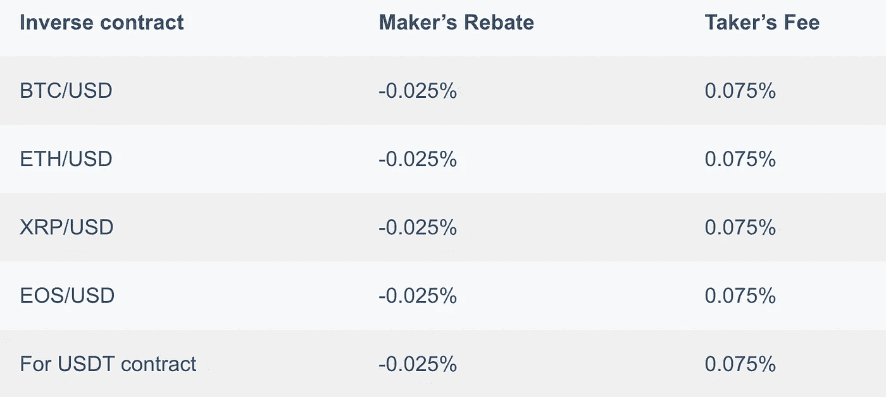

# Bybit 保证金交易指南 2021

> 原文：<https://medium.com/coinmonks/bybit-margin-trading-e5071676244e?source=collection_archive---------1----------------------->

在本文中，我们将讨论在**比特交易所进行的[保证金交易](https://blog.coincodecap.com/margin-trading)。Bybit 以永久合同的形式提供服务。我们将在 [Bybit](https://blog.coincodecap.com/go/bybit) 指导您完成[保证金交易](https://blog.coincodecap.com/go/margin-trading)的步骤，同时解释所有平台功能。**

# **总结(TL；博士)**

*   **[**Bybit**](https://blog.coincodecap.com/go/bybit) 仅提供[保证金交易](https://blog.coincodecap.com/margin-trading)，因此 [Bybit](https://blog.coincodecap.com/go/bybit) 针对其进行了优化。**
*   **你可以用保证金开仓，然后用杠杆增加你的资本。**
*   **Bybit 提供三种合约选择，即**逆永续**、 **USDT 永续**和**逆期货**。**
*   **它是为数不多的同时提供交叉和隔离保证金交易的加密保证金交易所之一。**
*   **有最大 100 倍的杠杆，在跨保证金模式的情况下不可调整。**
*   **该交易所提供许多功能，如条件模式、杠杆滑块、维持保证金、对冲模式等。**
*   **交易所收取高额手续费；然而，他们也支付制造商的回扣。**

# **什么是 Bybit 保证金交易？**

**融资融券交易因其灵活性和低资本高回报而广受欢迎。在 [**Bybit**](https://blog.coincodecap.com/go/bybit) ，你可以利用杠杆将你从融资融券交易中获得的收益倍增。然而，如果市场横盘，你也可能蒙受巨大损失。**

# **Bybit 的保证金交易是如何运作的？**

**在您的 [**Bybit 钱包**](https://blog.coincodecap.com/go/bybit) 中有资金后，您可以进入保证金交易选项卡并做多/做空。在输入您的保证金金额或抵押品，然后设置杠杆，平台会自动提供资金以建立头寸。**

# **合同选项**

**[**Bybit**](https://blog.coincodecap.com/go/bybit) 提供三种不同合约选项的保证金交易:**

## **1.逆永久**

**[**Bybit**](https://blog.coincodecap.com/go/bybit) 提供 BTCUSD、ETHUSD、EOSUSD、XRPUSD 的反向永续合约。BTC 或任何其他资产将是你的基础货币，你需要拥有该资产才能使用逆永续。**

**假设你不拥有瑞士联邦交易所，那么你就不能交易瑞士联邦交易所的永久合约。但是，Bybit 提供了资产交换功能，将您拥有的资产交换为 ETH，然后使用 ETHUSD 永久合同。**

## **2.USDT 永久**

**[**Bybit**](https://blog.coincodecap.com/go/bybit) 提供 BTCUSDT、ETHUSDT、LINKUSDT、BCHUSDT 等 USDT 永久合约。Bybit 保证金交易在 USDT 使用线性合约。USDT 永久合约使用稳定币作为保证金，因此你不需要对冲头寸。**

## **3.反向期货**

**Bybit 最近在 BTCUSD0625 推出了反向期货合约，并很快将推出另一个合约 BTCUSD0924。您可以使用一个 BTC 保证金交易账户进行永久和期货交易。**

****

# **隔离保证金交易**

**[**逐位**](https://blog.coincodecap.com/go/bybit) 的隔离保证金仅将该特定头寸的资金置于风险之中。万一市场横盘，你将不得不增加更多的资金，或者可能需要遭受清算。然而，在清算的情况下，交易所不会从你的原始账户余额中扣除资金。**

# **Bybit 交叉保证金交易**

**[**处的交叉保证金 Bybit**](https://blog.coincodecap.com/go/bybit) 使用所有用户的账户余额来防止清算。如果市场横盘，那么交叉保证金交易的成本会超过你的初始资本。如果交易对的权益低于维持保证金，则进行清算。**

# **Bybit 的杠杆作用**

**[**Bybit**](https://blog.coincodecap.com/go/bybit) 对交叉和隔离保证金交易提供最大 100 倍的杠杆。您可以通过提供的滑块更改单独保证金交易的杠杆；然而，交叉保证金交易有 100 倍的固定杠杆。**

# **蜡烛图**

**[**Bybit**](https://blog.coincodecap.com/go/bybit) 提供了一个可定制的蜡烛图，具有 XABCD、多头、干草叉等特性。您可以使用烛台图表右上角的“设置”按钮轻松自定图表。**

****

# **“融资融券交易”标签的功能**

**Bybit 的 [**的融资融券交易页签上有很多功能，几乎全部如下:**](https://blog.coincodecap.com/go/bybit)**

## **限价订单**

**限价单允许你设置一个限价，当限价达到时，订单就会执行。如果你的需求没有得到市场的满足，这种限制也会导致你的订单永远无法完成。**

## **市场秩序**

**市价订单允许您实时开仓，您的订单以订单簿中的最佳价格执行。你可以用它们进入或退出快速波动的市场。**

****

## **条件指令**

**这些都是预订单，只有当市场达到触发价格时才会满足。当订单要求得到满足时，订单的位置会立即填充。有条件的限价单被置于订单簿中。当市场达到其预设价格时，该限价单将被执行。**

****

## **触发时关闭**

**触发器上的关闭仅在条件订单中可用。即使你没有足够的保证金，这个选项也能保证你的止损单的执行。**

****

## **杠杆滑块**

**[**Bybit**](https://blog.coincodecap.com/go/bybit) 允许您使用隔离保证金选项卡中的杠杆滑块调整杠杆。但是，此功能在“交叉边距”选项卡中不可用。**

****

## **仅邮寄订单**

**仅后订单确保您的限价订单被列入订单簿并获得市场折扣，然后才能成功执行。但是，如果您选择此选项，系统会自动取消可能会在下单时立即执行的限价单。**

****

## **仅减少订单**

**减少-只保证你的仓位不会无意中增加。例如，你在 4800 USDT 有一个止损限制，在 5000 USDT 持有 1000 BTCUSDT 合约。该交易员还将限价设置在 5200 USDT，以获取部分利润。**

**如果市值首先满足 4800 USDT，那么止损限价和 5200 USDT 订单自动取消。**

## **带 TP/ SL 的多头/空头**

**您可以通过做多或做空来下单 TP/ SL 详情。您可以通过输入“获利价格”、“止损价格”并点击相应的复选框来实现。**

****

## **如何一点一点的走下去？**

**通过做多，交易所借给你资金，以较低的价格买入一项资产，然后以较高的价格卖出，将差价作为你的正回报。**

**你可以点击屏幕右侧的买入/做多/绿色按钮做多。**

****

## **如何做空 Bybit？**

**做空意味着交易所借给你资产，你以更高的价格卖出。然后，当资产价格下跌时，你再次买入该资产，并将其返还给交易所。**

**您可以点击屏幕右侧的卖出/做空/红色按钮做空。**

## **相互保险**

**您可以在 [**逐位**](https://blog.coincodecap.com/go/bybit) 购买相互保险来对冲您的损失。您支付给共同保险的金额将反映在您的共同保险基金中。共同保险基金将补偿你遭受的任何损失。**

****

## **维修范围**

**它是您的保证金账户中保持头寸所需的资金总额。BTC 的最佳比例是 0.5%，EOS、ETH 和 XRP 的最佳比例是 1%。在反向合约的情况下，清算价格将略高于 USDT 合约。**

## **计算器**

**通知图标下方有一个小小的计算器图标。您可以输入您喜欢的市场价值，并使用它们来计算利润/损失、目标价格和清算价格。**

****

## **偏好；喜好；优先；参数选择**

**您可以从计算器图标旁边的图标访问首选项。从首选项中，您可以设置交易的弹出选项和风险限额。你也可以在反向期货的单向模式和对冲模式之间选择。**

****

## **单向模式**

**单向模式允许你只在一个方向持有头寸，也就是说，你可以做空或做多。**

## **对冲模式**

**对冲模式允许您同时持有同一 BTCUSDT 期货的多头和空头头寸。你可以通过抵消可能导致交叉保证金模式的多头和空头头寸来永远防止清算。**

# **如何开始使用 Bybit？**

**从 [**Bybit**](https://blog.coincodecap.com/go/bybit) 开始非常简单，你要做的就是按照下面部分的步骤来做:**

## ****创建账户****

**您可以按照以下步骤设置您的保证金交易账户:**

1.  **访问 Bybit[官网](https://www.bybit.com/)点击报名。**
2.  **现在，输入你的电子邮件和密码。**
3.  **通过输入发送到您的电子邮件 id 的代码来确认您的帐户。**
4.  **现在进入设置，启用谷歌认证。如果你不这样做，你将无法提取任何资金。**
5.  **现在登录并存入资金开始保证金交易。**

****

## ****存款资金****

**您可以按照以下步骤将资金存入您的 Bybit 帐户:**

1.  **从“个人资料”下拉图标中单击“我的资产”按钮。**
2.  **现在，在您希望存放的资产上单击“transfer”按钮。**
3.  **扫描二维码或复制钱包地址。**
4.  **交易成功后，资产将在一小时内反映在您的钱包中。**

****

## ****下订单****

**按照以下步骤进行您的第一笔 but 保证金交易:**

1.  **将鼠标悬停在交易上，从反向永续、USDT 永续和反向期货中选择一个。**
2.  **在下一个窗口中，自定义最适合您的所有选项。**
3.  **现在输入下订单所需的详细信息。**
4.  **点击做多/买入做多，点击卖出/做空做空。**
5.  **一旦订单执行，它将出现在屏幕的底部。**

****

## ****撤回资金****

**一旦你从交易中获得一些回报，你可以通过以下步骤提取资金:**

1.  **将鼠标悬停在您的个人资料图标上，然后单击我的资产。**
2.  **现在，单击您希望收回的资产旁边的“收回”按钮。**
3.  **您现在可以输入钱包地址或扫描二维码并完成交易。**

****

# **按位收费**

**[**Bybit**](https://blog.coincodecap.com/go/bybit) 从你的账户余额中扣除交易费用，并且不影响你某一特定头寸的保证金。Bybit 向从订单簿中提取流动性的交易员收取手续费。然而，Bybit 也向增加订单深度的交易商支付制造商回扣。**

**您可以在下表中观察反向和 USDT 合约的制造商回扣和接受者费用:**

****

# **Bybit 保证金交易的风险**

**[保证金交易](https://blog.coincodecap.com/margin-trading)可以帮你用最少的资金获得可观的回报。然而，像硬币一样，它也有两面。如果市场与你的押注相反，你也可能遭受重大损失。以下是关于保证金交易需要考虑的一些风险或要点:**

*   **在 [**逐位**](https://blog.coincodecap.com/go/bybit) 进行的交叉保证金交易只有一个 100 倍的杠杆，这将使你遭受损失的几率增加几倍。**
*   **下了保证金订单后，你不能离开屏幕，因为市场可能会瞬间横盘。**
*   **你使用的杠杆越高，你遭遇清算的几率就越高。**
*   **你应该练习对冲以避免不必要的损失。但是 [**Bybit**](https://blog.coincodecap.com/go/bybit) 只在期货合约中提供套期保值。**

# **逐位保证金交易:利弊**

****

# **Bybit 保证金交易:结论**

**[**Bybit**](https://blog.coincodecap.com/go/bybit) 完全致力于为其用户提供融资融券交易服务。它为所有主要类型的合约提供保证金服务，并收取合理的费用。许多功能对交易者来说可能是救命稻草，同时，对新手来说又让人不知所措。如果你正在寻找简单而强大的保证金交易，那么你应该[试试 Bybit](https://blog.coincodecap.com/go/bybit) 。**

**要了解更多关于交换的信息，请阅读我们对 Bybit 交换的全面回顾。**

# **常见问题**

****by bit 合法吗？****

**Bybit Fintech Ltd .运营 Bybit，是一个合法的交易平台。 [**Bybit**](https://blog.coincodecap.com/go/bybit) 自 2018 年开始提供服务，是业内最好的交易平台之一。截至 2021 年 3 月，该交易所不受任何国家的监管。因此用户不需要完成他们的 KYC。**

****美国公民可以使用 Bybit 吗？****

**由于美国对加密货币的监管法律， [Bybit](https://www.bybit.com/) 不向美国的交易者提供服务。**

**【Bybit 杠杆如何发挥作用？**

**杠杆允许交易者用最少的资金建仓，并成倍增加交易回报。Bybit 提供 100 倍的最大杠杆，你可以使用杠杆滑块轻松定制它，进行单独的保证金交易。**

*   **[2021 年五大加密保证金交易交易所|保证金交易](https://blog.coincodecap.com/crypto-margin-trading-exchanges)**
*   **什么是融资融券交易？保证金交易是如何运作的？【2021】**
*   **[币安保证金交易 2021 |你需要知道的一切](https://blog.coincodecap.com/binance-margin-trading)**
*   **[比特币保证金交易|终极指南【2021】](https://blog.coincodecap.com/bityard-margin-trading)**
*   **[5 家最佳比特币保证金交易交易所【2021】](https://blog.coincodecap.com/bitcoin-margin-trading-exchange)**

> **加入 Coinmonks [Telegram group](https://t.me/joinchat/EPmjKpNYwRMsBI4p) 并了解加密交易和投资**

## **另外，阅读**

*   **[什么是融资融券交易](https://blog.coincodecap.com/margin-trading)**
*   **最好的[密码交易机器人](/coinmonks/crypto-trading-bot-c2ffce8acb2a) | [网格交易](https://blog.coincodecap.com/grid-trading)**
*   **[3 商业评论](/coinmonks/3commas-review-an-excellent-crypto-trading-bot-2020-1313a58bec92) | [Pionex 评论](/coinmonks/pionex-review-exchange-with-crypto-trading-bot-1e459d0191ea) | [Coinrule 评论](/coinmonks/coinrule-review-2021-a-beginner-friendly-crypto-trading-bot-daf0504848ba)**
*   **[AAX 交易所评论](/coinmonks/aax-exchange-review-2021-67c5ea09330c) | [德里比特评论](/coinmonks/deribit-review-options-fees-apis-and-testnet-2ca16c4bbdb2) | [FTX 交易所评论](/coinmonks/ftx-crypto-exchange-review-53664ac1198f)**
*   **[n 零审核](/coinmonks/ngrave-zero-review-c465cf8307fc) | [Phemex 审核](/coinmonks/phemex-review-4cfba0b49e28) | [PrimeXBT 审核](/coinmonks/primexbt-review-88e0815be858)**
*   **[Bybit Exchange 审查](/coinmonks/bybit-exchange-review-dbd570019b71) | [Bityard 审查](/coinmonks/bityard-review-7d104239be35) | [CoinSpot 审查](https://blog.coincodecap.com/coinspot-review)**
*   **[3 commas vs crypto hopper](/coinmonks/3commas-vs-pionex-vs-cryptohopper-best-crypto-bot-6a98d2baa203)|[赚取加密利息](/coinmonks/earn-crypto-interest-b10b810fdda3)**
*   **最好的比特币[硬件钱包](/coinmonks/the-best-cryptocurrency-hardware-wallets-of-2020-e28b1c124069?source=friends_link&sk=324dd9ff8556ab578d71e7ad7658ad7c) | [BitBox02 回顾](/coinmonks/bitbox02-review-your-swiss-bitcoin-hardware-wallet-c36c88fff29)**
*   **[莱杰 vs n rave](/coinmonks/ledger-vs-ngrave-zero-7e40f0c1d694)|[莱杰 nano s vs x](/coinmonks/ledger-nano-s-vs-x-battery-hardware-price-storage-59a6663fe3b0)**
*   **[密码本交易平台](/coinmonks/top-10-crypto-copy-trading-platforms-for-beginners-d0c37c7d698c)**
*   **[CoinLoan 评论](/coinmonks/coinloan-review-18128b9badc4) | [YouHodler 评论](/coinmonks/youhodler-4-easy-ways-to-make-money-98969b9689f2) | [BlockFi 评论](/coinmonks/blockfi-review-53096053c097)**
*   **最好的[加密税务软件](/coinmonks/best-crypto-tax-tool-for-my-money-72d4b430816b) | [硬币追踪评论](/coinmonks/cointracking-review-a-reliable-cryptocurrency-tax-software-5114e3eb5737)**
*   **最佳[加密借贷平台](/coinmonks/top-5-crypto-lending-platforms-in-2020-that-you-need-to-know-a1b675cec3fa) | [杠杆令牌](/coinmonks/leveraged-token-3f5257808b22)**
*   **[block fi vs Celsius](/coinmonks/blockfi-vs-celsius-vs-hodlnaut-8a1cc8c26630)|[Hodlnaut 审查](/coinmonks/hodlnaut-review-best-way-to-hodl-is-to-earn-interest-on-your-bitcoin-6658a8c19edf)**
*   **[Bitsgap 审查](/coinmonks/bitsgap-review-a-crypto-trading-bot-that-makes-easy-money-a5d88a336df2) | [Quadency 审查](/coinmonks/quadency-review-a-crypto-trading-automation-platform-3068eaa374e1) | [Bitbns 审查](/coinmonks/bitbns-review-38256a07e161)**
*   **[埃利帕尔泰坦评论](/coinmonks/ellipal-titan-review-85e9071dd029) | [赛克斯斯通评论](/coinmonks/secux-stone-hardware-wallet-review-15-discount-coupon-2020-7577032faa6e)**
*   **[本地比特币评论](/coinmonks/localbitcoins-review-6cc001c6ed56) | [加密货币储蓄账户](https://blog.coincodecap.com/cryptocurrency-savings-accounts)**
*   **最佳[区块链分析](https://bitquery.io/blog/best-blockchain-analysis-tools-and-software)工具| [赚比特币](/coinmonks/earn-bitcoin-6e8bd3c592d9)**
*   **[加密套利](/coinmonks/crypto-arbitrage-guide-how-to-make-money-as-a-beginner-62bfe5c868f6)指南| [如何做空比特币](/coinmonks/how-to-short-bitcoin-568a2d0b4ae5)**
*   **最佳[加密制图工具](/coinmonks/what-are-the-best-charting-platforms-for-cryptocurrency-trading-85aade584d80) | [最佳加密交易所](/coinmonks/crypto-exchange-dd2f9d6f3769)**
*   **[如何在印度购买比特币？](/coinmonks/buy-bitcoin-in-india-feb50ddfef94) | [瓦济克斯评论](/coinmonks/wazirx-review-5c811b074f5b)**
*   **[印度比特币交易所](/coinmonks/bitcoin-exchange-in-india-7f1fe79715c9) | [比特币储蓄账户](/coinmonks/bitcoin-savings-account-e65b13f92451)**
*   **[CoinDCX 评论](/coinmonks/coindcx-review-8444db3621a2) | [加密保证金交易交易所](https://blog.coincodecap.com/crypto-margin-trading-exchanges)**

> **[直接在您的收件箱中获得最佳软件交易](/coinmonks/newsletters/coinmonks)**

****

***原载于 2021 年 3 月 23 日 https://blog.coincodecap.com***。****