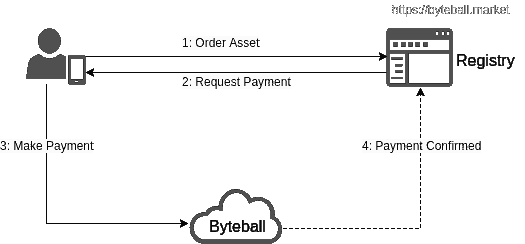
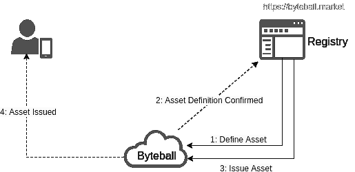
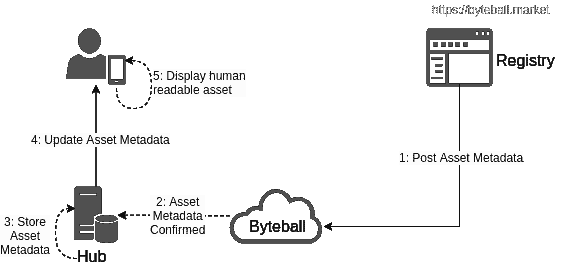

# Byteball 资产注册和发行

> 原文：<https://medium.com/coinmonks/byteball-asset-registration-and-issuance-under-the-hood-c030ea6739ac?source=collection_archive---------0----------------------->

自 live net 推出以来，自定义资产一直是 Byteball 中的一等公民。很少有人知道 blackbytes，一种广泛用于私人支付的货币，是 Byteball 网络中发行的第一种资产。虽然创建新资产需要一些编程技能，但 Byteball Market 让任何人都可以轻松发布定制的 Byteball 资产。

在讨论细节之前，我们先来看看白皮书对资产的描述:

> Byteball 中的资产可以发行、转移和交换，它们的行为类似于本地货币“字节”。它们可以代表任何有价值的东西，例如债务、股票、忠诚度积分、通话时间、商品、其他法定货币或加密货币。

一般来说，资产可以通过某些特征来创建:它们可以是私有的，用不同的名称来定义，或者它们可以在转移时要求连署人或证明等。我们称之为资产定义。当通过 Byteball Market 创建资产时，其中一些功能尚不可用。在编写时，用户可以指定:

*   资产的总资本，以及
*   如果资产是可自动销毁的，这意味着当硬币被送回发行它们的地址时，硬币被“销毁”(烧毁)。

除了资产定义之外，Byteball Market 还允许用户选择将附加元数据与资产相关联，例如小数位、简称、股票代码、描述、发行者名称或联系信息。然而，需要注意的是，这些元数据中的大部分仅存储在字节球市场的数据库中，并且仅显示在字节球市场网站内的资产目录中。

当以少量费用创建资产时，字节球市场代表用户执行许多步骤，因为这些步骤需要在字节球数据库中发布永久和不可变的数据。

*   资产定义:将资产特征发布到字节球 DAG。
*   资产发放:将资产发放到给定的地址。这一步创建硬币、代币、股份、忠诚度积分或资产代表的任何东西。
*   资产元数据发布:将用户提供的信息(如资产名称和关于资产的小数点)发布到字节球 DAG。这一步骤使得中心运营商能够将这些数据广播到连接的钱包，从而显示人类可读的资产名称。请注意，字节球市场只为通过身份验证的发行者提供它。

一旦用户填写了资产订单，流程就从一个支付周期开始:用户必须转移费用，以便开始资产创建步骤。

1.  用户提交填写好的订单。
2.  Byteball Market 生成一个支付地址和一个支付请求二维码/url。
3.  用户通过扫描二维码或点击付款请求 url 进行付款。
4.  字节球市场被通知支付变得稳定。

付款一经确认，字节球市场就开始资产定义和发行步骤:

1.  具有用户定义的 cap 和一些默认特征的资产定义发布在 DAG 中。
2.  字节球市场被通知资产定义变得稳定。
3.  具有完全上限的资产被发放回用户进行支付的同一个钱包。
4.  用户收到他们钱包中的资产。

此时，资产元数据还没有被发布到字节球 DAG，并且资产以其原始格式可见:通过资产散列和没有小数位的 cap 格式化。如果用户决定验证订购资产时提供的发行者的身份，该身份可以是社交媒体别名、真实姓名或公司名称，他们必须联系 Byteball Market，并且可能有资格将资产元数据发布到 DAG。如果身份验证成功，该过程继续如下:

1.  Byteball Market 发布用户在向 DAG 提交订单时提供的元数据。字节球钱包目前使用的最重要的数据是资产名称和小数位数。
2.  字节球中枢被通知资产元数据数据单元在 DAG 中变得稳定。集线器通过监视字节球市场注册地址的帖子来识别资产元数据信息，该地址是用于验证的发行者的资产的 am 6 gtukenbya 54 fydakx 2 vlenfzimxwg。注意，中心必须决定它们信任哪个资产注册中心来接收元数据。字节球市场发布的资产得到了字节球中心 byteball.org/bb,和 byteball.fr/bb.的认可
3.  集线器存储和索引资产元数据，以优化访问。
4.  资产元数据被同步到字节球轻钱包。
5.  资产在用户的钱包中按带小数点的可读名称显示(如果适用)。

有关通过字节球市场注册资产的更多信息，请查看[注册政策](https://docs.google.com/document/d/e/2PACX-1vQnpiwTipnBgrhSJcELOYYAOa3mTLZbmLmOebbtHFJFrfgHtlsNNZ9MPEGafvtuTnVAyfWukwu_hYSB/pub)。要创建自定义字节球资产或浏览现有资产，请访问 [https://byteball.market](https://byteball.market) 。

> [在您的收件箱中直接获得最佳软件交易](https://coincodecap.com/?utm_source=coinmonks)

