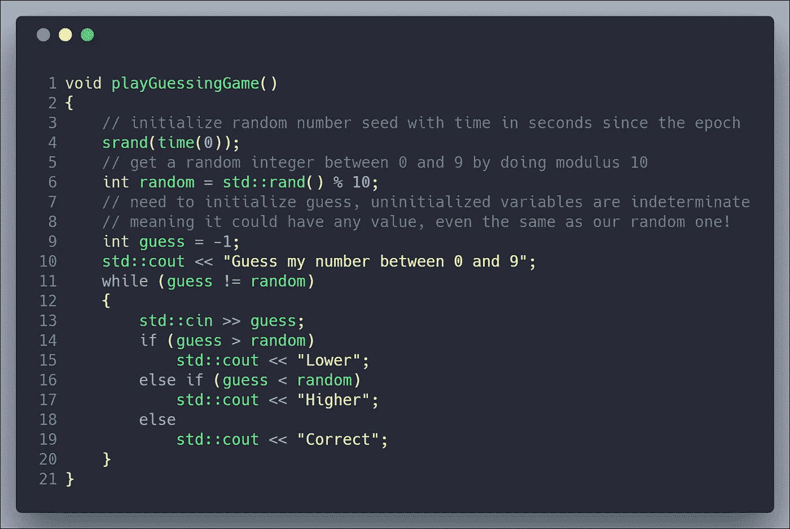

# EOS 开发 C++指南—基础

> 原文：<https://medium.com/coinmonks/c-guide-for-eos-development-basics-37d2596a9688?source=collection_archive---------2----------------------->



> 这篇文章是我的[EOS 开发者 C++指南](https://cmichel.io/categories/learneos)的一部分

1.  [基础知识](https://cmichel.io/cpp-guide-for-eos-development-basics/)
2.  [通过值/引用调用&指针](https://cmichel.io/cpp-guide-for-eos-development-call-by-value-reference/)
3.  类和结构
4.  模板
5.  迭代器
6.  λ表达式
7.  多指数
8.  头文件

## 为什么是 C++？

整个 EOS 区块链基础设施都是用 C++写的。C++是一种低级语言，它让程序员可以很好地控制如何做事和管理资源。其结果是一种非常强大和高性能的语言，在游戏、计算机图形等性能关键的应用程序中，或者在大多数嵌入式系统等资源较少的硬件上被大量使用。然而，将如此多的控制权转移给开发人员也使得它成为最难学习的语言之一。

我们需要学习 C++，因为你的 EOS 智能合约，你的分散式应用程序中位于区块链的部分，也必须用 C++编写。C++代码然后被编译成 WebAssembly。虽然理论上，其他“更容易”的语言可以编译成 WebAssembly(最著名的是 RUST、Python、Solidity)，但 C++是 Block One 唯一官方支持的语言。

> 虽然这些其他语言可能看起来更简单，但它们的性能可能会影响您可以构建的应用程序的规模。我们预计 C++将是开发高性能和安全智能合约的最佳语言，并计划在可预见的未来使用 C++。 [EOS 开发者门户](https://developers.eos.io/eosio-cpp/docs/required-knowledge)

是的，C++很可怕，当你的编程体验主要是通过 JavaScript 这样的高级解释语言时，一开始可能会令人望而生畏——但这里有一个好消息:编写智能合同实际上不需要 C++的大多数功能。这些教程的目的是教你 C++基础知识和高级 C++特性，这些是你在智能契约编程中真正需要的。

让我们花点时间来认识和了解一些有用的[现代 C++特性](https://github.com/AnthonyCalandra/modern-cpp-features)，这些特性是 JavaScript 等高级语言所不具备的。最值得注意的是:

*   静态类型(但是带有自动类型推断)
*   预处理宏
*   显式引用调用、值调用
*   内存指针
*   运算符重载
*   通过模板进行泛型编程
*   `typedef`年代

如果您还不理解这些，请不要担心，我们将从基础开始。

## 基础

我假设您已经熟悉至少一种编程语言，如 JavaScript 或 Python。然后理解像定义变量、`for`循环、`if`条件或调用 C++中的函数这样的基础知识对你来说也不会感到惊讶。让我们来看看语法:

```
// @url: https://repl.it/@MrToph/CPPBasics-1
// In c++ libraries are imported through the #include macro
// iostream comes with functions handling input and output to the console
#include <iostream>
// includes rand function
#include <cstdlib>
// includes time function
#include <ctime>

// this is how to define functions: <return type> <name>(<arguments>)
int compute(int x)
{
    // unsigned means no negative values which increases the range of numbers the variable can hold
    const unsigned int FIVE = 5;
    // FIVE = 3; // would throw an error as FIVE is declared constant
    return x * x + FIVE;
}

// the return type for no return value is called 'void'
void playGuessingGame()
{
    // initialize random number seed with time in seconds since the epoch
    srand(time(0));
    // get a random integer between 0 and 9 by doing modulus 10
    int random = std::rand() % 10;
    // need to initialize guess, uninitialized variables are indeterminate
    // meaning it could have any value, even the same as our random one!
    int guess = -1;
    std::cout << "Guess my number between 0 and 9";
    while (guess != random)
    {
        std::cin >> guess;
        if (guess > random)
            std::cout << "Lower";
        else if (guess < random)
            std::cout << "Higher";
        else
            std::cout << "Correct";
    }
}

// the entry point of your program is a function called main which returns an integer
int main()
{
    std::cout << "Hello! Type in a number\n";

    int number;
    std::cin >> number;

    int computed = compute(number);
    std::cout << "I computed x^2+5 as " << computed << "!\n";

    playGuessingGame();

    return 0;
}
```

整数`short, int, long, long long`有许多基本类型(每种类型都有一个`unsigned`选项来表示非负整数)。它们的区别在于字节数，以及它们所包含的整数范围。这里提到的这些类型**没有指定的大小**，它们的大小**取决于实现**。如果你在一台机器上编译你的程序，一个`int`有 16 位(`sizeof(int) == 2)`，当在另一台机器上编译时，它将有 32 位。这些类型给你的唯一保证是最小字节数。例如，`int`必须至少有 16 位，`long`必须至少有 32 位。

在处理数字时，了解各个类型的确切范围是很有帮助的，尤其是在安全敏感的应用中，如区块链开发，其中上溢/下溢非常重要。为了解决这个问题，C99 增加了新的类型，你可以明确地要求一个特定大小的整数，例如`int16_t`、`int32_t`或无符号的`uint64_t`变量。当编写智能契约时，我们将只使用这些显式的固定大小类型。

注意，类似的固定大小类型对于浮点数来说是不存在的，因为位数并不能告诉你它的精度和范围。在这些情况下，您需要使用`float, double, long double`(前者通常是`32`和`64`位 IEEE-754 浮点类型)。

## 用线串

除了数字类型和布尔`bool`类型，`string`是最常用的数据类型之一。它们通过`<string>`包含在名称空间`std`中。(名称空间是限定变量范围的区域，是解决大型项目中名称冲突的一种方式。)

```
// @url: https://repl.it/@MrToph/CPPBasics-Strings
#include <iostream>
// need to import <string> for strings
#include <string>

int main()
{
  // strings are part of the std namespace
  std::string text = "Hello";
  // + is used for concatenation
  text += " World";
  std::cout << text << "\n";
  // length and size are synonyms
  std::cout << text.length() << " " << text.size() << "\n";

  text = text.substr(0, 5);
  for (int i = 0; i < text.length(); i++)
  {
    std::cout << i << ": " << text[i] << "\n";
  }

  // different way to loop over characters
  for (char c : text)
  {
    std::cout << c << "\n";
  }
  return 0;
}
```

## 数组/向量

C++区分静态和动态数组。*静态数组*是具有**固定大小**的数组，在编译时已知为*。如果您的数组需要能够增长或者大小只有在运行时才知道，那么您需要使用`vector` s。*

```
// @url: https://repl.it/@MrToph/CPPBasics-Vectors
#include <iostream>
#include <vector>

int main()
{
    // arrays are defined with [] after the variable name
    // and can be immediately initialized providing values in { ... }
    int arr[] = {1, 2, 3};
    // can specify size in brackets
    // initializes elements in the list, rest to 0
    int brr[3] = {1, 3};
    for (int x : brr)
    {
        // outputs 1, 3, 0
        std::cout << x << "\n";
    }

    std::vector<int> numbers;
    for (int i = 0; i < 3; i++)
    {
        // add a number to the back
        numbers.emplace_back(i);
    }
    // size and accessing vectors is the same as with arrays
    std::cout << "numbers: " << numbers[0] << numbers.size() << "\n";

    // this inserts a number at the second (index 1) place
    numbers.emplace(numbers.begin() + 1, 9);
    // numbers.begin returns an iterator. More on these later
    for (std::vector<int>::iterator it = numbers.begin(); it != numbers.end(); it++)
    {
        // outputs 1, 3, 0
        std::cout << *it << "\n";
    }
}
```

让我们暂时就此打住。在下一篇教程中，我们将讨论向函数传递参数的不同类型。

[](https://learneos.one#modal)

LearnEOS

最初发布于 [cmichel.io](https://cmichel.io/cpp-guide-for-eos-development-basics/)


> [直接在您的收件箱中获得最佳软件交易](https://coincodecap.com/?utm_source=coinmonks)

[](https://coincodecap.com/?utm_source=coinmonks)