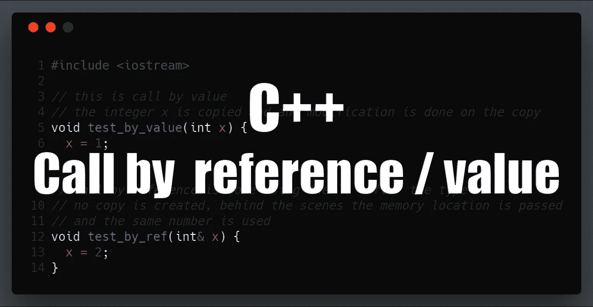

# EOS 开发的 C++指南—通过值/引用调用

> 原文：<https://medium.com/coinmonks/c-guide-for-eos-development-call-by-value-reference-8dd8481f0647?source=collection_archive---------0----------------------->



> 这篇文章是我的[EOS 开发人员 C++指南](https://cmichel.io/categories/learneos)的一部分

1.  [基础知识](https://cmichel.io/cpp-guide-for-eos-development-basics/)
2.  [通过值/引用调用&指针](https://cmichel.io/cpp-guide-for-eos-development-call-by-value-reference/)
3.  类和结构
4.  模板
5.  迭代器
6.  λ表达式
7.  多指数
8.  头文件

## 通过值/引用调用

参数如何传递给函数是 C++中的一个重要概念。对于初学者来说，这通常很难理解，因为在 Java 或 JavaScript 等语言中，您没有这些不同的方法来传递参数。您可以通过值调用**或引用调用**将参数传递给函数。它们之间的区别在于，在按值调用中，实际参数的副本**被创建，被调用的函数在副本上操作。而在引用调用中，参数在内存中的位置(地址)被传递给函数。也就是说，函数将在*相同的、相同的*对象上操作，因此，对象上的任何修改将在函数调用之外持续，因为当函数返回时，这些改变当然不会被恢复。让我们来看一个例子:******

```
#include <iostream>

// this is call by value
// the integer x is copied and any modification is done on the copy 
void test_by_value(int x) {
  x = 1;
}

// call by reference is done using the `&` after the type
// no copy is created, behind the scenes the memory location is passed
// and the same number is used
void test_by_ref(int& x) {
  x = 2;
}

int main() {
  std::cout << "Hello World!\n";
  int number = 0;
  test_by_value(number);
  // outputs 0, number unchaged
  std::cout << "test_by_value " << number << "\n";

  test_by_ref(number);
  // outputs 2(!), number changed
  std::cout << "test_by_ref " << number << "\n";
}
```

注意，无论是通过值传递还是通过引用传递，调用方*的代码都是完全相同的。打电话的人总是刚过`number`。对于引用调用，在函数的参数列表中使用一个符号`&`作为指示符。调用方的不可区分性使得无法推断您的数据是否作为函数副作用的一部分被修改。C++之所以有这两种类型，是因为 C++默认的问题答案:**性能**。创建大对象的副本需要时间，只要重用现有对象就可以避免。您可以通过将参数声明为`const`来禁止修改参数:*

```
int test_by_ref(const int& x) {
  // this raises a compile time error now 
  // x = 2;

  // reading is OK
  return x + 2;
}
```

同样的行为不仅适用于`int`，也适用于所有其他数据类型(`string`、`vector` s)和类对象。

> 使用引用调用是一个很好的实践，因为它通常更有性能，并且不要通过将参数声明为`const`来修改它们

例如，[谷歌 C++风格指南](http://drake.mit.edu/styleguide/cppguide.html#Reference_Arguments)指出:

> 所有通过引用传递的参数都必须标记为 const。

```
In fact, it is a very strong convention in Google code that input arguments are values or const references while output arguments are pointers.
```

我们现在理解了`values`和`const references`，那么让我们来谈谈 Google 所说的*输出参数是指针*是什么意思。

## 两颗北极指极星

指针是存储另一个变量的内存地址的变量。它们在 C 中被大量使用，因为它没有*引用调用*。相反，在 C 中，你定义一个指针变量来存储你的参数的内存位置，然后通过值传递这个指针变量。

让我们看看如何用 C 语言编写我们的`test`函数:

```
int number = 0;

// in C++
void test_by_ref(int& x) {
  x = 2;
}
test_by_ref(number);

// in C
void test_by_pointer(int* px) {
    // remember the value of px is the address of x
    // to get the actual value of x we need to dereference the pointer by using `*` 
  *x = 2;
}

// pointers are defined by <type>*
// you get the address of a variable by using &
int* pnumber = &number;
test_by_pointer(pnumber);
// or without intermediate pointer variable
test_by_pointer(&number);
```

指向`int`变量的指针被定义为`int*`，指向`string`的指针将被定义为`string*`。然而*任何*指针的实际大小都是一样的:`sizeof(int*) == sizeof(string*)`。直观上，指针可以被看作一个 32 位或 64 位的变量，这取决于平台，`unsigned int`变量的**值是另一个变量的内存地址**。

> 那么为什么我们需要指定指针的*类型*(`int*`或`string*`)呢？

好问题。当试图访问指针指向的变量*的值时，类型变得很重要。在我们的例子中，为了从我们的`int* pnumber`指针中获得`number`的值，我们需要**解引用指针**。这是由指针变量上的`*`操作符完成的:`int numberValue = *pnumber`为了知道指针应该读取多少字节，我们需要定义指针*的*类型。*

例如，您可以这样逐字节读取整数变量:

```
uint32_t number = 0x01020304;
// we need to cast it to uint8_t* because &number is of type unit32_t*
// remember the pointers all have the same range as they all store memory addresses
uint8_t* p = (uint8_t*)(&number);
for(int i = 0; i < 4; i++) {
    std::cout << "Byte " << i << ": " << std::to_string(*(p+i)) << "\n";
}
```

如你所见，我们可以对指针进行计算。这叫做**指针算法**。这里，`*(p+i)`是指在`p`的存储单元中向前移动`i`倍指针类型的大小(`sizeof(uint8_t)`)并读取一个`uint8_t`。

> C++里我们还需要指针吗？

尽管在 C++中使用更简单的`references`可以做很多事情，但是你仍然会经常遇到指针，例如，当使用*迭代器*或*输出参数*时。输出参数类似于函数中的`return`值，除了它们作为指针参数传递，然后在函数中修改被引用的对象。让我们来看一个例子:

```
void split(const std::string &name, std::string *first, std::string *last)
{
    std::size_t pos = name.find(" ");
    *first = name.substr(0, pos);
    *last = name.substr(pos + 1);
}
std::string name = "Dan Larimer";
std::string first, last;
split(name, &first, &last);
```

这里的`first`和`last`是指针输出参数，包含`split`函数完成后的计算结果。当您需要返回一个以上的值时，比如在我们的例子中需要返回两个 `string`时，输出参数通常用在真正的返回参数(`string split(...) { ... return <string> }`)上。

> 难道我们不能通过使用引用而不是指针作为输出参数来达到同样的目的吗？

是的，我们可以重写该函数，改为使用*引用*输出参数:

```
void split(const std::string &name, std::string& first, std::string& last)
{
    std::size_t pos = name.find(" ");
    first = name.substr(0, pos);
    last = name.substr(pos + 1);
}
std::string name = "Dan Larimer";
std::string first, last;
split(name, first, last);
```

你喜欢什么由你决定，归结为个人风格。Google C++ Styleguide 更喜欢使用*指针*作为输出参数的一个原因是，它在调用者站点清楚地表明**参数可能会发生变异。**

然而，能够阅读和理解引用和指针是很重要的。

现在，您可能对向函数传递参数的许多不同方式感到困惑。对于初学 C++的开发人员来说，这通常是最大的学习体验，所以不要担心。在某些时候，你会看到共同的，重复的模式。

[](https://learneos.one#modal)

最初发布于 [cmichel.io](https://cmichel.io/cpp-guide-for-eos-development-call-by-value-reference/)


> [在您的收件箱中直接获得最佳软件交易](https://coincodecap.com/?utm_source=coinmonks)

[](https://coincodecap.com/?utm_source=coinmonks)