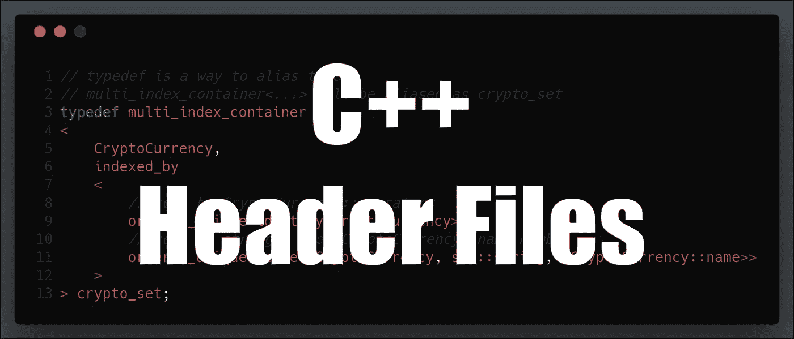

# for EOS 开发指南-头文件

> 原文：<https://medium.com/coinmonks/c-guide-for-eos-development-header-files-9e01e1fb3b51?source=collection_archive---------2----------------------->



> 这篇文章是我为 EOS 开发人员编写的 [C++指南](https://cmichel.io/categories/learneos)的一部分

1.  [基础](https://cmichel.io/cpp-guide-for-eos-development-basics/)
2.  [通过值/引用调用&指针](https://cmichel.io/cpp-guide-for-eos-development-call-by-value-reference/)
3.  [类和结构](https://cmichel.io/cpp-guide-for-eos-development-classes-and-structs/)
4.  [模板](https://cmichel.io/cpp-guide-for-eos-development-templates)
5.  [迭代器&λ表达式](https://cmichel.io/cpp-guide-for-eos-development-iterators-lambda-expressions)
6.  [多指标](https://cmichel.io/cpp-guide-for-eos-development-multi-index)
7.  [头文件](https://cmichel.io/cpp-guide-for-eos-development-header-files)

## 头文件

在 C++中有两种主要的文件类型。源文件(`.cpp`)和头文件(`.hpp`或`.h`)。头文件是您*在编写`#include <vector>`或`#include "./Game.hpp"`时所包含的文件*。

如果你来自 Java、C#等语言。，对您来说*头文件*的概念可能会出现怪异和不必要的情况。但是让我试着激发一下为什么 C++会这样做。

C++将**声明**与**定义**分开。声明*引入*一个标识符并描述其类型。它使标识符为*编译器*所知。

示例有:

```
// extern means exactly this, that the definition is in another file
extern int a;

double square(double d);

class Currency
{
    string name;
    double priceInUSD;

    public:
    Currency(const string &_name, const double price);

    void setName(const string &dogsName);
    void setPrice(double price);
    void print() const;
};
```

> 这个类声明实际上也作为一个定义，但是让我们保持它的简单，以表明这一点。

定义*实例化*标识符。这是*链接器*在编译步骤后组装二进制文件所需要的。示例有初始化变量或*实现*功能:

```
int a;
int b = 5;
void Currency::setPrice(double price)
{
    priceInUSD = price;
}

void Currency::print() const
{
    cout << name << " is at a price of " << priceInUSD << "USD\n";
}

// ...
```

> C++有一个*一个定义规则*:虽然你可以想声明多少次就声明多少次，但是你只能有一个定义。

简单地说:声明说某个标识符存在于某个地方，这个定义给了这个标识符一张脸。

通常，您将**声明放在头文件**中，将**定义放在源文件**中。

为什么 C++将定义和声明分开，而不是像大多数现代语言那样从源文件中自动识别符号，这是因为~~它已经有 30 年的历史了~ ~将声明放在头文件中有几个好处:

*   它提高了编译时间，因为编译器只需要头文件中的*声明*。因此，减少了实现变化的不必要的重新编译。(然而，C++是编译速度最慢的语言之一。)
*   它在结构上将类的接口与实现分开。
*   您可以只通过头文件来构建代码，而不需要访问定义/实现的源代码

你的项目越大，像这样组织你的代码就越好，否则，你的代码可能会变得难以理解。一开始，一个头文件和一个源文件(或者甚至一个既有声明又有定义的源文件)就足够了。

[](https://learneos.one#modal)

最初发表于 [cmichel.io](https://cmichel.io/cpp-guide-for-eos-development-header-files/)

> [直接在您的收件箱中获得最佳软件交易](https://coincodecap.com/?utm_source=coinmonks)

[](https://coincodecap.com/?utm_source=coinmonks)