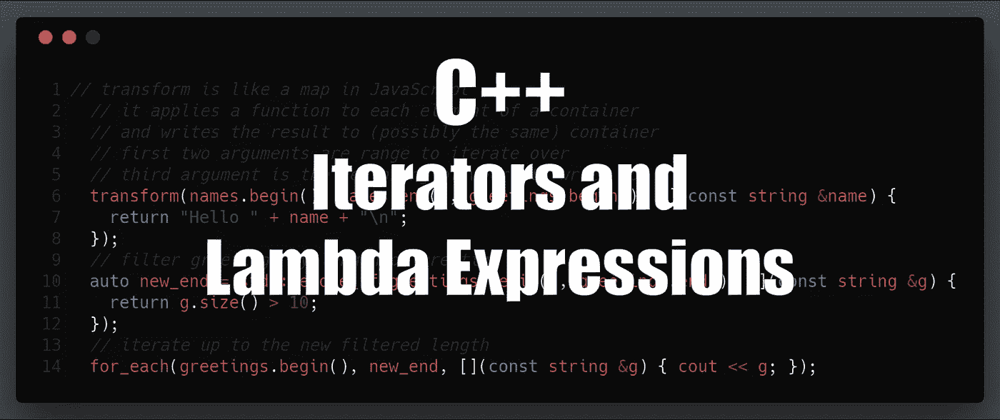
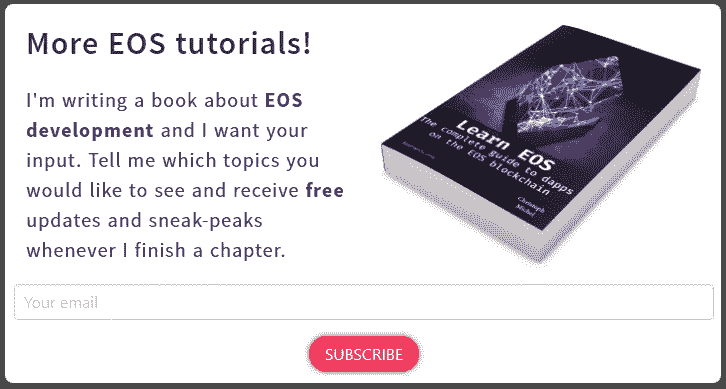

# EOS 开发的 C++指南—迭代器和 Lambda 表达式

> 原文：<https://medium.com/coinmonks/c-guide-for-eos-development-iterators-lambda-expressions-c677d0a99278?source=collection_archive---------5----------------------->



> 这篇文章是我的[EOS 开发人员 C++指南](https://cmichel.io/categories/learneos)的一部分

1.  [基础知识](https://cmichel.io/cpp-guide-for-eos-development-basics/)
2.  [通过值/引用调用&指针](https://cmichel.io/cpp-guide-for-eos-development-call-by-value-reference/)
3.  [类和结构](https://cmichel.io/cpp-guide-for-eos-development-classes-and-structs/)
4.  [模板](https://cmichel.io/cpp-guide-for-eos-development-templates)
5.  [迭代器&λ表达式](https://cmichel.io/cpp-guide-for-eos-development-iterators-lambda-expressions)
6.  多指数
7.  头文件

## 迭代器

让我们来谈谈迭代器，这是一个非常有用的工具，在 EOS 代码库中被大量使用。如果您来自 JavaScript 背景，您可能已经熟悉迭代器，就像它们用在`for of`循环中一样。迭代器的关键概念是提供一种更好的方式来遍历一组条目。额外的好处是，您可以为任何自定义类实现*迭代器接口*，使迭代器成为遍历数据的通用方式。

```
// @url: https://repl.it/@MrToph/CPPBasics-Iterators
#include <iostream>
#include <vector>

using namespace std;

int main()
{
  vector<int> v{2, 3, 5, 8};
  // old way to iterate
  for (int i = 0; i < v.size(); i++)
  {
    cout << v[i] << "\n";
  }

  // using Iterators
  // begin() returns an iterator that points to the beginning of the vector
  // end() points to the end, can be compared using != operator
  // iterators are incremented by using the + operator thanks to operator-overloading
  for (vector<int>::iterator i = v.begin(); i != v.end(); i++)
  {
    // iterators are dereferenced by * like pointers
    // returns the element the iterator is currently pointing to
    cout << *i << "\n";
  }

  // auto keyword allows you to not write the type yourself
  // instead C++ infers it from the return type of v.begin
  for (auto i = v.begin(); i != v.end(); i++)
  {
    cout << *i << "\n";
  }

  // can use arithmetic to "jump" to certain elements
  int thirdElement = *(v.begin() + 2);
  cout << "Third: " << thirdElement << "\n";
  // end is the iterator that points to the "past-the-end" element
  // The past-the-end element is the theoretical element that would follow the last element in the vector.
  // It does not point to any element, and thus shall not be dereferenced.
  int lastElement = *(v.end() - 1);
  cout << "Last: " << lastElement << "\n";

  // do not go out of bounds by iterating past the end() iterator
  // the behavior is undefined
  // BAD: v.end() + 1, v.begin() + 10
}
```

在现代 C++中，迭代器是迭代元素集合(`vector` s，`list` s，`map` s)的首选方式。此外，`auto`关键字让你不用输入冗长的类型，但是可能会导致代码表达能力下降。

## λ表达式

有了迭代器，我们可以开始研究现代 C++的函数式编程概念。标准库中的许多函数将由两个迭代器(开始和结束)和一个**匿名函数** (lambda 函数)表示的一系列元素作为参数。然后，这个匿名函数被应用于该范围内的每个元素。它们被称为匿名函数，因为它们没有绑定到变量，而是作为内联参数传递给高阶函数的短逻辑块。通常，它们对于它们被传递到的函数是唯一的，因此不需要有一个名字(匿名)的全部开销。

有了它，我们可以实现排序、映射、过滤等类似的结构。用 JavaScript 这样的语言很容易做到:

```
[1,2,3,4].map(x => x*x).filter(x => x % 2 === 1).sort((a,b) => b - a)
```

C++中的代码没有这么简洁，但结构是一样的。许多来自`std`库的函数式编程助手在*半开*区间上操作，这意味着包括下限，排除上限。

```
// @url: https://repl.it/@MrToph/CPPBasics-Lambdas
#include <iostream>
#include <vector>
// for sort, map, etc.
#include <algorithm>

using namespace std;

int main()
{
  vector<int> v{2, 1, 4, 3, 6, 5};
  // first two arguments are the range
  // v.begin() is included up until v.end() (excluded)
  // sorts ascending
  sort(v.begin(), v.end());

  // in C++, functions like sort mutate the container (in contrast to immutability and returning new arrays in other languages)
  for (auto i = v.begin(); i != v.end(); i++)
  {
    cout << *i << "\n";
  }

  // sort it again in descending order
  // third argument is a lambda function which is used as the comparison for the sort
  sort(v.begin(), v.end(), [](int a, int b) { return a > b; });

  // functional for_each, can also use auto for type
  for_each(v.begin(), v.end(), [](int a) { cout << a << "\n"; });

  vector<string> names{"Alice", "Bob", "Eve"};
  vector<string> greetings(names.size());

  // transform is like a map in JavaScript
  // it applies a function to each element of a container
  // and writes the result to (possibly the same) container
  // first two arguments are range to iterate over
  // third argument is the beginning of where to write to
  transform(names.begin(), names.end(), greetings.begin(), [](const string &name) {
    return "Hello " + name + "\n";
  });
  // filter greetings by length of greeting
  auto new_end = std::remove_if(greetings.begin(), greetings.end(), [](const string &g) {
    return g.size() > 10;
  });
  // iterate up to the new filtered length
  for_each(greetings.begin(), new_end, [](const string &g) { cout << g; });
  // alternatively, really erase the filtered out elements from vector
  // so greetings.end() is the same as new_end
  // greetings.erase(new_end, greetings.end());

  // let's find Bob
  string search_name = "Bob";
  // we can use the search_name variable defined outside of the lambda scope
  // notice the [&] instead of [] which means that we want to do "variable capturing"
  // i.e. make all local variables available to use in the lambda function
  auto bob = find_if(names.begin(), names.end(), [&](const string &name) {
    return name == search_name;
  });
  // find_if returns an iterator referncing the found object or the past-the-end iterator if nothing was found
  if (bob != names.end())
    cout << "Found name " << *bob << "\n";
}
```

在 C++中，匿名函数的语法是需要习惯的。它们由括号指定，后跟一个参数列表，就像 so `[](int a, int b) -> bool {return a > b; }`。注意，`-> bool`指定了一个布尔返回值。通常，您可以避免表达返回类型，因为它可以从函数体中的返回类型推断出来。

如果你想使用定义在 lambda 函数范围之外的变量，你需要做*变量捕获*。也有可能通过*引用*或*值*将参数传递给你的函数。

*   要通过引用传递，您需要以`&`字符开始您的 lambda(就像在函数中使用引用时一样):`[&]`
*   为了传递值，可以使用`=`字符:`[=]`

也有可能*混搭*通过价值和引用捕获。
例如，`[=, &foo]`将为除`foo`之外的所有变量创建副本，而`foo`是通过引用捕获的。

这有助于理解使用 lambdas 时幕后发生的事情:

> 原来 lambdas 的实现方式是通过创建一个小类；这个类重载了操作符()，因此它的行为就像一个函数。lambda 函数是该类的一个实例；构造类时，周围环境中的任何变量都被传递到 lambda 函数类的构造函数中，并保存为成员变量。事实上，这有点像已经存在的函子的概念。C++11 的好处是这样做变得非常简单——所以你可以一直使用它，而不是只在极少数情况下编写一个全新的类才有意义。[编程 Lambda 函数](https://www.cprogramming.com/c++11/c++11-lambda-closures.html)

Lambda 函数在 EOS 智能合约中被大量使用，因为它们提供了一种用少量代码修改数据的非常方便的方法。标准库中有更多函数的工作方式与我们已经看到的`sort, transform, remove_if`和`find_if`类似。它们都是通过`<algorithm>`头导出的。

[](https://learneos.one#modal)

最初发布于 [cmichel.io](https://cmichel.io/cpp-guide-for-eos-development-iterators-lambda-expressions/)


> [在您的收件箱中直接获得最佳软件交易](https://coincodecap.com/?utm_source=coinmonks)

[](https://coincodecap.com/?utm_source=coinmonks)