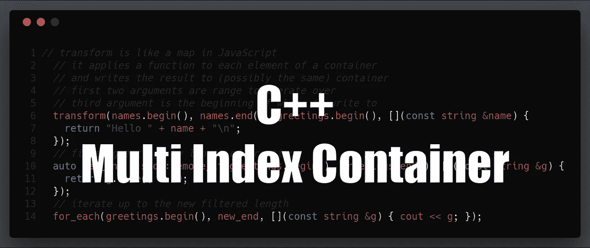

# EOS 开发的 C++指南——多索引容器

> 原文：<https://medium.com/coinmonks/c-guide-for-eos-development-multi-index-container-82ccfc21bad6?source=collection_archive---------1----------------------->



> 这篇文章是我的[EOS 开发人员 C++指南](https://cmichel.io/categories/learneos)的一部分

1.  [基础知识](https://cmichel.io/cpp-guide-for-eos-development-basics/)
2.  [通过值/引用调用&指针](https://cmichel.io/cpp-guide-for-eos-development-call-by-value-reference/)
3.  [类和结构](https://cmichel.io/cpp-guide-for-eos-development-classes-and-structs/)
4.  [模板](https://cmichel.io/cpp-guide-for-eos-development-templates)
5.  [迭代器&λ表达式](https://cmichel.io/cpp-guide-for-eos-development-iterators-lambda-expressions)
6.  [多指标](https://cmichel.io/cpp-guide-for-eos-development-multi-index)
7.  头文件

## 多指数

我们将讨论的最后一个重要话题是*多索引*。标准库附带了许多*容器*，如`vector` s(动态数组)`list` s(双向链表)`set` s 或`map` s。虽然它们都服务于存储和访问元素的相同目的，但它们中的每一个都以不同的方式实现这一目的，从而导致基本操作的不同*运行时*——例如，`set`以排序的方式维护其元素，而`list`不产生随机访问，而是允许您在恒定时间内在任何位置插入元素，而无需重新分配。它们都提供了一个*单一的*特定的方式来访问你的元素，但是有时我们希望有多个接口来访问相同的数据。

我们来看一个`CryptoCurrency`类:

```
#include <iostream>
#include <set>
#include <string>
#include <algorithm>

using namespace std;

class CryptoCurrency {
    public:
    string name;
    uint64_t market_cap;
    double priceInUSD;
    CryptoCurrency(const string &name, uint64_t market_cap, double priceInUSD) : name(name), market_cap(market_cap), priceInUSD(priceInUSD) {}

    // define comparison < operator to compare cryptos by market_cap 
    bool operator<(const CryptoCurrency& c) const {
        return market_cap < c.market_cap;
    }
};

int main()
{
    // store some crypto currencies in a set
    set<CryptoCurrency> cryptos;
    cryptos.insert(CryptoCurrency("EOS", 1000, 1.0));
    cryptos.insert(CryptoCurrency("Bitcoin", 2000, 10.0));
    cryptos.insert(CryptoCurrency("Ethereum", 500, 2.0));

    // sets order their elements, in our case according to market_cap
    // iterating the currencies in ascending order
    for_each(cryptos.begin(), cryptos.end(), [](const CryptoCurrency& c) {
        cout << c.name << " " << c.market_cap << "\n";
    });
}
```

集合是一种很好的方式来保持加密货币按单个*索引*排序，在我们的例子中就是`market_cap`。但是，如果您需要一个按字母顺序排列的货币列表，会发生什么呢？

一种方法是保存一组指向由`name`字段排序的`set`元素的指针。然而，有一种更简单的方法:我们需要的是一种为相同的数据元素定义多个索引的方法。

这正是来自 *boost* 库的`multi_index_container` s 的概念。

> Boost 库是一个在实践中被高度使用的外部库，因为它解决了 C++标准库中没有的广泛的常见任务，附带了很好的文档和教程，并且是开源的和经过同行评审的。(您也可以在编写智能合同时使用它！)

```
"The obvious solution for most programmers is to use a library that provides an elegant and efficient platform independent to needed services. Examples are BOOST..." — Bjarne Stroustrup
```

让我们来看看如何让我们的类与`multi_index_container` s:

```
#include <iostream>
#include <set>
#include <string>
#include <algorithm>
#include <boost/multi_index_container.hpp>
#include <boost/multi_index/ordered_index.hpp>
#include <boost/multi_index/identity.hpp>
#include <boost/multi_index/member.hpp>

using namespace std;
using namespace boost; // for multi_index_container
// for indexed_by, ordered_unique, member, identity
using namespace boost::multi_index;

class CryptoCurrency
{
  public:
    string name;
    uint64_t market_cap;
    double priceInUSD;
    CryptoCurrency(const string &name, uint64_t market_cap, double priceInUSD) : name(name), market_cap(market_cap), priceInUSD(priceInUSD) {}

    // define comparison < operator to compare cryptos by market_cap
    bool operator<(const CryptoCurrency &c) const
    {
        return market_cap < c.market_cap;
    }
};

// typedef is a way to alias types
// multi_index_container<...> will be aliased as crypto_set
typedef multi_index_container
<
    CryptoCurrency,
    indexed_by
    <
        // sort by CryptoCurrency::operator<
        ordered_unique<identity<CryptoCurrency>>,
        // sort by string's < on CryptoCurrency::name member
        ordered_unique<member<CryptoCurrency, std::string, &CryptoCurrency::name>>
    >
> crypto_set;

int main()
{
    // use the typedef'd multi_index_container
    crypto_set cryptos;
    cryptos.insert(CryptoCurrency("Eos", 1000, 1.0));
    cryptos.insert(CryptoCurrency("Bitcoin", 2000, 10.0));
    cryptos.insert(CryptoCurrency("Ethereum", 500, 2.0));

    // interface through the first index by market_cap
    // market_cap_index is now an iterator having .begin() and .end()
    // make sure to not forget the '&' after ::type or use auto
    const crypto_set::nth_index<0>::type &market_cap_index = cryptos.get<0>();
    for_each(market_cap_index.begin(), market_cap_index.end(), [](const CryptoCurrency &c) {
        cout << c.name << " " << c.market_cap << "\n";
    });

    // alternatively you can omit the .get<0>().begin() and call .begin() directly
    // not providing .get<index> always returns the first index
    // so we don't even need to change the old code for sorting by market_cap!
    for_each(cryptos.begin(), cryptos.end(), [](const CryptoCurrency &c) {
        cout << c.name << " " << c.market_cap << "\n";
    });

    // now interface through the _second_ index by name
    // const crypto_set::nth_index<1>::type& name_index = cryptos.get<1>();
    const auto &name_index = cryptos.get<1>();
    for_each(name_index.begin(), name_index.end(), [](const CryptoCurrency &c) {
        cout << c.name << " " << c.market_cap << "\n";
    });
}
```

有比`ordered_unique`或`ordered_non_unique`更多的索引类型(对于非唯一类成员)。虽然这两个提供了类似于将`CryptoCurrency`存储为`std::set`的接口，但是`sequenced<>`索引提供了类似于`std::list`的双向接口。当您希望保持插入元素时的原始顺序时，顺序索引非常有用。如果你需要进入一个特定的位置，比如一个`std::vector`，有一个`random_access<>`索引。

当我们通过智能合约在 EOS 区块链中存储和检索数据表时，我们将重新访问。可以想象，拥有多个接口来排序和搜索数据库表中的元素是非常有用的。

如果你想了解更多，boost.org 有一个详尽的教程。

[](https://learneos.one#modal)

最初发布于 [cmichel.io](https://cmichel.io/cpp-guide-for-eos-development-multi-index/)

> [直接在您的收件箱中获得最佳软件交易](https://coincodecap.com/?utm_source=coinmonks)

[](https://coincodecap.com/?utm_source=coinmonks)