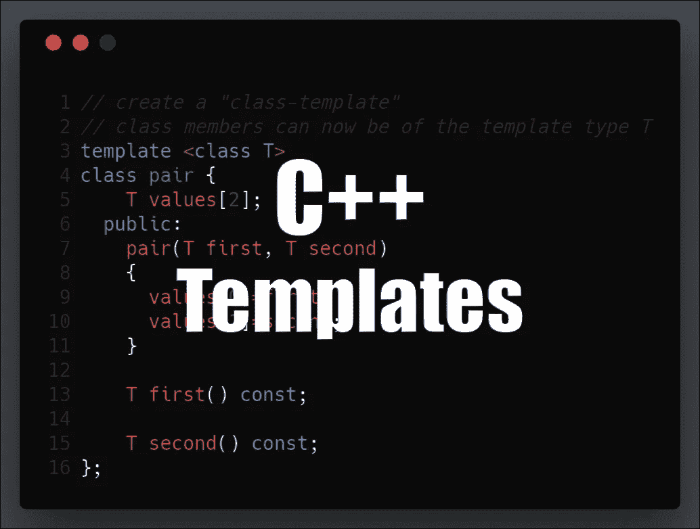

# EOS 开发的 C++指南—模板

> 原文：<https://medium.com/coinmonks/c-guide-for-eos-development-templates-cce17156eaf?source=collection_archive---------0----------------------->



> 这篇文章是我的[EOS 开发者 C++指南](https://cmichel.io/categories/learneos)的一部分

1.  [基础知识](https://cmichel.io/cpp-guide-for-eos-development-basics/)
2.  [通过值/引用调用&指针](https://cmichel.io/cpp-guide-for-eos-development-call-by-value-reference/)
3.  [类和结构](https://cmichel.io/cpp-guide-for-eos-development-classes-and-structs/)
4.  [模板](https://cmichel.io/cpp-guide-for-eos-development-templates)
5.  迭代器
6.  λ表达式
7.  多指数
8.  头文件

## 模板

拥有静态类型的语言有很多好处，因为可以在编译时通过类型检查来捕捉错误。然而，当编写函数或类时，它也引入了开销，因为它们需要为某种类型编写。如果你正在写一个库，并且不知道你的库将如何被使用，该怎么办？如果你想支持更多的类型，你必须重复你自己并重载这个函数。

```
int max(int a, int b) {
    return a > b ? a : b;
}
max(5, 3); // works
max(5.0, 3.0) // does not work as these are _double_s and not _int_s.
```

您需要为`double` s 定义另一个函数:

```
double max(double a, double b) {
    return a > b ? a : b;
}
```

如你所见，函数体*和*在两种情况下完全相同。重要的是该类型实现了比较运算符`>`。

对于这些用例，C++提供了类型`template`，你可以使用通用类型来代替特定类型。这允许您创建其功能可以适用于多种类型或类的函数或类，而无需为每种类型重复整个代码。

```
// @url: https://repl.it/@MrToph/CPPBasics-Templates
#include <iostream>

// create a "function-template" with template type T
// T can now be used as any other type like int
template<class T>
T max(T a, T b)
{
  return a > b ? a : b;
}

// create a "class-template"
// class members can now be of the template type T
template <class T>
class pair {
    T values[2];
  public:
    pair(T first, T second)
    {
      values[0]=first;
      values[1]=second;
    }

    T first() const;

    T second() const;
};

// must use template<class T> syntax here again
template <class T>
T pair<T>::first() const {
  return values[0];
}

template <class T>
T pair<T>::second() const {
  return values[1];
}

int main()
{
    int iMax = max(3, 5);
    double dMax = max(3.0, 5.0);
    // class template instantiations are done
    // by passing the type in angle brackets
    pair<int> p(3, 5);
    std::cout << max(p.first(), p.second());
}
```

幕后发生的事情和我们之前手工做的事情是一样的。作为静态类型，代码被分析，并且对模板函数的任何*调用*的类型可以被解析。然后，编译器为使用的每个特定类型实例化一个函数。

[](https://learneos.one#modal)

最初发布于 [cmichel.io](https://cmichel.io/cpp-guide-for-eos-development-templates/)


> [直接在您的收件箱中获得最佳软件交易](https://coincodecap.com/?utm_source=coinmonks)

[](https://coincodecap.com/?utm_source=coinmonks)