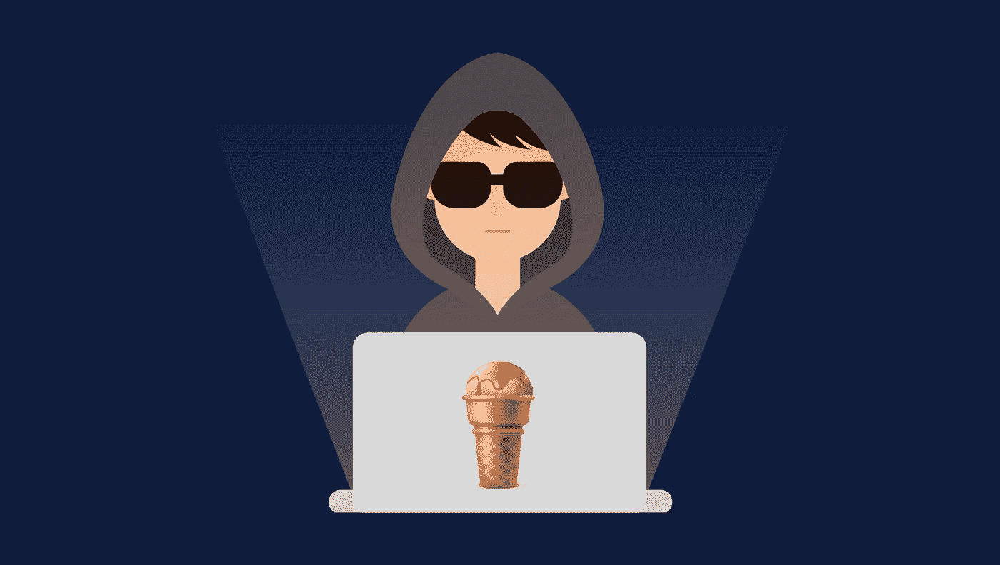
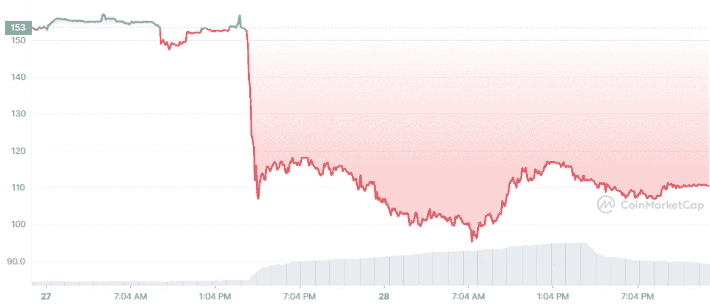
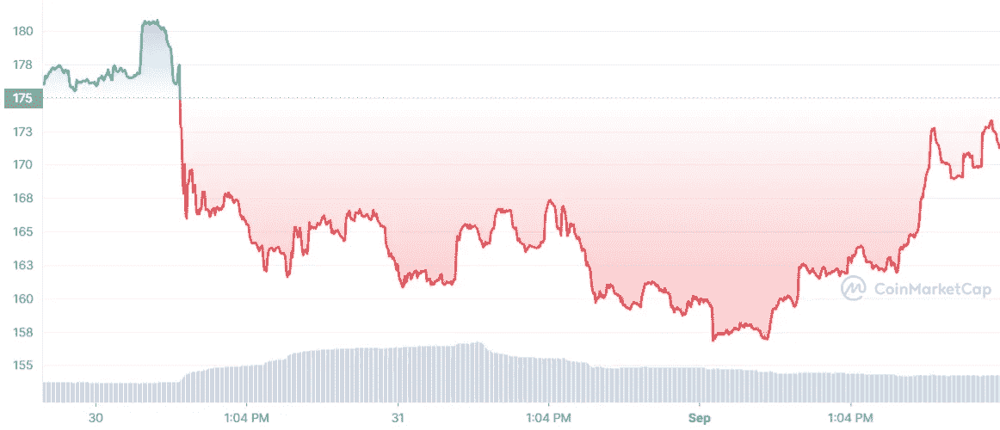

# C.R.E.A.M 金融的第三次入侵。1.3 亿美元的抢劫。

> 原文：<https://medium.com/coinmonks/c-r-e-a-m-finances-third-hack-130-million-heist-61b98b13ffb7?source=collection_archive---------8----------------------->

DeFi 黑客的新闻对于加密用户和 DeFi 领域的 degens 来说并不陌生。或者让我说，DeFi hacks 的新闻对 C.R.E.A.M finance 及其用户来说并不陌生。

10 月 27 日，DeFi 贷款协议遭遇了今年的第三次攻击，距离第二次攻击仅约两个月。黑客通过利用协议中 AMP 合同实现方式的漏洞，从协议库中窃取了大约 1.3 亿美元。今年早些时候的攻击使 DeFi 平台在 2 月份损失了 3700 万美元，在 8 月份损失了 2900 万美元。这使得黑客攻击在短短 10 个月内造成的总损失达到 1.96 亿美元。

C.R.E.A.M Finance 并不是唯一被黑客利用的 DeFi 协议。8 月，6 亿美元从 Poly 网络被盗，但在黑客和该组织达成协议后，大部分资金被归还。

根据安全公司 AtlasVPN 的一份报告，2021 年，DeFi 生态系统中的黑客攻击占所有主要黑客攻击的近 76%。迄今为止，已有超过 4.74 亿美元被盗。

# 奶油的柜台移动

有意义的第一步是找出问题的根源。在[渴望金融](https://gov.yearn.finance/)和社区中其他贡献者的帮助下，被利用的漏洞在大约 6 个小时内被识别和修补。

下一步是追踪黑客的地址并将其冻结，尽管黑客已将资金转移到其他账户，使资金更难被追回。[无损](https://lossless.cash/)，一个 DeFi hack 缓解工具也许能够提供一个解决方案。

# 对奶油令牌的影响

像所有其他有新闻价值的事件一样，黑客攻击对奶油券的价格产生了直接影响。代币从周三的 152 美元跌至周四的 95.21 美元。

source: Coinmarketcap

在 8 月 30 日的黑客攻击后，令牌的价格在 24 小时内从 180 美元跌至 156 美元，但在 9 月 1 日迅速回升至 172 美元。(我知道你在想什么。购买警报？！)

# 结论

我们仍处于 DeFi 的早期阶段，这不会是最后一次 DeFi 攻击，因为在发现和创新新的方法来构建协议并保护它们免受外部攻击方面，还有很多工作要做。黑客在帮助生态系统在几年内发展成为 DeFi 的过程中发挥了重要作用。干杯。

如果你想要一些免费的$奶油，点击[这里](https://www.notion.so/free-CREAM-2befd11b52594c10ba96d8988968116c)

> 加入 Coinmonks [电报频道](https://t.me/coincodecap)和 [Youtube 频道](https://www.youtube.com/c/coinmonks/videos)了解加密交易和投资

## 也阅读

 [## 最佳加密交易所| 2021 年十大加密货币交易所

### ICON _ PLACEHOLDEREstimated 预计阅读时间:28 分钟加密货币交易所的加密交易需要知识…

blog.coincodecap.com](https://blog.coincodecap.com/crypto-exchange)  [## 2021 年 10 大最佳加密贷款平台| CoinCodeCap

### 当谈到加密货币贷款时，大量因素等同于良好的收入状况。此外，借款的一部分…

blog.coincodecap.com](https://blog.coincodecap.com/crypto-lending)  [## 2021 年最佳免费加密交易机器人

### 2021 年币安、比特币基地、库币和其他密码交易所的最佳密码交易机器人。四进制，位间隙…

medium.com](/coinmonks/crypto-trading-bot-c2ffce8acb2a)  [## 最佳 4 个加密交易信号电报通道

### 这是乏味的找到正确的加密交易信号提供商。因此，在本文中，我们将讨论最好的…

medium.com](/coinmonks/best-crypto-signals-telegram-5785cdbc4b2b)  [## BlockFi 评论 2021:利弊和利率| CoinCodeCap

### 今天，我们提出了一个全面的 BlockFi 评论，这是一个成立于 2017 年的加密贷款平台，拥有其…

blog.coincodecap.com](https://blog.coincodecap.com/blockfi-review)  [## 如何在印度购买比特币？2021 年购买比特币的 7 款最佳应用[手机版]

### 如何使用移动应用程序购买比特币印度

medium.com](/coinmonks/buy-bitcoin-in-india-feb50ddfef94)  [## 加密税务软件——五大最佳比特币税务计算器[2021]

### 不管你是刚接触加密还是已经在这个领域呆了一段时间，你都需要交税。

medium.com](/coinmonks/best-crypto-tax-tool-for-my-money-72d4b430816b)  [## 存储比特币的最佳加密硬件钱包[2021] | CoinCodeCap

### 保管您的数字资产很容易，但找到正确的存储方式却是一项繁琐的任务。在线钱包有一个风险…

blog.coincodecap.com](https://blog.coincodecap.com/best-hardware-wallet-bitcoin)