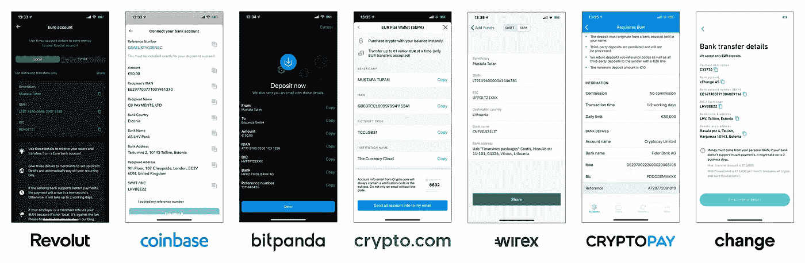
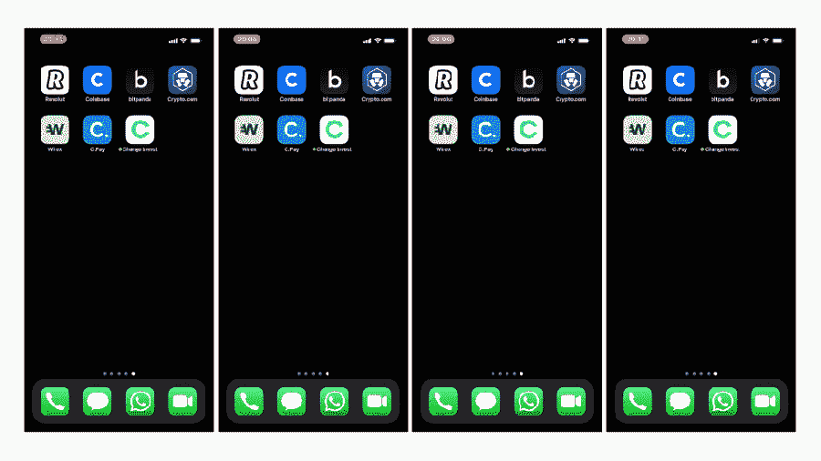

# 欧洲终极加密代理应用程序比较

> 原文：<https://medium.com/coinmonks/c3838021667b?source=collection_archive---------0----------------------->

## revolut vs Crypto.com vs 比特币基地 vs bit panda vs Wirex vs Cryptopay vs Change Invest

Revolut vs Coinbase vs Bitpanda vs Crypto.com vs Wirex vs Cryptopay vs Change Invest

嗨，

我叫穆斯塔法，是一名软件工程师。我住在爱沙尼亚的塔林，在 Change Invest 工作，这是一个在欧洲可用的加密*(很快还有股票)*投资和交易应用程序。

我想亲自测试我们竞争对手的应用程序，并分享我的发现。任何居住在欧洲的人，只要有一台 Android 或 iOS 设备，几欧元 *(Bitpanda 的最低存款€25，Cryptopay 的€10，其他人没有最低存款)*加上一点费用缓冲，就可以完全复制这项测试。我在 Change 工作的事实不会改变测试的结果，但为了清楚起见，我想清楚地说明我的参与。请自行重复测试。🙂

## 我如何选择测试对象？

有许多可用的加密平台，但为了公平比较，在本次测试中，仅包括具备以下条件的公司:

1.  **仅限加密经纪人，不包括交易所🏦** 表示没有北海巨妖、币安或其他交易所。只有经纪人应用程序，你可以直接购买和出售一个确定的价格。
2.  **移动优先📱** 有许多优秀的网络和桌面应用经纪服务，但在本次测试中，我们只关注移动应用。
3.  **支持 SEPA 存款**💶SEPA 转账在整个欧洲都是免费、安全、方便的*(而且通常是即时的)*这对于经纪用户来说是一个重要的价值支柱。最初，我也选择了 Aximetria 和 Crypterium，但它们不支持 SEPA。
4.  **适用于欧洲🇪🇺** 仅适用于欧洲公民和居民的应用程序。有些仅面向欧洲，有些也提供全球服务。

# 第一步。使€50 SEPA 存款💶

我开始在每个应用程序中存入 50€ SEPA。所有存款都是在同一天 15 分钟内完成的。每个应用程序都有自己的银行账户，有些会给你一个唯一的参考代码，你需要添加作为支付的描述。

SEPA deposit screens of the apps

存款处理速度取决于您的银行和应用程序的银行。我在爱沙尼亚用 LHV。

🥇以下存款是即时的:**革命**，**比特币基地**，**改变投资**。

🥈第二天账户中有以下存款:**Crypto.com**、 **Wirex** 、 **Cryptopay** 。

🥉只有给 **Bitpanda** 的存款花了一天多。

# 第二步。用 50🛒€的全部余额购买了比特币

Buying €50 of Bitcoin with on **Revolut, Coinbase, Bitpanda** and **Change Invest**

# 第三步。立即卖掉我买的东西🎰

我立刻卖掉了我买的所有东西。以下是我剩下的最后余额:

**7。比特币基地:** €45.50 (-€4.50)
**6。革命:** €47.47 (-€2.53)
**5。wirex:**€47.76(-€2.24)
**4。加密支付:** €47.75 (-€2.25)
🥉**比特熊猫:** €48.29 (-€1.71)
🥈**crypto . com:**€49.71(-€0.29)
🥇**改变投资:** €49.75 (-€0.25)

请注意，一些应用程序对菲亚特*(和加密)*取款收费，所以如果你想取钱，你可能会剩下更少的钱。

例如，Cryptopay 和比特币基地分别为 SEPA 取款支付了 9 美分和 15 美分。Revolut、Bitpanda 和 Change Invest 不收取提现费用。

# 结论

我们可以看到，拥有知名品牌和庞大营销预算的大型企业依靠自己的声誉，申请更高的费用和更低的费率。

像 Revolut 这样的新银行仍然是密码行业的新手，但由于其著名的品牌和大量银行/支付产品用户的交叉销售，其定价也很低。

Wirex、Cryptopay、Cryptopay 和 Change Invest 被称为 Cryptopay 和 Change Invest 的比特币基地替代品，具有竞争性价格。

> **最后的结果是，在欧盟购买比特币的热潮中，Change Invest 给了你最多的钱。**

如果你不相信，最好的方法就是亲眼看看。[获取 app](https://www.changeinvest.com/app) 并试用，没有开户或维护费用。

## 另外，阅读

*   最好的[密码交易机器人](/coinmonks/crypto-trading-bot-c2ffce8acb2a)
*   [密码本交易平台](/coinmonks/top-10-crypto-copy-trading-platforms-for-beginners-d0c37c7d698c)
*   最好的[加密税务软件](/coinmonks/best-crypto-tax-tool-for-my-money-72d4b430816b)
*   [最佳加密交易平台](/coinmonks/the-best-crypto-trading-platforms-in-2020-the-definitive-guide-updated-c72f8b874555)
*   最佳[加密贷款平台](/coinmonks/top-5-crypto-lending-platforms-in-2020-that-you-need-to-know-a1b675cec3fa)
*   [最佳区块链分析工具](https://bitquery.io/blog/best-blockchain-analysis-tools-and-software)
*   [加密套利](/coinmonks/crypto-arbitrage-guide-how-to-make-money-as-a-beginner-62bfe5c868f6)指南:新手如何赚钱
*   最佳[加密制图工具](/coinmonks/what-are-the-best-charting-platforms-for-cryptocurrency-trading-85aade584d80)
*   [莱杰 vs 特雷佐](/coinmonks/ledger-vs-trezor-best-hardware-wallet-to-secure-cryptocurrency-22c7a3fd391e)
*   了解比特币的[最佳书籍有哪些？](/coinmonks/what-are-the-best-books-to-learn-bitcoin-409aeb9aff4b)
*   [3 商业评论](/coinmonks/3commas-review-an-excellent-crypto-trading-bot-2020-1313a58bec92)
*   [AAX 交易所评论](/coinmonks/aax-exchange-review-2021-67c5ea09330c) |推荐代码、交易费用、利弊
*   [Deribit 审查](/coinmonks/deribit-review-options-fees-apis-and-testnet-2ca16c4bbdb2) |选项、费用、API 和 Testnet
*   [FTX 密码交易所评论](/coinmonks/ftx-crypto-exchange-review-53664ac1198f)
*   [n 零审核](/coinmonks/ngrave-zero-review-c465cf8307fc)
*   [Bybit 交换审查](/coinmonks/bybit-exchange-review-dbd570019b71)
*   [3Commas vs Cryptohopper](/coinmonks/cryptohopper-vs-3commas-vs-shrimpy-a2c16095b8fe)
*   最好的比特币[硬件钱包](/coinmonks/the-best-cryptocurrency-hardware-wallets-of-2020-e28b1c124069?source=friends_link&sk=324dd9ff8556ab578d71e7ad7658ad7c)
*   最佳 [monero 钱包](https://blog.coincodecap.com/best-monero-wallets)
*   [莱杰纳诺 s vs x](https://blog.coincodecap.com/ledger-nano-s-vs-x)
*   [bits gap vs 3 commas vs quad ency](https://blog.coincodecap.com/bitsgap-3commas-quadency)
*   [莱杰纳米 S vs 特雷佐 one vs 特雷佐 T vs 莱杰纳米 X](https://blog.coincodecap.com/ledger-nano-s-vs-trezor-one-ledger-nano-x-trezor-t)
*   [block fi vs Celsius](/coinmonks/blockfi-vs-celsius-vs-hodlnaut-8a1cc8c26630)vs Hodlnaut
*   Bitsgap 评论——一个轻松赚钱的加密交易机器人
*   为专业人士设计的加密交易机器人
*   [PrimeXBT 审查](/coinmonks/primexbt-review-88e0815be858) |杠杆交易、费用和交易
*   [埃利帕尔泰坦评论](/coinmonks/ellipal-titan-review-85e9071dd029)
*   [赛克斯·斯通评论](https://blog.coincodecap.com/secux-stone-hardware-wallet-review)
*   [BlockFi 评论](/coinmonks/blockfi-review-53096053c097) |从您的密码中赚取高达 8.6%的利息