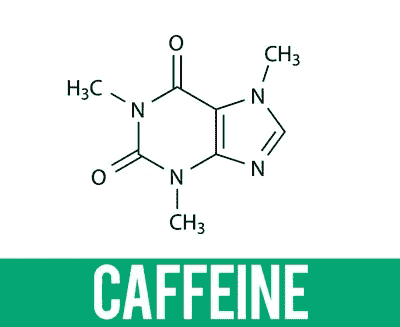

# 以太坊的咖啡因:赋予 DApps 力量的 NodeJS 神谕

> 原文：<https://medium.com/coinmonks/caffeine-for-ethereum-the-nodejs-oracle-987b8db13a5c?source=collection_archive---------2----------------------->

一段时间以前，我不得不写一份基于以太坊的合同，作为信托。该信托的所有者能够向该合同发送乙醚，然后该合同本身在每月 15 日将一些乙醚转移到会员的钱包中。转移给每个成员的乙醚量基于成员资格的长度和当前的美元汇率。

设计这样一个信托基金是可行的，但我经常对稳健的本质感到绝望。这就是为什么我决定在 Solidity 中实现一种开发智能合同的更智能的方式。我将向您展示如何以更智能的方式实现这种信任——用更少的代码、更少的压力和合同本身更多的自主权。

# 首先，看看令人痛苦的“今天是怎么做的”代码

开发一个基于以太坊的契约可能会变得相当耗时，因为以太坊自己的编程语言的可靠性有些奇怪和有限。这就是为什么用 Solidity 写的智能合约大部分都很简单，业务逻辑都在外面实现。

[Daniel Joszef](/@daniel.jozsef) 在 2018 年写了一篇关于此事的漂亮的[帖子](/@daniel.jozsef/on-the-evm-solidity-ivy-and-giving-idiocy-a-platform-8b133982d9c2):

> 可靠之所以成为如此热门的现象，是因为它让人们*相信*他们可以编写以太坊代码。毕竟，智能契约并不复杂(考虑到平台的限制，它*不能*太复杂)…但是，这与一种远非显而易见的语言结构相结合(你知道 Solidity 有*指针*吗，甚至更糟的是，[指针*算法*](/cryptronics/storage-allocation-exploits-in-ethereum-smart-contracts-16c2aa312743) ？)，还有一百万加一的方法搞砸。

现在让我们回到我不久前开发的简单信托:有一个所有者和一些信托成员。你需要在每个月 15 日根据当前的瑞士法郎对美元的汇率支付一些钱。

整个合同开始时非常简单:

在`function NewMembership`中，第一拳击中了你的开发者的肝脏:今天是几号？我只想知道当前的年份和月份，但是计算这些值需要我在互联网上搜索解决方案。幸运的是，我发现了 P [iper Merriam](https://github.com/pipermerriam) 早在 2017 年完成的一项伟大的 [216 行固化代码](https://github.com/pipermerriam/ethereum-datetime/blob/master/contracts/DateTime.sol)工作。

既然坚固性本身无法调用外界(*是的！在区块链*之外还有另一个世界。作为一名开发者，你需要离开区块链以太坊来获得 ETH 对美元的汇率。oracle 是查找和验证这些信息的代理。Oraclize 是 Solidity 开发人员使用最多的 oracle，开发非常简单:

**总结**:

*   我们有 287 行通过编译器检查的可靠性代码
*   我们已经花了很多时间来测试松露，混合等。—检查
*   我们有日期的解决方案—检查
*   我们得到了瑞士法郎对美元的汇率——核对
*   我们已经花了 0.001923 瑞士法郎的煤气费——检查
*   我们有一个聪明的合同，在每个月的 15 号支付一些钱— **等等**

合同不能在每月 15 日生效。我们需要另一个区块链以外的解决方案，它必须确保在每 15 日调用合同… **这一切都让我不高兴**。这就是为什么我决定在 Solidity 中寻找一种更智能的方式来编写智能合同。

# 介绍在 Solidity 中编写智能合同的更智能方式

我是以太坊的超级粉丝。稳健是可以的——但不是很好。实现真实世界的业务逻辑非常耗时，有时甚至是不可能的。我相信，如果智能合约中实现了更多真实的业务逻辑，那么我们都将挖掘以太坊作为加密平台的全部潜力。

我喜欢 NodeJS 和 JavaScript。每当我写复杂的可靠性代码时，我都会问自己“*为什么会这么复杂？在 JavaScript 中，这将非常容易……*”

例如，找出离下个月的 15 号还有多少天:

或者计算信托成员资格的持续时间，然后询问北海巨妖关于当前的 ETH 对美元的汇率，最后计算关于成员资格持续时间的信托支付值:

但那是 NodeJS 代码。不能用在实处？不，除非有先知。根本没有。直到 2018 年 11 月我决定实施一个。我称之为 [CaptainJS' #ScriptIt](https://github.com/CaptainJavaScript) ，它允许你将 NodeJS 代码直接集成到 Solidity 中，编译整个代码，并将业务逻辑和数据存储到以太坊区块链中。

结果是，结合 NodeJS 代码和 Solidity 不仅增加了 Solidity 的潜力，还大大减少了您的开发和测试时间。

**现在让我们用 Solidity 和 NodeJS 代码编写相同的 trust】。这样的合同一定是`usingCaptainJS`。然后整个魔术就可以开始了:**

差异从`constructor`开始。在`constructor`中，我们将强制合约在下个月的 15 号自动回调。因此，一旦我们部署了它，它会自动调用自己。不需要外部调用。您可以向信任发送以太网，向信任添加成员(外部)。但是信托会自己执行它的商业逻辑:

在`function DaysUntilNext15th`中，你用一个`string`嵌入 NodeJS 代码。然后你调用`usingCaptainJS`的`Run`方法，用一个惟一的 Id 传递代码来标识你的回调，并通知 NodeJS 容器加载模块`moment`。

当这个 JavaScript 代码在 NodeJS 容器中执行时，如果没有错误，#ScriptIt oracle 将调用`function CaptainsResult`。剩下的代码流是

*   如果今天是 15 号，那么调用`function Payout`
*   否则在下个月 15 日收回该合同(用`function CallbackOn15th`

通过调用`RingShipsBell`来调用回调请求，这导致了`function RingRing`的#ScriptIt 回调。

**总结**:

*   我们有 82 行通过编译器检查的可靠性代码(包括 NodeJS 代码)
*   在将 NodeJS 代码嵌入 Solidity 之前，我们花了一些时间在本地测试它，并用 Truffle、Remix 等做了一些简短的测试。—检查
*   我们有日期的解决方案—检查
*   我们得到了瑞士法郎对美元的汇率——核对
*   我们已经花了 0.001462 瑞士法郎的煤气费——检查
*   我们有一份精明的合同，每月 15 日支付一些钱——没错

更新@[https://twitter.com/captainjs_v2](https://twitter.com/captainjs_v2)

坚固性代码@[https://github.com/CaptainJavaScript/Solidity](https://github.com/CaptainJavaScript/Solidity)

新旧学校代码@[https://github . com/captain JavaScript/Solidity/tree/master/trust example](https://github.com/CaptainJavaScript/Solidity/tree/master/TrustExample)

> [直接在您的收件箱中获得最佳软件交易](https://coincodecap.com/?utm_source=coinmonks)

