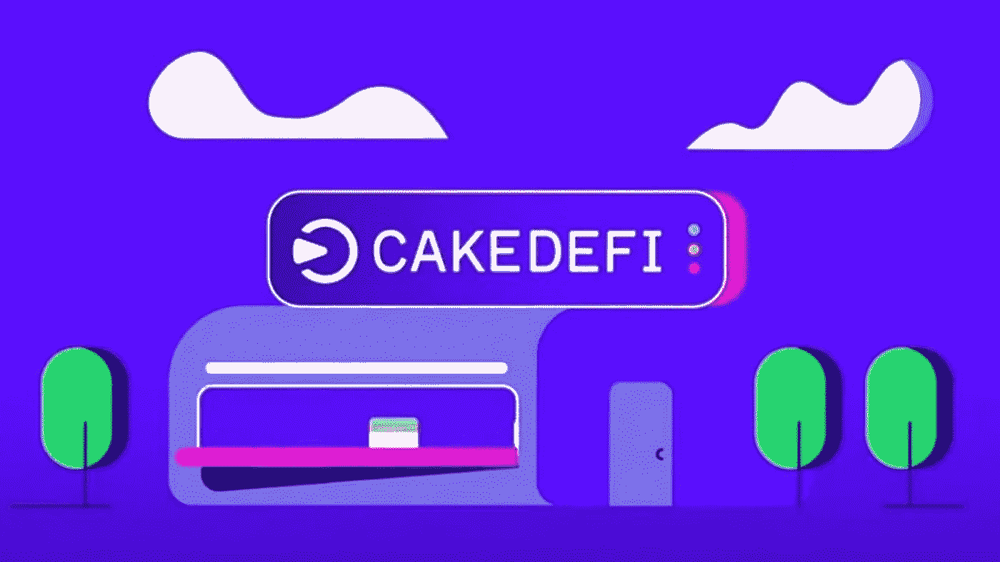

# 蛋糕定义审查:把你的密码工作或它的风险？

> 原文：<https://medium.com/coinmonks/cake-defi-review-put-your-crypto-to-work-or-is-it-to-risk-4eb5df972271?source=collection_archive---------7----------------------->

## 一个必读的投资前，你的蛋糕定义加密…

在骑墙观望了 7 个月后，我决定进入兔子洞，但不是没有做彻底的研究和风险分析。

这篇评论是这项研究的成果，我希望它也能帮助你做出明智的决定，理解投资[蛋糕 DeFi](https://pool.cakedefi.com/#?ref=306386) 的风险。

我的重点主要是蛋糕 DeFi 业务，这有助于它产生广告中所说的高 APYs 和 APRs。看看它有多现实和可持续。

在我们深入到这篇评论的细节之前，让我们快速地看一下蛋糕定义的利与弊。

# 蛋糕定义利弊

# 赞成的意见

*   他们有自己的区块链，这告诉我他们是来建造和居住的。
*   该平台由一家正式注册的公司支持，由知名且可证实的人创建。
*   提高透明度并努力达到标准。
*   提供诱人的年度利润和多种收入机会。
*   可持续的商业模式。仔细观察就会发现，他们的回报和奖金是合理的、可持续的。
*   Cake DeFi 维持着一个名为“秘密曲奇储存(SCS)”的紧急保险基金，以保护用户的资金免受任何潜在的未来由黑客攻击、利用等引起的损失。

# 骗局

*   他们的营销系统可能开始健全，并类似于庞氏骗局和 HYIPs 所使用的。
*   众所周知，这位创始人以前曾参与过一些有争议的项目。
*   为了赚取他们广告的高 APYs，你必须投资他们的硬币，并参与锁定。
*   Cake DeFi 并非在所有司法管辖区都可用。您将需要检查平台是否支持您的国家。
*   APY 的基础贷款低于行业标准。
*   与类似的平台不同，你不能在蛋糕上借钱。
*   支持数量非常有限的硬币。

# 什么是蛋糕定义

[Cake DeFi](https://pool.cakedefi.com/#?ref=306386) 是一个集中式(托管式)加密货币平台，使用户能够存放他们的密码，并通过借贷、流动性挖掘、赌注和其他投资机会获得高 APY 回报。

该平台支付 5%到 100%的 APY，取决于你参与的投资项目(赌注、贷款、流动性挖掘等)和你存入的加密货币。

Cake DeFi 归 Cake Pte Ltd 所有，该公司总部位于新加坡，注册号为 201918368M。

该公司自称是新加坡金融科技协会(SFA)和新加坡加密货币和区块链企业及初创企业协会(ACCESS)的成员。

在 SFA 网站上简单的[搜索就能证明这个事实是真的(+1)。](https://directory.singaporefintech.org/directory/listing/cake-defi)

# 蛋糕定义团队

Cake DeFi 由 [Julian Hosp](https://twitter.com/julianhosp) (CEO)和 [U-Zyn Chua](https://twitter.com/uzyn) (CTO)于 2019 年初共同创立。

Julian 是一名专业医学博士、多才多艺的作家、连续创业者，也是国际公认的区块链和加密货币专家。

他之前共同创立了 Lyonness 和 TenX(之前为 OneBit)，这两家公司都是围绕他的名字的负面影响的主要贡献者。

然而，他没有被指控任何刑事犯罪。这意味着大多数指控只是宣传或无法证实的事实。

在共同创立 Cake DeFi 之前，U-Zyn 是 Zynesis 的区块链工程师和首席顾问。

Zynesis 是区块链的一家咨询公司，专门设计分散式系统和应用程序。

此外，他还是 NextID 的技术顾问和 Sparrow Exchange 的区块链建筑师。

# Cake DeFi 是如何工作的？

在你对 Cake DeFi 做任何事情之前，你需要首先[注册](https://pool.cakedefi.com/#?ref=306386)，完成 KYC 验证，并存入你认为合适的金额。

当您第一次存款 50 美元或以上时，您将立即获得 50 美元的 DFI 硬币欢迎奖金。

这项欢迎红利将锁定 6 个月，在此期间，它也将为您产生利息。

你可以在 6 个月期满后提取红利，或者留在那里继续为你赚取利息。

我想他们不希望人们只是注册，领取欢迎奖金，然后带着钱跑，这就是为什么他们把它锁了 6 个月。

有趣的是，锁定奖金为你赢得了利息，我认为这是一个公平的游戏。

注册时请务必使用[这个推荐链接](https://pool.cakedefi.com/#?ref=306386)或代码 **306386** 。否则，您将只能获得 20 美元，而不是 50 美元的欢迎奖金。

注册并存款后，您就可以开始使用 3 种 [Cake DeFi](https://pool.cakedefi.com/#?ref=306386) 投资产品中的任何一种或全部并从中获利:

# 1.蛋糕上的流动性挖掘

Cake DeFi 使用户能够将支持的加密货币对存入其共享的流动性挖掘池，以获得高 APR 奖励(高达 92%)。

这些奖励来自这些池中的交易活动在 [DeFi Chain DEX](https://defichain.com/dex/) 和 DFI 大宗奖励中产生的交易费。

## 1.1 流动性挖掘如何作用于蛋糕 DeFi？

截至今天，2021 年 8 月 9 日，Cake DeFi 上有 7 个流动性矿池供您挖掘。

这些学校包括 BTC、瑞士联邦理工学院、USDT、LTC、BCH、DOGE 和 USDC，都与 DFI 结对。

要开始采矿，你需要投入等量的两种硬币。

例如，如果你想投资 1,000 ETH，你需要将这笔钱分成 500 ETH 和 500 DEFI。

不要担心你有 1000 美元。Cake DeFi 将自动将您的一半 ETH 交换到 DFI，然后两者都添加到 ETH-DFI 流动性池中。

你的回报将在你提供流动资金后的 12 到 24 小时内开始进入你的账户。

## 1.2 我对蛋糕 DeFi 流动性挖掘的思考

我看到的蛋糕 DeFi 流动性挖掘计划的唯一缺点是，它只支持 DFI 池。

这意味着，如果你选择为 Cake DeFi 提供流动性，你就是在自动投资 DFI(不管你喜不喜欢)。

这将是很酷的有其他池不涉及 DFI，我想会随着 DeFi 链指数的增长。

然而，当我在他们的 Telegram 组中询问他们是否计划在未来支持非 DFI 池时，管理员说“没有这方面的消息…

这告诉我，其他池永远不会出现，或者最多会在非常遥远的将来出现。

此外，这些池中的高 APR 大部分来自 DFI 大宗回报，而不是来自 DeFi Chain DEX 的交易活动。

因此，人们很容易对 DeFi 链的发展状况产生错误的想法。

APYs 和 DFI 一起被支撑着，给人一种繁荣的假象。

# 2.在蛋糕上下注

蛋糕定义支持 DFI 和破折号硬币的赌注，实时赚取高额 APY 奖励(高达 104.4%)。

当你用 Cake DeFi 来下注你的硬币时，你会得到赌注股份，这更像是你存入赌注池的收据。

每个池可以容纳的股份有一个最大数量。

一旦股份数用完，就不能再存款，除非现有用户提取存款。

赌注奖励每 12 小时支付一次，如果你愿意，可以选择提取。

您还可以设置系统，自动将您的奖励进行再投资，以增加您的收入，加快您的投资组合增长。

## 2.1 蛋糕除渣之我见

他们的赌注商业模式在我看来是合法的。

他们为押注 DASH coin 支付 5.4%的 APY，而经营 Dash Masternode 的收入为 7.01%。

在我看来，他们本国硬币上超过 100%的 APY 看起来完全正常。据我所知，这无疑是适度和可持续的回报。

我真的没有什么可抱怨的。除此之外，也许他们应该试着包含更多的 Masternode 硬币，给用户更多的选择和机会。

# 3.蛋糕上的贷款

蛋糕 DeFi 让你把你的密码工作，通过贷款担保 APY 从 3.5%到 8%。

截至今天，该平台支持 4 种不同硬币的借贷，BTC，瑞士联邦理工学院，USDC 和 USDT。

蛋糕上的贷款 DeFi 是分批组织的。

每周(周五)开始新一批，每批持续 28 天或 4 周。

在这 4 周内，您的资金将被锁定(您不能提取)，以产生预期的 APY。

4 周后，你有 3 个选择:

*   选择自动滚转(自动复利)您的原始资本和所有应计利息到下一批，并继续赚取。
*   只提取你赚取的利息，并将原始资本进行再投资。
*   收回你的原始资本和赚取的利息，停止赚取。

每批贷款都有一定数量的硬币上限。

一旦达到这个限额，将不再接受更多的资金，您将不得不等到净批次开放存款。

然而，如果你资金雄厚，并且想投资超过某一特定批次的总规模，你可以联系团队讨论条款。

与其他 CeFi 平台不同，Cake DeFi 不向您收取任何贷款服务或平台费用。

相反，该公司称其收入直接来自合作伙伴的佣金。

## 3.1 蛋糕定义贷款之我见

当我问 Cake DeFi 如何处理从贷款人那里获得的硬币时，我被告知他们会将硬币借给机构合作伙伴，如 Sparrow、Genesis 和希格诺资本。

所以不管门后发生了什么，我和你永远也不会知道。

也没有法律明确规定公司应该如何使用收到的资金。

因此，我们只能相信他们告诉我们的。

这与其他集中借贷平台从出借人处接收资金，再发放给借款人有很大不同。并相应地支付或收取利息。

对信任的需求随着对蛋糕的借贷而增加。

# 其他蛋糕特色

除了上面讨论的 3 种基本产品外，Cake DeFi 还有 3 种其他功能，帮助您赢得更多 DFI，并享受一些特殊优惠。

这些功能是:

# 1.蛋糕冷冻器

蛋糕 DeFi 冷冻使您能够锁定(赌注)您的 DFI 硬币从 1 个月到 10 年，以赚取更多。

您选择下注的时间越长，您获得的 APY 就越高，您享受的下注费回扣(高达 85%)也越多。

注意 Cke DeFi 会从冰柜里拿走你 15%的奖励。

然而，他们对 15%的费用给予折扣，从 1 个月锁定期的 15%到 120 个月(10 年)锁定期的 85%不等。

因此，你把 DFI 锁在冰箱里的时间越长，平台从你的奖励中收取的服务费就越少。

冰柜里的奖励每隔 12 小时就会存入你的钱包。

你可以选择撤回它们，将它们再投资到之前讨论过的常规 DFI 赌注池，或者将它们用于流动性挖掘。

不要！您不能将冰柜中的奖励再投资到冰柜中。

# 2.蛋糕点心店

Cake DeFi 糖果计划根据用户在平台上持有的所有资产的 BTC 价值，授予用户分级 VIP 和精英 VIP 身份。

糖果分为两类

每层都有 4 层，每层都有会员，享受独特的优势，例如:

*   特殊 VIP 界面
*   VIP 代币
*   独家 VIP 电报组
*   每月内部市场分析
*   每 3 个月免费提款一次
*   专门的客户经理
*   专门的电子邮件支持
*   与首席执行官的私人电话/会议

您享受的福利取决于您所属的糖果类别和等级。

VIP 糖果分为四层:

1.  **一级:**甜食版(要求至少 0.1 BTC 控股。
2.  **二级:**助理版(要求 0.5 BTC 控股)
3.  **三级:**学徒版(1 BTC 控股)
4.  **第四级:**帮工版(5 BTC 控股)。

同样，精英贵宾也有 4 层:

1.  **一级:**工匠版(10 BTC 控股)。
2.  **二级:**帕蒂西尔版(50 BTC 控股)
3.  **第三层:**糖果版(BTC 控股 100 号)
4.  第四层:贝克大师版(BTC 控股 500 号)。

[单击此处了解每一层累积的优势详情。](https://app.cakedefi.com/vip)

## 2.1 我对糖果计划的想法

蛋糕 DeFi 糖果计划是非常类似的会员制度金字塔和庞氏骗局用来锁定其成员。

不要！我并没有说这就是事实。这很相似，他们可能只是因为它是一种营销工具才使用它。

此外，你在平台上接触 DFI 越多，由于他们的乘数系统，你进入 VIP 计划的机会就越高

例如，贷款项目中的资产有 1 倍的乘数。《冰柜中的资产》( DFI)有 2 倍的乘数。流动性挖掘和赌注池中的资产具有 1.5 倍的乘数。

这意味着您的实际资产将乘以乘数值，以增加您加入 VIP 计划和晋升的机会。

最高的乘数来自那些让你更多接触 DFI 的公司。

同样，鼓励人们更多地接触 DFI 也没什么不好。

但这是一种比 BTC 和瑞士联邦理工学院更成熟的硬币风险更大的资产。

这进一步增加了你对蛋糕定义团队的信任度。

只要他们不辜负期望，你很可能会更好地承担风险。

# 3.蛋糕定义推荐计划

Cake DeFi 有一个推荐计划，奖励您推荐人在平台上投资总额的 0.25%至 1%。

你享受的百分比取决于你有多少合格的推荐。

一个合格的引荐是谁完成了 KYC，并在平台上投资至少 50 美元。

对于 1-2 个合格的推荐人，你可以获得他们在平台上总投资的 0.25%。

对于 3-5 岁，你得到 0.5%。对于 6-9 人，你可以得到 0.75%，对于 10 人及以上的推荐，你可以得到 1%。

随着您的推荐数量及其总投资额的变化，推荐奖金将于每周一在 DFI 计算和支付。

神奇的是，只要你的推荐人保持对平台的投入，你每年都能赚到这 0.25 到 1%的推荐奖金。

纯被动和剩余收入机会。

# 蛋糕无法取出

[Cake DeFi 提款政策](https://support.cakedefi.com/hc/en-us/articles/360035528272-How-long-does-it-take-for-my-withdrawal-to-be-processed-)规定，提款可能需要 72 小时来处理。

据该小组称，法律要求他们审查和标记所有可疑活动，这增加了取款处理时间。

然而，在现实中，现有用户证明，在大多数情况下，提款通常在 24 小时内处理。

不管怎样，72 小时是我在 [Nexo](https://cryptosorted.info/nexo-review/) 、[摄氏](https://cryptosorted.info/celsius-network-review/)等同类平台中见过的最高提现时间门槛。

其他大部分平台最多有 24 小时和 48 小时提现时间。

# 结论

Cake DeFi 为用户提供了一个平台，在这里他们可以使用自己的密码并获得奖励。

其流动性挖掘和押记计划拥有市场上最高的 APYs 和 APRs。

然而，与竞争对手提供的贷款相比，他们贷款计划的 APY 基数相当低。

总的来说，我觉得这个平台值得探索。但只能是我觉得方便舒适的量。

你对蛋糕 DeFi 有什么体验？请在下面的评论区与我们分享。

*最初发布于 2021 年 8 月 10 日*[*https://cryptosered . info*](https://cryptosorted.info/cake-defi-review/)*。*

> 加入 [Coinmonks 电报频道](https://t.me/coincodecap)，了解加密交易和投资

## 也阅读

 [## 最佳加密交易所| 2021 年十大加密货币交易所

### 加密货币交易所的加密交易需要了解市场，这可以帮助你获得利润…

blog.coincodecap.com](https://blog.coincodecap.com/crypto-exchange)  [## 2021 年 9 大最佳加密借贷平台

### 当谈到加密货币贷款时，大量因素等同于良好的收入状况。此外，借款的一部分…

blog.coincodecap.com](https://blog.coincodecap.com/crypto-lending)  [## 2021 年最佳加密交易机器人(免费和付费)

### 2021 年币安、比特币基地、库币和其他密码交易所的最佳密码交易机器人。四进制，位间隙…

medium.com](/coinmonks/crypto-trading-bot-c2ffce8acb2a)  [## 最佳 6 个加密交易信号电报通道

### 这是乏味的找到正确的加密交易信号提供商。因此，在本文中，我们将讨论最好的…

medium.com](/coinmonks/best-crypto-signals-telegram-5785cdbc4b2b)  [## BlockFi 评论 2021:利弊和利率

### 今天，我们提出了一个全面的 BlockFi 评论，这是一个成立于 2017 年的加密贷款平台，拥有其…

blog.coincodecap.com](https://blog.coincodecap.com/blockfi-review)  [## 如何在印度购买比特币？2021 年购买比特币的 7 款最佳应用[手机版]

### 如何使用移动应用程序购买比特币印度

medium.com](/coinmonks/buy-bitcoin-in-india-feb50ddfef94)  [## 加密税务软件——五大最佳比特币税务计算器[2021]

### 不管你是刚接触加密还是已经在这个领域呆了一段时间，你都需要交税。

medium.com](/coinmonks/best-crypto-tax-tool-for-my-money-72d4b430816b)  [## Pionex 评论 2021 |免费加密交易机器人和交换

### Pionex 是为交易自动化提供工具的后起之秀。Pionex 上提供了 9 个加密交易机器人…

medium.com](/coinmonks/pionex-review-exchange-with-crypto-trading-bot-1e459d0191ea)  [## 存储比特币的最佳加密硬件钱包[2021]

### 保管您的数字资产很容易，但找到正确的存储方式却是一项繁琐的任务。在线钱包有一个风险…

blog.coincodecap.com](https://blog.coincodecap.com/best-hardware-wallet-bitcoin)