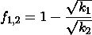

# 计算 Uniswap V2 费用

> 原文：<https://medium.com/coinmonks/calculating-uniswap-v2-fees-489f10776da0?source=collection_archive---------0----------------------->

V1 和 V2 的 Uniswap 都有相同的简单收费方法。每笔交易收取 0.30%的固定费用，这笔费用将计入 Uniswap 对的准备金。

Uniswap 处理费用的方式非常简单。就像我在 Uniswap V2 合同中看到的其他东西一样，他们使用的系统是精简的，没有任何东西被浪费。契约从每一行代码中榨取每一滴功能。

这种对简单性的关注是它成为如此强大的自动化做市商交易所的原因之一。然而，这也是为什么计算 Uniswap 对已收取的费用量可能是一项重要的任务。

要想搞清楚这一切，首先要了解它的恒量积公式和`k`的含义。

# **理解“k”**

Uniswap 对的交易使用常数乘积公式定价。这意味着，无论从一对货币的储备中增加(或在闪换的情况下，移除)多少代币，储备的乘积必须保持不变。

> 这个公式，最简单地表达为`*x * y = k*`，规定交易不得改变一对储备余额(`*x*`和`*y*`)的*乘积* ( `*k*`)。(联合国 V2 大学)

`k`的值只能在流动性存入或取出时变化。该属性是 Uniswap 计算费用的基础。在检查`k`值保持不变之前，通过将支付给 Uniswap 对的金额减少 0.30%的费用，该费用基本上作为新的流动性添加到准备金中。因为没有铸造额外的流动性代币，所以这种新的流动性按比例归一对货币的所有流动性提供者所有。

这就是我所说的优雅简单。这些费用不是附加在功能上的。不需要气体密集型内部会计来计算和分配它们。它们非常适合 Uniswap 系统。

> 另请参阅:[获取 Uniswap 数据的简单 rest API](https://bitquery.io/blog/dex-data-apis)

# **使用“k”计算费用**

现在我们知道 Uniswap 对处理费用的方式与处理流动性的方式完全一样。随着一对累积费用，它的`k`值增加。但是我们也知道`k`值会随着正常流动性的存入或提取而变化。

Uniswap 对通过计算每个流动性事件的费用，将最近的`k`值与最近的值进行比较，来区分两者。这捕获了`k`中的变化，独立于铸造或燃烧流动性代币所导致的变化。

要了解两次流动性事件之间的`k`变化，以及收取的费用占该对总流动性的百分比，我们使用来自*“uni swap v2 Core”*白皮书的以下公式:

(Adams et al. 5)

注意平方根的使用。因为`k`是一对储备的乘积，`k`的平方根也是一对储备的几何均值。

几何平均数是有用的，因为它比单独的`k`更好地代表了一对储备的总规模。因为收费增加了一对的储备，几何平均值的增长是计算它们的最好方法。

从这里，我们可以将表示为货币对总流动性的百分比的费用金额与货币对储备的总价值相结合，以获得收取的费用的价值。

Uniswap 对储备的总价值可以使用新的 uni swap V2 Oracle 进行计算，但我将在另一篇文章中讨论该主题。

> 另请阅读:[unis WAP 的最佳钱包](/coinmonks/best-wallets-to-use-uniswap-e91a6385d9e8)

# **接下来是什么？**

我的团队在[hack money](https://hackathon.money/)Virtual[DeFi](https://blog.coincodecap.com/the-ultimate-guide-to-defi-decentralized-finance)Hackathon 中使用了这些技术来构建*[*DALP*](https://github.com/opz/DALP-core)*(你可以在这里查看我们的推介视频[)。 *DALP* 代表分散自主的流动性提供者。用户可以购买 DALP 代币，让 DALP 自动将其流动性重新分配给收益最高的 Uniswap 对。](https://youtu.be/ciK5_W55K-U)**

**为了消除手动治理的需要，我们必须能够在链上对 Uniswap 对进行评级。这意味着我们必须完全理解 Uniswap 如何计算费用，以及我们如何进行自己的计算。查看我们的`[DALPManager](https://github.com/opz/DALP-core/blob/master/contracts/DALPManager.sol)`合同，看看我们是如何做到的。**

****

# **特别感谢 DALP 团队**

*   **迈克尔·科恩( [@mjaycee](http://twitter.com/mjayceee) e)**
*   **米切尔·奥帕托夫斯基([@ _ the _ 米奇 _](https://twitter.com/_themitch_) )**
*   **塞巴斯蒂安·斯坦特([@塞巴斯蒂安·斯坦特](https://twitter.com/SebastianStant))**

# **引用的作品**

**“Uniswap V2” *Uniswap/docs，*[https://uniswap.org/docs/v2](https://uniswap.org/docs/v2)。2020 年 5 月 28 日访问。**

**亚当斯，海登，等。“Uniswap v2 核心。”2020 年 3 月，[https://uniswap.org/whitepaper.pdf](https://uniswap.org/whitepaper.pdf)**

***如果这篇文章对您有帮助，请点击* ***或点击******❤***按钮，让其他人也能找到。****

****在**[**LinkedIn**](https://www.linkedin.com/in/willshahda)**和**[**Twitter**](https://twitter.com/ethdapp)**上跟我连线。****

> **加入 Coinmonks [电报频道](https://t.me/coincodecap)和 [Youtube 频道](https://www.youtube.com/c/coinmonks/videos)获取每日[加密新闻](http://coincodecap.com/)**

## **另外，阅读**

*   **[复制交易](/coinmonks/top-10-crypto-copy-trading-platforms-for-beginners-d0c37c7d698c) | [加密税务软件](/coinmonks/crypto-tax-software-ed4b4810e338)**
*   **[网格交易](https://coincodecap.com/grid-trading) | [加密硬件钱包](/coinmonks/the-best-cryptocurrency-hardware-wallets-of-2020-e28b1c124069)**
*   **[密码电报信号](http://Top 4 Telegram Channels for Crypto Traders) | [密码交易机器人](/coinmonks/crypto-trading-bot-c2ffce8acb2a)**
*   **[币安期货交易](https://coincodecap.com/binance-futures-trading)|[3 commas vs Mudrex vs eToro](https://coincodecap.com/mudrex-3commas-etoro)**
*   **[如何购买 Monero](https://coincodecap.com/buy-monero) | [IDEX 评论](https://coincodecap.com/idex-review) | [BitKan 交易机器人](https://coincodecap.com/bitkan-trading-bot)**
*   **[CoinDCX 评论](/coinmonks/coindcx-review-8444db3621a2) | [加密保证金交易交易所](https://coincodecap.com/crypto-margin-trading-exchanges)**
*   **[红狗赌场评论](https://coincodecap.com/red-dog-casino-review) | [Swyftx 评论](https://coincodecap.com/swyftx-review) | [CoinGate 评论](https://coincodecap.com/coingate-review)**
*   **[最佳加密交易所](/coinmonks/crypto-exchange-dd2f9d6f3769) | [印度最佳加密交易所](/coinmonks/bitcoin-exchange-in-india-7f1fe79715c9)**
*   **开发人员的最佳加密 API**
*   **最佳[密码借贷平台](/coinmonks/top-5-crypto-lending-platforms-in-2020-that-you-need-to-know-a1b675cec3fa)**
*   **杠杆代币的终极指南**