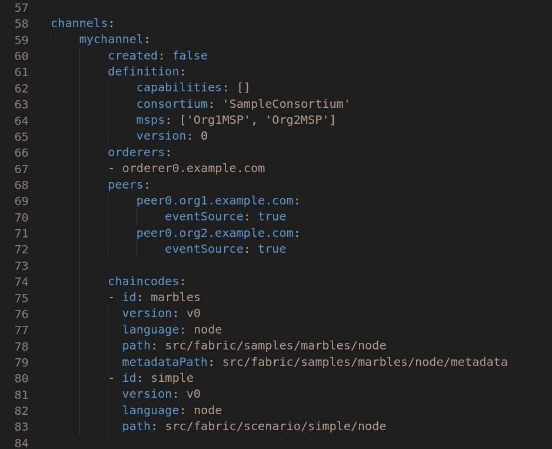

# 厚度与 Hyperledger 织物的集成

> 原文：<https://medium.com/coinmonks/caliper-integration-with-hyperledger-fabric-d2aa0df2f73f?source=collection_archive---------0----------------------->

**其**性能基准框架，允许用户用预定义的用例测试不同的区块链解决方案，并得到一组性能测试结果。


它支持不同区块链解决方案。
[总账面料 v1。X](https://github.com/hyperledger/fabric)

*   [超账锯齿 1.0+](https://github.com/hyperledger/sawtooth-core)
*   [Hyperledger Iroha 1.0 beta-3](https://github.com/hyperledger/iroha)
*   [总账钻地 1.0](https://github.com/hyperledger/burrow)
*   [以太坊](https://github.com/ethereum/go-ethereum)
*   [Hyperledger Besu](https://github.com/hyperledger/besu) ，利用以太坊适配器。
*   FISCO·BCOS

> [发现并回顾最佳区块链软件](https://coincodecap.com)

Youtube 视频系列:
第 1 部分:

第二部分:

第三部分:

第四部分:

在性能基准结束时，它给出了下面的性能指标
成功率

*   事务/读取吞吐量
*   事务/读取延迟(最小、最大、平均)
*   资源消耗(CPU、内存、网络 IO 等)

**绩效指标**


**每个集装箱的资源消耗**


让我们从 caliper 与 Hyperledger fabric 的集成开始。

克隆回购从[这里](https://github.com/hyperledger/caliper-benchmarks)，转到路径

`cd caliper-benchmarks`

```
npm i **&&** npm run repoclean -- --yes **&&** npm run bootstrap
```

为了运行基准测试，我们必须遵循某些步骤

**第一步:**

# 卡尺 CLI

Caliper 发布为[@ hyperledger/caliper-cli](https://www.npmjs.com/package/@hyperledger/caliper-cli)NPM 包和[hyperledger/caliper](https://hub.docker.com/r/hyperledger/caliper)Docker 映像，两者都包含 CLI 二进制文件。

安装制动钳 CLI

# 全球 NPM 安装

***注意:*** *确保你有一个真正好的理由在全球范围内安装卡尺 CLI。推荐的方法是本地安装。这样，您的项目是自包含的，您可以轻松地设置多个项目(在多个目录中)，每个项目针对不同的 SUT(或者只是不同的 SUT 版本)。全局安装或重新绑定依赖项可能会变得棘手。*

与本地安装相比，有一些细微的区别:

1.  你不需要一个`package.json`文件。
2.  您可以从任何地方执行安装、绑定和运行步骤(只需相应地指定工作区)。
3.  您需要全局安装 CLI(`-g`标志)。
4.  你需要告诉绑定步骤来全局安装软件包(`--caliper-bind-args`参数)。
5.  您可以省略`npx`命令，因为`caliper`将在您的`PATH`中。

```
user@ubuntu:~$ npm install -g --only**=**prod @hyperledger/caliper-cliuser@ubuntu:~$ caliper bind --caliper-bind-sut fabric --caliper-bind-sdk 1.4.0 --caliper-bind-args**=**-g
```

我们需要理解上面的三个命令。

第一个用于全局安装 caliper-CLI，您也可以选择本地安装。

# bind 命令

从技术上讲，绑定步骤包括一个额外的`npm install`调用，调用适当的包和安装设置，完全由 CLI 管理。可以为该命令设置以下参数:

*   **SUT/平台名称:**指定目标平台的名称，例如`fabric`
*   **SDK 版本:**指定为 SUT 安装的 SDK 版本，例如`1.4.0`
*   **工作目录:**必须执行`npm install`命令的目录。默认为当前工作目录
*   **用户参数:**要传递给`npm install`的附加参数，例如`--save`

这个命令 caliper 绑定特定的 SUT(被测系统)和所选 SUT 的 SDK。这里我们讨论的是你可以相应选择的 Fabric 和版本。卡尺支持不同的 SUT 如下。


# 基准命令

该命令要求设置以下参数:

*   **工作空间:**作为项目根目录的目录。其他配置文件或设置中的每个相对路径都将从此目录中解析。引入工作空间的概念是为了使 Caliper 项目可以跨不同的机器移植。
*   **基准配置文件:**包含测试回合配置的文件路径，详见[架构页面](https://hyperledger.github.io/caliper/vLatest/architecture/#configuration-file)。*应该相对于*工作空间路径。
*   **网络配置文件:**包含所选 SUT 的网络配置/描述的文件路径，在各个适配器的配置页面中有详细说明。*应该相对于*工作空间路径。

最后，运行下面的命令来启动基准测试。

```
user@ubuntu:~$ caliper benchmark run --caliper-workspace ~/caliper-benchmarks --caliper-benchconfig benchmarks/scenario/simple/config.yaml --caliper-networkconfig networks/fabric/fabric-v1.4.1/2org1peergoleveldb/fabric-go.yaml
```

基准测试完成后，您可以看到报告显示为`report.html`

您可以从这里 [**这里**](https://drive.google.com/open?id=1bHecgojxeOK2E-CaOKuya22h3-FJIYLr) 下载报表样本，并在浏览器中打开。

让我们将迪普挖掘到卡尺库中

## **基准配置文件**

在上面的命令中，我们使用工作台配置作为 `--caliper-benchconfig benchmarks/scenario/simple/config.yaml`


这个配置文件包含不同的轮次和相对回调，我们将讨论第一轮次。


在这一轮中，我们以 50 tps 的速率发送总共 100 个交易，这里我们传递的是钱:100000 作为一个参数，我会让你知道我们在哪里使用这个参数。我们可以看到 open.js 是一个回调函数，我们来研究一下。


忘记其他事情，这个文件包含创建样本数据和调用智能契约方法的逻辑。


在同一个文件 open.js 中，在顶部有另一个可用的方法(`init`)，我们在这里得到从`config.yaml`传递过来的参数。对于其他回合，也有一些特定的文件，如`query.js`、`transfer.js`

**网络配置文件**

在 caliper run benchmark 命令中，我们使用网络配置作为 `--caliper-networkconfig networks/fabric/fabric-v1.4.1/2org1peergoleveldb/fabric-go.yaml`

路径 network/fabric/我们有以下多个文件夹。我们必须根据我们的面料配置进行选择。让我们假设我们在谈论 fabric-v1.4.1。


我们在这个文件夹中有多个配置文件，如


让我们考虑一下`2org1eercouchdb_raft`，里面有如下几种不同的配置。


此配置文件包含以下配置

*   两个组织各有一个同级
*   状态数据库为 CouchDB
*   作为 RAFT 订购服务
*   我们有不同的选项来选择订购服务，如单人木筏订购或多人木筏订购。
*   同样，我们可以选择不同的链码语言，即 go 或 node。

我们可以通过选择不同的配置来测试不同概要文件的基准。

让我们在路径`networks/fabric/fabric-v1.4.1/2org1peercouchdb_raft/`处可用的轮廓`fabric-go-tls-solo.yaml`内挖掘铲斗

参见文件的第一部分`fabric-go-tls-solo.yaml`


它有名称、版本、交互 tls 和 caliper，重要的是在 caliper 对象中，有两个 imp 命令，如`start and end`。如果你还没有运行网络，这个`start`命令会根据提供的 docker-compose 文件创建一个网络，这个 docker-compose 文件会根据选择的配置文件进行所有的配置。一旦基准测试完成，`end`命令关闭结构网络并移除不必要的容器活动链代码容器。

下一部分是网络信息和客户信息。


它具有关于网络的一般信息和客户端(用户)的信息。请确保您为`clientPrivateKey`和`clientSignedCert`提供了正确的路径。我们可以在这里指定多个客户端。

下一部分是如下的通道。



如上提供必要的参数，我们可以指定多个链码来安装和实例化。

下一个对象是组织:


确保您为每个组织指定了正确的`peers`、`certificateAuthorities`、`adminPrivateKey`和`signedCert`

最后一部分是订购者、对等者和 CA


请为 CA 提供正确的`peer`、`url`、`tlsCACerts`和其他必要的东西，如上图所示。

到此为止，我们已经介绍了运行 fabric 基准测试所需的所有文件，您可以使用不同的配置文件和不同的配置进行测试。

> 注意:如果你已经有光纤网络，不要运行开始和结束命令，你可以注释它。如果已经创建了通道注释`configBinary`和`created: true`，如果已经实例化了，就不需要提及链码，可以随意进行必要的修改。

如果你有任何困难，请在评论区告诉我，我会尽力解决。

> [直接在您的收件箱中获得最佳软件交易](https://coincodecap.com/?utm_source=coinmonks)

[](https://coincodecap.com/?utm_source=coinmonks)