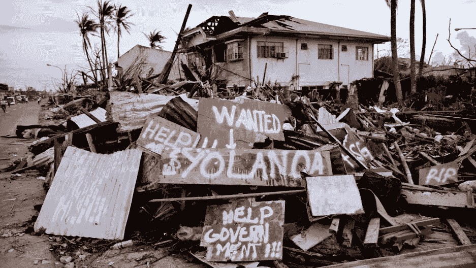

# 呼吁代码 2018:生命的证明

> 原文：<https://medium.com/coinmonks/call-for-code-2018-proof-of-life-3c3373f0bdf1?source=collection_archive---------5----------------------->

## 由 IBM 和美国红十字会组织的 [*代码挑战赛*](https://callforcode.org/) *已于 9 月 28 日星期五截止提交。Code challenge 呼吁开发人员使用顶级技术开发解决方案，以提高准备程度，减少自然灾害对人类生活、健康和福祉的破坏性影响。虽然*当然*有许多引人注目的提交，但其中一个解决方案，依靠区块链和加密交易，在提交截止日期到期前作为实验提出，引起了媒体的一些兴趣，*[*crypto*](https://cointelegraph.com/news/developer-completes-proof-of-life-off-grid-crypto-transaction-primed-for-post-apocalypse)*和* [*主流，*](https://www.ccn.com/this-off-grid-solar-powered-system-sends-crypto-through-radio-waves/) *表明区块链上的交易可能远不止这些。*

Image courtesy of [pri.org](https://media.pri.org/s3fs-public/styles/story_main/public/photos/2013-November/philippines_typhoon_haiyan_aftermath_nov_13_1.jpg?itok=UKmwqecz)

它始于 9 月 16 日 Burst 社区开发者之一发布的一条推文，他宣布他成功地在 Burst 区块链上发送了一个加密交易，使用了一个 H.A.M .无线电和一个由太阳能电池供电的便携式 Burst node/miner。最初的宣传来自业余无线电台，出于各种错误的原因，被称为“生命的证明”的实验参与者拥有适当当局颁发的操作无线电的足够许可证。

显然，这里的新闻不是通过无线电发送加密交易——虽然这肯定很酷，但以前已经做过了。“生命的证明”的作者，在媒体中被称为“丹尼尔·琼斯”(发音为:“所谓的丹尼尔·琼斯”)，发表了一篇文章[“生命的证明，复活的技术”](/@nixops_56291/proof-of-life-resurrecting-technology-653167c5763a)，详细解释了进行这样一个实验的动机及其使用案例。

新颖之处在于，没有连接到电网的便携式突发节点/挖掘器用于同步几个块，然后在突发区块链上发布事务。

[突发区块链](https://www.burst-coin.org/)利用容量证明(PoC)共识算法，这是一种独特的共识算法，使用硬盘来挖掘数据块。为了开采区块链本土的加密货币 Burstcoin，矿工们首先预先计算 Shabal256 哈希并将它们存储在硬盘上。这个过程称为“打印”，生成的文件是打印文件。在采矿开始前绘制一次。Shabal256 散列存储在绘图文件中称为“scoops”的组中。突发挖掘软件与钱包通信，钱包向挖掘软件提供伪造下一个块所需的信息。挖掘软件使用挖掘信息来计算下一个块生成散列和勺数。下一步是根据独家新闻数量和存储的哈希值计算截止日期。截止时间是一个间隔，以秒为单位，在锻造新块之前必须到期，这就是截止时间最短的矿工赢得这轮比赛并锻造新块的方式。(Burstcoin 采矿过程的完整技术描述可在 [Burst Wiki](https://burstwiki.org/wiki/Mining) 中获得。)

如上所述，与挖掘[工作证明(PoW)](https://en.wikipedia.org/wiki/Proof-of-work_system#Bitcoin-type_proof-of-work) 加密货币(如比特币、以太坊等)的过程中的实时散列的繁重计算相比，挖掘突发区块链需要从硬盘读取信息和少量简单计算。与用于 PoW mining 的[ASIC](https://en.wikipedia.org/wiki/Application-specific_integrated_circuit)和 GPU 相比，硬盘的低功耗，以及突发区块链的相当高的交易容量(高达 80tx/s)，一次突发交易的[能量支出比在比特币区块链上执行的交易低约 400，000 倍。](https://explore.burst.cryptoguru.org/chart/transaction/electricity_consumption)

突发区块链的这一功能对于执行“生命验证”实验至关重要，因为由太阳能电池供电的外部硬盘足以在同步和发送事务所需的一段时间内运行一个突发节点和一个矿工。这意味着，在发生自然灾害或敌对情况时，许多具有矿工和手持无线电作为通信设备的便携式节点可以扩展和维护通信网络，同时验证交易和伪造新块，而无需来自电网或电信基础设施的电力。

作者准备了一个演示该系统如何工作的短片:

该解决方案的代码库位于:[https://github.com/nixops/NoBoundaries](https://github.com/nixops/NoBoundaries)

显然，这不是一个商业解决方案，而是在其他通信手段不安全或不可用的特殊情况下，以及在区块链上的交易可能不仅仅意味着加密支付时的解决方案。

该文章的文本可以在[突发区块链](https://www.burst-coin.org/download-wallet)上获得，并且可以使用 CLOUD-KM3P-KGZD-B92T-CCS 75[CloudBurst ID](https://burstwiki.org/wiki/Burst_Software#CloudBurst)进行检索。

> [直接在您的收件箱中获得最佳软件交易](https://coincodecap.com/?utm_source=coinmonks)

