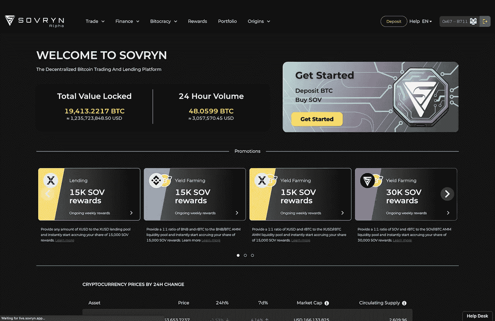
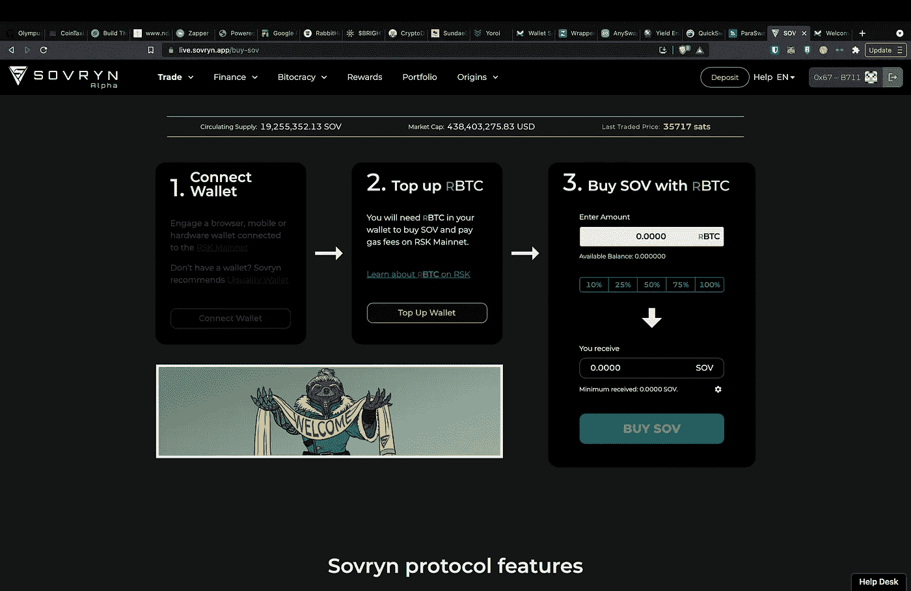

# 比特币能在自己的游戏中打败以太坊吗

> 原文：<https://medium.com/coinmonks/can-bitcoin-beat-ethereum-in-its-own-game-3ac1ff80b8fb?source=collection_archive---------2----------------------->

## 比特币的 DeFi 和智能合约

Created With Canva

比特币的诞生是为了改善世界货币体系，成为最有价值、最可信、最安全的价值储存手段。随着空间的发展，出现了其他项目，如以太坊，它引入了智能合同的概念，以及 DeFi，它们现在正试图彻底改变互联网和金融上的应用。

这就引出了一个问题，*数字黄金能成为互联网的货币吗？*但首先，让我们清楚地了解什么是 DeFi 和智能合约。

## 什么是 DeFi？

> *DeFi(分散金融的缩写)是一个总括术语，包括任何一种在没有中间人参与的情况下发生的区块链交易。*

这是怎么发生的？嗯，区块链使任何能上网的人都能与世界各地的其他计算机组成的整个网络连接起来，一起工作来验证和完成各种点对点交易。当有人在阿根廷想要向秘鲁的朋友发送比特币时，他们只需点击几个按钮，就可以完成交易，交易将由网络上成千上万的其他计算机进行验证和推送。

DeFi world 经常完成类似于银行的任务，比如借贷、汇款、提供保险，甚至为你的资产计息。这种方式的主要优势在于，与以前的金钱交易方式相比，DeFi 的速度**更快**，更易访问，**防审查**，并为任何有互联网连接的人提供了**机会**。

## 什么是智能合约？

> *智能合约是简单的编码机制，可以自动执行交易并将其存储在区块链上，而无需中央机构的任何批准。*

由于其无限的应用可能性，它们是 DeFi 领域的基础。公司经常在“如果这个那么那个”的情况下使用智能合同。例如，智能合约可以简单到*“如果 X 实体完成 Y 任务，那么他们将获得 Z 代币的支付”*。

这消除了任何一方可能有的工作或担心，因为交易的结果是根据是否满足设定的要求而自动确定的。除了效率之外，智能合同还非常可靠，并为双方提供了一种安全感。一旦双方创建并同意智能合同，任何一方都不能更改或退出交易。

很容易理解，DeFi 和智能合约是区块链生态系统最重要的功能之一，但多年来，人们的讨论一直围绕着这样一个观点，即它们在比特币上是不可能的。但是如果有办法呢？

# 输入比特币智能合约

虽然比特币的推出旨在建立第一种基于区块链技术的去中心化数字货币，但它并不是作为一个预见到区块链生态系统中无限应用和可能性的平台而设计的。这是由于比特币的**非图灵**完全性质，它本身不支持智能合约。以太坊网络使智能合约得以存在，因此 DeFi 的出现是由他们的本地货币以太(ETH)推动的。

多年来，以太坊一直是许多 DeFi 应用的首选，但人们越来越关注计算频率、燃气费和网络集中化。由于以太坊的使用每年都呈指数级增长，任何交易的价格也会增长，因为任何时候都有许多交易被尝试，堵塞了网络。

比特币已经被各大机构认为是避风港或者数字黄金。现在想象一下，如果你能把这种资产作为一种金融工具。诚然，比特币经历了与以太坊相同的问题，以太坊已经有了现有的智能合约。但它没有比特币那样的信任度和可信度。为了给比特币提供以太网的超能力，人们正在创造一种叫做**侧链**的东西。

> *比特币* ***侧链*** *是独立的区块链，与比特币网络并行运行。这些侧链可以有自己的规则和比特币网络特有的功能，同时使用 BTC 作为其本地货币。*

侧链的一个主要优点是它基本上解决了主链的伸缩问题，因为侧链独立于基础层。这样，基础层和侧链上的并发事务就不会在网络上互相拖累。最重要的是，比特币是现存最大、最容易获得的加密货币。拥有比特币的 DeFi 和智能合约功能将吸引更多的个人和机构，从而扩大整个加密空间。

根茎就是这样一个为比特币提供动力的侧链

# 什么是整党

> ***根茎(RSK)*** *是一个比特币侧链，以以太坊兼容智能合约为特色，在比特币区块链中通过合并挖掘进行保护。*

就哈希能力而言，RSK 是开采最多的区块链(仅次于比特币本身)，这使其成为最没有许可、最抵制审查的比特币侧链。目前，RSK 拥有超过 63%的比特币散列率。RSK 为众多利益相关方提供了多种优势。

## 对于比特币用户来说

比特币用户现在可以使用可编程货币和支付的最佳功能，包括降低交易成本和确认时间。RSK 实施了一个**15–30**块传播速率的网络，实现了低延迟交易的快速支付。

## 对于比特币矿工来说

比特币矿工可以参与智能合约市场，增加其行业的利用率和价值，同时实现更高的可扩展性。RSK 也是基于工作证明支持 **SHA-256D** 与比特币合并挖矿，使用其相同的共识协议和挖矿网络。合并开采允许比特币矿工以最小的额外成本同时开采 RSK，同时以额外的交易费奖励他们。

## 对于以太坊用户

以太坊用户有一个兼容的平台来使用比特币的货币、安全性和用户基础部署他们的应用程序。RSK 实现了一个图灵完全虚拟机( **RVM** )，它在操作码级别上与以太坊的虚拟机( **EVM** )兼容，允许以太坊的合约、编译器、工具和 DApps 在 RSK 上运行。

## BTC 的整党如何进行？

作为一个侧链，RSK 是一个独立的区块链，但它的货币通过一个名为 **PoWpeg** 的双向挂钩机制自动与比特币的价值挂钩。BTC 被转移到 RSK 区块链，成为 RBTC，并可以在任何时候转移回 BTC，没有额外的费用。

这个过程是通过 RSK 区块链中一个名为 [**桥契约**](https://www.rsk.co/faqs) 的智能契约完成的。由于智能合约只是一个“如果那么”合约，如果联系人收到特定数量的 BTC，则相同数量的 RBTC 将被发送到与原始比特币地址相对应的 RSKs 地址。如果您希望将您的 RBTC 转换回 BTC，您只需将 RBTC 发送到一个特殊的桥合同地址，转换将再次通过 PowPeg 处理，pow peg 从****(硬件安全模块)获得其安全性，这是一种保护私钥的机制。****

## ****可以信任根茎吗？****

****完全无信任和分散的双向挂钩要求两个平台都具有图灵完全智能合约，但比特币目前不支持它们。因此，一群半信任的第三方( **STTP** )，称为**联邦**，控制着 PoWpeg 机制。一个开放的智能契约控制着联盟的组成，如果有修改，它会在一周的延迟后应用。这样，不信任新联盟的用户就有时间将 BTC 转移回比特币区块链。****

****每个 STTP 人都有一把钥匙来控制被锁定的 BTC，他们的释放只由 STTP 的大多数人决定，根据来自 RSK 区块链的命令，没有人为干预。在 RSK 的未来版本中，比特币矿工也将直接参与 PoWpeg，使其更少联合，更多地与比特币工作证明相结合。****

# ****比特币的定义****

> ******Sovryn** 是一个基于 RSK 的去中心化应用。在智能合约的支持下，该应用程序允许比特币借贷和保证金交易。****

****Sovryn 的分散能力是围绕智能合同建立的，允许用户将 BTC 存入非托管钱包。用户保留对其私钥的控制权，并且不受 KYC 要求、交易审查或帐户禁令的约束。****

****作为一个分散的应用程序，Sovryn 使用 oracle 和多个交易所的集合在应用程序上进行交易时获得最准确的价格。*Oracle 允许从应用程序外部引入数据，并在这种情况下生成更准确的比特币价格*。由于交易所记录所有交易的效率低下，交易所对比特币的价格可能略有不同。因此，Sovryn 将多个交换价格结合起来，找到最准确的价格，并提供给用户。****

****Sovryn 试图减少发生的套利数量，并防止交易者从交易所的价格差异中获取小额利润。Sovryn 允许高达 5 倍的保证金交易杠杆，从 Sovryn 平台上的贷款人那里获得这些资金，这些贷款人从保证金交易的用户那里获得利息。这种通过点对点通信进行保证金交易和借贷的核心焦点，允许用户保持对其钱包的控制，并在没有中央交易所监管的情况下直接向其他用户提供借贷。****

****Sovryn 允许点对点交易和选择，向特定用户贷款进行保证金交易和农业，或向各种交易对提供流动性。分散式应用程序将控制权交给用户。Sovryn 以遵循 P2P 贷款设计和比特币精确定价的智能合约为后盾，通过开发甲骨文的编码和自动化实现，引领去中心化金融。****

# ****比特币上的 DeFi 如何入门****

****要使用 Sovryn，用户必须首先将其比特币转换为智能比特币(RBTC)，以与 Sovryn 兼容。****

****要进行这些转换，您需要访问支持 RSK 的钱包。这里有一些钱包，你可以看看——liquility，Defiant，Portis，Ledger，Beexo，Metamask 等等。下载并设置好钱包后，您需要将其连接到 RSK 区块链。****

> ****注意-保管好您的种子短语，即您从钱包中收到的 12 或 24 个单词，在任何情况下都不要与任何人分享。****

********

****Screenshot from Sovryn Website****

****对于这个例子，我将使用 Metamask 钱包。要将钱包连接到 RSK 区块链，您只需进入 [Sovryn](https://live.sovryn.app/) 应用程序，然后点击开始。****

********

****Screenshot from Sovryn Website****

****现在只需点击连接钱包并选择元掩码。它会要求您将 RSK 网络添加到 Metamask，在页面上签名以获得批准。现在你需要买一些 RBTC。点击 Top op wallet，将 BTC 发送到 FastBTC 地址。****

****(FastBTC 目前是集中式的，所以只有在信任 Sovryn 平台的情况下才这样做)****

****最低互换规模约为 200 美元(根据当时的资产价格而变化)，所以确保你转移的资金超过这个数字，以支付费用。你将在你的钱包里收到 RBTC(这可能需要 60 分钟)一旦你的钱包里有了 RBTC，你就可以购买 SOV 代币来使用 Sovryn 提供的各种 DeFi 服务。****

****由[马里亚诺·马鲁弗·达席尔瓦](https://medium.com/u/48f7353f6d58?source=post_page-----3ac1ff80b8fb--------------------------------)、[威尔·科尔西](https://medium.com/u/b9bde095886e?source=post_page-----3ac1ff80b8fb--------------------------------)、[亨利·杜尚](https://medium.com/u/a1c8982e0581?source=post_page-----3ac1ff80b8fb--------------------------------)、[克里斯·M](https://medium.com/u/3471f2719610?source=post_page-----3ac1ff80b8fb--------------------------------)、[乔纳森·平克斯通](https://medium.com/u/7e2e94a39794?source=post_page-----3ac1ff80b8fb--------------------------------)、[舒布·帕特尼](https://medium.com/u/a3762dfaaa71?source=post_page-----3ac1ff80b8fb--------------------------------)编剧。****

# ****参考资料和资源****

 ****[## 常见问题常规

### 让我们用两个例子来描述不同的用例。Alice 是一名比特币爱好者，她想通过以下方式使用她的 BTC 堆栈

wiki.sovryn.app](https://wiki.sovryn.app/en/getting-started/faq-general)**** **** [## 快速 BTC 继电器

### Sovryn 提供了以下快速、简单、方便的方法来直接在 dApp 中获取 RBTC。FastBTC…

wiki.sovryn.app](https://wiki.sovryn.app/en/sovryn-dapp/fast_btc)  [## RSK —常见问题

### RBTC 和 RIF 令牌 RIF 令牌信息包括支持钱包和交换在 RIF 令牌 RBTC 信息是什么…

www.rsk.co](https://www.rsk.co/faqs) 

[甲骨文和区块链:DeFi 甲骨文研究|双子座](https://www.gemini.com/cryptopedia/crypto-oracle-blockchain-overview#section-inbound-versus-outbound-oracles)

[比特币的定义解释| Edan Yago | Pomp 播客#575](https://youtu.be/PldRs3q23ac)

[RSK 白皮书 ](https://www.rsk.co/Whitepapers/RSK-White-Paper-Updated.pdf)

> 加入 Coinmonks [电报频道](https://t.me/coincodecap)和 [Youtube 频道](https://www.youtube.com/c/coinmonks/videos)了解加密交易和投资

## 也阅读

 [## 最佳加密交易所| 2021 年十大加密货币交易所

### 编辑描述

blog.coincodecap.com](https://blog.coincodecap.com/crypto-exchange)  [## 2021 年 10 大最佳加密贷款平台| CoinCodeCap

### 编辑描述

blog.coincodecap.com](https://blog.coincodecap.com/crypto-lending)  [## 2021 年最佳免费加密交易机器人

### 2021 年币安、比特币基地、库币和其他密码交易所的最佳密码交易机器人。四进制，位间隙…

medium.com](/coinmonks/crypto-trading-bot-c2ffce8acb2a)  [## 最佳 4 个加密交易信号电报通道

### 这是乏味的找到正确的加密交易信号提供商。因此，在本文中，我们将讨论最好的…

medium.com](/coinmonks/best-crypto-signals-telegram-5785cdbc4b2b)  [## 5 个最佳社交交易平台[2021] | CoinCodeCap

### 编辑描述

blog.coincodecap.com](https://blog.coincodecap.com/best-social-trading-platforms)  [## BlockFi 评论 2021:利弊和利率| CoinCodeCap

### 编辑描述

blog.coincodecap.com](https://blog.coincodecap.com/blockfi-review)  [## 如何在印度购买比特币？2021 年购买比特币的 7 款最佳应用[手机版]

### 如何使用移动应用程序购买比特币印度

medium.com](/coinmonks/buy-bitcoin-in-india-feb50ddfef94)  [## 加密税务软件——五大最佳比特币税务计算器[2021]

### 不管你是刚接触加密还是已经在这个领域呆了一段时间，你都需要交税。

medium.com](/coinmonks/best-crypto-tax-tool-for-my-money-72d4b430816b)  [## 存储比特币的最佳加密硬件钱包[2021] | CoinCodeCap

### 编辑描述

blog.coincodecap.com](https://blog.coincodecap.com/best-hardware-wallet-bitcoin)  [## Pionex 评论 2021 |免费加密交易机器人和交换

### Pionex 是为交易自动化提供工具的后起之秀。Pionex 上提供了 9 个加密交易机器人…

medium.com](/coinmonks/pionex-review-exchange-with-crypto-trading-bot-1e459d0191ea)****