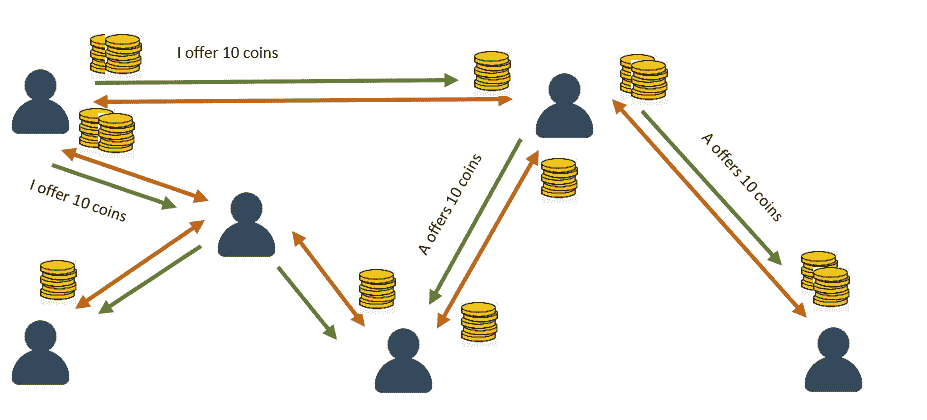

# 加密货币有可能规模化吗？

> 原文：<https://medium.com/coinmonks/can-cryptocurrency-ever-be-scalable-8dca44c3f9be?source=collection_archive---------2----------------------->

## 本·戈德施密特

随着中本聪引入比特币，加密货币于 2008 年首次出现。创建一个分布式、去中心化支付网络的想法是革命性的，并很快吸引了追随者和投资者。对这一新的未知及其扰乱现有金融体系的可能性的恐惧引发了许多国家的大规模监管，比如美国，而其他国家，比如俄罗斯，则广泛接受了新体系。很快，其他开发者跟随 Satoshi，创造了现在被称为以太坊，XRP 和其他货币。许多人将加密货币革命比作互联网的早期，并设想未来将被大多数人大量采用和使用。

*Source: BitCoin transactions per day from 2010 till today.* [*https://www.blockchain.com/charts*](https://www.blockchain.com/charts)

*Source: BitCoin market price from 2010 till today.* [*https://www.blockchain.com/charts*](https://www.blockchain.com/charts)

## **加密货币——问题出在哪里？**

加密货币的好处是显而易见的:我们希望创造一种支付方式，消除中间人(主要是银行)，让我们能够处理即时和安全的交易。就此而言，所有加密货币都实现了分类账。账本主要由矿工维护，他们用计算能力换取佣金。这种方法赋予加密货币安全可信的交易，同时也带来了它们在扩展方面的最大问题。

处理分类账需要强大的计算能力。比特币每秒管理 8 笔交易，比特币现金管理 60 多一点。这甚至比不上规模更大、更成熟的供应商(如 Visa)提供的每秒 24000 笔交易。这种差异是由于矿工需要花费时间来计算分类账作为交易的公共安全分布式注册表所需的加密哈希。

## **PCN——今天对秤问题的回答**

大规模快速支付仍然是一个挑战。近年来，我们经历了一项新技术的采用，它是账本之上的一层(例如比特币区块链之上)。这项技术被称为支付渠道网络(PCN)。这项技术中最著名的是闪电网络。这项技术旨在使分类帐更具可扩展性，允许点对点的无限交易流，并通过它们之间的连接设置限制。例如，支付必须在有足够资金的路径上进行，而资金不能像标准连接上的带宽那样增加，除非用新的资金重建通道。随着支付在单个通道(链路)上沿同一方向流动，该通道最终会耗尽，无法支持该方向的进一步支付。

假设我是节点 A，我希望向节点 B 转移 5 枚硬币，我与节点 B 建立了一个 PCN，我们每个人都插入了 5 枚硬币。

传输完成后，网络将如下所示:

现在，如果我希望转移 B 更多的资金，网络将成为瓶颈，PCN 将不得不关闭，将当前余额写入区块链，并且只有在有足够的资金来容纳新的转移时才会重新开放。这种均衡的传输速率将导致类似的资金从一边转移到另一边，从而允许网络无限期地支持交易。不幸的是，这与现实世界的情况相去甚远。

如果我们看一个更复杂的网络，每个边代表一个 PCN，其中节点可以将资金转移到跨越多个 PCN 的路由中的任何其他节点，那么这些边中的每一个都可能成为阻止尝试通过该路由进行支付的瓶颈。

假设我是绿色节点，我希望转移 10 枚硬币到蓝色节点。如果我使用最短路径路由，我有两个选项，两个选项的距离都是两跳。但是，两者都不支持交易，因为两条路径上的第二个 PCN 都不支持传递 10 枚硬币。

## **为什么不够好？**

近年来，许多研究试图用旨在创建平衡网络的算法来解决这一问题，试图在写入分类帐之前最大化交易数量是不可避免的。这些解决方案必须解决寻找最有效的路线、负载平衡和分期付款、保持网络平衡和支持尽可能多的交易等问题。我们看到最短路径路由、地标路由、注水等等的实现。在最近的研究中引入了负载平衡和拆分支付，使网络更加平衡和动态。

我们目前拥有的最先进的解决方案在写入分类账之前平均可以实现 7–8 笔交易。这是因为现实世界的支付是不对称的，这使得网络天生不平衡。达到每秒 24，000 次交易的速度似乎是一个非常困难的任务。

## **那么我们能做些什么来最大化网络效率呢？**

如果我们回顾 20 年前，下载文件是通过单个服务器完成的，并且也没有扩展。然后 BitTorrent 出现了，它提供了一个新的解决方案。如果我们试图将这两个想法的相似方面结合起来，我们可以在 PCN 的基础上创建一个层，欠钱的人将是“种子”，有钱的人将是“同行”，让网络为每个人保持平衡。

正余额与欠款相关，因此我应该接受根据我的余额等待付款的人发送给我的付款请求。负余额与有钱相关，因此我将“寻找”附近的付款人，并向他们发送付款请求。为了保证可靠性，相互交织的支付的原子性是很重要的。采取懒惰的交易完成方式意味着在一段特定的时间后，我会做一些交易，定期改变我的余额。许多支付可能会相互抵消，在最坏的情况下，我将最终使用与原始系统相同的直接交易途径，但增加了搜索付款人的时间。

付款人广播一条类似 LSA 的消息，说明他们的状态，以便创建一个支付网络。

*节点 A(左上)发送一个类似 LSA 的消息，包含它的信息和提供的金额。接收到该消息的每个节点会将该信息添加到它保存的网络拓扑中。一旦节点 B(右上)要求付款，它知道节点 A 提供 10 个硬币，并且能够发送请求(这里需要锁定和响应机制，这里不讨论)。*

*节点 B(蓝色节点)发送支付 5 个硬币的请求消息，通过网络将其分发给最近的付款人(绿色节点)，他通过自己构建的拓扑结构识别这些付款人。*

我相信，一种创建类似 BitTorrent 的拓扑结构的方法将最大限度地减少所需的分类帐写入，同时保持相对平衡的网络，BitTorrent 受益于惰性事务执行，并确保陈述网络上每个节点状态的平衡。不要单独查看每笔支付，例如从 A 到 B 的交易，而是查看同时定期执行的一组相互交织的交易。这也采用了分布式方法机制——每个用户都可以从其他每个用户转移或接收资金，相应地改变他们的余额，而实际的资金似乎是从 A 流向 B，让网络在幕后以分布式方式完成支付的繁重工作。除非用户是交易的发起者(例如通过应用新的交易——必须向某人付款并相应地改变其自己的余额),否则用户余额不能从正变到负，反之亦然(0 是不应超过的限制)。

## **结论**

这种新系统的优势是显而易见的——可以通过一种懒惰的方式进行交易，节省了计算时间，并允许大量的交易同时执行，有可能相互抵消。写入分类账的频率将大大降低，从而解决了我们当前系统的最大问题之一。尽管如此，保持一个安全的交织支付网络，允许安全的并行支付，以及在 PCN 上创建一个额外层的额外价格，是一项艰巨的挑战。需要进一步的研究来评估这些新的负担是否值得，以及这个新系统是否可以成为超越 Visa 24000 交易率的关键。

## 另外，阅读

*   最好的[密码交易机器人](/coinmonks/crypto-trading-bot-c2ffce8acb2a)
*   [密码本交易平台](/coinmonks/top-10-crypto-copy-trading-platforms-for-beginners-d0c37c7d698c)
*   最好的[加密税务软件](/coinmonks/best-crypto-tax-tool-for-my-money-72d4b430816b)
*   [最佳加密交易平台](/coinmonks/the-best-crypto-trading-platforms-in-2020-the-definitive-guide-updated-c72f8b874555)
*   最佳[加密贷款平台](/coinmonks/top-5-crypto-lending-platforms-in-2020-that-you-need-to-know-a1b675cec3fa)
*   [最佳区块链分析工具](https://bitquery.io/blog/best-blockchain-analysis-tools-and-software)
*   [加密套利](/coinmonks/crypto-arbitrage-guide-how-to-make-money-as-a-beginner-62bfe5c868f6)指南:新手如何赚钱
*   最佳[加密制图工具](/coinmonks/what-are-the-best-charting-platforms-for-cryptocurrency-trading-85aade584d80)
*   [莱杰 vs 特雷佐](/coinmonks/ledger-vs-trezor-best-hardware-wallet-to-secure-cryptocurrency-22c7a3fd391e)
*   了解比特币最好的[书籍有哪些？](/coinmonks/what-are-the-best-books-to-learn-bitcoin-409aeb9aff4b)
*   [3 商业评论](/coinmonks/3commas-review-an-excellent-crypto-trading-bot-2020-1313a58bec92)
*   [AAX 交易所评论](/coinmonks/aax-exchange-review-2021-67c5ea09330c) |推荐代码、交易费用、利弊
*   [Deribit 审查](/coinmonks/deribit-review-options-fees-apis-and-testnet-2ca16c4bbdb2) |选项、费用、API 和 Testnet
*   [FTX 密码交易所评论](/coinmonks/ftx-crypto-exchange-review-53664ac1198f)
*   [n 零审核](/coinmonks/ngrave-zero-review-c465cf8307fc)
*   [逐位交换审查](/coinmonks/bybit-exchange-review-dbd570019b71)
*   [3Commas vs Cryptohopper](/coinmonks/cryptohopper-vs-3commas-vs-shrimpy-a2c16095b8fe)
*   最好的比特币[硬件钱包](/coinmonks/the-best-cryptocurrency-hardware-wallets-of-2020-e28b1c124069?source=friends_link&sk=324dd9ff8556ab578d71e7ad7658ad7c)
*   最佳 [monero 钱包](https://blog.coincodecap.com/best-monero-wallets)
*   [莱杰 nano s vs x](https://blog.coincodecap.com/ledger-nano-s-vs-x)
*   [bits gap vs 3 commas vs quad ency](https://blog.coincodecap.com/bitsgap-3commas-quadency)
*   [莱杰纳米 S vs 特雷佐 one vs 特雷佐 T vs 莱杰纳米 X](https://blog.coincodecap.com/ledger-nano-s-vs-trezor-one-ledger-nano-x-trezor-t)
*   [block fi vs Celsius](/coinmonks/blockfi-vs-celsius-vs-hodlnaut-8a1cc8c26630)vs Hodlnaut
*   [bits gap review](/coinmonks/bitsgap-review-a-crypto-trading-bot-that-makes-easy-money-a5d88a336df2)——一个轻松赚钱的加密交易机器人
*   为专业人士设计的加密交易机器人
*   [PrimeXBT 审查](/coinmonks/primexbt-review-88e0815be858) |杠杆交易、费用和交易
*   [埃利帕尔泰坦评论](/coinmonks/ellipal-titan-review-85e9071dd029)
*   [赛克斯石评论](https://blog.coincodecap.com/secux-stone-hardware-wallet-review)
*   [BlockFi 评论](/coinmonks/blockfi-review-53096053c097) |赚取高达 8.6%的加密利息