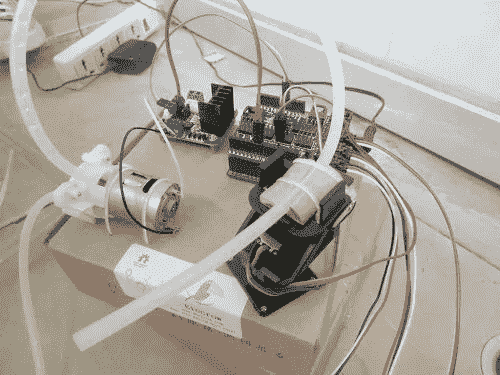
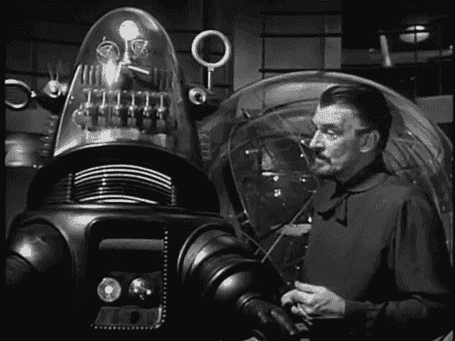

# DApps 可以在嵌入式设备上运行吗？

> 原文：<https://medium.com/coinmonks/can-dapps-run-on-an-embedded-device-18123517816c?source=collection_archive---------4----------------------->

## 事实证明，它们实际上可以，以一种自然的方式，只要你把代码调整得恰到好处…

前段时间我参加了一个工程设计挑战赛。其中一个团队的任务是，在主人不在的时候，创造一个能给植物浇水两周的装置。他们发明的设备是一个电气庞然大物，包括水泵、电子计时系统、软管、多级集水坑、湿度传感器和脚手架臂。在演示会上，机器惊人地爆炸了，水溅得到处都是。

This is what you get when you ask a group of engineers to design ‘automatic plant waterer’. [https://www.instructables.com/id/Arduino-Automatic-Watering-System-For-Plants/](https://www.instructables.com/id/Arduino-Automatic-Watering-System-For-Plants/)

然后我们得到了商业解决方案——一块细布，一端浸在一罐水中，另一端浸在花盆中。毛细作用滴水给植物浇水。是的——理想的解决方案是一块布和一罐水。

前一年，一个团队设计了一个系统，让身患绝症的病人能够在医院的病床上吸烟(嘿，那是 90 年代)。解决方案正是你在学校时会想到的——不可避免地涉及到一个机器人手臂拿着香烟，用电动托盘接住并处理烟灰。当该设备将一支香烟移入和移出患者口腔时，有一组定时继电器、传感器和步进电机发出咯咯声。在演示中，这台机器滑稽地袭击了一名评委，并向观众喷射燃烧的香烟，然后毫不客气地向演示团队摇晃烟灰。也许机器人手臂被阿西莫夫的机器人定律编程，并认为允许人类吸烟违反了机器人第一定律(不允许伤害人类)。

你可以让机器人梅帮你抽烟——只要不危及人类的生命，机器人会尽力服从。如果机器人被命令去伤害一个人，它可能会陷入道德困境，尤其是如果这发生在 1955 年到 1990 年之间。

商业解决方案(由一名退休消防员设计)是一个烟灰缸，侧面有一个洞，用来放香烟，还有一根管子伸入病人的嘴里。

如果你已经在以太坊领域呆了一段时间，并且对物联网产生了短暂的兴趣，你可能会想起一个团队，他们正在构建一个完整的解决方案，用以太坊为物联网设备供电，这个解决方案一度引起了很大的争议。该团队构建的解决方案涉及定制的树莓 Pi 内核、WiFi 握手、令人发指的欧洲口音的混合、手工制作的协议、大量的公关、对行业的承诺和资金请求——这一部分看起来非常完美。它需要一小组工程师和软件开发人员来安装它——如果他们真的能让它运行的话。

本着这种精神，我们开发了一个物联网/DApp(*)系统，试图提供早期开拓者寻求的现实世界解决方案。

*   零基础架构—没有代理服务器，没有应用程序。
*   安全性完全由 ECDSA 提供支持——同样的加密技术赋予了比特币和以太坊信任。没有自定义协议或代理。
*   微小的攻击面-只有一种方式输入可以到达设备。通过简单和健壮的约束和输入检查，我们可以很容易地防止缓冲区溢出攻击等等。
*   没有机会进行中间人攻击，代理服务器可以翻译用户的输入并重新键入。如果你把令牌放在钱包里，就没有办法发起代理攻击。

两条开发路线使得一个简单的解决方案成为可能— [ERC875 不可替换令牌](https://github.com/alpha-wallet/ERC875)和 [Web3E](https://github.com/alpha-wallet/Web3E) 。

为了展示这些如何无缝地协同工作，我们在 AlphaWallet 办公室解决了一个问题。我们只发了两张进入卡，但办公室里有 4 到 8 个人在工作。考虑到我们三个也住在办公室，这就产生了一些问题(我们是一家初创公司，不要妄加评论！).

办公室的门有一个拜占庭式的对讲系统，你可以在人们按下对讲系统上的一系列按钮后让他们进来，但它只能在你按下门后 10 秒内起作用。

我们的系统使用 [AlphaWallet](https://alphawallet.com/) 和 [DApp](https://blockgeeks.com/guides/dapps/) ，由 [ESP32 微控制器设备](https://en.wikipedia.org/wiki/ESP32)提供服务，该设备连接到一个中继系统，该系统在潜在的进入者通过密码挑战后关闭一些开关上的连接。它也可以在任何支持 DApp 的钱包浏览器上运行，比如带有 Metamask 插件的 Chrome。

Enter the AlphaWallet Office…

那么，它是如何工作的呢？

*   运行在微控制器上的 DApp，它为钱包浏览器提供 DApp 网页服务。
*   当用户连接到服务器时，微控制器产生一个随机的挑战字符串，嵌入到所提供的网页/DApp 中。
*   用户点击“Open Gate”按钮，DApp JavaScript 中的 Web3 函数调用被钱包/元掩码截获，提示用户用他们的私钥签署挑战字符串。
*   DApp JavaScript 将生成的签名和钱包地址嵌入到一个标题中，该标题作为重定向 URL 发送回微控制器(就像电子邮件中的广告分析谁点击了他们的电子邮件一样)。
*   DApp 使用它发送的签名和挑战来执行 [EC-recover](/@angellopozo/ethereum-signing-and-validating-13a2d7cb0ee3) 。
*   从 EC-recover 计算的地址首先与发送的地址进行比较，以检查它们是否匹配。如果它们匹配，我们知道用户拥有该地址的私钥。你可以跳过这个阶段。
*   检查该地址以查看它是否持有 ERC875 AlphaWallet office 入口证明令牌。如果该地址存在，则微控制器开始开门序列。
*   开门是一系列三个按钮的按下，以模拟打开对讲机(通常是检查要求进入的人的身份)，随着对讲机打开，门打开命令被发送，然后对讲机关闭。一些由设备控制的机电继电器执行这些动作。

这里的关键点是，代替口头确认输入者——这是非常低效的；这种情况每天可能会发生 20 次以上——相反，我们会向进入者颁发一个允许他们进入的证明。如果需要撤销输入者的输入，只需使用 ERC875 合同管理密钥(用于创建合同)将令牌传输回管理池即可。

您可以在此处找到 door 应用程序的源代码:

 [## alpha-钱包/web 3e-应用

### 使用 Web3E 的应用程序。通过在 GitHub 上创建帐户，为 alpha-wallet/Web3E-应用程序开发做出贡献。

github.com](https://github.com/alpha-wallet/Web3E-Application) 

要运行它，你需要[安装 Platformio](https://platformio.org/) ，如果你还没有这样做的话。Web3E 图书馆现在是官方图书馆的一部分，所以它可以自动下载。设置示例的完整说明在上面的 github 页面上。

ESP32 硬件来自[这些家伙](https://www.aliexpress.com/item/Lolin-ESP32-OLED-V2-0-Pro-ESP32-OLED-wemos-pour-Arduino-ESP32-OLED-WiFi-Modules-Bluetooth/32824839148.html?spm=a2g0s.9042311.0.0.45924c4dbybbfW)——他们自己设计和制造电路板，并有一系列有趣的电路板，包括一种带有电子纸的电路板，似乎它在加密领域有很好的应用。

(*)DApp

不久前，有人提出了一个网站通过钱包与以太坊互动的想法。他们称任何使用以太坊作为后台的网站为分散应用或 DApp。它是分散的，因为它依赖于分散的网络，而不是咨询数据库 API。

> [在您的收件箱中直接获得最佳软件交易](https://coincodecap.com/?utm_source=coinmonks)

