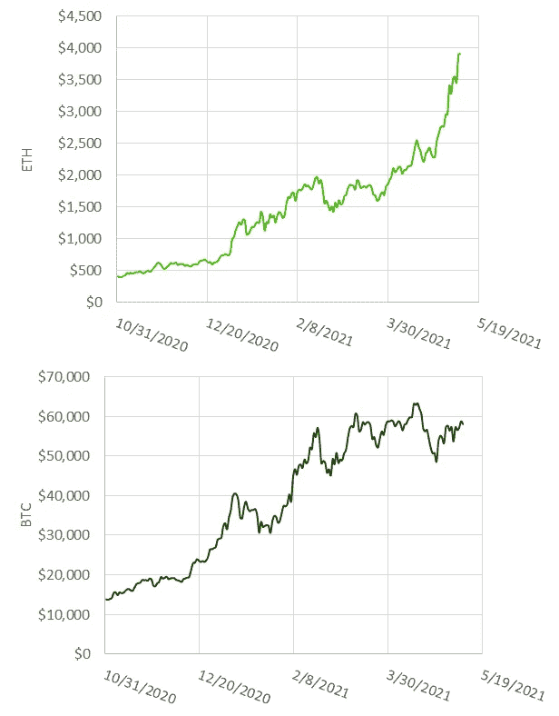
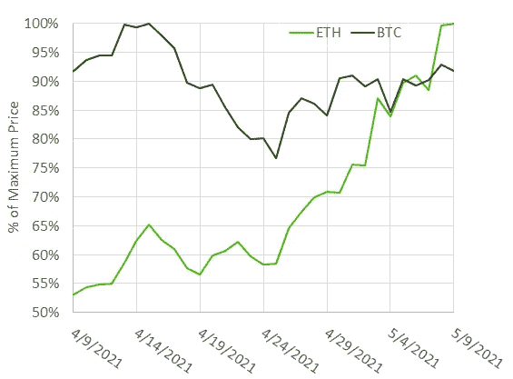

# 以太坊能给机构提供多元化的来源吗？

> 原文：<https://medium.com/coinmonks/can-ethereum-provide-institutions-with-reliable-diversification-491f2d3beb8c?source=collection_archive---------9----------------------->

**关于此内容:**

*浮点集团的研究团队致力于用简单易懂的书面内容为我们的机构受众带来量化的见解。您想要检查的问题或关于本文及其相关数据的问题可以发送到 research@floating.group*

如果有人在过去几周关注以太坊，你会注意到一些疯狂的价格行为，尤其是与比特币相比。过去一周，瑞士联邦理工学院股价上涨了近 18%，相比之下，BTC 股价有所起伏，但下跌了 3%。从过去 6 个月的趋势来看，近期表现的这种差异尤其引人入胜。在秋季，当牛市开始时，以太网通常以相对于 BTC 相当一致的模式移动——比特币会上涨，以太坊会在一两天后以更大的幅度上涨。当比特币下跌时，以太坊也会跟着下跌，而且幅度更大。这种模式看起来是一致的，可预测的——就像时钟一样。对于许多机构投资者来说，以太坊被认为是风险更高的投资，他们只有在适应比特币之后才会涉足——以太坊为那些能够忍受波动性的人提供了更高的风险和更高的回报。特别是对于那些加密新手来说，比特币本身就存在很大的风险(尤其是与传统资产相比)，他们没有兴趣冒险进一步突破加密风险曲线。

ETH and BTC Performance

但 ETH 3-4 周的表现令人着迷的是，它开始显示出开辟自己的道路的迹象，提供相对于比特币的不相关加密回报来源，拥有提供多样化的*潜力，并有助于降低风险，而不是从整个投资组合的角度增加风险。*

*现在样本量很小，但过去一个月的三件事引起了我的注意。第一次是在围绕比特币基地 IPO 的炒作和宣传之后，BTC 崩盘。BTC 在 4 月中旬达到了近 65000 美元的历史高点，但 10 天后就跌破了 50000 美元。对于此次暴跌有几种解释，最常见的解释是，比特币基地 IPO 引发了比特币热潮，并受到过度杠杆的推动，导致期货头寸在最初下跌时被清算，从而导致快速下跌。在同一时期，ETH 在比特币基地 IPO 之前小幅上涨，但经历了一次更加温和的调整:比特币连续 10 天下跌(对许多不熟悉加密的投资者来说，这是他们第一次尝到正常市场调整的滋味)，而 ETH 基本持平。对于那些持有平衡的 BTC-联邦理工学院投资组合的人来说，这种多元化令人欣慰，在一定程度上缓解了投资于如此波动的资产类别的过山车行情。*

*更有趣的是上周发生的事情，5 月 4 日，财政部长珍妮特·耶伦暗示可能需要提高利率以防止经济过热。现在，加息甚至不是耶伦部长目前的工作，但鉴于她目前的角色和作为前美联储主席的经验，她的话对市场仍然很重要，风险曲线的远端作为对她的言论的回应而抛售——吓坏了科技股和加密股。以太坊下跌，但比特币下跌更多，以太坊能够比比特币更快地恢复并继续其上升轨迹。这种模式在今天再次展现，当技术和密码被抛售时，虽然 ETH 受到了打击，但它能够比 BTC 和更广泛的密码市场恢复得更快。*

**

*Price change over the last month expressed in percentage of the maximum price of ETH and BTC. Data gathered from Coin*

*以太坊在这个特定时刻的表现和弹性有几种可能的解释，包括但不限于:1)NFT 和 DeFi 热潮，其中很大一部分依赖于以太坊的基础设施，需要购买 ETH 才能参与。2)正在进行的以太坊改进提案(EIP)，包括最近的柏林分支和即将到来的伦敦分支，它们是以太坊从工作证明向利益证明协议过渡的一部分，旨在使 ETH 更具可扩展性和可持续性。3)欧洲投资银行(European Investment Bank)最近通过以太坊(Ethereum)发行了他们有史以来第一只数字债券 4)机构资金开始将以太坊视为与比特币平行的投资工具，而不是在熟悉 BTC 后依次投资以太坊。由于市值不到比特币的一半，大量收购 ETH 会带来更大的市场影响。*

*目前推动以太网价格的一些现象本质上可能是短期的，还有许多悬而未决的问题有待回答，包括这种 DeFi 热潮将持续多久，以及 EIP 是否会转化为以太坊真正的工作改进？尽管时间会证明一切，但瑞士联邦理工学院能否为机构投资者的 BTC 配置提供可靠的多元化，这个问题值得研究。虽然一些来自传统金融的人更多地将 ETH 视为 BTC 的杠杆化风险敞口(如果他们听说过 ETH 的话)，但或许更恰当的是将 ETH 视为完全不同的东西。因为它是不同的，并且不同的力量正在推动 ETH 的表现，所以值得问一问 ETH 是否可以提供多样化的来源，而不是增加风险，将 ETH 与 BTC 一起分配实际上可以减少投资者的加密投资组合的波动性。*

***关于浮点小组**
FPG 是一家诞生于麻省理工学院的初创公司，它加速了加密货币经济的发展，重新定义了金融。我们的平台让复杂的加密货币交易操作能够无缝进入加密货币市场，让为交易所账户提供资金和结算交易变得更加容易和安全。FPG 得到了 Tribe Capital、Naval Ravikant 以及一群成功的科技企业家和资产管理高管的支持。*