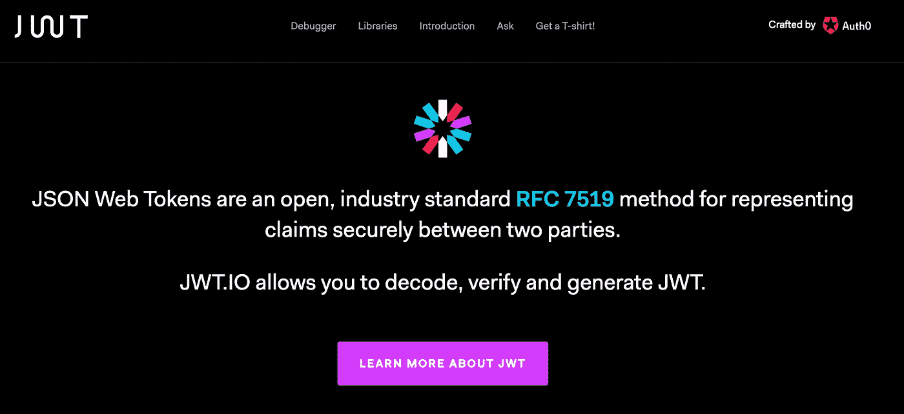

# 使用“secp256r1”创建 JWT。不能用以比特币闻名的‘secp 256k 1’

> 原文：<https://medium.com/coinmonks/can-not-use-secp256k1-which-is-common-on-crypto-currency-to-create-jwt-d6685be35a66?source=collection_archive---------1----------------------->

当我研究以太坊上以自我主权身份平台闻名的 uPort 时，我奋力创建了 JWT(uPort 通过 JWT 实现了链外身份认证)。所以，我把我的经验记录下来，供未来的学习者参考。

Gist 上的工作示例代码:[jwt-secp 256k 1-secp 256 r 1 . js](https://gist.github.com/tak1827/1c1aa56eaf0f6f77896df29aa8a8b7dc)



## 发生错误

我们可以使用 **ECDSA** 公/私钥对将 JWT 作为[官方站点](https://jwt.io/introduction/)进行签名。所以我写了如下的脚本。请注意，我将“secp256k1”指定为 ECDSA 曲线。

```
const JWT = require('jsonwebtoken');
const Elliptic = require('elliptic').ec;
const EC = new Elliptic('secp256k1');// Use 'secp256k1'// Payload
const payload = {
  sub: 'Subject',
  iss: 'Issuer',
  exp: 1639248876
}// Generate private key
const privateKey = EC.genKeyPair().getPrivate().toString(16);// Create token
const token = JWT.sign(payload, privateKey, { algorithm: 'ES256'});
```

预期结果是以下错误。

```
Error: error:0906D06C:PEM routines:PEM_read_bio:no start line
    at Sign.sign (crypto.js:331:26)
    at sign (/work/node_modules/jwa/index.js:76:45)
    at Object.sign (/work/node_modules/jwa/index.js:96:27)
    at Object.jwsSign [as sign] (/work/node_modules/jws/lib/sign-stream.js:32:24)
    at Object.module.exports [as sign] (/work/node_modules/jsonwebtoken/sign.js:188:21)
    at Object.<anonymous> (/work/jwt.js:24:13)
    at Module._compile (module.js:653:30)
    at Object.Module._extensions..js (module.js:664:10)
    at Module.load (module.js:566:32)
    at tryModuleLoad (module.js:506:12)
```

## 原因是“secp256k1”

我在解决这个错误时遇到了麻烦，但是我被[这个发布的问题](https://github.com/auth0/node-jsonwebtoken/issues/97)救了。

> [JWA 规范](https://tools.ietf.org/html/rfc7518#section-3.4)使用 P-256 和 SHA-256 将 *ES256* 定义为 *ECDSA，其中 *P-256* 是 *secp256r1* 的另一个名称*

我知道只有“secp256r1”适用于 JWT。为了安全起见，我确认了 [RFC](https://tools.ietf.org/html/rfc7519) ，发现了以下文字。

> 使用 P-256 曲线的 ECDSA

P-256 被[定义](https://www.ietf.org/rfc/rfc5480.txt)为 secp256r1。

## 创建 JWT 的正确方法

我显示正确的工作样本，为您创建 JWT 信息。请将“secp256r1”指定为 ECDSA 曲线。

```
const JWT = require('jsonwebtoken');
const ECDSA = require('ecdsa-secp256r1');// Use 'secp256r1'// Payload
const payload = {
  sub: 'Subject',
  iss: 'Issuer',
  exp: 1639248876
}// Genarate private key
const privateKey = ECDSA.generateKey();// Retrive public key
const publicKey = privateKey.asPublic();// Create token
const token = JWT.sign(payload, privateKey.toPEM(), { algorithm: 'ES256'});// Verify token
const decoded = JWT.verify(token, publicKey.toPEM());console.log({ 
  privateKey: privateKey.toPEM(), 
  publicKey: publicKey.toPEM(), 
  token, 
  decoded 
});
```

> [直接在您的收件箱中获得最佳软件交易](https://coincodecap.com/?utm_source=coinmonks)

[](https://coincodecap.com/?utm_source=coinmonks)