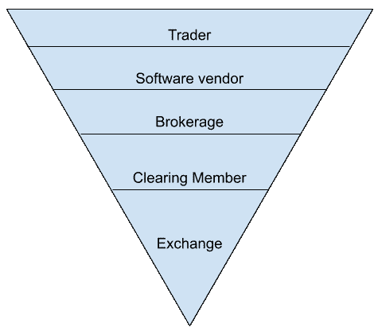
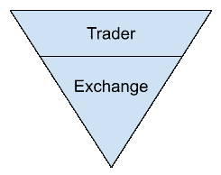

# 结算速度能改变个人交易者的体验吗？

> 原文：<https://medium.com/coinmonks/can-settlement-speed-change-the-experience-for-individual-traders-ae5fb81ee6fc?source=collection_archive---------8----------------------->

## TL；Kollider 博士正在利用闪电网络改变交易者进入加密货币市场的体验

上周的 Gamestop 头条告诉我们，交易者不再仅仅是专业人士。无论是股票还是衍生品，进入市场比以往任何时候都更方便。但是散户的体验真的改善了吗？

# **传统交易所**

从历史上看，交易者的体验已经大大改善了。想象你在 17 世纪早期的阿姆斯特丹。你只能亲自去交易所购买有限的商品，或者以后在海外探险中“分享”。这种体验很慢，而且访问受限。如果你在 18 世纪生活在日本，并想在第一个期货市场 Dō jima 大米交易所购买大米期货，你也会有类似的经历。大约三百年后的今天，你可以打开你最喜欢的经纪应用程序，购买你最喜欢的公司的看涨期权，并且早上不用起床就可以完成所有这些事情。

活着是多么美好的时光啊！
但是事情仍然没有想象中那么简单。交易员仍受制于缺乏直接渠道、不透明的费用和无限责任。

**直接访问**

大多数想交易的散户受经纪人的支配。这是因为传统交易所不允许交易者直接进入市场。如果你想在芝加哥商业交易所等交易所交易期货合约，至少要经过三四层中间商。你进行交易的唯一途径是通过经纪人或软件供应商。两者都需要与清算会员直接联系，清算会员是唯一可以直接访问交易指令簿的机构。这意味着对大多数人来说，他们是通过第三方交易，而不是直接在交易所的订单簿上交易。

为什么这是一个问题？如果不能直接进入交易所，交易者只能按照别人的条件进入市场。以 Gamestop 为例。对于许多上周试图交易 Gamestop 的人来说，他们使用了 Robinhood 等新经纪服务，这只是一家拥有出色用户界面的经纪公司。像许多经纪公司一样，Robinhood 不得不阻止用户进一步购买 Gamestop 股票，因为结算会员使用的结算时间过时，导致存款要求在一夜之间提高。简而言之，交易所和交易者之间的这些层次导致了这样一个场景:经纪人决定，你，交易者，何时被允许交易。

费用并不像它们看起来的那样。

假设你想利用看跌期权做空一家公司的股票。你得找个经纪人让你交易。在你的搜索中，你会遇到经纪服务告诉你“交易的未来是零费用”或“零佣金！”。但是如果一项服务是免费的，你通常就是产品。券商也不例外。许多经纪公司已经从对交易者透明的固定或比例交易费用转向“零佣金”或“自由交易”模式。

提供零佣金交易的经纪公司通过将订单出售给做市商来赚钱，做市商以低于或高于当前实际利率的价格报价，以便从价差中获利。“零佣金”或“零费用”的说法只是交易者支付费用方式的重新洗牌。散户交易者不再获得明确的费用，只是由另一方而非市场决定的市场价格。基本上，一个中间人为交易者规定了价格，而交易者对此一无所知。

**无限责任**

由于传统交易所每天只检查几次保证金，通过经纪人进入市场的交易者最终可能会欠经纪人更多的钱。这是因为通过像经纪人这样的第三方进入交易所，可以让交易者承担无限责任。想象一下，你的杠杆头寸走错了方向，你有责任确保你的账户有偿付能力。经纪人向你发出“追加保证金通知”,以增加你的保证金，但你没有足够的保证金。

**市场并非对所有人开放**

不是每个人都能接触到新经纪人。传统上，如果你想交易一个利基衍生合约，你不能去交易所直接交易。你需要先找到一家在柜台上提供这种产品的经纪公司。一旦你找到了一家提供你想要交易的产品的公司，你就需要经历注册和入职的噩梦，这有时需要几天或几周。当(或如果)你成功入职时，迎接你的是一份让你热泪盈眶的最低合约(说真的，有时你需要支付的最低保费可能高达数千英镑)。但你已经走到这一步，所以现在你需要得到你的抵押品，或经纪保证金，以打开一个位置。你不得不卖掉你的肾来支付，但是你终于有了开仓所需的资金。现在，您需要通过银行转帐将您的担保品发送到该服务。当你发出汇款，等一两天后，你就可以开始交易了。

# **加密货币交易所**

交易者可以从 [/r/SatoshiStreetBets](https://www.reddit.com/r/SatoshiStreetBets/) 中学到一些东西，因为在加密货币交易所交易比在传统场所交易要好得多。随着加密货币的发明，零售交易商进入市场的体验发生了巨大变化。第一次，新的和有经验的交易者都能够把他们的抵押品送到交易所，直接在订单簿上交易，而不需要中间人。他们甚至可以交易一系列不同的产品，最小合约规模为一美元，甚至更低，每天 24 小时，每周 7 天。进入金融市场已经变得自由化，现在几乎任何人、任何地方都可以快速访问加密货币交易所并开立头寸，无论他们是否有银行账户或拥有多少财富。

简单来说:

**有限责任和透明费**

除了直接访问，加密货币场所还有助于通过使用有限责任和透明费用来保护用户。加密货币交易所不断实时检查用户的保证金余额，允许交易者采取杠杆头寸，只承担损失其账户资金的风险，允许新用户了解产品，而不必担心失去一切。此外，与新经纪人不同，加密交易所的每笔交易都有透明的费用，用户看到的价格是公平价格，而不是包含价差的价格。

第一批加密货币交易场所开启了一场交易革命。他们为世界各地的新一代交易者提供了他们以前做梦也想不到的金融渠道。然而，尽管与传统场所相比有了这些改进，加密货币交易所仍面临新的问题，特别是围绕结算速度的问题。比方说，你想进入一个使用比特币的衍生品头寸，你需要将你的比特币送到交易所，为你的头寸提供资金，以充当抵押品。但是，通过这样做，你将比特币的所有权交给了交易所，你现在面临着交易对手风险。或者说是交易所被黑的风险，你会永远失去你的比特币。

你可以提取你不使用的东西，但这是很痛苦的，因为用户需要浏览提取过程，并等待缓慢的交易时间来将他们的资金从交易所取出。这种结算速度的缺乏意味着交易者可能会错过市场机会，迫使交易者在交易所留下比所需更多的资金。那么，明天的交易者如何在没有这些问题的情况下进入市场呢？

**Kollider:直接、即时结算以保护交易者**

这就是第二层协议的用武之地。第二层协议为加密货币提供了超出其原始功能的扩展功能。比特币的第二层协议是闪电网络，它可以用来让交易者体验使用加密货币场所的所有前述好处，但对他们的资金和访问速度的控制力度要大得多，这在其他任何地方都不存在。

我们相信，通过第二层协议，我们可以为新老交易者进入加密货币市场创造一个全新的模式。

因此，从闪电网络开始，我们正在建立新的方式，为交易者提供他们如何进入加密货币市场的全新体验。从柯利德开始。

Kollider 是一个 P2P 加密货币交易平台(不是另一个经纪人，我们保证)，让交易者控制自己的资金，并允许他们直接从自己选择的钱包中进入或退出衍生品合约的头寸。我们将 lightning 网络直接构建到我们的结算引擎中，使交易商能够:

-立即为头寸提供资金，并直接从自己的钱包或节点中索赔任何利润或损失

-永远不要将任何未用于未平仓头寸的资金留在交易所(大大降低了风险)

*   想试试我们的平台吗？[加入等候名单](https://kollider.xyz/)
*   想了解最新信息吗？[在推特上关注我们](https://twitter.com/kollider_trade)