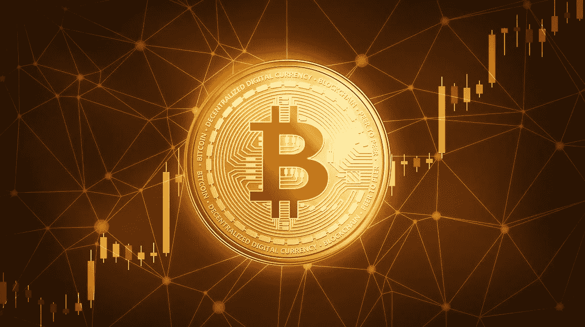

# 用比特币还能致富吗(2022)

> 原文：<https://medium.com/coinmonks/can-you-still-become-rich-with-bitcoin-2021-15fd0a867f8f?source=collection_archive---------3----------------------->

```
Thank you for your interest in this article, if you like the content feel free to [**Subscribe**](https://untilwefall.medium.com/membership), clap and share it.
```



那么，比特币是什么？让我们为门外汉做一个快速复习。

比特币是第一种被创造出来的加密货币。2008 年 10 月 31 日，一个化名为**中本聪**的人向一群密码学家发送了一份九页纸的论文…