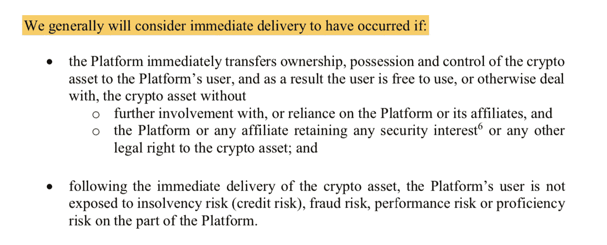

# 加拿大对加密货币交易所的监管指导

> 原文：<https://medium.com/coinmonks/canadas-regulatory-guidance-for-cryptocurrency-exchanges-a-good-thing-for-users-and-29ffb9df8841?source=collection_archive---------1----------------------->

Photo by [Ameen Fahmy](https://unsplash.com/@ameenfahmy_?utm_source=unsplash&utm_medium=referral&utm_content=creditCopyText) on [Unsplash](https://unsplash.com/@ameenfahmy_?utm_source=unsplash&utm_medium=referral&utm_content=creditCopyText)

## **对用户和非托管交易所来说是好事**

两个月前，加拿大证券管理机构(CSA)——加拿大省级证券监管机构的集合——发布了 [CSA 员工通知 21–327](https://www.osc.gov.on.ca/documents/en/Securities-Category2/csa_20200116_21-327_trading-crypto-assets.pdf)、*关于将证券立法应用于促进加密资产交易的实体的指南。*

该指南阐述了 CSA 对加密货币交易所是否受证券法管辖的解释。

## **TL；博士**

如果您是在加拿大运营或为加拿大用户服务的加密货币交易所，您可能会受到加拿大证券法的管辖。这适用于您的“典型”加密货币交易所(也称为*托管*或*集中*加密货币交易所)。授权用户在整个交易生命周期中和之后完全控制他们自己的资产(如非托管交易所(DEX)所做的那样)可能是不受证券法约束的唯一途径。

下面我总结一下指导意见，然后探讨它对交易所、用户和整个加密货币行业的意义。我也解释了为什么一些监管交易所的反应是抵制可能没有考虑到非监管交易所技术的现实和好处。我将介绍最先进的非托管交换技术是如何成为 CSA 所描述和寻求的安全系统的，并且通过扩展，一个很好的例子来说明如果应用程序被设计成这样，公共区块链是如何对监管者友好的。

## **目录**

1.  指导摘要
2.  这对交易所、用户和行业意味着什么
3.  驳斥对非托管交易所的指控
4.  结束语

# **1。指导概要**

*   即使交易所的平台上没有证券，即支持的资产显然是非证券和非衍生品，如比特币和以太(被广泛视为数字商品)，交易所仍可能受到证券法的约束，因为；
*   平台的性质——在其上“交易如何发生”——可能意味着潜在的非安全性*成为*衍生品，因为**交易所实际上并没有将资产交给用户，**只是同意在稍后的某个时间交付该东西，因此“用户对加密资产的合同权利本身可能构成衍生品。”他们继续说，“一些平台**仅仅向他们的用户提供对底层加密资产**的合同权利或要求，而不是立即将加密资产交付给它的用户。”
*   该说明的主旨是**立即交付**是区分因素，本质上归结为合同/工具是否在平台上创建了立即**将加密资产的所有权、占有权和控制权转移给平台用户的义务。**即，交易所是否将加密资产结算到用户控制的钱包。
*   如果这种立即交付发生，那么用户将*而不是*面临平台方面的**破产风险、欺诈风险、履约风险或熟练风险**，因此平台通常不受证券法的约束。如果不能立即交付，该平台可能会受到证券法的约束。

保护用户免受上述风险是本指南的最终目标，因为 CSA 的任务包括保护加拿大投资者免受不当或欺诈行为的影响，并促进公平的资本市场。坦率地说，它希望**避免另一个**[**quadrigax 灾难**](https://decrypt.co/5853/complete-story-quadrigacx-190-million) **，以及** [**爱因斯坦小灾难**](https://betakit.com/crypto-trading-platform-einstein-exchange-shuts-down-owing-16-million-to-clients/) ，这已经永久地污染了该国的加密交易所，并导致零售用户损失/窃取了价值数亿美元的加密资产。

## **多一点色彩**

CSA 已经做了功课，并深入研究了加密资产通常如何在交易所交易和结算的细微差别。他们表示，集中式交易所的现状并没有将资产的真正所有权赋予用户，而是只是在平台的内部账本上转移资产，将不断变化的余额记入用户账户。

注意:当你在一个中央交易所(CEX)交易加密货币时，交易所实际上并没有将货币转移到用户的钱包中——钱包是用户在区块链上的资产之家。相反，交易只是 CEX 内部数据库中的一个条目。为了实际将他们的资产从交易所中取出并纳入他们自己的控制中，在以后的某个时刻，用户将需要进一步的提取请求。

在结束语中，工作人员指出:

> “在我们看来，仅仅是账面记录并不构成交付，因为用户对平台的持续依赖和依赖是为了最终在请求时收到加密资产。”

在 CSA 看来，用户需要*请求将他们的资产置于自己的控制之下—* 意味着更晚的时间和所需的操作是一个问题，因为正是在这个长期依赖的时期，可能潜伏着重大的危险。

相反，在什么样的*被视为立即交付的问题上，指南断言必须有义务将加密资产转移到**用户控制的钱包**。具体而言，它们包括以下(除其他外)不受证券立法约束的内容:*

> *-交易条款要求从平台或交易对手卖家处购买的全部数量的比特币立即转移到由用户单独控制的钱包中，并且该转移**立即反映在比特币区块链**上；*
> 
> *-比特币的销售或购买不仅仅是通过记入平台卖家账户借方和平台用户账户贷方的内部分类账或账簿来证明，而是通过**将比特币转移到用户的钱包**；*
> 
> *-**平台或交易对手卖方对转让的比特币没有所有权、占有权或控制权**。*

*你可以(大概)在这里把‘比特币’换成‘以太’，或者其他取得商品地位的加密货币(截至目前可能不是很多)。*

*为了更好地衡量，我包括他们对立即交付的准确解释:*

**

*[CSA Staff Notice 21–327](https://www.osc.gov.on.ca/documents/en/Securities-Category2/csa_20200116_21-327_trading-crypto-assets.pdf)*

# ***2。对交易所、用户来说意味着什么&对行业来说***

**请注意我不是律师；这只是我个人的看法。另请注意，我的兴趣与以太坊上的领先协议和可扩展非托管交换技术提供商*[*loop ring*](https://loopring.org/#/)*有着内在的联系。我们构建了一个数字资产交易没有第三方托管或结算风险的世界，永远由加密技术保证。**

## ***交易所***

*这意味着加拿大的加密货币交易所或为加拿大客户服务的交易所的业务将变得更加困难，因为它们现在可能要遵守一套更加严格的法律——涵盖证券的法律。*

*让这些平台受制于证券法将会给这些企业带来更沉重、更昂贵的负担——这种负担可能足以让规模较小的企业倒闭。规模较大的公司将不得不组建和充实其法律和合规团队，如果尚未注册为证券公司，则应寻求注册。*

*在我看来，加拿大加密货币交易所的选择是:*

1.  *注册为证券交易商*
2.  *适应和采用非托管交换技术*
3.  *退出加拿大市场/停止服务加拿大客户*
4.  *关闭*

***方案 1** 涉及人力资源(健全的合规流程和人员)、资本(注册费、律师费)、时间(注册的相关流程)方面的大量成本。即便如此，我还是相信不能保证一个交易所注册成功。如果他们成功了，上述成本不仅仅是一次性的初始成本，而是用于维持合规框架和必要的行为。*

***选项 2** 涉及将非托管交换协议或能力集成到交换栈中。这种技术使用基础区块链进行结算，因此用户无需将其资产委托给交易所保管。正如 CSA 所规定的，它使用分布式分类帐，而不是内部分类帐。这项技术开始成熟和蓬勃发展，实际上除了留在企业中还有许多其他好处。一个好处是，一个交易所的运营成本可能会比一开始低得多——考虑到证券登记的额外成本，甚至比开始前的成本还要低。这是因为曾经由一个大型安全团队在内部保护的资产现在由一个公共的区块链加密系统保护。**交易所公司可以更精简，同时也更安全。此外，这项技术通常是免费和开源的。就 Loopring 而言，它是以太坊上的一个[开放协议](https://github.com/Loopring/protocols/blob/master/packages/loopring_v3/DESIGN.md)，任何团队或公司都可以在此基础上构建。交易所基本上可以外包他们的安全和结算需求——这可能是业务中最大的资源消耗——并专注于用户获取和增长。 [Loopring.io](https://loopring.io/trade/LRC-ETH) 是建立在协议之上的非托管交换的一个例子。***

***选择 3** 涉及到改变你的业务和公司结构，忽视加拿大市场和用户。虽然在全球范围内很小(也许只有百分之几的用户？)，这可能会伤害专门或主要关注加拿大人的交易所。*

***选项 4** 不言自明。*

*除了现有交易所的这些选择之外，它还将阻止新交易所的出现，或者至少阻止那些不那么严肃、谨慎或缺乏资源的交易所出现。另一方面，它可能会*鼓励*拥有更高级&安全技术的新交易所推出，我们将在本文末尾看到。*

## ***用户***

*用户将对他们的加密资产享有一定程度的自主权和控制权，这排除了平台丢失、窃取、被黑客攻击或任何其他事情的可能性。*

*加密货币兑换事故/损害的一个显著邪恶的方面是错误通常是不可归因的。一个耗尽资金的“外部黑客”可以很容易地是首席执行官或流氓雇员填满他们的个人储蓄罐。或者，一个“诚实的”丢失钥匙的案例，实际上可能是彻头彻尾的盗窃。当然，善意的交易所可能会犯错误，但最终结果是一样的:用户的资产不见了。*

## *行业反馈*

*有反对意见解释了为什么在交易所托管用户资产实际上是一件好事。事实上，在此指导之前，CSA 会同加拿大投资行业监管组织(IIROC)发布了一份 [*咨询文件 21–402*](https://www.osc.gov.on.ca/en/SecuritiesLaw_csa_20190314_21-402_crypto-asset-trading-platforms.htm)*、*征求行业意见。所有回应的评论信件都可以在[这里](https://www.osc.gov.on.ca/en/59631.htm)找到。*

*不出所料，许多交易所回应称，提议的框架有些过头，所描述的交易动态应该与证券法无关。他们的一些观点有可取之处。我不会陷入技术性和法律性的抱怨/评论，这些抱怨/评论有效地阐述了什么是衍生品，什么不是衍生品，等等。不过，我会回应他们一再提出的一些问题，我认为这些问题已不合时宜。*

***即现任托管交易所声称:***

1.  ***非托管兑换因钱包问题给用户带来不便***
2.  ***网上交易结算速度太慢且成本太高***

*总的来说，他们声称非监禁交换充其量是对用户不友好，在最坏的情况下是不可用。但是这两种说法都是错误的。*

*在下一节中，我通过提供相反的证据来反驳这些说法，并通过这样做来描述非托管交换技术的尖端在哪里。*

# ***3。驳斥对非托管交易所的指控***

*在继续之前，重要的是要考虑到，当我提到非托管交换时，我不一定是指“完全开放”的 dex(分散交换)。这种区别是另一篇文章的主题，但足以说明的是，你可以认为非托管交易所(有时被称为*自托管*交易所)是我们今天所知的“典型”交易所，如上所述&，除外，其资产托管 100%脱离交易所，并始终处于各自用户的控制之下。*

*另一方面，DEX(纯粹主义者的意思)是一个非托管组件，*加上*对无权限和审查阻力的额外保证——确保没有用户被拒之门外，交易被审查，frontrun，KYC 等。因此，虽然 DEX 必须是非托管的，但非托管交易所不一定是“完全”的 DEX。*

> *非托管交易所可以(而且许多交易所确实)遵循完全符合监管的路径，并且很可能成为监管者的好朋友和工具——这是指南中概述的消除风险的原因。*

*在这篇文章的剩余部分，为了简洁起见，我将把非托管交换称为 *NCEs* 。从现在开始，我主要使用 NCE，而不是 DEX，因为本文关注的是保管，而不是 DEX 的其他属性。注意:像 Loopring 这样的协议适合于 DEX 构建，但也可以用于“仅仅”NCE 构建，例如，基于它构建的公司可以决定建立 KYC。*

## ***假权利要求 1:(中)方便***

*保管交易所提出的最持久的指责是，用户通常不想保管他们自己的资产，和/或不知道如何管理他们自己的私人钥匙和区块链钱包。*

*交易所声称，如果运营得当，交易所本身更有能力做到这一点。他们进一步指出，除了用户给自己带来的安全风险之外，将资产留在交换平台上更方便，可以随时使用用户名和密码登录，并随时进行交易。*

*Coinsquare 在他们的[评论信](https://www.osc.gov.on.ca/documents/en/Securities-Category2-Comments/com_20190515_21-402_coinsquare-capital-markets.pdf)中声明:*

> *“参与者将他们的加密资产存储在平台上的主要好处是，他们不必管理自己的钱包，这需要他们负责存储自己的私钥。我们认为，参与者将资产放在平台上的倾向源于便利……”*

*对于一部分用户，我同意这种观点的逻辑——确实，没有实践好的私钥保护的普通用户很容易意外地失去对他们资产的访问，或者被盗。但它完全忽略了考虑 NCEs——以及与之相邻的工具，如钱包——是如何发展并开始迎合喜欢传统风格平台的“普通”用户的。有趣的是，事实上，这些 NCEs 和工具现在可以提供比他们的保管对手更大的便利。*

*具体来说，交易所的评论有意无意地忽略了:*

*   ***以太坊上的 NCEs 有能力向想要的用户呈现传统风格的 onboarding 和便利性。**您可以在您的姓名/电子邮件&密码上附加一个钱包，并使用这些凭证来访问兑换。与此同时，你保持对你的资产的完全监管。[白云石](https://dolomite.io/)，一个建立在 Loopring (v2，以前的版本)上的交易所[解释了他们如何提供这种便利](/dolomite-official/a-detailed-look-at-how-dolomite-solves-the-dex-onboarding-problem-6c1fc6530119)。这种设计模式完全克服了托管交换所带来的挑战和批评。类似于 [Fortmatic](https://fortmatic.com/) 和 [Portis](https://www.portis.io/) 的钱包提供商也为应用程序提供了简单(传统风格)的入门便利。*
*   *暂且不谈交易，钱包本身已经发展成熟，实际上是对 UX 和传统系统的一种改进。12 个单词的种子短语是用户重新获得资金的唯一途径的日子已经一去不复返了。所谓的*智能合约钱包*是你能要求的最方便和友好的体验。在许多情况下，开发人员可以完全抽象出秘密。例如，利用“社交恢复”，一个完全的新手可以在移动应用程序上创建他们的钱包，并指定 2 个朋友，1 个家庭成员和 1 个专业服务(任何人)作为他们的“监护人”。如果用户无法访问他们的钱包，他们可以实现一些预设的恢复方案，这可能需要这些监护人中的 2/4(或一些 *m-* of- *n* )来“扳动开关”以恢复资金。这些过程可以变得非常有创意和有用，比如增加延迟时间，“紧急开关”和每日限额。Argent 和 Gnosis Safe 就是智能合约钱包的两个例子。*

*正如你可能从上面收集到的，便利性实际上在 NCEs 上被增强了。事实上，用户 NCE 体验的可能配置位于安全性和便利性之间。即使是选择留在便利极端的用户也将比他们在保管交换中体验到更多的安全和责任。忽视这一事实，在他们的不便的呼喊中，保管交流要么故意忽视这一威胁性的进步，要么幸福地不知道艺术的状态。*

*在进入下一点之前，值得强调的是，除了用户驱动的安全性与便利性的选择之外，或许**NCEs 世界中最重要的主题是*总体选择*** 。*

*随着资产在他们自己的控制和保管之下，用户能够根据他们不断变化的需求和体验来选择和切换平台，以及选择最让他们高兴的人。**不再有任何供应商锁定问题**。用户并不拘泥于一个平台。虽然这种灵活性对于试图建立 AUM 式防御护城河的托管交易所来说并不理想，但对于用户、市场竞争力以及寻求保护用户的 CSA 和监管机构来说却是非常好的。*

*说到选择，让我们兜一圈，让托管交易所高兴一点:如果用户愿意(并且监管机构允许)，他们实际上可以将他们的资产托管到他们的交易所！*

> *最重要的想法是，用户可以选择自己保管资产——放在他们认为合适的钱包上——或者与交易所或其他第三方(他们可能会发现这些第三方更有信誉、更受监管或更有能力)。*

***交易平台*和*托管提供商不应该是强制打包交易。**这在传统金融中是行不通的，而且就区块链舞台上可用的工具而言，在新的或去中心化的金融中也不应该是这样的。因此，如果用户愿意，他们可以去(虚构的)*Matthewsexchange.com*作为他们的首选交易场所——因为他们喜欢资产、流动性和用户界面——但他们的资产托管在他们的智能合约钱包、硬件钱包或(虚构的)*值得信赖的托管人 R Us Inc.* 那里，他们将自己的账户插入该场所。它完全是模块化的，对用户来说更加方便和安全。*

## ***假索赔 2:太慢&贵***

*历史上，DEX 存在的祸根是速度——通常被称为*可伸缩性*。人们普遍认为 dex 无法扩展。然而，可扩展性研究和开发是该领域最令人兴奋的创新领域之一，也是 Loopring 构建和关注其解决方案的领域。*

*在 NCE 或 DEX 上交易意味着在基础区块链上交易(结算)。因此，它的速度与底层分类账生成块的速度一样快，但通常会更慢，因为无法保证你会在下一个块中，或者你能在一个块中容纳多少交易，等等。这被测量为区块链的吞吐量；一段时间内可以结算多少笔交易(每秒交易，TPS)。在 exchange 环境下，每秒有多少*笔交易*。*

*NCE 面临着与区块链类似的权衡:**为了获得有趣的去中心化和自我保管的特性，你放弃了速度。在我看来，正如以太坊等最有趣的区块链选择真正的去中心化、无权限化和抵制审查，而不是增加吞吐量，一个引人注目的 nce 也必须如此。***

> *谁都可以快；它是关于快速而不妥协的理想&我们都在这里的独特能力。*

*以下是 orderbook DEX tech 各代产品的简要概述，以便您能够理解图片:*

1.  *第一种方法是构建一个完全在链上的 DEX，其中所有事情——下订单、取消订单、匹配订单——都需要一个在链上的事务。这是缓慢和昂贵的，因为以太坊只能解决大约 15 TPS。通过这种方式，DEX 可以实现大约 1-2 TPS。*
2.  *下一个 DEX 设计已经存在了几年，是一种“混合”方法:尽可能在链外执行，只在链上执行关键任务步骤。这意味着离线下单、托管和匹配订单，并将匹配的交易提交到以太坊进行结算。通过确保每份订单都附有正确的加密签名，使非连锁部分保持洁净。协议只能执行这个命令，不能乱来。通过这种方式，DEX 可以实现大约 2-3 TPS。*
3.  *下一个也是最新的类型将混合设计哲学带到了它的逻辑和极端的结论:绝对做所有的事情，包括结算。它使用零知识证明(zkp)来证明执行的有效性，并且只提交一个小的链上证明。具体来说，它编译一批*交易*，执行它们，使用 ZKPs 强大的加密保证来证明它们是正确的，并向以太坊提交一个小证明——其真实性的拇指指纹。ZKPs(自 80 年代以来的密码学学科)充当可验证的计算引擎:输出一些或真或假的东西——这些动作要么符合交易协议，要么不符合——不可能乱来。这种构造被称为零知识汇总(zkRollup)，这是一种第 2 层扩展解决方案(指的是扩展发生在基础链的“上一层”这一事实；第一层在这里是以太坊)。第一个现场实现的是 [Loopring 的最新协议版本](https://loopring.org/#/protocol)，目前**可以达到 2025 TPS**。*

*这是值得重复的:今天的技术可以将以太坊上的 NCE 或 DEX 吞吐量提升 1000 倍。这一吞吐量水平对于目前运营的任何加密资产交易所来说都绰绰有余——无论是否托管。而这是在完全没有任何安全牺牲的情况下实现的:Loopring 继承了 100%以太坊级别的安全保障，因此用户资产始终在自己的掌控之中。*

*这样，速度和安全性之间的权衡问题就解决了。这并不夸张: [Loopring.io](https://loopring.io/trade/LRC-ETH) 是一个任何人现在都可以使用的实时交换的例子，基于他们的 zkRollup 协议。*

*精明的读者可能会意识到，较高 TPS 的必然结果意味着每次结算的**较低*成本*。在 Loopring 的例子中，成本可能是每笔交易 0.000124 美元(T4)，或者 100 万笔交易 124 美元。以前的版本几乎贵了 1000 倍。这种改进是因为一笔交易的成本是与其他交易一起摊销的。这和租一辆巴士去公路旅行的逻辑是一样的:如果我们能让更多的人乘坐巴士，那么人均租车费用就会降低。(公交车的燃料成本可能会随着每个人的体重而略微增加，但固定租金/司机成本是其中的主要部分)。***

*因此，如前所述，NCE 理工学院实际上是一项为交易所所有者和运营商节省成本的技术。只需支付千分之一的费用就能在安全的账本上结算交易，这意味着他们在向用户收取的交易费用上有足够的利润空间。例如，一笔 1000 美元的交易，交易费为 0.25%，交易所将赚 2.5 美元，只需支付 0.000124 美元的结算成本。99.9%的毛利率听起来相当不错。回想一下，这意味着需要更少的安全人员、合规人员、注册许可证等开销。，因为交易所实际上从未触及用户资产。*

## *链外，链内*

*重要的是要考虑到并非所有的第 2 层扩展解决方案都是平等的:这两层可以以不同的方式相互联系，有些是松散的，有些是严格的，还有一些是在追求高性能时折衷的安全性。因此，让用户和监管者了解 NCE 理工大学的细微差别至关重要。例如，Loopring 的 zkRollup 在每一个决策点都选择了最安全的路径，只依赖于早于区块链狂热的成熟的 ZKP 加密技术，以及最安全的智能合约平台以太坊。*

*有趣的是，也有些明显的是，正常的托管交换也在做着链外的一切。问题是，它是字面上的一切，而且它从来没有以任何忠实的方式回到链条上。在他们的情况下，外链只是他们的内部数据库，他们可以随意篡改。在某种程度上，区块链完全是一种事后的想法——用户余额中的数字可能是一桶谷物，也可能是一枚比特币。*

*保管交易所声称，完整的链外操作是可行的用户体验所必需的。来自 Bitvo(一家加拿大交易所)给 CSA 和 IIROC 的[意见函](https://www.osc.gov.on.ca/en/com_20190531_21-402_bitvo.pdf):*

> *“由于要求在每次交易完成时实际交付加密资产，而没有链外选项，这将带来物流挑战、时间延迟和成本增加，因为它涉及加密货币到加密货币的交易……”*

*离链并没有什么本质上的错误，但这并不意味着用户需要授予交易所所有者对其资产的完全和任意的控制权。以太坊和 Loopring 如何使用术语*链外*的区别在于，它暗示着它以重要的方式附着在链上:有密码保证，或者在其他设计中，有博弈论保证。随着越来越多的研发，这些链外解决方案已经变得不可信任，无法赋予用户权力。2,025 TPS，每笔交易的结算成本约为 0.0001 美元，**说在 NCEs 交易太慢、太贵已经没有任何道理了。***

*所以下次你看到下面这样的陈述时，你可以轻松地反驳它。正如 Coinsquare 在上述评论信中继续指出的:*

> *“我们认为，参与者将资产保留在平台上的倾向源于便利，特别是对于频繁交易者来说，他们受到与“链上”交易相关的高额确认时间和采矿/交易费用的影响，对于缺乏技术知识的参与者来说更是如此。”*

*这些说法不再正确。高速和低成本——也就是高性能——现已在 dex 上推出。数以千计的交易可以立即结算，只需几分之一便士，而且**使得交易所所有者不可能欺骗或窃取用户。***

*有一点需要注意的是，基本上所有上述内容都与以太坊交易有关，只涉及基于以太坊的资产。为了支持“跨链”交易——在这种交易中，你交易位于不同链上的资产或硬币，比如 BTC 或 ZEC——上述技术本身并不具备*功能*。需要将资产连接到以太坊的解决方案。好消息是，有几个这样的解决方案已经投入使用或正在开发中，比如 [WBTC](https://www.wbtc.network/) 或 [tBTC](https://tbtc.network/) 。此外，作为对警告的反驳，应该注意的是，绝大多数非本地链令牌实际上目前都在以太坊上运行，遵循 ERC20 标准。*

# *结束语*

*加拿大发生了几起最引人注目的加密货币交易事故和恶作剧。用户已经有数亿美元被盗，省级监管机构现在正致力于加强他们存在的保护。一个更大的挫折可能会让这个行业面临被驱逐的风险，不仅是在法庭上，更重要的是在数百万潜在用户的心目中。*

*因此，与新兴行业的现状以及参与者的预期相比，CSA 提出了相对严格的指导意见。然而，CSA 指南受益于区块链技术明确适合的领域:转移这些账本上的数字资产。*

*这些资产的交易主要发生在传统风格的数据库上，它们只是一个人的条目，而不是在它们固有的防篡改轨道上，这一直没有什么意义。与此同时，鉴于交易者要求在速度和成本方面获得更好的体验，并愿意以性能和更好的体验的名义放弃意识形态基础——以及他们的资产托管——这确实是有意义的。然而，现在根本没有必要做出这样的权衡。*

*CSA 正确地认识到区块链交易技术已经成熟，并认为能够保持行业的高标准。我发现他们对此印象深刻，并相信用户无疑是这一指南的主要受益者。我们需要回忆一下，这些加密资产是**不记名工具**——如果你没有*拥有*它们(如果你不直接控制私钥)，那么你就真的没有*拥有*它们。对于交易所所有者来说，行为不端和恶意行为太容易了——而且没有归因——或者他们真的犯了严重的错误。*

*这种资产类别和并行的金融体系在我们当前的框架下是不确定的，是一个特别危险的斜坡。它需要在两种合理的范式之间做出选择:**成为受监管的证券交易所以保护用户，或者利用技术赋予用户保护自己的能力。***

> *他们没有命令所有加密货币交易所注册为证券交易所；它们为交易所提供了使用支撑整个行业本身的技术的能力。*

*因此，交易所所有者有两条非常可行的道路:要么完善现有的监管制度，要么使用加密的安全分类账来禁止平台对用户采取行动。任何抱怨这两种选择的交易所所有者可能都不会正确理解他们对用户的责任，或者他们所拥有的蜜罐的诱惑力和随之而来的威胁。*

*目前，完全有可能建立一个复制(并改进)托管交易所的体验、便利性和性能的非托管交易所。即时交付——以及无法打破最优行为——现在是赌注，而不是无法实现的目标。*

*毫不奇怪，现任托管交易所将挑战这一现实和这一指导，因为它威胁到他们的起点和做生意的方式。但对用户和监管者来说，越来越清楚的是:区块链的资产应该在区块链结算，如果不是，那么只能由承诺并坚持最高标准的公司结算。*

*通过技术强制推行良好行为意味着减少对监管者的依赖；通过证券立法强制推行良好行为意味着减少对技术的依赖。无论哪种方式，良好的行为和用户主权和安全必须是指路明灯。*

> *[在您的收件箱中直接获得最佳软件交易](https://coincodecap.com/?utm_source=coinmonks)*

****